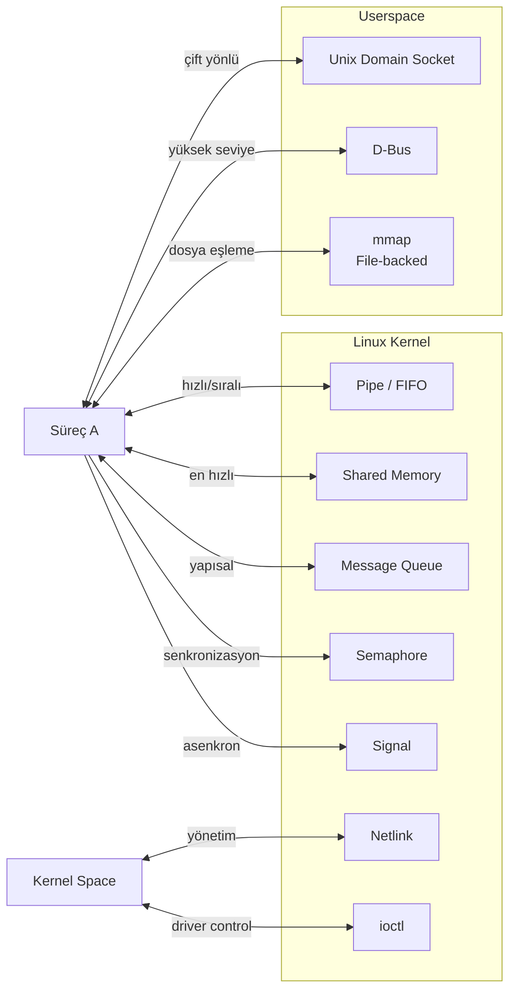
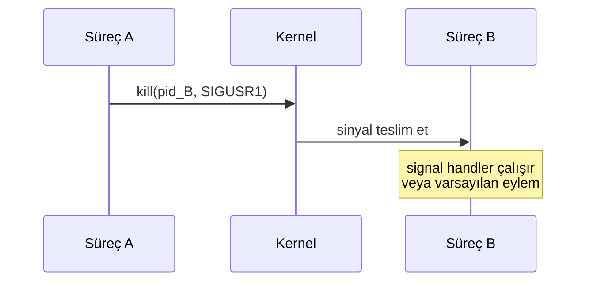
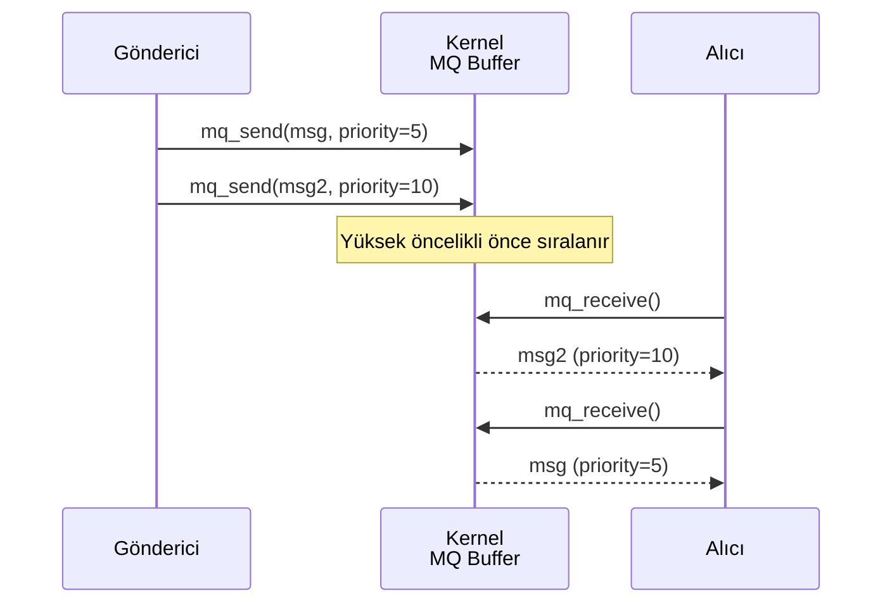
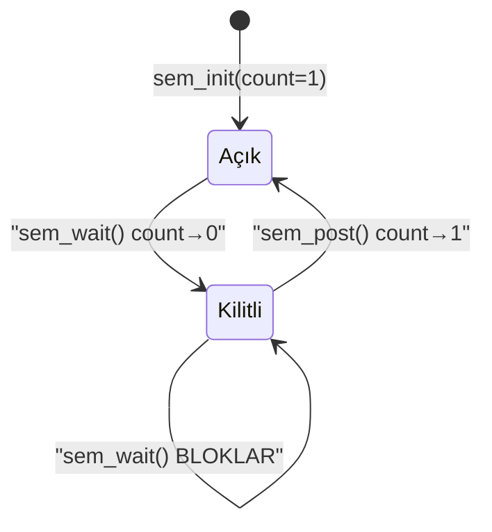
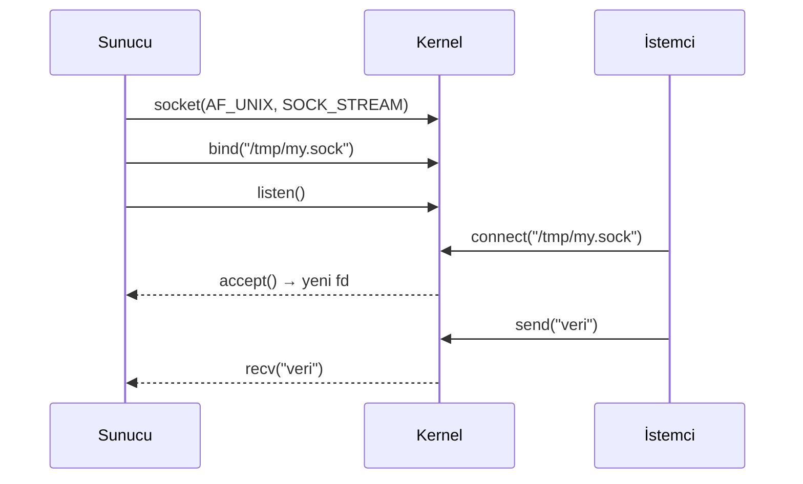
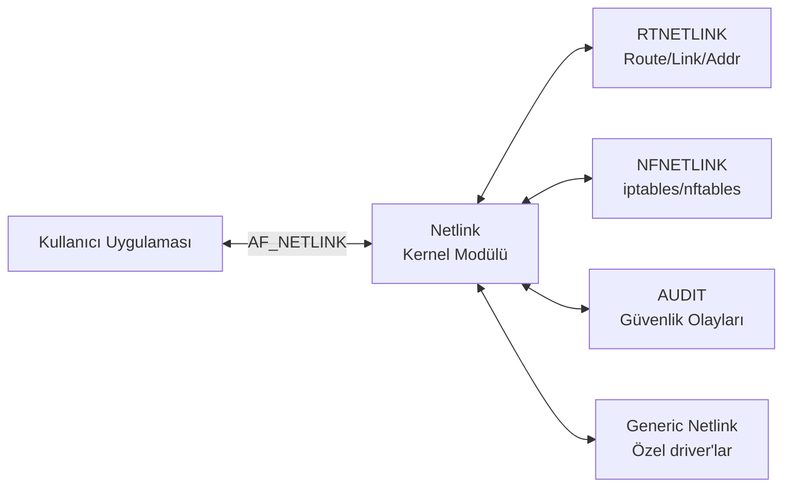
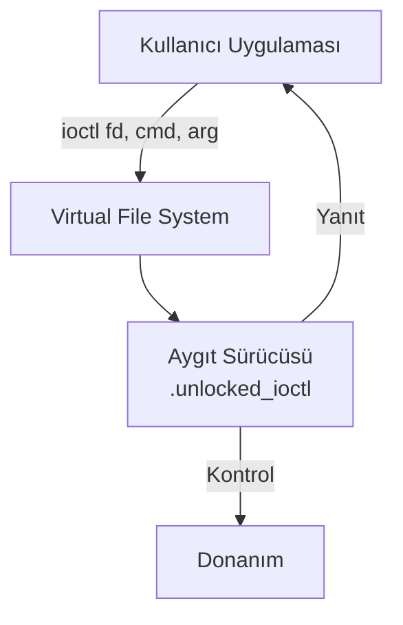
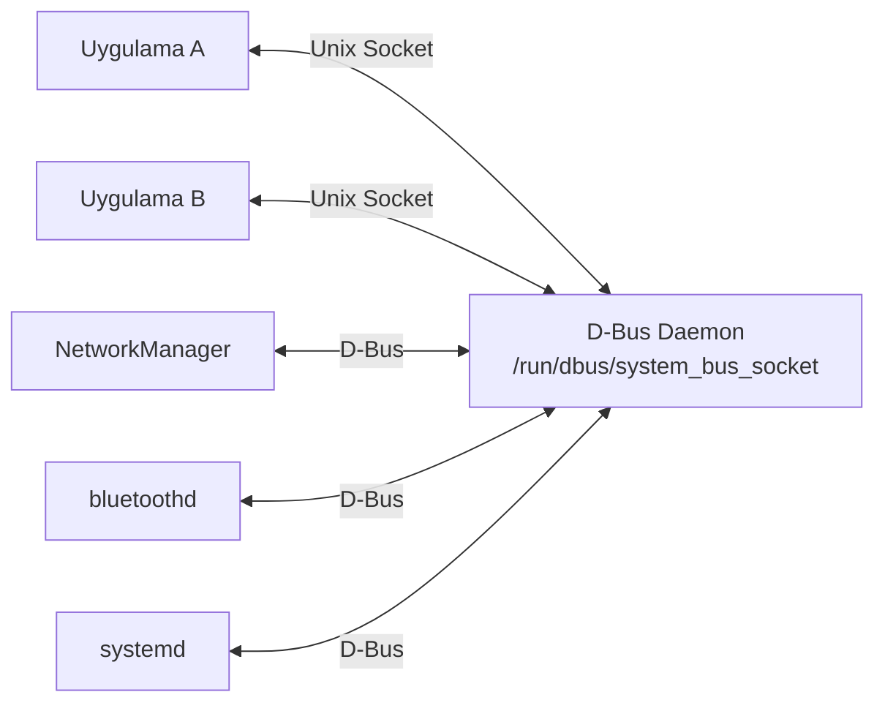
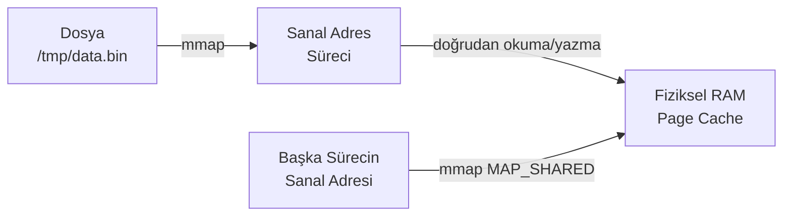

# IPC - Süreçler Arası İletişim

Aynı makinede çalışan bağımsız süreçlerin veri paylaşmasını ve koordineli çalışmasını sağlayan mekanizmalar bütünüdür. Her yöntemin performans, karmaşıklık ve kullanım senaryosu açısından farklı bir dengesi vardır; doğru yöntemi seçmek genelde şu sorulara verilen cevaba bağlıdır: 

- Süreçler akraba mı? 
- Ne kadar veri taşınacak?
- Kaç yönlü iletişim gerekiyor? 
- Senkronizasyon gerekiyor mu?




---

## Pipe

- Ebeveyn süreç ile `fork()` ile türettiği alt süreç arasında tek yönlü bir veri kanalı oluşturur. 
- Kernel belleğinde yaşar, dosya sisteminde bir karşılığı yoktur; bu yüzden yalnızca ortak bir atadan türeyen süreçler arasında kullanılabilir 
- Süreç A önce pipe'ı açar, sonra `fork()` ile ikiye bölünür ve her iki taraf da aynı dosya tanımlayıcılarını (fd) miras alır.

| Avantajlar                                                   | Dezavantajlar                                                        |
| -------------------------------------------------------------- | ------------------------------------------------------------------------ |
| Kurulumu tek sistem çağrısı (`pipe()`) kadar basit             | Yalnızca akraba (ortak atadan türeyen) süreçler arasında kullanılabilir |
| Kernel tarafından otomatik senkronize edilir, ekstra kilit gerekmez | Tek yönlüdür; iki yönlü iletişim için iki ayrı pipe gerekir             |
| Düşük gecikme                                                  | Sınırlı tampon boyutu (tipik 64 KB); mesaj sınırı yoktur, düz byte akışıdır |


!!! tip "Shell'de Pipe"
    Terminaldeki `|` operatörü de aynı `pipe()` sistem çağrısını kullanır:
    ```bash
    ls -la | grep ".c" | wc -l
    # Her | için kernel bir pipe tamponu oluşturur
    ```

!!! warning "Dikkat Edilecekler"
    - Tampon dolduğunda `write()` **bloklar**; tampon boşken `read()` **bloklar**.
    - Yazma ucunun tüm kopyaları kapanırsa `read()` **EOF** döner.
    - Pipe kapasitesi sistemde `ulimit -p` veya `/proc/sys/fs/pipe-max-size` ile görülür.

!!! example "Ne Zaman Kullanılır?"
    Bir ebeveyn sürecin başlattığı alt süreçle (örn. bir worker process) basit, tek yönlü veri/komut aktarımı gerektiğinde. Shell pipeline'ları ve çoğu `popen()` kullanımı bu modele dayanır.


## Named Pipe (FIFO)

Anonim pipe'ın akrabalık kısıtlamasını kaldıran versiyonudur: dosya sisteminde görünen özel bir dosya türü olarak `mkfifo` ile oluşturulur, böylece birbiriyle akraba olmayan iki bağımsız program da aynı FIFO dosyasını açarak haberleşebilir.

```bash
# FIFO oluştur
mkfifo /tmp/myfifo

# Terminal 1 - okuyucu
cat /tmp/myfifo

# Terminal 2 - yazıcı
echo "veri" > /tmp/myfifo
```

| Özellik                 |       Anonim Pipe          |    Named Pipe (FIFO)       |
| ----------------------- | :------------------------: | :-----------------------:  |
| Dosya sistemi           |            Yok             | `/tmp/fifo` gibi görünür   |
| Akraba olmayan süreçler |             ✗              |             ✓              |
| Kalıcılık               |  Süreçle birlikte silinir  |   `unlink()` ile silinir   |
| Yön                     |         Tek yönlü          |         Tek yönlü          |


| Avantajlar                                                    | Dezavantajlar                                                                   |
| ------------------------------------------------------------- | -------------------------------------------------------------------------------- |
| Akrabalık şartı yoktur, herhangi iki süreç kullanabilir        | Hâlâ tek yönlüdür; çift yönlü iletişim için iki FIFO gerekir                      |
| Dosya sistemi izinleriyle (chmod/chown) erişim kontrolü sağlanır | `open()` çağrısı karşı taraf bağlanana kadar **bloklar**, bu davranış kafa karıştırabilir |
| Basit API: normal `open`/`read`/`write` yeterlidir              | Birden fazla yazıcı aynı anda yazarsa veri karışabilir (atomiklik garantisi yalnızca `PIPE_BUF` altı yazımlarda vardır) |

!!! example "Ne Zaman Kullanılır?"
    Akraba olmayan iki program (örn. bir arka plan servisi ile ayrı bir CLI aracı) arasında basit, tek yönlü ve dosya tabanlı bir kanal yeterli olduğunda; soket kurmanın gereksiz karmaşıklık katacağı durumlarda.


## Signals 

Sinyal, bir sürece kernel veya başka bir süreç tarafından asenkron olarak iletilen, yazılımsal bir interrupt mekanizmasıdır. Veri taşımaz; yalnızca "bir olay oldu" bilgisini iletir.




| Sinyal    | Numara | Varsayılan Eylem | Açıklama                                   |
| --------- | :----: | :---------------: | -------------------------------------------- |
| `SIGTERM` |   15   |     Sonlandır      | Nezaket isteği; yakalanabilir                |
| `SIGKILL` |   9    |     Sonlandır      | **Kesin; yakalanmaz ve engellenemez**         |
| `SIGINT`  |   2    |     Sonlandır      | Ctrl+C                                       |
| `SIGQUIT` |   3    |     Core dump      | Ctrl+\                                       |
| `SIGHUP`  |   1    |     Sonlandır      | Terminal kapandı; daemon'lar yeniden yükle    |
| `SIGUSR1/2` | 10/12 |     Sonlandır      | Uygulama tanımlı kullanım                     |
| `SIGALRM` |   14   |     Sonlandır      | `alarm()` zamanlayıcısı                       |
| `SIGCHLD` |   17   |       Yoksay        | Alt süreç durdu/sonlandı                      |
| `SIGPIPE` |   13   |     Sonlandır      | Okuyucusuz pipe'a yazma                       |
| `SIGSEGV` |   11   |     Core dump       | Geçersiz bellek erişimi                       |

```bash
kill -SIGUSR1 <PID>
kill -SIGTERM <PID>
```

!!! danger "Sinyal Handler Güvenliği"
    Sinyal handler'ların içinde yalnızca **async-signal-safe** fonksiyonlar çağrılabilir. `printf`, `malloc`, `free` güvenli değildir - bunları handler içinde çağırmak tanımsız davranışa yol açar. Bunun yerine global bir bayrak (`sig_atomic_t`) set edip ana döngüde işleyin.


| Avantajlar                                                | Dezavantajlar                                                                 |
| ------------------------------------------------------------ | ---------------------------------------------------------------------------------- |
| Çok düşük gecikme, çok düşük overhead                        | Veri taşımaz; yalnızca olay/numara bildirir                                        |
| Kernel tarafından native desteklenir, ek kaynak gerekmez      | Handler içinde kullanılabilecek fonksiyon seti çok kısıtlıdır                       |
| Asenkron - alıcı süreç ne yapıyor olursa olsun teslim edilir   | Standart (real-time olmayan) sinyaller birikmez/kaybolabilir: aynı sinyal art arda birden fazla gönderilirse tek teslimat olarak görülebilir |

!!! example "Ne Zaman Kullanılır?"
    Süreç yaşam döngüsü kontrolü (durdur/nazikçe kapat), basit asenkron bildirimler (örn. `SIGHUP` ile config yeniden yükleme), watchdog/timeout tetikleyicileri. Veri aktarımı gerekiyorsa sinyal tek başına yetmez, shared memory veya mesaj kuyruğu ile birlikte kullanılır.


## Shared Memory 

En yüksek bant genişliğine sahip IPC yöntemidir. İki süreç, `shm_open` + `mmap` ile aynı fiziksel bellek sayfasını kendi sanal adres alanlarına eşler; veri hiç kopyalanmadan doğrudan paylaşılan bölgeye yazılır/okunur.

```mermaid
graph LR
    PA["Süreç A<br/>Virtual Addr Space"] -->|mmap| PHYS["Fiziksel RAM<br/>Shared Page"]
    PB["Süreç B<br/>Virtual Addr Space"] -->|mmap| PHYS
    PHYS -.->|shm_open| SHM_OBJ[/dev/shm/myshm]
```

```bash
# /dev/shm altında shared memory nesnelerini gör
ls -la /dev/shm/
```

!!! warning "Senkronizasyon Zorunlu"
    Shared memory yarış koşuluna (race condition) açıktır. Eş zamanlı erişimi korumak için mutlaka **semaphore** veya **mutex** kullanın. Aksi takdirde okuyucu eksik ya da bozuk veri görebilir.


| Avantajlar                                                       | Dezavantajlar                                                                     |
| -------------------------------------------------------------------- | --------------------------------------------------------------------------------------- |
| **En yüksek performans**: veri kopyalanmaz (zero-copy)               | Senkronizasyon (semaphore/mutex) tamamen geliştiricinin sorumluluğundadır                |
| Büyük veri hacimleri için idealdir                                    | Race condition riski yüksektir; yanlış kullanım sessizce bozuk veriye yol açar            |
| Rastgele erişime (random access) izin verir, akış sınırı yoktur       | Veri formatı/serileştirme garantisi yoktur; iki tarafın aynı struct düzenini bilmesi gerekir |

!!! example "Ne Zaman Kullanılır?"
    Yüksek frekanslı veya büyük hacimli veri paylaşımı gereken senaryolarda: kamera görüntü karesi, sensör tamponu, gerçek zamanlı sinyal işleme, birden fazla sürecin ortak bir durum tablosuna hızlı eriştiği robotik/kontrol yazılımları.


## POSIX Message Queue 

Yapılandırılmış mesajları öncelik sırasına göre ileten kuyruk yapısıdır. Pipe'ın aksine mesaj sınırları korunur (her `mq_send` ayrı bir mesaj olarak `mq_receive` ile okunur) ve mesajlar kernel'de saklanır; gönderen ve alıcı aynı anda çalışmak zorunda değildir.



```bash
# Aktif message queue'ları listele
ls /dev/mqueue/
cat /proc/sys/fs/mqueue/msg_max   # Max mesaj sayısı
```


| Avantajlar                                                      | Dezavantajlar                                                              |
| --------------------------------------------------------------- | ---------------------------------------------------------------------------- |
| Mesaj sınırları korunur (framing), byte akışıyla uğraşılmaz       | Pipe'a göre daha fazla overhead (kopyalama içerir)                          |
| Öncelik tabanlı sıralama desteklenir                              | Mesaj boyutu ve kuyruk derinliği sınırlıdır (`mq_msgsize`, `mq_maxmsg`)      |
| Gönderen ve alıcı aynı anda çalışmak zorunda değildir              | POSIX MQ ile eski Sys V MQ (`msgget`/`msgsnd`) API'leri karıştırılabilir     |

!!! example "Ne Zaman Kullanılır?"
    Yapılandırılmış, önceliklendirilmiş görevlerin bir üreticiden bir veya birden fazla tüketiciye iletildiği durumlarda (basit görev kuyruğu, event bus benzeri iç sistemler). Ham veri akışı değil, ayrık "mesajlar" söz konusu olduğunda pipe yerine tercih edilir.

---

## POSIX Semaphore 

Paylaşılan bir kaynağa eş zamanlı erişimi sınırlayan atomik sayaç mekanizmasıdır. Kendi başına veri taşımaz; genelde shared memory ile birlikte, kritik bölgeyi korumak için kullanılır.



**Named vs Unnamed:** Named semaphore (`sem_open`) ilişkisiz süreçler arasında dosya sistemi üzerinden paylaşılır; unnamed semaphore (`sem_init`) genelde aynı sürecin thread'leri arasında veya (shared memory bölgesine yerleştirilerek) akraba süreçler arasında kullanılır.


| Avantajlar                                                    | Dezavantajlar                                                            |
| --------------------------------------------------------------- | ----------------------------------------------------------------------------- |
| Basit, atomik sayaç mantığı - kernel tarafından garanti edilir   | Veri taşımaz, tek başına yeterli bir IPC yöntemi değildir                     |
| Hem thread hem process arası kullanılabilir                      | Yanlış kullanım deadlock veya starvation'a yol açabilir                       |
| Kaynak havuzu sınırlama (N eşzamanlı erişim) için doğal bir araçtır | Hata ayıklaması zordur; kilitlenme sırası hatası sessizce sistemin donmasına neden olabilir |

!!! example "Ne Zaman Kullanılır?"
    Shared memory gibi paylaşılan bir kaynağa erişimi senkronize etmek, veya "aynı anda en fazla N süreç şu kaynağı kullanabilir" kuralını uygulamak (örn. sınırlı sayıda donanım kanalı, bağlantı havuzu) gerektiğinde.


## Unix Domain Socket (UDS)

Ağ protokol yığınını (TCP/IP) bypass ederek, dosya sistemi üzerinden aynı makinedeki süreçler arasında çift yönlü, güvenilir iletişim sağlar. API'si TCP soketleriyle neredeyse aynıdır (`socket`, `bind`, `listen`, `accept`, `connect`), bu yüzden ağ koduna çok benzer ama loopback TCP'den daha hızlıdır (ağ katmanı overhead'i yoktur).




| Avantajlar                                                        | Dezavantajlar                                                     |
| ---------------------------------------------------------------------- | --------------------------------------------------------------------- |
| Çift yönlüdür, TCP'ye benzer güvenilir stream veya datagram modu sunar | Yalnızca aynı makinede çalışır, dağıtık sistemlerde kullanılamaz       |
| Ağ protokol overhead'i yoktur → TCP loopback'ten daha hızlıdır           | Socket dosyasının varlığı ve temizliği (`unlink`) manuel yönetilmelidir |
| Dosya sistemi izinleriyle erişim kontrolü sağlanır                       | Sunucu önce ayakta olmalıdır; istemci bağlanmadan önce `bind`+`listen` tamamlanmış olmalı |

!!! example "Ne Zaman Kullanılır?"
    Aynı makinede çalışan servisler arasında güvenilir, çift yönlü iletişim gerektiğinde (Docker daemon soketi, PostgreSQL yerel bağlantıları, sistem servisleri arası API'ler). TCP kullanmaya göre daha hızlı ve dosya izinleriyle daha kolay yetkilendirilebilir bir alternatiftir.

---

## Netlink Socket (Kernel ↔ Userspace)

Netlink, kernel subsystem'larıyla kullanıcı alanı arasında çift yönlü, asenkron iletişim sağlayan özel bir soket ailesidir (`AF_NETLINK`). `iproute2` araçları (`ip`, `ss`) ağ arayüzü/route bilgisini almak için Netlink kullanır.




| Avantajlar                                                     | Dezavantajlar                                                     |
| ------------------------------------------------------------------ | ----------------------------------------------------------------------- |
| Kernel ↔ userspace için standart, genişletilebilir bir kanaldır      | Düşük seviyedir; mesaj formatlama (`nlmsghdr`, öznitelik ayrıştırma) karmaşıktır |
| Çoklu-yayın (multicast) grubu desteği vardır (kernel olaylarını dinleme) | Yalnızca Linux'a özgüdür, taşınabilir değildir                           |
| Soket tabanlı olduğu için tanıdık bir API (`socket`/`recv`) kullanır | `ioctl`'e göre daha fazla altyapı kurulumu gerektirir                    |

!!! example "Ne Zaman Kullanılır?"
    Ağ yönetimi araçları geliştirirken (arayüz/route/adres değişikliklerini izlemek veya değiştirmek) ya da kernel'deki bir olayı (arayüz up/down, cihaz takılması) gerçek zamanlı dinlemek gerektiğinde.

---

## ioctl (Device Control)

`ioctl` (input/output control), aygıt sürücülerine `read`/`write` ile ifade edilemeyen özel komutlar göndermek için kullanılan sistem çağrısıdır - genel amaçlı bir "uzak fonksiyon çağrısı" gibi düşünülebilir.



```bash
# Terminal termios - baud rate sorgusu
stty -F /dev/ttyUSB0

# ioctl kullanan araçlar
ethtool eth0        # Ethernet sürücü kontrolü
hdparm -I /dev/sda   # Disk bilgisi
v4l2-ctl --all       # Kamera ioctl çağrıları
```

**Avantaj / Dezavantaj**

| Avantajlar                                                      | Dezavantajlar                                                    |
| ----------------------------------------------------------------- | ------------------------------------------------------------------- |
| `read`/`write` ile ifade edilemeyen aygıta özel komutlar için standart mekanizmadır | Tip güvenliği yoktur (`void *arg`); yanlış struct/boyut kolayca hataya yol açar |
| Driver geliştirmede çok yaygın, iyi belgelenmiş bir desendir        | API standart değildir; her sürücü kendi komut setini tanımlar        |
| Senkron ve basittir (tek sistem çağrısı)                            | Hata ayıklaması zordur; komut numaraları çakışabilir                  |

!!! example "Ne Zaman Kullanılır?"
    Donanım/sürücü seviyesinde kontrol gerektiğinde: kamera parametreleri (V4L2), seri port yapılandırması, ağ arayüzü bayrakları, disk/aygıt bilgisi sorgulama. Uygulama seviyesi IPC için tercih edilmez.


## D-Bus

D-Bus, masaüstü uygulamaları ve sistem servisleri arasında yüksek seviyeli, tip güvenli mesajlaşma sağlayan bir IPC ara katmanıdır. Alt seviyede Unix Domain Socket kullanır, ancak üzerine servis keşfi (introspection), isimlendirme ve nesne/yöntem soyutlaması ekler. `systemd`, `NetworkManager`, `BlueZ` gibi kritik sistem servisleri D-Bus üzerinden kontrol edilir.



```bash
# D-Bus servisleri listele
busctl list

# NetworkManager arayüzlerini sorgula
busctl introspect org.freedesktop.NetworkManager \
    /org/freedesktop/NetworkManager

# Systemd servis başlat
busctl call org.freedesktop.systemd1 \
    /org/freedesktop/systemd1 \
    org.freedesktop.systemd1.Manager \
    StartUnit ss nginx.service replace
```


| Avantajlar                                                       | Dezavantajlar                                                          |
| ----------------------------------------------------------------- | ----------------------------------------------------------------------- |
| Yüksek seviyelidir: servis keşfi, tip güvenli mesajlaşma sunar     | Diğer IPC yöntemlerine göre yavaştır (daemon üzerinden yönlendirme, ekstra kopyalama) |
| Standart sistem servisleriyle (systemd, NetworkManager) hazır entegrasyon sağlar | `dbus-daemon` çalışıyor olmalı - ek bir bağımlılıktır                    |
| Sinyal/yöntem çağrısı gibi soyutlamalarla ham socket kodu yazmaya gerek kalmaz | Gömülü/gerçek zamanlı sistemlerde performans kritikse uygun değildir      |

!!! example "Ne Zaman Kullanılır?"
    Masaüstü veya sistem servisleri arası yüksek seviyeli entegrasyon gerektiğinde (bir GUI uygulamasının NetworkManager veya systemd ile konuşması gibi). Performans kritik, düşük gecikmeli veri yolu ihtiyacında D-Bus yerine socket/shared memory tercih edilir.


## mmap - Bellek Eşlemeli Dosya

`mmap`, bir dosyayı veya anonim belleği doğrudan sürecin sanal adres alanına eşler. Shared memory'nin dosya tabanlı, kalıcı alternatifi olarak da düşünülebilir ve sıfır kopyalamayla (zero-copy) dosya G/Ç gerçekleştirir - dosya içeriğine normal bir dizi/pointer gibi erişilir.



**İki kullanım biçimi vardır:** dosya tabanlı eşleme (bir dosyayı belleğe eşleyip normal pointer gibi okuma/yazma, `msync` ile diske senkronize etme) ve `fork()` öncesi oluşturulan anonim `MAP_SHARED` eşleme (ebeveyn/çocuk arasında hızlı, dosyasız paylaşım).


| Avantajlar                                                       | Dezavantajlar                                                          |
| ----------------------------------------------------------------- | ----------------------------------------------------------------------- |
| Zero-copy dosya G/Ç; büyük dosyalarda bellek verimlidir (sayfalar talep üzerine/demand paging yüklenir) | Sayfa boyutu hizalama kısıtlamaları vardır                                |
| Rastgele erişim (random access) doğal ve hızlıdır                  | Dosya küçültülür/silinirse erişimde `SIGBUS` alınabilir                   |
| Shared memory'nin dosya tabanlı, kalıcı bir alternatifidir          | Eş zamanlı erişimde senkronizasyon yine geliştiricinin sorumluluğundadır  |

!!! example "Ne Zaman Kullanılır?"
    Büyük dosyaları rastgele erişimle işlerken (log analizi, veritabanı motorları, büyük veri setleri); ya da `fork()` sonrası ebeveyn/çocuk arasında dosya tabanlı, kalıcı bir paylaşım gerektiğinde.


## IPC Yöntemleri Karşılaştırması

| Yöntem             |     Hız      | Veri Kopyası | Yön  | Süreç Sınırı |    Kalıcılık     |
| ------------------- | :-----------: | :------------: | :---: | :------------: | :-----------------: |
| Anonymous Pipe      |      Orta      |     1 kopya      |  Tek  |     Akraba      |    Process ömrü      |
| Named Pipe (FIFO)   |      Orta      |     1 kopya      |  Tek  |    Herhangi     |    `unlink` ile      |
| Signal              |   Çok hızlı    |     Veri yok      |  Tek  |    Herhangi     |        Anlık          |
| Shared Memory       |  **En hızlı**  |   **0 kopya**    |  Çift |    Herhangi     |  `shm_unlink` ile     |
| Message Queue       |     Hızlı      |     1 kopya      |  Çift |    Herhangi     |  `mq_unlink` ile      |
| Semaphore           |       -        |     Veri yok      |   -   |    Herhangi     |  `sem_unlink` ile     |
| Unix Domain Socket  |     Hızlı      |    1–2 kopya      |  Çift |  Aynı makine    |    `unlink` ile      |
| Netlink             |     Hızlı      |     1 kopya      |  Çift |  User/Kernel    |          -            |
| D-Bus               |     Yavaş      |    2+ kopya      |  Çift |    Herhangi     |          -            |
| mmap                |  **En hızlı**  |   **0 kopya**    |  Çift |    Herhangi     |    Dosya tabanlı      |


!!! example "Seçim Rehberi"
    - **En yüksek bant genişliği** → Shared Memory + Semaphore
    - **Akraba olmayan süreçler, iki yönlü** → Unix Domain Socket
    - **Kernel ↔ Userspace** → Netlink veya ioctl
    - **Sistem servisleri (NM, systemd)** → D-Bus
    - **Senkronizasyon primitifi** → Semaphore veya Mutex
    - **Ebeveyn/çocuk, basit** → Anonymous Pipe
