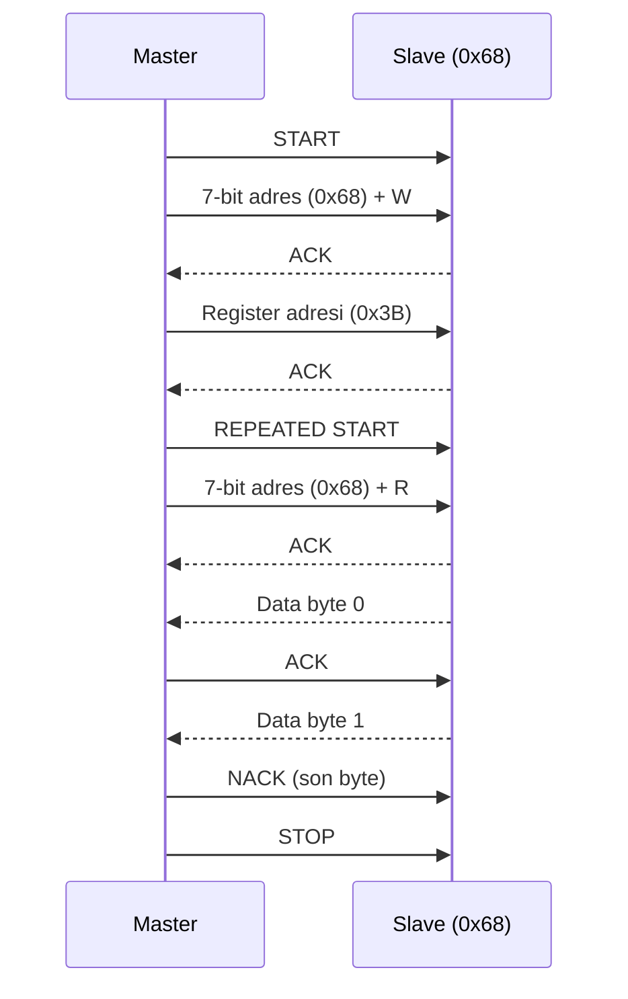
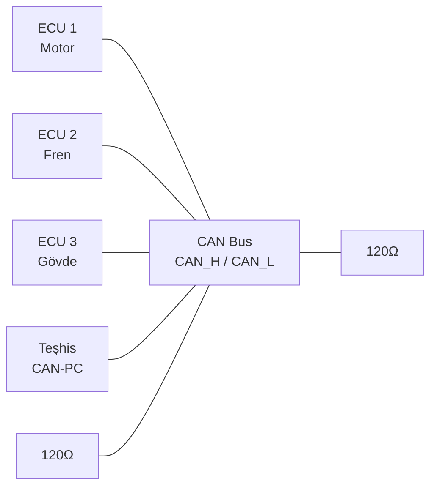
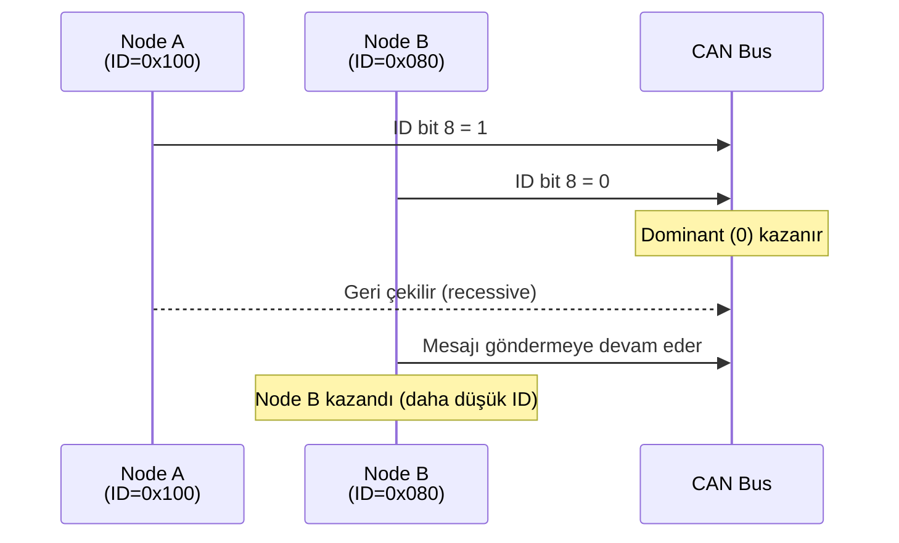
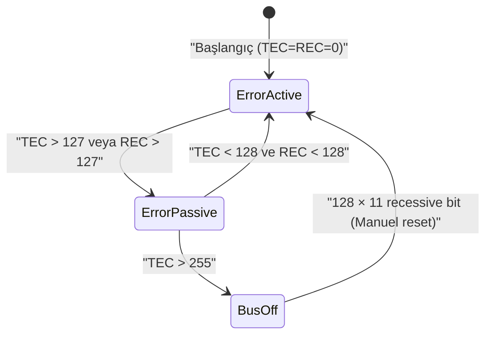
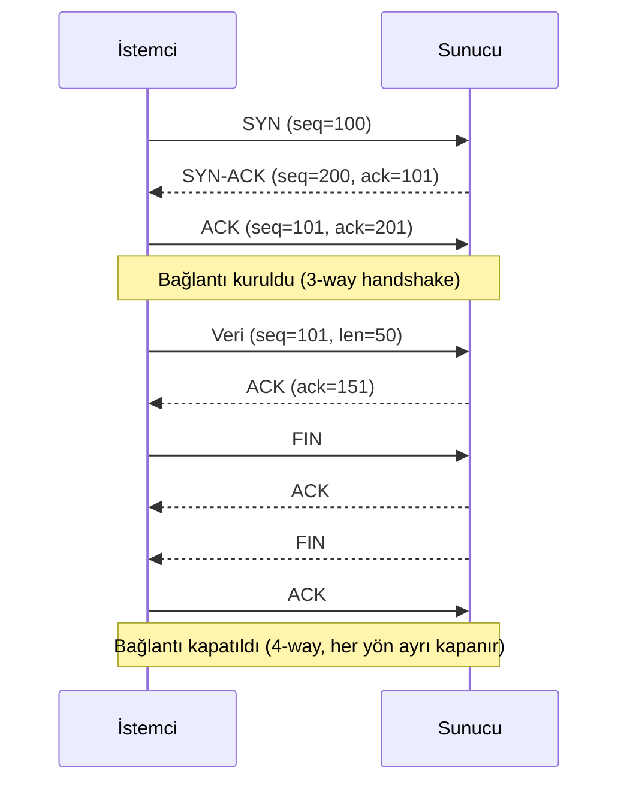
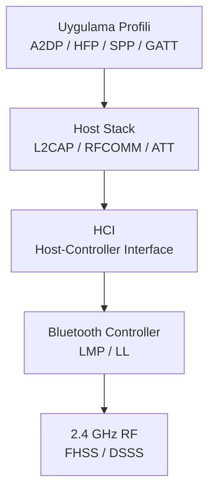
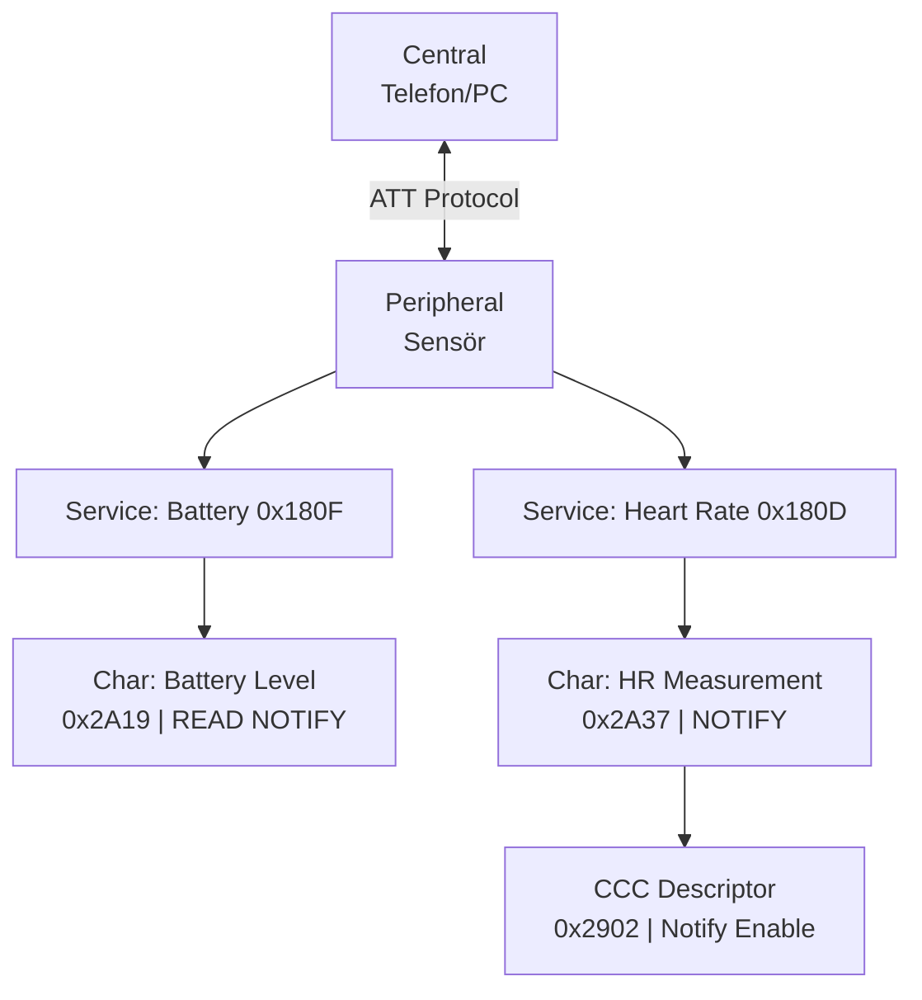
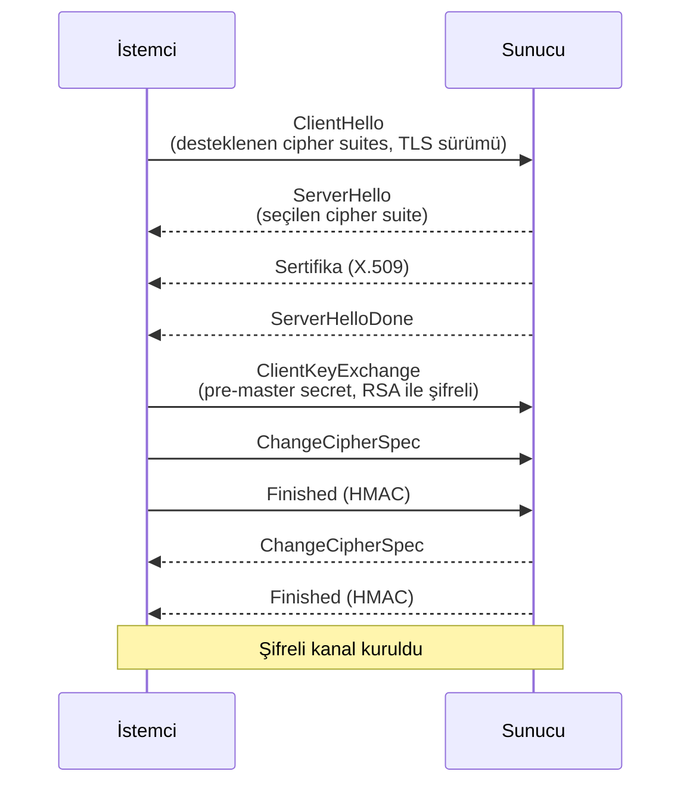
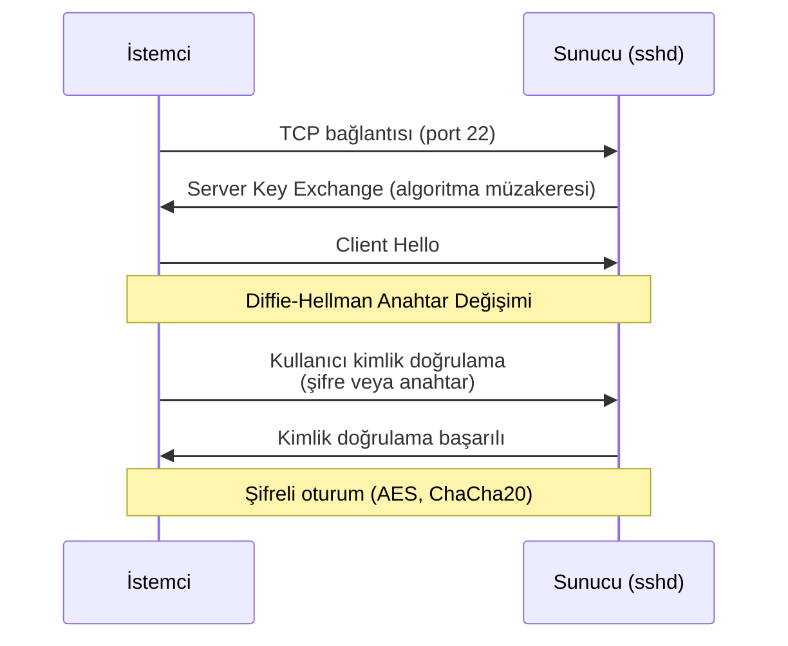

# Haberleşme Protokolleri

## UART (Universal Asynchronous Receiver/Transmitter)

UART, **saat hattı paylaşmayan** (asenkron) noktadan noktaya seri haberleşme protokolüdür. İki taraf da veriyi önceden anlaştıkları sabit bir baud rate'e göre örnekler; bu yüzden saat sinyali yerine her byte'ın başına bir **start bit** eklenerek alıcının senkronize olması sağlanır. TX ve RX hatları birbirinden bağımsız olduğu için **full-duplex**'tir (aynı anda hem gönderip hem alabilir). Mikrodenetleyiciler ile PC/modüller arasındaki en yaygın düşük hızlı seri haberleşme yöntemidir.

```
IDLE  START   D0   D1   D2   D3   D4   D5   D6   D7   PARITY  STOP
 1  |  0  |  x  |  x  |  x  |  x  |  x  |  x  |  x  |  x  |   x   |  1
     ←----------------- 1 tam çerçeve ------------------------→
```

| Alan             | Açıklama                                                                 |
| ------------------ | --------------------------------------------------------------------------- |
| **Start bit**       | Hat IDLE (1) durumundan 0'a düşer; alıcıya çerçevenin başladığını bildirir ve örnekleme saatini bu kenara göre senkronize eder |
| **Veri bitleri**    | Genellikle 8 bit (1 byte); LSB önce gönderilir                              |
| **Parity bit**      | Opsiyonel tek bitlik hata tespiti (Odd/Even/None); yalnızca **tek bit** hatasını yakalar, çift bit hatasını kaçırır |
| **Stop bit**        | 1 veya 2 bit; hat tekrar IDLE (1) seviyesine döner                          |

| Baud Rate | Veri Hızı (8N1) | Yaygın Kullanım    |
| :-------: | :-------------: | ------------------- |
|    9600   |     ~960 B/s     | GPS, eski modüller   |
|   115200  |    ~11.5 KB/s    | Arduino, debug       |
|   460800  |     ~46 KB/s     | ESP32 flash          |
|   921600  |     ~92 KB/s     | Yüksek hızlı debug   |
|  4000000  |    ~400 KB/s     | STM32, FTDI FT4232   |

Alıcı ve verici **aynı baud rate**'i kullanmalıdır; tolerans genelde ±2–3%'tir, bunun üzerinde sapma bitlerin yanlış örneklenmesine (framing error) yol açar. Mikrodenetleyicide baud rate, çevresel saatten bir bölücü (`BRR` - Baud Rate Register) ile üretilir: $\text{Baud} = \dfrac{f_{clock}}{16 \times \text{BRR}}$.

!!! warning "Yaygın UART Hataları"
    - **Framing Error**: Stop bit beklenen seviyede (1) bulunamadı - genelde baud rate uyuşmazlığından kaynaklanır.
    - **Overrun Error**: Yeni byte geldiğinde önceki byte alım tamponundan (RX buffer) henüz okunmadı; veri kaybolur. Yüksek hızda ve düşük öncelikli ISR'lerde sık görülür.
    - **Break Condition**: Hat, bir bayt süresinden uzun süre 0'da tutulursa "break" sinyali sayılır; bazı bootloader'lar bunu resete/DFU moduna girmek için kullanır.

!!! tip "Donanımsal Akış Kontrolü (RTS/CTS)"
    Yüksek hızlarda alıcı tampon dolabilir. `RTS`/`CTS` hatları eklenerek alıcı, hazır olmadığında vericiye "gönderme" sinyali verebilir (donanımsal flow control). Çoğu mikrodenetleyici UART çevre birimi bunu destekler ama pratikte nadiren kullanılır; genelde yazılımsal tampon yönetimi tercih edilir.

!!! tip "RS-232 vs RS-485"
    - **RS-232**: Noktadan noktaya, ±3–15V mantık, tek mantık seviyesi (tek uçlu/single-ended), ~15m maks, gürültüye hassas.
    - **RS-485**: UART'ın kendisi değil, fiziksel katman farklıdır - diferansiyel çift (A/B hatları) kullanır, 32 cihaza kadar bus, ~1200m, gürültüye dayanıklı, endüstri standardı. UART çerçeve formatı aynıdır; RS-485 sadece elektriksel katmanı değiştirir ve yarı-duplex bus paylaşımı için bir yön kontrol pini (`DE`/`RE`) gerektirir.

**Avantaj / Dezavantaj**

| Avantajlar                                                | Dezavantajlar                                                          |
| -------------------------------------------------------------- | ---------------------------------------------------------------------------- |
| Basit donanım (2 hat + toprak), her mikrodenetleyicide bulunur   | Saat hattı yok; taraflar arası baud rate uyuşmazlığı veri bozulmasına yol açar |
| Full-duplex, düşük gecikme                                     | Yerleşik adresleme/çoklu cihaz desteği yoktur (noktadan noktaya)              |
| Hata ayıklama/loglama için kolay erişilebilir (USB-UART köprüleri) | Görece düşük hız; uzun mesafede sinyal bütünlüğü bozulur (RS-232 için ~15m sınırı) |

---

## SPI (Serial Peripheral Interface)

SPI, ortak bir saat hattı (`SCLK`) etrafında senkronize çalışan, **full-duplex** seri haberleşme protokolüdür: her saat darbesinde master hem bir bit gönderir (`MOSI`) hem de bir bit alır (`MISO`) - veri alışverişi aynı anda, tek bir shift register döngüsü gibi gerçekleşir. Adresleme mekanizması yoktur; cihaz seçimi ayrı bir `CS` (Chip Select) hattıyla yapılır. Yüksek hız gerektiren sensörler, flash bellek, ekranlar ve ADC'lerde kullanılır.

| Hat   | Yön | Açıklama                    |
| ----- | :--: | ----------------------------- |
| SCLK  | M→S  | Saat sinyali; master üretir   |
| MOSI  | M→S  | Master Out Slave In            |
| MISO  | S→M  | Master In Slave Out            |
| CS/SS | M→S  | Chip Select; aktif LOW          |

Her slave'in kendi `CS` hattı olması gerekir (`N` slave için `N` ayrı CS pini); pin sayısını azaltmak için bazı sensörler (örn. shift register'lar, bazı ekran sürücüleri) **daisy-chain** modunu destekler - veri bir cihazdan diğerine zincirleme aktarılır ve tek `CS` yeterli olur.

`CPOL` (saat boşta seviyesi) ve `CPHA` (örnekleme kenarı) kombinasyonu **SPI Modu**'nu belirler; master ve slave aynı modda olmalıdır, bu bilgi cihazın datasheet'inde yazar:

| Mod | CPOL | CPHA | Saat Boşta | Örnekleme       |
| :--: | :--: | :--: | :---------: | :---------------: |
|  0   |  0   |  0   |    LOW      | Yükselen kenar     |
|  1   |  0   |  1   |    LOW      |  Düşen kenar        |
|  2   |  1   |  0   |    HIGH     |  Düşen kenar        |
|  3   |  1   |  1   |    HIGH     | Yükselen kenar      |

**Avantaj / Dezavantaj**

| Avantajlar                                            | Dezavantajlar                                                      |
| -------------------------------------------------------- | -------------------------------------------------------------------- |
| Çok yüksek hız (onlarca MHz'e kadar), full-duplex          | Pin sayısı fazladır; her slave için ayrı CS gerekir (daisy-chain hariç) |
| Basit donanım, düşük protokol overhead'i                   | Standart bir adresleme/hata denetim (CRC/ACK) mekanizması yoktur      |
| Yerleşik saat hattı sayesinde baud rate uyuşmazlığı sorunu yok | Kısa mesafeye uygundur; diferansiyel olmadığı için uzun kabloda gürültüye hassastır |

---

## I²C (Inter-Integrated Circuit)

I²C, iki hatlı (`SDA`: veri, `SCL`: saat) senkron **half-duplex** protokoldür; SPI'dan farklı olarak birden fazla master'ı ve 7-bit adres şemasıyla 128 cihaza kadar aynı iki hat üzerinde paylaşımı destekler. Her iki hat da **open-drain**'dir; bu yüzden harici pull-up direnci zorunludur (hat, hiçbir cihaz sürmediğinde pull-up sayesinde HIGH'da kalır).

| Parametre        |          Değer            |
| ------------------- | :--------------------------: |
| Hız (Standard)      |          100 kHz             |
| Hız (Fast)          |          400 kHz             |
| Hız (Fast+)         |           1 MHz              |
| Hız (High Speed)    |          3.4 MHz             |
| Pull-up             |  Genellikle 4.7 kΩ (3.3V)    |
| Mantık düzeyi       |         Open-drain           |

!!! warning "Pull-up Direnci"
    I²C hatları açık-drain çalışır; dışarıdan pull-up direnci **zorunludur**. Direnç değeri bus kapasitansına ve hıza göre seçilir: düşük hız = yüksek direnç, yüksek hız = düşük direnç. Bus toplam kapasitansı tipik olarak **400 pF** ile sınırlıdır; bu da pratikte kablo uzunluğunu (~birkaç metre) ve bağlanabilecek cihaz sayısını kısıtlar.



Diyagramdaki **REPEATED START**, bus'ı bırakıp (STOP) tekrar almak yerine, yazma işleminden hemen sonra yön değiştirip okumaya geçmeyi sağlar - böylece başka bir master araya giremez ve register-okuma işlemi atomik kalır. Her byte'tan sonra alıcı `ACK` (devam) veya `NACK` (dur/hata) biti gönderir; son byte'ta master bilerek `NACK` göndererek transferi sonlandırır.

**Clock Stretching ve Arbitration:** Bir slave veriyi hazırlamak için zaman gerektiğinde `SCL` hattını LOW'da tutarak master'ı bekletebilir (**clock stretching**) - tüm slave'ler bunu desteklemez, datasheet kontrol edilmelidir. Birden fazla master aynı anda bus'a erişmeye çalışırsa, her master kendi gönderdiği biti hattaki gerçek seviyeyle karşılaştırır; uyuşmazlık gören master geri çekilir (**arbitration**) - bu da I²C'yi multi-master için pipe/SPI'a göre daha uygun kılar.

!!! tip "Adres Çakışması"
    Aynı sabit I²C adresine sahip iki aynı sensör aynı bus'a bağlanamaz. Çözüm: donanımsal adres pinleri (`AD0` gibi) ile adresi değiştirmek, I²C multiplexer (`TCA9548A` vb.) kullanmak veya cihazları ayrı bus'lara (MCU'nun birden fazla I²C periferi varsa) dağıtmak.

**Avantaj / Dezavantaj**

| Avantajlar                                                  | Dezavantajlar                                                         |
| ------------------------------------------------------------- | ----------------------------------------------------------------------- |
| Sadece 2 hat ile onlarca cihaz bağlanabilir (adresleme dahil)   | Half-duplex ve SPI'a göre yavaştır                                       |
| Multi-master ve arbitration desteği vardır                     | Bus kapasitansı sınırı yüzünden mesafe/cihaz sayısı kısıtlıdır            |
| Yerleşik ACK/NACK ile temel hata bildirimi vardır               | Aynı adresli iki cihaz aynı bus'ta çakışır; adres yönetimi gerektirir     |

---

## CAN Bus (Controller Area Network)

CAN, çoklu düğüm (multi-master) destekli, diferansiyel çift (`CAN_H`/`CAN_L`) üzerinden **mesaj tabanlı** (adres değil, mesaj ID tabanlı) haberleşme protokolüdür. Bir düğüm değil, bir **mesaj** yayınlanır; bus'taki tüm düğümler her mesajı dinler ve kendileriyle ilgili ID'leri filtreler. OSI modelinde yalnızca fiziksel ve veri bağlantı katmanını tanımlar - mesajın içeriğini yorumlamak için CANopen, J1939 gibi üst katman protokolleri kullanılır. Otomotiv, endüstriyel ve robot sistemlerinde standart haberleşme yöntemidir.



Hat, iki uçta **120Ω** terminasyon direnciyle sonlandırılır (yansımaları önlemek için); diferansiyel sinyal iki durumdan birindedir: **dominant (0)** - her iki hat aktif sürülür, **recessive (1)** - hat pasif/yüksek empedanstadır. Bir düğüm dominant gönderirken bir diğeri recessive gönderirse, bus dominant seviyede kalır; bu fiziksel özellik, arbitration mekanizmasının temelidir.

| Alan           |    Bit    | Açıklama                                     |
| -------------- | :--------: | --------------------------------------------- |
| SOF            |     1      | Start of Frame                                 |
| Arbitration ID | 11 (Standart) / 29 (Extended) | Mesaj kimliği; **düşük ID = yüksek öncelik** (dominant bit daha çok kazanır) |
| RTR            |     1      | Remote Transmission Request (veri isteği çerçevesi) |
| Control        |     6      | DLC (data length code: 0–8 byte)                |
| Data           |  0–64 bit  | Taşınan veri (klasik CAN: maks. 8 byte)          |
| CRC            |    15      | Cyclic Redundancy Check                         |
| ACK            |     2      | Alıcı onayı                                     |
| EOF            |     7      | End of Frame                                    |

!!! note "Standart (CAN 2.0A) vs Extended (CAN 2.0B) Çerçeve"
    Standart çerçeve 11-bit ID kullanır (2048 farklı mesaj kimliği); Extended çerçeve 29-bit ID ile (11-bit temel ID + 18-bit uzantı) çok daha fazla benzersiz ID sağlar. Aynı bus üzerinde iki tür bir arada bulunabilir; extended ID her zaman standart ID'den düşük önceliklidir (arbitration alanındaki ekstra bit dominant kabul edilir).

!!! tip "CAN FD (Flexible Data-Rate)"
    Klasik CAN veri alanı 8 byte ile sınırlıdır. **CAN FD**, aynı fiziksel katmanı kullanarak veri alanını 64 byte'a çıkarır ve veri fazında (arbitration sonrası) daha yüksek bit hızına geçebilir; günümüz otomotiv/robotik sistemlerinde klasik CAN'ın yerini almaktadır. Standart CAN kontrolcüleri CAN FD çerçevelerini okuyamaz - donanım desteği gerekir.



| Bit Rate | Maks. Kablo Uzunluğu |
| :-------: | :---------------------: |
|  1 Mbps   |          25 m           |
| 500 kbps  |         100 m           |
| 250 kbps  |         250 m           |
| 125 kbps  |         500 m           |
| 50 kbps   |        1000 m           |
| 10 kbps   |        5000 m           |



!!! danger "Bus-Off Durumu"
    TEC (Transmit Error Counter) 255'i aşarsa node bus-off olur ve bus'tan tamamen kopar. Geri dönüş için manuel reset veya donanım yeniden başlatma gerekir. Sık tekrar eden bus-off genelde yanlış terminasyon, hatalı bit-rate ayarı veya donanım arızasına işaret eder.

**Avantaj / Dezavantaj**

| Avantajlar                                                    | Dezavantajlar                                                         |
| ----------------------------------------------------------------- | ----------------------------------------------------------------------- |
| Gerçek zamanlı, önceliklendirilmiş mesajlaşma (arbitration)         | Klasik CAN veri alanı küçüktür (8 byte); büyük veri için CAN FD gerekir  |
| Gürültüye çok dayanıklıdır (diferansiyel sinyal, endüstriyel ortamlar için tasarlanmıştır) | Mesaj içeriğinin anlamı protokolde tanımlı değildir; üst katman (CANopen/J1939) gerekir |
| Yerleşik hata tespiti/yönetimi (CRC, ACK, error counter'lar)         | Şifreleme/kimlik doğrulama yoktur; bus'a fiziksel erişim = tam kontrol   |

---

## TCP / IP

**TCP/IP**, internetin temelini oluşturan katmanlı protokol ailesidir. **IP (Internet Protocol)**, paketleri (IP adresi kullanarak) kaynaktan hedefe yönlendiren ağ katmanı protokolüdür - güvenilirlik garantisi vermez, sadece "en iyi çaba" (best-effort) ile teslim etmeye çalışır. **TCP (Transmission Control Protocol)**, IP üzerine inşa edilen, güvenilir, sıralı, çift yönlü bağlantı odaklı taşıma katmanı protokolüdür; kayıp paketleri yeniden gönderir, sırasını düzeltir ve akış kontrolü yapar.

| Katman (TCP/IP) | Örnek Protokoller           | Görev                                          |
| ------------------ | ------------------------------ | ------------------------------------------------- |
| Uygulama           | HTTP, SSH, DNS, MQTT           | Uygulamaya özgü mesaj formatı                       |
| Taşıma             | TCP, UDP                       | Uçtan uca iletim, port numaralandırma               |
| Ağ (Internet)      | IP, ICMP                       | Adresleme ve yönlendirme (routing)                  |
| Bağlantı           | Ethernet, Wi-Fi, ARP           | Aynı fiziksel ağdaki (LAN) çerçeve iletimi           |

!!! tip "Port Numaraları"
    Bir IP adresi makineyi, **port numarası** (16-bit, 0–65535) o makinedeki hangi uygulamaya/servise ait olduğunu belirtir. `0–1023`: well-known port'lar (root yetkisi gerektirir, örn. 22=SSH, 80=HTTP, 443=HTTPS); `1024–49151`: kayıtlı port'lar; `49152–65535`: dinamik/geçici (ephemeral) port'lar - istemcilerin kısa ömürlü bağlantıları genelde buradan seçilir.



!!! note "MTU ve Parçalanma (Fragmentation)"
    Ethernet'te tipik MTU (Maximum Transmission Unit) **1500 byte**'tır. Bu boyuttan büyük bir IP paketi, ağ katmanında parçalara bölünür (fragmentation) - performansı düşürür ve bazı ağ cihazlarında sorun çıkarabilir. TCP, bağlantı kurulurken MSS (Maximum Segment Size) değerini bu sınırın altında tutmaya çalışarak parçalanmayı önler.

| Özellik        |       TCP       |           UDP           |
| --------------- | :---------------: | :------------------------: |
| Bağlantı        |    Bağlantılı     |       Bağlantısız          |
| Güvenilirlik    |    ✓ Garanti      |      ✗ Best-effort          |
| Sıralama        |        ✓          |            ✗                |
| Akış kontrolü   |        ✓          |            ✗                |
| Gecikme         |      Yüksek       |        **Düşük**            |
| Boyut           |     Değişken       |       Maks. 64 KB            |
| Kullanım        |  HTTP, SSH, FTP    |  DNS, DHCP, RTSP, Oyun       |

**Avantaj / Dezavantaj**

| Avantajlar (TCP)                                          | Dezavantajlar (TCP)                                                |
| -------------------------------------------------------------- | ------------------------------------------------------------------ |
| Güvenilir teslimat, sıralama ve akış kontrolü uygulama katmanına iş bırakmaz | El sıkışma ve yeniden gönderim mekanizmaları gecikmeyi artırır       |
| Tıkanıklık kontrolü (congestion control) ağı korur               | Gerçek zamanlı/kayıp toleranslı veri (ses, video akışı) için gereksiz overhead getirir - bu senaryolarda UDP tercih edilir |

---

## Bluetooth Classic ve BLE



Bluetooth Classic (BR/EDR) sürekli veri akışı (ses, dosya transferi) için tasarlanmıştır; BLE ise kısa, seyrek veri paketleri gönderip çoğu zamanı düşük güçlü uyku modunda geçirecek şekilde tasarlanmıştır - bu yüzden IoT sensörlerinde ve giyilebilir cihazlarda BLE tercih edilir.

| Özellik           | Bluetooth Classic (BR/EDR)  | Bluetooth Low Energy (BLE)   |
| ------------------- | :----------------------------: | :------------------------------: |
| Kullanım            |        Ses/Veri akışı          |     Kısa periyodik veri           |
| Frekans kanalları   |          79 × 1 MHz            |          40 × 2 MHz               |
| Veri hızı           |        1–3 Mbps (EDR)          |      125 Kbps – 2 Mbps            |
| Güç tüketimi        |            Yüksek               |        **Çok düşük**              |
| Bağlantı süresi     |             ~100 ms             |             < 3 ms                 |
| Piconet             |      1 Master + 7 Slave        |   Sınırsız (Mesh/Broadcast)        |
| Profil              |        A2DP, HFP, SPP           |   GATT (Generic Attribute)         |



| Yapı           | Açıklama                                                                    |
| ---------------- | -------------------------------------------------------------------------------- |
| **Piconet**       | 1 Master + maks. 7 aktif Slave                                                    |
| **Scatternet**    | Birden fazla Piconet'in örtüşmesi; bir cihaz iki Piconet'te rol alabilir           |
| **FHSS**          | 79 kanalda saniyede 1600 hop - parazit/girişim direnci                            |
| **Service/Characteristic** | GATT'ta veri, hiyerarşik olarak Service (işlevsel grup, örn. Battery) → Characteristic (tek bir değer, örn. Battery Level) → Descriptor (meta veri, örn. bildirim aç/kapa) şeklinde organize edilir |

!!! tip "BLE Eşleştirme (Pairing) Güvenlik Seviyeleri"
    - **Just Works**: Kullanıcı etkileşimi yok, MITM saldırısına açık - yalnızca düşük riskli senaryolarda kullanılmalı.
    - **Passkey Entry**: Bir tarafta ekran, diğerinde tuş takımı varsa 6 haneli kod girilir.
    - **Numeric Comparison**: Her iki tarafta da ekran varsa aynı kodun gösterilip onaylanması istenir - MITM'e karşı en güçlü seçenek.

**Avantaj / Dezavantaj**

| Avantajlar                                                | Dezavantajlar                                                         |
| -------------------------------------------------------------- | ----------------------------------------------------------------------- |
| BLE: çok düşük güç tüketimi, uzun pil ömrü                       | Kısa menzil (tipik 10–100m, ortama bağlı)                                |
| Yaygın donanım desteği (telefon, PC, çoğu MCU)                   | Classic BR/EDR ile BLE farklı protokol yığınlarıdır; her ikisi gerekiyorsa "dual-mode" çip gerekir |
| GATT ile standartlaştırılmış, keşfedilebilir veri modeli          | BLE veri hızı düşüktür; büyük veri transferi için uygun değildir          |

---

## Güvenlik Protokolleri

### TLS/SSL El Sıkışması

Aşağıdaki diyagram, RSA anahtar değişimi kullanan **klasik TLS 1.2** el sıkışmasını gösterir (2 round-trip gerektirir):



!!! note "TLS 1.3 Farkı"
    TLS 1.3, el sıkışmasını **1 round-trip**'e indirir ve RSA yerine zorunlu olarak (Ephemeral) Diffie-Hellman anahtar değişimi kullanır. Bu, **forward secrecy** sağlar: sunucunun uzun ömürlü özel anahtarı ileride ele geçirilse bile, geçmişte kaydedilmiş trafik çözülemez (RSA anahtar değişiminde bu garanti yoktur). Modern sistemlerde TLS 1.2'nin yalnızca güçlü (PFS destekli) cipher suite'lerle kullanılması, TLS 1.0/1.1'in ise tamamen devre dışı bırakılması önerilir.

!!! tip "Hibrit Şifreleme"
    Gerçek TLS trafiğinde veri, RSA/DH gibi yavaş asimetrik algoritmalarla değil, el sıkışma sırasında üretilen bir **oturum anahtarıyla** hızlı simetrik bir algoritma (AES-GCM, ChaCha20) kullanılarak şifrelenir. Asimetrik kriptografi yalnızca bu oturum anahtarını güvenli şekilde değiştirmek için kullanılır - bu yaklaşıma **hibrit şifreleme** denir.

### RSA (Asimetrik Şifreleme)

RSA güvenliği, büyük sayıların asal çarpanlarına ayrılmasının (factorization) hesaplama zorluğuna dayanır.

| Kavram                 | Açıklama                                          |
| ------------------------- | ---------------------------------------------------- |
| **Public Key**             | Herkesle paylaşılır; yalnızca şifreler ya da imza doğrular |
| **Private Key**            | Gizli tutulur; şifreyi çözer ve imzalar                |
| **Anahtar uzunluğu**       | Minimum 2048-bit (≥4096-bit önerilir)                  |
| **Matematiksel temel**     | n = p × q (büyük asal sayılar); e·d ≡ 1 mod φ(n)       |

```bash
# RSA anahtar çifti oluştur
openssl genrsa -out private.pem 4096
openssl rsa -in private.pem -pubout -out public.pem

# Şifreleme / Deşifreleme
openssl rsautl -encrypt -pubin -inkey public.pem -in data.txt -out data.enc
openssl rsautl -decrypt -inkey private.pem -in data.enc -out data.dec

# Dijital imza
openssl dgst -sha256 -sign private.pem -out sig.bin data.txt
openssl dgst -sha256 -verify public.pem -signature sig.bin data.txt
```

!!! warning "RSA Doğrudan Veri Şifrelemede Kullanılmaz"
    RSA yalnızca kendi anahtar boyutundan küçük verileri şifreleyebilir ve simetrik algoritmalara göre çok yavaştır. Pratikte RSA (veya DH) sadece bir simetrik oturum anahtarını taşımak/imzalamak için kullanılır (bkz. "Hibrit Şifreleme"); büyük verinin kendisi AES gibi bir simetrik algoritma ile şifrelenir.

### SSH (Secure Shell)

SSH, OSI uygulama katmanında çalışan, varsayılan olarak **TCP 22** portunu kullanan şifreli uzaktan erişim protokolüdür. Bağlantı, TLS'e benzer şekilde bir anahtar değişimiyle başlar, ardından kullanıcı kimlik doğrulaması yapılır.



|   Kimlik Doğrulama    |  Güvenlik   | Avantaj                            |
| :----------------------: | :-----------: | ------------------------------------- |
|         Parola          |     Orta      | Kolay kurulum                          |
|  RSA/Ed25519 Anahtar     |  **Yüksek**   | Şifresiz, brute-force'a dayanıklı       |
|  FIDO2 / Hardware Key    |   En yüksek   | Kimlik avına karşı dirençli             |

!!! danger "known_hosts ve MITM"
    İlk bağlantıda SSH, sunucunun host key parmak izini gösterip onay ister; onaylanan anahtar `~/.ssh/known_hosts`'a kaydedilir. Sunucunun host key'i beklenmedik şekilde değişirse (`REMOTE HOST IDENTIFICATION HAS CHANGED!` uyarısı) bu **meşru bir sunucu yeniden kurulumu** ya da **bir man-in-the-middle saldırısı** olabilir - bilmeden onaylamayın; sunucu tarafını doğrulayın.

```bash
ssh kullanici@192.168.1.10          # ssh kullanici@hostname.local 'de bağlanılabilir.
ssh -p 2222 kullanici@host          # Farklı port
ssh -i ~/.ssh/id_ed25519 user@host  # Belirli anahtar

ssh-keygen -t ed25519 -C "yorum"    # Anahtar çifti oluştur
ssh-copy-id kullanici@host          # Public key'i sunucuya kopyala
ssh-add ~/.ssh/id_ed25519           # Agent'a ekle

ssh -L 8080:localhost:80 user@host     # Yerel port yönlendirme
ssh -R 9090:localhost:3000 user@host   # Uzak port yönlendirme
ssh -D 1080 user@host                  # SOCKS proxy

ssh user@host "df -h && uptime"
ssh user@host 'bash -s' < local_script.sh

# mDNS (LAN'da IP olmadan bul)
ping raspberrypi.local
avahi-browse -at                       # Ağdaki tüm mDNS servislerini gör

scp dosya.py pi@raspberrypi.local:~/   # -r ile dizin kopyalama

# /etc/ssh/sshd_config düzenleme yapılırsa
sudo systemctl restart sshd      # Ayarları uygula
sudo sshd -t                     # Yapılandırmayı doğrula

# ProxyJump - bir bastion/jump host üzerinden iç ağdaki sunucuya bağlan
ssh -J bastion.example.com user@ic-sunucu
```

```bash title="/etc/ssh/sshd_config (önemli ayarlar)"
Port 22                          # Farklı porta taşı
PermitRootLogin no               # Root girişini engelle
PasswordAuthentication no        # Sadece anahtar
PubkeyAuthentication yes
AuthorizedKeysFile .ssh/authorized_keys
AllowUsers serkan mert           # Sadece bu kullanıcılar
ClientAliveInterval 300          # Keep-alive aralığı (s)
ClientAliveCountMax 3            # Maksimum keep-alive sayısı
MaxAuthTries 3                   # Maksimum deneme sayısı
```

