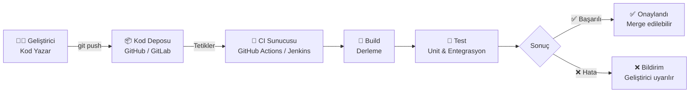
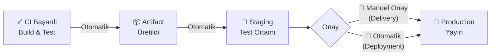
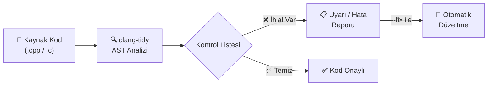

## CI (Continuous Integration)

Her kod değişikliğinde (commit/pull request) otomatik olarak derleme ve testleri çalıştırır. Sorunları dakikalar içinde raporlar; production'a geçmeden yakalar.





| Kavram             | Açıklama                                                                      |
| ------------------ | ----------------------------------------------------------------------------- |
| **Pipeline**       | CI sürecindeki adımların sıralı çalıştığı yapı (build → test → raporlama)     |
| **Job**            | Pipeline içinde bağımsız olarak çalışan bir görev birimi; paralel çalışabilir |
| **Step / Stage**   | Job içindeki tek bir komut ya da eylem                                        |
| **Trigger**        | Pipeline'ı başlatan olay (push, pull request, schedule gibi)                  |
| **Artifact**       | Build sonucunda üretilen çıktı dosyaları (binary, rapor, paket)               |
| **Runner / Agent** | CI komutlarını çalıştıran sunucu veya sanal makine                            |


| Araç               | Açıklama                                                                                   |
| ------------------ | ------------------------------------------------------------------------------------------ |
| **GitHub Actions** | GitHub'a entegre, YAML tabanlı; ek kurulum gerektirmez                                     |
| **GitLab CI/CD**   | GitLab'a gömülü, `.gitlab-ci.yml` ile yapılandırılır                                       |
| **Jenkins**        | Açık kaynak, eklenti tabanlı; kendi sunucunda çalıştırırsın, tam kontrol                   |
| **CircleCI**       | Bulut tabanlı, hızlı kurulum                                                               |
| **Travis CI**      | Açık kaynak projeler için yaygın kullanılırdı; günümüzde GitHub Actions daha tercih edilir |


!!! example "GitHub Actions ile C++ CI (`.github/workflows/ci.yml`)"
    ```yaml
    name: C++ CI

    on:
      push:
        branches: [ main, develop ]
      pull_request:
        branches: [ main ]

    jobs:
      build-and-test:
        runs-on: ubuntu-latest

        steps:
          - name: Kodu İndir
            uses: actions/checkout@v4

          - name: Bağımlılıkları Kur
            run: sudo apt-get install -y cmake g++ ninja-build

          - name: CMake ile Yapılandır
            run: cmake -B build -G Ninja -DCMAKE_BUILD_TYPE=Release

          - name: Derle
            run: cmake --build build

          - name: Testleri Çalıştır
            run: cd build && ctest --output-on-failure
    ```

!!! tip "İyi Bir CI Pipeline'ının Özellikleri"
    1. **Hızlı olmalı:** 10 dakikayı geçen pipeline'lar geliştiricileri yavaşlatır ve atlanmaya başlar.
    2. **Deterministik olmalı:** Aynı kod her çalıştırmada aynı sonucu vermelidir. "Bazen geçiyor bazen geçmiyor" olan test güvenilmezdir.
    3. **Anlamlı hata mesajı üretmeli:** Sorunun kaynağını açıkça göstermelidir; geliştirici log'un içinde kaybolmamalı.
    4. **Her commit'te çalışmalı:** Özellikle ana branch'e giden her değişiklikte tetiklenmelidir.


## CD (Continuous Delivery / Deployment)

Production'a alma sürecini otomatize eder. Deploy sık yapıldıkça küçük değişiklikler gider ve risk azalır.


|                    | Continuous Delivery                              | Continuous Deployment                                           |
| ------------------ | ------------------------------------------------ | --------------------------------------------------------------- |
| **Tanım**          | Yazılım her an yayına alınmaya **hazır** tutulur | Yazılım her başarılı build'de **otomatik** olarak yayına alınır |
| **Son adım**       | İnsan onayı gerekir                              | Tamamen otomatik                                                |
| **Kullanım alanı** | Kritik sistemler, finans, sağlık                 | SaaS uygulamaları, web servisleri                               |





| Ortam                 | Açıklama                                                                       |
| --------------------- | ------------------------------------------------------------------------------ |
| **Development (Dev)** | Geliştiricilerin aktif çalıştığı, en sık değişen ortam                         |
| **Staging**           | Production'ın birebir kopyası; son testler burada yapılır; kullanıcılar görmez |
| **Production (Prod)** | Gerçek kullanıcıların eriştiği canlı ortam                                     |


| Strateji                  | Açıklama                                                                                                                               |
| ------------------------- | -------------------------------------------------------------------------------------------------------------------------------------- |
| **Blue-Green Deployment** | İki özdeş ortam tutulur; yeni versiyon "yeşil"e alınır, sorun yoksa trafik anahtarlanır. Sorun çıkarsa anında eski ortama geri dönülür |
| **Canary Release**        | Yeni versiyon önce %1-5 kullanıcıya sunulur, sorun yoksa kademeli genişletilir. Risk minimize edilir                                   |
| **Rolling Update**        | Sunucular sırayla güncellenir; sistem hiç tamamen kapanmaz                                                                             |
| **Feature Flag**          | Yeni özellik kodda mevcut ama yapılandırmayla açık/kapalı kontrol edilir. Deploy ile release birbirinden ayrılır                       |


!!! example "GitHub Actions ile CD (Staging'e Otomatik Deploy)"
    ```yaml
    name: CD - Staging Deploy

    on:
      push:
        branches: [ main ]

    jobs:
      deploy-staging:
        runs-on: ubuntu-latest
        needs: build-and-test       # CI job'ı başarılıysa çalışır

        steps:
          - name: Kodu İndir
            uses: actions/checkout@v4

          - name: Docker Image Oluştur
            run: docker build -t myapp:${{ github.sha }} .

          - name: Staging'e Gönder
            run: |
              docker tag myapp:${{ github.sha }} registry.example.com/myapp:staging
              docker push registry.example.com/myapp:staging

          - name: Staging Ortamını Güncelle
            run: ssh deploy@staging.example.com "docker pull && docker-compose up -d"

      deploy-production:
        runs-on: ubuntu-latest
        needs: deploy-staging
        environment:
          name: production          # GitHub'da manuel onay gerektirir
        steps:
          - name: Production'a Deploy
            run: ssh deploy@prod.example.com "docker pull && docker-compose up -d"
    ```


!!! danger "CD için Kritik Noktalar"
    1. **Rollback planı:** Her deployment geri alınabilmeli; önceki versiyona dönmek hızlı ve güvenli olmalıdır.
    2. **Health check:** Deploy sonrası uygulamanın ayakta olduğu doğrulanmalı, sorun varsa otomatik rollback tetiklenmelidir.
    3. **Secret yönetimi:** Parola, API anahtarı asla kaynak kodda bulunmamalı; CI/CD sistemi secret store'lardan okumalıdır.
    4. **Ortam değişkenleri:** Dev/Staging/Prod farkları kod değil, konfigürasyon üzerinden yönetilmelidir.


## clang-tidy

LLVM/Clang altyapısını kullanan bir **statik analiz** ve **linting** aracıdır. Kodu çalıştırmadan, AST (Abstract Syntax Tree) üzerinde analiz ederek derleyici uyarılarının yakalayamadığı hataları (bellek sızıntısı, null pointer dereference, kullanımdan sonra move gibi), stil ihlallerini ve modernleştirme fırsatlarını tespit eder.


!!! note "Statik Analiz Nedir?"
    Programın kaynak kodu üzerinde **çalıştırılmadan** yapılan inceleme. Derleyici uyarılarının ötesine geçer: mantık hataları, kaynak sızıntıları, güvenlik açıkları. Kod review'dan farklı olarak otomatiktir ve her commit'te çalışır.





| Kategori              | Prefix             | Açıklama                                                       |
| --------------------- | ------------------ | -------------------------------------------------------------- |
| **Clang Analizör**    | `clang-analyzer-*` | Bellek sızıntısı, null pointer dereference gibi ciddi hatalar  |
| **C++ Modernizasyon** | `modernize-*`      | Eski C++ kodunu C++11/14/17 idiomlarına dönüştürür             |
| **Performans**        | `performance-*`    | Gereksiz kopyalama, verimsiz döngü gibi sorunları yakalar      |
| **Okunabilirlik**     | `readability-*`    | İsimlendirme, karmaşıklık ve anlaşılırlık sorunlarını raporlar |
| **Güvenlik**          | `cert-*`           | CERT C/C++ güvenli kodlama standartlarını uygular              |
| **Google Stili**      | `google-*`         | Google C++ stil kurallarını kontrol eder                       |
| **Hata Yatkınlığı**   | `bugprone-*`       | Sık yapılan mantık hatalarını ve tehlikeli kalıpları saptar    |
| **Taşınabilirlik**    | `portability-*`    | Platformlar arası uyumsuzlukları bildirir                      |


```bash
sudo apt-get install clang-tidy

clang-tidy main.cpp -- -std=c++17              # Tek dosyayı analiz et
clang-tidy main.cpp --checks="*" -- -std=c++17 # Tüm kontrolleri etkinleştir

# Belirli kategorileri seç
clang-tidy main.cpp --checks="modernize-*,bugprone-*,performance-*" -- -std=c++17

# Sorunları otomatik düzelt
clang-tidy main.cpp --checks="modernize-*" --fix -- -std=c++17

# CMake build diziniyle kullan (compile_commands.json gerekir)
clang-tidy -p build/ main.cpp
```

!!! note "compile_commands.json Nedir?"
    clang-tidy her dosyanın nasıl derlendiğini bilmek ister: hangi include path'ler, hangi bayraklar. Bu bilgiyi `compile_commands.json` dosyasından okur. Olmadan include path'lerini bulamaz ve yanlış analiz yapar. CMake ile üretmek için:
    ```bash
    cmake -B build -DCMAKE_EXPORT_COMPILE_COMMANDS=ON
    ```


| Kontrol                                       | Açıklama                                                               |
| --------------------------------------------- | ---------------------------------------------------------------------- |
| `modernize-use-nullptr`                       | `NULL` yerine `nullptr` kullanımını önerir                             |
| `modernize-use-auto`                          | Tip açık olduğunda `auto` kullanımını önerir                           |
| `modernize-range-based-for`                   | İndeks döngülerini range-based for'a çevirir                           |
| `modernize-use-override`                      | Virtual fonksiyon override'larına `override` eklenmesini zorunlu kılar |
| `bugprone-use-after-move`                     | `std::move` sonrası nesne kullanımını tespit eder                      |
| `performance-unnecessary-copy-initialization` | Gereksiz kopyalamaları işaret eder                                     |
| `clang-analyzer-cplusplus.NewDelete`          | Bellek sızıntılarını ve çifte silmeleri tespit eder                    |


!!! example "`.clang-tidy` Yapılandırma Dosyası Örneği"
    
    Proje kök dizinine `.clang-tidy` dosyası eklenerek kontroller kalıcı olarak yapılandırılır; her geliştirici ve CI aynı kuralları kullanır.

    ```yaml
    ---
    Checks: >
      -*,
      clang-analyzer-*,
      modernize-*,
      bugprone-*,
      performance-*,
      readability-identifier-naming,
      -modernize-use-trailing-return-type

    WarningsAsErrors: "bugprone-*"

    CheckOptions:
      - key: readability-identifier-naming.ClassCase
        value: CamelCase
      - key: readability-identifier-naming.FunctionCase
        value: camelCase
      - key: readability-identifier-naming.VariableCase
        value: lower_case
      - key: readability-identifier-naming.ConstantCase
        value: UPPER_CASE
    ```


!!! tip "CMake ile Entegrasyon"
    ```cmake title="CMakeLists.txt"
    find_program(CLANG_TIDY clang-tidy)
    if(CLANG_TIDY)
        set(CMAKE_CXX_CLANG_TIDY
            ${CLANG_TIDY}
            --checks=modernize-*,bugprone-*,performance-*
            --warnings-as-errors=bugprone-*)
    endif()
    ```


## clang-format

Kaynak kodunu belirlenen kurallara göre otomatik biçimlendiren bir araçtır. Bir kez yapılandırıldıktan sonra ekipteki herkes aynı formatı kullanır; girinti/boşluk farklılıklarından kaynaklanan gereksiz diff'ler ve tartışmalar ortadan kalkar.

Kodu elle formatlamak zaman kaybıdır. `clang-format` kullanıldığında ekip farklı editörler kullansa bile her commit aynı formata sahip olur. Bu özellikle gömülü sistemlerde ve büyük C++ projelerinde standart bir pratiktir.


!!! danger "Dikkat Edilmesi Gerekenler"
    1. `.clang-format` dosyası proje kök dizininde olmalıdır; yoksa clang-format üst dizinlere bakarak arar ve yanlış kurallar uygulayabilir.
    2. Mevcut projeye ilk kez `clang-format -i` uygulandığında çok büyük bir diff oluşur. Bu değişikliği tek bir ayrı "style: apply clang-format" commit'ine toplamak git history'nin okunabilirliğini korur.
    3. `ColumnLimit: 0` satır kesimi yapılmamasını sağlar; büyük projelerde okunabilirliği bozabilir.
    

| Yerleşik Stil Şablonları        | Açıklama                             |
| --------------------------------| ------------------------------------ |
| `LLVM`                          | LLVM projesinin kodlama standartları |
| `Google`                        | Google C++ Stil Kılavuzu             |
| `Chromium`                      | Google'ın Chromium projesi stili     |
| `Mozilla`                       | Mozilla kodlama standartları         |
| `WebKit`                        | WebKit projesinin stili              |
| `Microsoft`                     | Microsoft C++ kodlama stili          |
| `GNU`                           | GNU projesinin stil kuralları        |


```bash
sudo apt-get install clang-format

# Çıktıyı terminale yaz (dosyayı değiştirmez - önizleme için)
clang-format main.cpp
clang-format -i main.cpp                # Dosyayı yerinde formatla
clang-format -i --style=Google main.cpp # Belirli bir stil şablonuyla formatla

# Birden fazla dosyayı formatla
clang-format -i --style=LLVM src/*.cpp include/*.h

# CI'da format kontrolü - değişiklik varsa hata döner, dosyayı değiştirmez
clang-format --dry-run --Werror main.cpp
```


!!! example "`.clang-format` Yapılandırma Dosyası"
    
    Proje kök dizinindeki `.clang-format` dosyası tüm ekip için ortak kuralları tanımlar. clang-format çalıştırıldığında üst dizinlere bakarak bu dosyayı bulur.

    ```yaml
    ---
    BasedOnStyle: LLVM

    # Girinti
    IndentWidth: 4
    TabWidth: 4
    UseTab: Never
    AccessModifierOffset: -4

    # Satır uzunluğu
    ColumnLimit: 120

    # Süslü parantez stili
    BreakBeforeBraces: Allman    

    # Boşluk kuralları
    SpaceBeforeParens: ControlStatements
    SpaceInEmptyParentheses: false
    SpacesInAngles: false

    # Pointer ve referans hizalama
    PointerAlignment: Left       # int* ptr  (sola yapışık)

    # Include sıralama
    SortIncludes: CaseSensitive
    IncludeBlocks: Regroup

    # Constructor initializer listesi
    BreakConstructorInitializers: BeforeColon

    # Namespace içi girinti
    NamespaceIndentation: None
    ```


| BreakBeforeBraces    | Görünüm                                    | Kullanım               |
| ---------------------| ------------------------------------------ | ---------------------- |
| `Allman`             | `{` her zaman yeni satırda                 | C/C++ geleneksel stili |
| `Attach`             | `{` önceki satırın sonunda                 | Java / Google stili    |
| `Linux`              | Fonksiyonda `{` yeni satır, kontrolde ekli | Linux kernel stili     |


=== "VS Code"
    ```json title=".vscode/settings.json"
    {
        "editor.formatOnSave": true,
        "editor.defaultFormatter": "xaver.clang-format",
        "C_Cpp.clang_format_style": "file",
        "C_Cpp.clang_format_fallbackStyle": "LLVM"
    }
    ```

=== "CMake"
    ```cmake title="CMakeLists.txt"
    find_program(CLANG_FORMAT clang-format)
    if(CLANG_FORMAT)
        file(GLOB_RECURSE ALL_SOURCE_FILES
            ${CMAKE_SOURCE_DIR}/src/*.cpp
            ${CMAKE_SOURCE_DIR}/include/*.h)

        add_custom_target(format
            COMMAND ${CLANG_FORMAT} -i --style=file ${ALL_SOURCE_FILES}
            COMMENT "Kod formatlaniyor...")

        add_custom_target(format-check
            COMMAND ${CLANG_FORMAT} --dry-run --Werror ${ALL_SOURCE_FILES}
            COMMENT "Format kontrolu yapiliyor...")
    endif()
    ```

=== "GitHub Actions"
    ```yaml title=".github/workflows/format-check.yml"
    name: Format Check

    on: [ push, pull_request ]

    jobs:
      clang-format:
        runs-on: ubuntu-latest
        steps:
          - uses: actions/checkout@v4

          - name: clang-format Kur
            run: sudo apt-get install -y clang-format

          - name: Format Kontrolü
            run: |
              find src/ include/ -name "*.cpp" -o -name "*.h" | \
              xargs clang-format --dry-run --Werror
    ```

!!! tip "Mevcut Koddan Stil Üretme"
    Mevcut projeye `.clang-format` dosyasını sıfırdan yazmak yerine LLVM'den türetip ayarlamak daha kolaydır:
    ```bash
    clang-format --dump-config --style=LLVM > .clang-format
    # Sonra .clang-format dosyasını tercihlerine göre düzenle
    ```
