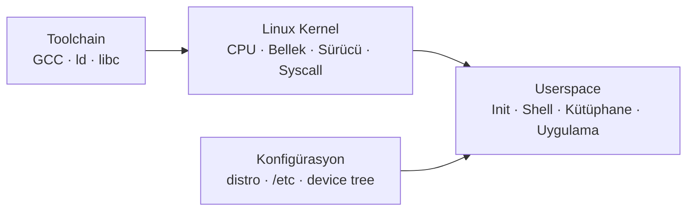
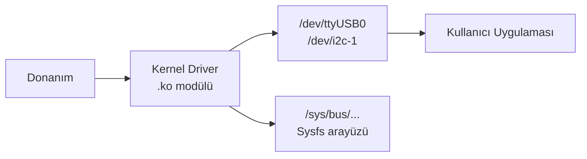
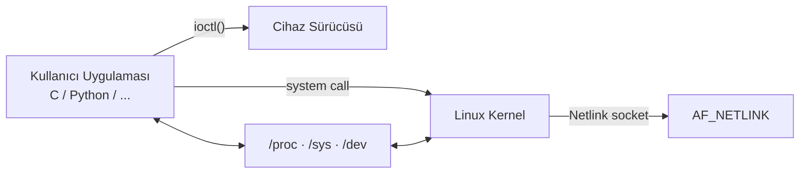
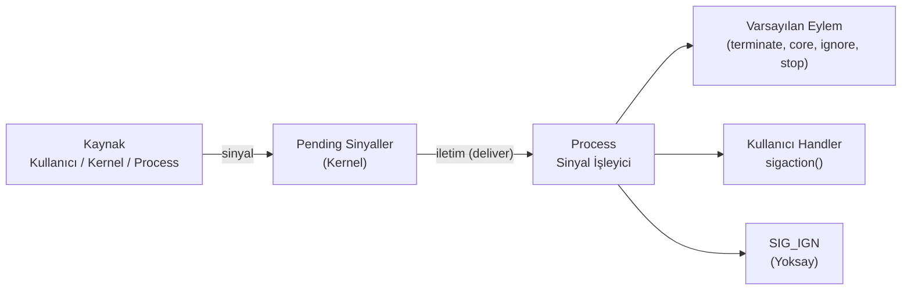

# Temel Linux 



- Linux, **Kernel + Userspace + Toolchain + Konfigürasyon** katmanlarından oluşan özgür ve açık kaynaklı bir işletim sistemi çekirdeğidir.

-  **Büyük - küçük harfe duyarlıdır.** (`README.md` ≠ `readme.md`)
- **inode**     Dosyanın veri bloklarını ve meta bilgilerini (izin, boyut, tarih) tutan benzersiz yapı. 
- **Soft Link** Hedef dosyanın yoluna referans; asıl dosya silinirse işlevsiz kalır.                    
- **Hard Link** Dosyanın inode'una doğrudan bağlanır; asıl dosya silinse de veri korunur.               
- **Daemon**    Sistem başlangıcında başlayan, arka planda çalışan uzun ömürlü servisler.               
- **Scheduler** CPU zamanını process'ler arasında paylaştıran kernel alt sistemi.                       
- **Polling**   CPU'nun bir donanımın durumunu belirli aralıklarla aktif olarak kontrol etmesi.         
- **Gizli Dosyalar:** `.` ile başlayan dosyalar gizlidir. (`.bashrc`, `.gitconfig`, `.ssh/`)

- Terminalde `#` **root** kullanıcı (Shell'de yorum satırı) `$` standart kullanıcı simgesidir.                                               
- `>` Stdout'u dosya varsa **üzerine yazar**. `>>` dosyanın **sonuna ekler** mevcut veriyi korur.       
- `2>` Yalnızca **stderr** (hata mesajları) dosyaya yönlendirir.      
- `<` Stdin'i klavye yerine **dosyadan alır**.                       
- `&>` Hem stdout hem stderr'ı aynı dosyaya yönlendirir.              
- `tee` Çıktıyı hem terminale hem dosyaya yazar.  
- `;` Komutları sırayla çalıştırır. (Başarı durumu gözetilmez)        
- `&&` Sol komut başarılıysa sağdakini çalıştırır. `||` Sol komut başarısızsa sağdakini çalıştırır.                    
- `&` Komutu **arka planda** çalıştırır.     
- `|` Bir komutun çıktısını bir sonrakinin girdisine bağlar.         

```bash
echo "merhaba" > dosya.txt          # Dosyaya yaz (üzerine yazar)

ls >> dosya.txt                      # Dosyaya ekle
cat < dosya.txt                      # Dosyadan oku
telnet localhost 2> hata.txt         # Hataları dosyaya yönlendir
ls /tmp 2>/dev/null                  # Hata mesajını yok say
komut &> tum_cikti.txt               # Stdout + stderr → dosya

echo "merhaba" | tee -a dosya.txt   # Hem ekrana hem dosyaya yaz

cmd1 && cmd2                         # cmd1 başarılıysa cmd2 çalışır
cmd1 || cmd2                         # cmd1 başarısızsa cmd2 çalışır
sleep 10 &                           # Arka planda çalıştır
```

## Dosya Sistemi ve Dosyalar

| Dizin            | Açıklama                                                                        |
| ---------------- | ------------------------------------------------------------------------------- |
| `/`              | Tüm dosya sisteminin kökü (`root`)                                              |
| `/bin`, `/sbin`  | Kritik sistem komutları. Modern distro'larda `/usr/bin`'e symlink.              |
| `/etc`           | Statik sistem yapılandırma dosyaları (ağ, kullanıcı, güvenlik).                 |
| `/usr`           | Paylaşılan kullanıcı programları ve kütüphaneler (salt okunur).                 |
| `/lib`, `/lib64` | Dinamik kütüphaneler ve kernel modülleri (`/lib/modules/<versiyon>/`).          |
| `/dev`           | Donanım aygıt düğümleri - UART, I2C, SPI, disk vb. kernel'in userspace arayüzü. |
| `/sys`           | Kernel nesne modelinin userspace arayüzü (sysfs).                               |
| `/var`           | Çalışma zamanında değişen kalıcı veriler - loglar, state.                       |
| `/tmp`           | Geçici dosyalar; genellikle RAM'de (tmpfs). Yeniden başlatmada silinir.         |
| `/boot`          | Kernel image, DTB, initramfs gibi önyükleme dosyaları.                          |
| `/proc`          | Kernel runtime durumunun sanal görünümü (procfs).                               |
|                  | `/proc/cmdline`     ->  Kernel başlatma parametreleri                           |
|                  | `/proc/meminfo`     ->  Bellek kullanım bilgisi                                 |
|                  | `/proc/cpuinfo`     ->  İşlemci bilgisi                                         |
|                  | `/proc/<pid>/`      ->  Belirli bir process'in detayları                        |
|                  | `/proc/<pid>/maps`  ->  Process bellek haritası                                 |
|                  | `/proc/<pid>/fd/`   ->  Açık dosya tanımlayıcıları                              |


```bash
$ ls -l
total 28
drwxrwxr-x  4 serkan serkan 4096 Ağu  6 16:32 docs
-rw-rw-r--  1 serkan serkan 5676 Ağu 12 16:41 mkdocs.yml
-rw-rw-r--  1 serkan serkan   24 Ağu 10 15:58 README.md

#  Tür     Sahip    Grup     Diğer
#   d      r w x    r w -    - w 


# Tür:
# `-`: Düzenli dosya (Regular File)                
# `d`: Dizin (Directory)                           
# `l`: Sembolik Link                               
# `c`: Karakter Aygıtı (terminal, seri port)       
# `b`: Blok Aygıtı (disk, USB)                     
# `s`: Soket (Socket)                              
# `p`: Adlandırılmış Boru Hattı (Named Pipe / FIFO)


#   İzinler: 
#   r (Read / Okuma)       = 4
#   w (Write / Yazma)      = 2
#   x (Execute / Çalıştır) = 1
#   - (İzin yok)           = 0

chmod 755 script.sh           # rwxr-xr-x
chmod +x  script.sh           # Sadece execute ekle
chmod g-w dosya.txt           # Gruptan yazma kaldır
chmod u=rw,go=r dosya         # Detaylı format

chown serkan:arge dosya.txt   # Sahip ve grup değiştir
chgrp arge dizin              # Sadece grup
```


## Regular Expression (Regex)

- **BRE (Basic):** `grep`, `sed` varsayılanı. `+`, `?`, `|`, `()` için `\` gerekir.
- **ERE (Extended):** `grep -E`, `egrep`, `awk`. Özel karakterler doğrudan kullanılır.

| Karakter | Anlamı                             | Örnek         | Eşleşen                      |
| -------- | ---------------------------------- | ------------- | ---------------------------- |
| `.`      | Herhangi bir karakter              | `a.c`         | `abc`, `axc`, `a1c`          |
| `*`      | Öncekinden 0 veya daha fazla       | `ab*c`        | `ac`, `abc`, `abbc`          |
| `+`      | Öncekinden 1 veya daha fazla (ERE) | `ab+c`        | `abc`, `abbc`                |
| `?`      | Önceki opsiyonel (ERE)             | `colou?r`     | `color`, `colour`            |
| `^`      | Satır başı                         | `^Hata`       | "Hata" ile başlayan satırlar |
| `$`      | Satır sonu                         | `Hata$`       | "Hata" ile biten satırlar    |
| `[]`     | Karakter sınıfı                    | `[abc]`       | `a`, `b` veya `c`            |
| `[^]`    | Hariç tutma                        | `[^0-9]`      | Rakam olmayan her karakter   |
| `{n,m}`  | n ile m arası tekrar               | `a{2,4}`      | `aa`, `aaa`, `aaaa`          |
| `()`     | Gruplama                           | `(ab)+`       | `ab`, `abab`, `ababab`       |
| `\|`     | Alternatif (veya)                  | `kedi\|köpek` | `kedi` veya `köpek`          |
| `\d`     | Rakam                              | `\d{3}`       | `123`                        |
| `\w`     | Kelime karakteri                   | `\w+`         | `merhaba_123`                |
| `\s`     | Boşluk karakteri                   | `\s+`         | boşluk, tab                  |


| POSIX Sınıf   | Anlamı               |
| ------------- | -------------------- |
| `[[:digit:]]` | Rakamlar (0–9)       |
| `[[:alpha:]]` | Harfler              |
| `[[:alnum:]]` | Harf ve rakamlar     |
| `[[:space:]]` | Boşluk karakterleri  |
| `[[:upper:]]` | Büyük harfler        |
| `[[:lower:]]` | Küçük harfler        |
| `[[:punct:]]` | Noktalama işaretleri |


```bash title="grep Örnekleri"
grep "hata" dosya.log                                          # Tam eşleşme
grep -i "hata" dosya.log                                       # Büyük/küçük harf duyarsız
grep "^Error" dosya.log                                        # Satır başı
grep "failed$" dosya.log                                       # Satır sonu
grep -E "[0-9]+" dosya.log                                     # ERE ile rakam ara
grep -E "([0-9]{1,3}\.){3}[0-9]{1,3}" dosya.log              # IP adresi
grep -E "hata|uyarı" dosya.log                                 # Birden fazla kalıp
grep -v "debug" dosya.log                                      # Eşleşmeyenleri göster
grep -r -E "TODO|FIXME" /proje/                                # Özyinelemeli arama
grep -o -E "[a-zA-Z0-9._%+-]+@[a-zA-Z0-9.-]+\.[a-zA-Z]{2,}" dosya.txt
```

```text title="Yaygın Kalıplar"
# E-posta
[a-zA-Z0-9._%+-]+@[a-zA-Z0-9.-]+\.[a-zA-Z]{2,}

# IPv4 adresi
^([0-9]{1,3}\.){3}[0-9]{1,3}$

# Tarih (YYYY-MM-DD)
^[0-9]{4}-[0-9]{2}-[0-9]{2}$

# URL
^https?://[a-zA-Z0-9.-]+\.[a-zA-Z]{2,}(/\S*)?$

# Türkiye telefon (05XX XXX XX XX)
^0[0-9]{3}[ ]?[0-9]{3}[ ]?[0-9]{2}[ ]?[0-9]{2}$
```


## Sistem Günlükleri

| Kaynak              | Açıklama                               |
| ------------------- | -------------------------------------- |
| `/var/log/boot.log` | Önyükleme mesajları                    |
| `/var/log/auth.log` | Kimlik doğrulama ve güvenlik olayları  |
| `/var/log/syslog`   | Genel sistem mesajları (Debian/Ubuntu) |
| `/var/log/messages` | Genel sistem mesajları (RHEL/CentOS)   |
| `/var/log/kern.log` | Kernel detaylı kayıtları               |
| `dmesg`             | Kernel ring buffer çıktısı             |
| `journalctl`        | systemd journal kayıtları              |

```bash
journalctl -b                     # Son önyüklemeden itibaren tüm loglar
journalctl -u nginx               # Belirli bir servisin logları
journalctl -f                     # Canlı log takibi (tail -f benzeri)
journalctl -p err                 # Sadece hata seviyesi
journalctl --since "1 hour ago"   # Son 1 saatin logları
dmesg | grep -i error             # Kernel hata mesajlarını filtrele
dmesg -T                          # İnsan okunabilir timestamp
```


## Run Levels ve Systemd Targets

| Run Level | Anlamı                | systemd Target      |
| :-------: | --------------------- | ------------------- |
|     0     | Kapatma               | `poweroff.target`   |
|     1     | Tek kullanıcı (bakım) | `rescue.target`     |
|     3     | Çoklu kullanıcı + ağ  | `multi-user.target` |
|     5     | Grafik arayüz + ağ    | `graphical.target`  |
|     6     | Yeniden başlatma      | `reboot.target`     |

```bash
systemctl isolate multi-user.target    # Target geçişi
systemctl get-default                  # Varsayılan target
systemctl set-default graphical.target # Varsayılan değiştir
sudo init 3                            # SysV run level değiştir
```


## Kernel Modülleri ve Sürücüler



| Komut               | Açıklama                                                |
| ------------------- | ------------------------------------------------------- |
| `lsmod`             | Yüklü kernel modüllerini listeler                       |
| `modprobe <modül>`  | Modül yükler (bağımlılıkları da yükler)                 |
| `rmmod <modül>`     | Modülü kaldırır                                         |
| `modinfo <modül>`   | Modül meta bilgisini gösterir                           |
| `insmod <dosya.ko>` | Belirtilen `.ko` dosyasını yükler (bağımlılık yönetmez) |

```bash
lsmod | grep usb           # USB ile ilgili modüller
modinfo usbserial          # usbserial modülü hakkında bilgi
sudo modprobe i2c-dev      # i2c-dev modülünü yükle
sudo modprobe -r i2c-dev   # Modülü kaldır
```

---

## Linux Kernel ve Userspace İletişim Mekanizmaları



| Mekanizma          | Açıklama                                                                                 |
| ------------------ | ---------------------------------------------------------------------------------------- |
| **System Call**    | Kullanıcı modunun kernel hizmetlerine erişmesi: `open()`, `read()`, `write()`, `ioctl()` |
| **ioctl**          | Sürücülere özel kontrol komutları; cihaz özelliklerine göre farklı anlam taşır           |
| **Netlink Socket** | Kernel ↔ Userspace mesajlaşma; `AF_NETLINK` ailesi; network config için yaygın           |
| **Device File**    | `/dev` altındaki düğümler; blok ve karakter aygıtlara okuma/yazma arayüzü                |
| **sysfs**          | `/sys` üzerinden sürücü ve donanım parametrelerine R/W erişim                            |
| **procfs**         | `/proc` üzerinden kernel runtime state'ini okuma                                         |

---

## Sinyaller (Signals)

Sinyaller, process'lere asenkron olay bildirimi gönderen kernel mekanizmasıdır. Bir sinyal; kullanıcı (`Ctrl+C`), kernel (segfault), başka bir process (`kill`) veya donanım tarafından gönderilebilir.



| Sinyal      | No    | Varsayılan | Açıklama                                   |
| ----------- | ----- | ---------- | ------------------------------------------ |
| `SIGHUP`    | 1     | Terminate  | Terminal kapandı / daemon yeniden yükle    |
| `SIGINT`    | 2     | Terminate  | `Ctrl+C` - kullanıcı kesme                 |
| `SIGQUIT`   | 3     | Core Dump  | `Ctrl+\` - core dump ile çıkış             |
| `SIGKILL`   | 9     | Terminate  | **Yakalanamaz/engellenemez** - zorla öldür |
| `SIGSEGV`   | 11    | Core Dump  | Geçersiz bellek erişimi                    |
| `SIGPIPE`   | 13    | Terminate  | Okuyucusu olmayan pipe'a yazma             |
| `SIGALRM`   | 14    | Terminate  | `alarm()` zamanlayıcı                      |
| `SIGTERM`   | 15    | Terminate  | Nazik sonlandırma isteği (yakalanabilir)   |
| `SIGCHLD`   | 17    | Ignore     | Alt process durdu / sonlandı               |
| `SIGSTOP`   | 19    | Stop       | **Yakalanamaz** - process'i durdur         |
| `SIGCONT`   | 18    | Continue   | Durdurulan process'i devam ettir           |
| `SIGUSR1/2` | 10/12 | Terminate  | Uygulama tanımlı kullanım                  |

```bash
# Sinyal gönderme
kill -SIGTERM 1234          # PID'e nazikçe sonlandırma
kill -9 1234                # SIGKILL - zorla
kill -SIGHUP $(pgrep nginx) # nginx'e yeniden yükleme sinyali
pkill -USR1 gunicorn        # İsme göre SIGUSR1 gönder
killall -TERM myapp         # Aynı isimli tüm process'lere

# Process'in bekleyen sinyallerini göster
cat /proc/<PID>/status | grep Sig  # SigPnd, SigBlk, SigIgn, SigCgt

# Sinyal maskesini çöz (bitfield → sinyal adları)
kill -l                     # Tüm sinyalleri listele
```

```c
// C - sinyal yakalama (sigaction)
#include <signal.h>

static volatile sig_atomic_t running = 1;

static void handle_sigterm(int sig) {
    running = 0;    // async-signal-safe: sadece atomic yaz
}

int main(void) {
    struct sigaction sa = {
        .sa_handler = handle_sigterm,
        .sa_flags   = SA_RESTART,   // Kesilen syscall'ları yeniden başlat
    };
    sigemptyset(&sa.sa_mask);
    sigaction(SIGTERM, &sa, NULL);
    sigaction(SIGINT,  &sa, NULL);

    while (running) {
        // ...
    }
    return 0;
}
```

!!! warning "Async-Signal-Safe"
    Sinyal işleyici içinde `printf`, `malloc`, `free` gibi fonksiyonlar çağrılmamalıdır - bu fonksiyonlar async-signal-safe değildir ve kilitlenmeye (deadlock) yol açabilir. İşleyici içinde yalnızca `write()`, `_exit()` veya `sig_atomic_t` işlemleri güvenlidir.


## Terminal Kısayolları

| Kısayol    | İşlev                                       |
| ---------- | ------------------------------------------- |
| `Ctrl + C` | Çalışan komutu sonlandırır                  |
| `Ctrl + Z` | Çalışan komutu duraklatır (arka plana alır) |
| `Ctrl + R` | Komut geçmişinde arama                      |
| `Ctrl + U` | İmlecin solundaki her şeyi siler            |
| `Ctrl + A` | Satır başına git                            |
| `Ctrl + E` | Satır sonuna git                            |
| `Ctrl + L` | Terminali temizler (`clear` gibi)           |
| `Ctrl + S` | Terminal çıktı akışını durdurur             |
| `Ctrl + Q` | Durdurulan akışı sürdürür                   |
| `Alt + F2` | Komut çalıştırma penceresi (grafik ortam)   |