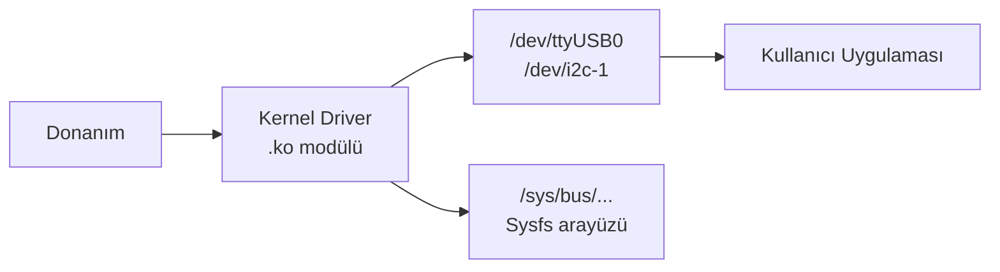
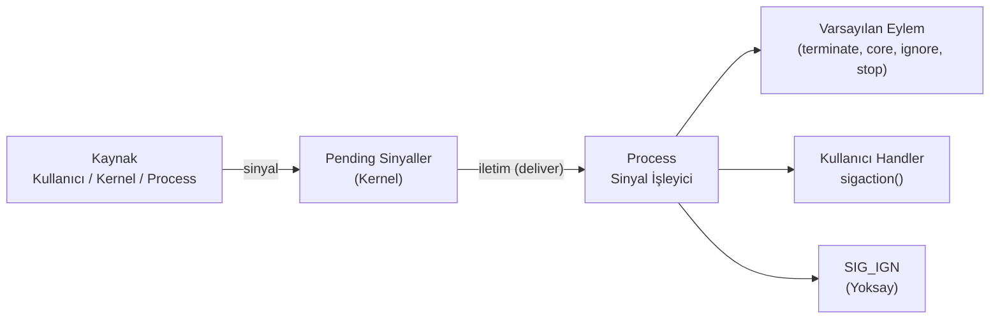
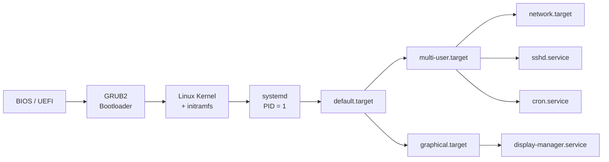

# Temel Linux

| Kavram              | Açıklama                                                                                                                                                    |
| ------------------- | ------------------------------------------------------------------------------------------------------------------------------------------------------------ |
| **inode**           | Dosyanın disk üzerindeki kimlik kartıdır. Dosya adını değil, meta bilgilerini (izin, boyut, sahip, zaman damgaları, veri bloklarının adresi) tutan benzersiz yapıdır. |
| **Soft (Symbolic) Link** | Hedef dosyanın **yoluna** referanstır; farklı dosya sistemine/diske işaret edebilir, asıl dosya silinirse veya taşınırsa işlevsiz kalır (`broken link`).      |
| **Hard Link**       | Dosyanın **inode'una** doğrudan bağlanır; aynı dosya sisteminde olmak zorundadır. Asıl dosya silinse bile veri, o inode'a bağlı en az bir hard link kaldığı sürece korunur. |
| **Daemon**          | Arka planda çalışan, genellikle bir isteğe/olaya yanıt veren uzun ömürlü servis süreçleridir (`sshd`, `nginx`, `cron`...); illa sistem açılışında başlamaları gerekmez. |
| **Scheduler**       | Sınırlı CPU kaynağını process/thread'ler arasında adil ve verimli paylaştıran kernel bileşenidir (Linux'ta varsayılan: CFS / EEVDF).                          |
| **Polling**         | CPU'nun bir donanımın durumunu belirli aralıklarla aktif olarak kontrol etmesidir; alternatifi donanımın kendisinin bir **interrupt** ile CPU'yu uyarmasıdır. |
| **User Space**      | Uygulamaların çalıştığı, donanıma doğrudan erişimi olmayan katmandır. Donanımla konuşmak için `syscall` (`read()`, `write()`, `open()`, `mmap()`...) ile kernel'den istekte bulunulur; bu geçişe **context switch** denir ve maliyetlidir. |
| **Kernel Space**    | Donanımın (disk, bellek, network...) doğrudan kontrol edildiği ayrıcalıklı katmandır.                                                                          |
| **Hard Real-Time**  | Görevin tanımlı deadline içinde kesin olarak tamamlanmasını garanti eden mimaridir; deadline kaçırılması sonucu tamamen geçersiz sayar (ör. hava yastığının zamanında açılmaması). Jitter en aza indirilir, deterministik scheduler kullanılır. |
| **Soft Real-Time**  | Deadline aşımı sistemi çökertmez, yalnızca çıktı kalitesini/deneyimini düşürür (ör. video akışının anlık donması). Zamanlama gereksinimleri daha esnektir.    |

!!! note "Linux ve Real-Time"
    Linux varsayılan olarak Soft Real-Time'dır; çekirdeğe **PREEMPT_RT** yaması uygulanıp doğru konfigüre edildiğinde, endüstriyel/otonom sistemlerin gerektirdiği Hard Real-Time garantilerine yaklaşan bir davranış sergiler.

!!! tip "Not"
    1. Sistem büyük / küçük harfe duyarlıdır ve gizli dosya oluşturmak için başına `.` koyulur.
    2. Terminalde `#` root, `$` standart kullanıcı yetkisini gösterir.
    3. Dosya Türleri: `-` Regular File, `d` Directory, `l` Sembolik Link, `c` Karakter Aygıtı (terminal, seri port), `b` Blok Aygıtı (disk, USB), `s` Socket, `p` Named Pipe / FIFO 

!!! tip "Sistem Seviyesinde Analiz ve Debug Araçları"
    Kod içine `printf`/log eklemeden, çalışan bir sistemdeki tıkanma ve hataları teşhis etmek için kullanılır (izleme işlemi sisteme ek yük bindirir):

    | Araç             | Ne izler                                                                          |
    | ---------------- | ---------------------------------------------------------------------------------- |
    | `strace`         | User space ↔ kernel arasındaki **system call**'ları ve alınan sinyalleri izler.    |
    | `ltrace`         | Programın kullandığı paylaşımlı kütüphane (libc, OpenCV vb.) fonksiyon çağrılarını izler. |
    | `perf`           | CPU performans sayaçları, fonksiyon bazlı profilleme (`perf top`, `perf record`).   |
    | eBPF / `bpftrace`| Kernel ve user space olaylarını canlı sistemi yavaşlatmadan, çok düşük maliyetle analiz eder. |
                                       

| Operatör | Açıklama                                           || Operatör | Açıklama                                         |
| -------- | -------------------------------------------------- || -------- | -------------------------------------------------|
| `>`      | Stdout'u dosyanın **üzerine yazar**                || `>>`  | Stdout'u dosyanın **sonuna ekler**                  |
| `2>`     | Yalnızca stderr'i dosyaya yönlendirir              || `&>`  | stdout ve stderr'ı birlikte dosyaya yönlendirir     |
| `<`      | Stdin'i klavye yerine **dosyadan alır**            || `tee` | Çıktıyı hem terminale hem dosyaya yazar             |
| `&&`     | Soldaki komut **başarılıysa** sağdakini çalıştırır || `||`  | Soldaki komut **başarısızsa** sağdakini çalıştırır  |
| `&`      | Komutu **arka planda** çalıştırır                  || `|`   | Bir komutun çıktısını bir sonrakinin girdisine bağlar   |
| `;`      | Komutları sırayla çalıştırır (önceki komutun başarı durumu gözetilmez) |


```bash
echo "merhaba" > dosya.txt 
echo "merhaba" | tee -a dosya.txt   # Hem ekrana hem dosyaya yaz

ls /tmp 2>/dev/null                  
komut &> tum_cikti.txt               

cmd1 && cmd2; cmd1 || cmd2
sleep 10 &                           # Arka planda çalıştır
```


```bash title="Sudo Şifre İstemeyi Kaldır"
sudo visudo     # Sudoers dosyasını güvenli açar

# Belirli kullanıcı için şifresiz sudo
%sudo   ALL=(ALL:ALL) NOPASSWD:ALL     # Tüm sudo grubu
serkan  ALL=(ALL:ALL) NOPASSWD:ALL     # Sadece serkan

# Belirli komutlar için
serkan  ALL=(ALL) NOPASSWD: /usr/bin/apt, /sbin/reboot
```
 
```bash title="Wi-Fi Şifrelerini Görüntüle"
# NetworkManager şifreleri
sudo grep -r psk= /etc/NetworkManager/system-connections/

# Belirli bağlantı
sudo cat /etc/NetworkManager/system-connections/"WIFI_ADI"
```

```bash title="Özel Kullanım"
!!    # Bir önceki komut
!!:1  # Bir önceki komutun birinci indexi
!125  # Geçmiş komutlarda 128. komut
!apt  # apt ile başlayan son komut
```

```bash title="Terminalden Uygulama Çalıştırma"
# Uygulama terminalde bulunmuyorsa symlink kur
sudo ln -s $(readlink -f ./qtcreator) /usr/local/bin/qtcreator
sudo ln -s /opt/myapp/bin/myapp /usr/local/bin/myapp

# Veya PATH'e ekle (.bashrc / .profile)
echo 'export PATH="$PATH:/opt/myapp/bin"' >> ~/.bashrc
source ~/.bashrc
```

## Kısayollar

| Kısayol    | İşlev                                       || Kısayol    | İşlev                                       |
| ---------- | ------------------------------------------- || ---------- | ------------------------------------------- |
| `Ctrl + C` | Çalışan komutu sonlandırır                  || `Ctrl + Z` | Çalışan komutu duraklatır (arka plana alır) |
| `Ctrl + R` | Komut geçmişinde arama                      || `Ctrl + U` | İmlecin solundaki her şeyi siler            |
| `Ctrl + A` | Satır başına git                            || `Ctrl + E` | Satır sonuna git                            |
| `Ctrl + L` | Terminali temizler (`clear` gibi)           || `Ctrl + S` | Terminal çıktı akışını durdurur             |
| `Ctrl + Q` | Durdurulan akışı sürdürür                   || `Alt + F2` | Komut çalıştırma penceresi (grafik ortam)   |

## Dosya ve Dizin İzinleri 

- **İzinler:** `r - 4`, `w - 2`, `x - 1` ve `-` izin yok
- **Özel İzin Bitleri:** `setuid - 4000`, `setgid - 2000`, `sticky bit - 1000`

!!! tip "umask"
    Yeni oluşturulan dosya/dizinlerin varsayılan izinlerini belirler. Varsayılan tam izinden (dosya: `666`, dizin: `777`) `umask` değeri çıkarılır. `umask 022` ile oluşturulan bir dosya `644` (`rw-r--r--`) izniyle gelir. `umask` komutuyla görüntülenir, `~/.bashrc` içinde kalıcı yapılır.

| Bit         | Dosyada Etkisi                                                                 | Dizinde Etkisi                                                              | Ayarlama            |
| ----------- | ------------------------------------------------------------------------------- | ---------------------------------------------------------------------------- | -------------------- |
| **setuid**  | Çalıştırılan process, dosyayı **çalıştıran** kullanıcı değil dosya **sahibinin** yetkisiyle çalışır (`passwd` komutu buna örnektir - geçici olarak root yetkisi kazandırır). | Etkisizdir.                                                                   | `chmod u+s dosya`     |
| **setgid**  | Process, dosyanın **grup** yetkisiyle çalışır.                                   | Dizin içinde oluşturulan yeni dosyalar, oluşturanın grubunu değil **dizinin grubunu** miras alır - paylaşımlı proje dizinlerinde kullanışlıdır. | `chmod g+s dizin`     |
| **sticky bit** | Modern sistemlerde dosyada anlamsızdır.                                      | Dizindeki dosyaları yalnızca **sahibi** (veya root) silebilir/yeniden adlandırabilir; `/tmp` bunun klasik örneğidir. | `chmod +t dizin`      |


```bash
# Tür  Sahip  Grup   Diğer
  d    rwx    -wx    r-x   4 serkan serkan 4096 Ağu  6 16:32 docs

chmod 755 script.sh           # rwxr-xr-x
chmod +x  script.sh           # Sadece execute ekle
chmod g-w dosya.txt           # Gruptan yazma kaldır
chmod u=rw,go=r dosya         # Detaylı format

chmod u+s /usr/bin/passwd     # ls -l çıktısında sahip izninde 'x' yerine 's' görünür (rwsr-xr-x)
chmod g+s /srv/paylasim       # Grup izninde 's' görünür
chmod +t /tmp                 # Diğer izninde 't' görünür (rwxrwxrwt)
```

## Dizinler

| Dizin            | Açıklama                                                                        |
| ---------------- | ------------------------------------------------------------------------------- |
| `/`              | Tüm dosya sisteminin kökü (`root`)                                              |
| `/bin`, `/sbin`  | Kritik sistem komutları. Modern distro'larda `/usr/bin`'e symlink.              |
| `/etc`           | Statik sistem yapılandırma dosyaları (ağ, kullanıcı, güvenlik).                 |
| `/usr`           | Paylaşılan kullanıcı programları ve kütüphaneler (salt okunur).                 |
| `/lib`, `/lib64` | Dinamik kütüphaneler ve kernel modülleri (`/lib/modules/<versiyon>/`).          |
| `/dev`           | Donanım aygıt düğümleri - UART, I2C, SPI, disk vb. kernel'in userspace arayüzü. |
| `/sys`           | Kernel nesne modelinin userspace arayüzü (sysfs).                               |
| `/tmp`           | Geçici dosyalar; genellikle RAM'de (tmpfs). Yeniden başlatmada silinir.         |
| `/boot`          | Kernel image, DTB, initramfs gibi önyükleme dosyaları.                          |
| `/var`           | Sistemin çalışması esnasında boyutu ve içeriği sürekli değişen Log, Database, Cache ve Queue gibi dinamik uygulama verilerini, ana sistem dosyalarından izole bir şekilde saklamak için vardır. `var` dizini genellikle ayrı bir disk partition olarak yapılandırılır bu sayede sistemin dolması engelenir.<br> <br>- `/var/log/boot.log` Önyükleme mesajları <br>- `/var/log/auth.log` Kimlik doğrulama ve güvenlik olayları <br>- `/var/log/syslog`   Genel sistem mesajları (Debian/Ubuntu) <br>- `/var/log/messages` Genel sistem mesajları (RHEL/CentOS) <br>- `/var/log/kern.log` Kernel detaylı kayıtları                       |
| `/proc`          | Kernel runtime durumunun sanal görünümü (procfs).<br> <br>- `/proc/cmdline` Kernel başlatma parametreleri <br>- `/proc/meminfo` Bellek kullanım bilgisi <br>- `/proc/cpuinfo` İşlemci bilgisi <br>- `/proc/<pid>/` Belirli bir process'in detayları <br>- `/proc/<pid>/maps` Process bellek haritası <br>- `/proc/<pid>/fd/` Açık dosya tanımlayıcıları|
            

## Regular Expression (Regex)

- **BRE (Basic):** `grep`, `sed` varsayılanı. `+`, `?`, `|`, `()` için `\` gerekir.
- **ERE (Extended):** `grep -E`, `egrep`, `awk`. Özel karakterler doğrudan kullanılır.

| Karakter | Anlamı                             | Örnek         | Eşleşen                      |
| -------- | ---------------------------------- | ------------- | ---------------------------- |
| `.`      | Herhangi bir karakter              | `a.c`         | `abc`, `axc`, `a1c`          |
| `*`      | Öncekinden 0 veya daha fazla       | `ab*c`        | `ac`, `abc`, `abbc`          |
| `+`      | Öncekinden 1 veya daha fazla (ERE) | `ab+c`        | `abc`, `abbc`                |
| `?`      | Önceki opsiyonel (ERE)             | `colou?r`     | `color`, `colour`            |
| `^`      | Satır başı                         | `^Hata`       | "Hata" ile başlayan satırlar |
| `$`      | Satır sonu                         | `Hata$`       | "Hata" ile biten satırlar    |
| `[]`     | Karakter sınıfı                    | `[abc]`       | `a`, `b` veya `c`            |
| `[^]`    | Hariç tutma                        | `[^0-9]`      | Rakam olmayan her karakter   |
| `{n,m}`  | n ile m arası tekrar               | `a{2,4}`      | `aa`, `aaa`, `aaaa`          |
| `()`     | Gruplama                           | `(ab)+`       | `ab`, `abab`, `ababab`       |
| `\|`     | Alternatif (veya)                  | `kedi\|köpek` | `kedi` veya `köpek`          |
| `\d`     | Rakam                              | `\d{3}`       | `123`                        |
| `\w`     | Kelime karakteri                   | `\w+`         | `merhaba_123`                |
| `\s`     | Boşluk karakteri                   | `\s+`         | boşluk, tab                  |


| POSIX Sınıf                 | Anlamı                     || POSIX Sınıf   | Anlamı               |
| --------------------------- | -------------------------- || ------------- | -------------------- |
| `[[:digit:]] - [[:alpha:]]` | Rakamlar (0–9) -  Harfler  || `[[:alnum:]]` | Harf ve rakamlar     |
| `[[:lower:]] - [[:upper:]]` | Küçük - Büyük harfler      || `[[:space:]] - [[:punct:]]` | Boşluk karakterleri - Noktalama işaretleri |


```bash title="grep Örnekleri"
grep -E "[0-9]+" dosya.log                                     # ERE ile rakam ara
grep -E "([0-9]{1,3}\.){3}[0-9]{1,3}" dosya.log                # IP adresi
grep -E "hata|uyarı" dosya.log                                 # Birden fazla kalıp
grep -v "debug" dosya.log                                      # Eşleşmeyenleri göster
grep -r -E "TODO|FIXME" /proje/                                # Özyinelemeli arama
grep -o -E "[a-zA-Z0-9._%+-]+@[a-zA-Z0-9.-]+\.[a-zA-Z]{2,}" dosya.txt


[a-zA-Z0-9._%+-]+@[a-zA-Z0-9.-]+\.[a-zA-Z]{2,}       # E-posta
^([0-9]{1,3}\.){3}[0-9]{1,3}$                        # IPv4 adresi
^[0-9]{4}-[0-9]{2}-[0-9]{2}$                         # Tarih (YYYY-MM-DD)
^https?://[a-zA-Z0-9.-]+\.[a-zA-Z]{2,}(/\S*)?$       # URL
^0[0-9]{3}[ ]?[0-9]{3}[ ]?[0-9]{2}[ ]?[0-9]{2}$      # Türkiye telefon (05XX XXX XX XX)
```


## Runlevel ve Systemd Targets

- **Runlevels:** SysVinit sisteminde, işletim sisteminin çalışma durumları 0 ile 6 arasında numaralandırılmış 7 farklı seviye (runlevel) ile temsil edilir. Sistem aynı anda yalnızca tek bir `runlevel` içinde bulunabilir
- **systemd:** Servisleri ve sistem durumlarını yönetmek için Unit adı verilen yapıları kullanır. Target, sistemin ulaşmak istediği nihayi durumu belirten ve grup halindeki diğer servis/unit dosyalarını bir araya toplayan özel bir `.target` uzantılı unit tipidir.

| Run Level | Anlamı                                                                                                                 | systemd Target       |
| :-------: | -----------------------------------------------------------------------------------------------------------------------| -------------------- |
|     0     | Kapatma                                                                                                                | `poweroff.target`    |
|     1     | Single-User Mode (Ağ desteği ve grafik arayüzü olmayan, yalnızca root kullanıcısının erişebildiği kurtarma/bakım modu) | `rescue.target`      |
|     2     | Ağ desteği olmayan çok kullanıcılı komut satırı modu (bazı dağıtımlarda ağ destekler)                                  | `multi-user.target`  |
|     3     | Ağ desteği olan çok kullanıcılı komut satırı modu (grafik arayüz yok)                                                  | `multi-user.target`  |
|     4     | Kullanılmıyor / dağıtıma özgü özel amaçlar için ayrılmış                                                               | `multi-user.target`  |
|     5     | Grafik arayüz + ağ                                                                                                     | `graphical.target`   |
|     6     | Yeniden başlatma                                                                                                       | `reboot.target`      |

```bash
systemctl isolate multi-user.target    # Anlık olarak target geçişi
systemctl get-default                  # Varsayılan target
systemctl set-default graphical.target # Varsayılan target değişir
sudo init 3                            # SysV run level değiştir (eski yöntem)
```


## Kernel Modülleri ve Sürücüler



| Komut               | Açıklama                                                || Komut               | Açıklama                                                |
| ------------------- | ------------------------------------------------------- || ------------------- | ------------------------------------------------------- |
| `lsmod`             | Yüklü kernel modüllerini listeler                       || `rmmod <modül>`     | Modülü kaldırır                                         |
| `modprobe <modül>`  | Modül yükler (bağımlılıkları da yükler)                 || `modinfo <modül>`   | Modül meta bilgisini gösterir                           |
| `insmod <dosya.ko>` | Belirtilen `.ko` dosyasını yükler (bağımlılık yönetmez) |

```bash
lsmod | grep usb           # USB ile ilgili modüller
modinfo usbserial          # usbserial modülü hakkında bilgi
sudo modprobe i2c-dev      # i2c-dev modülünü yükle
sudo modprobe -r i2c-dev   # Modülü kaldır
```

- **Signals:** Process'lere asenkron olay bildirimi gönderen kernel mekanizmasıdır. Bir sinyal; `Ctrl+C`, segfault, `kill` veya donanım tarafından gönderilebilir.



| Sinyal         | Açıklama                                   || Sinyal              | Açıklama                                   |
| -------------- | ------------------------------------------ || ------------------- | ------------------------------------------ |
| `SIGHUP`  - 1  | Terminal kapandı / daemon yeniden yükle    || `SIGINT`    - 2     | `Ctrl+C` - kullanıcı kesme                 |
| `SIGQUIT` - 3  | `Ctrl+\` - core dump ile çıkış             || `SIGKILL`   - 9     | **Yakalanamaz/engellenemez** - zorla öldür |
| `SIGSEGV` - 11 | Geçersiz bellek erişimi                    || `SIGPIPE`   - 13    | Okuyucusu olmayan pipe'a yazma             |
| `SIGALRM` - 14 | `alarm()` zamanlayıcı                      || `SIGTERM`   - 15    | Nazik sonlandırma isteği (yakalanabilir)   |
| `SIGCHLD` - 17 | Alt process durdu / sonlandı               || `SIGSTOP`   - 19    | **Yakalanamaz** - process'i durdur         |
| `SIGCONT` - 18 | Durdurulan process'i devam ettir           || `SIGUSR1/2` - 10/12 | Uygulama tanımlı kullanım                  |

```bash
kill -l                     # Tüm sinyalleri listele
kill -9 1234                # Zorla
kill -SIGTERM 1234          # PID'e nazikçe sonlandırma
kill -SIGHUP $(pgrep nginx) # nginx'e yeniden yükleme sinyali
pkill -USR1 gunicorn        # İsme göre SIGUSR1 gönder
killall -TERM myapp         # Aynı isimli tüm process'lere

# Process'in bekleyen sinyallerini göster
cat /proc/<PID>/status | grep Sig  # SigPnd, SigBlk, SigIgn, SigCgt
```

## Ağ Temelleri

- **IP:** Bir cihazı ağ üzerinde tanımlayan sayısal adres (ör. `192.168.1.100`); IPv4 (32-bit) veya IPv6 (128-bit) olabilir.
    - `127.0.0.1` Loopback (kendi cihaz)
    - `0.0.0.0` Tüm arayüzleri dinle
    - `255.255.255.255` Broadcast
    - `169.254.x.x` Link-local (APIPA - DHCP yoksa)
    - `10.x.x.x`, `172.16-31.x.x`, `192.168.x.x` Özel (Private) ağlar
- **Netmask:** IP adresinin hangi bitlerinin network, hangilerinin host kısmı olduğunu belirtir (ör. `255.255.255.0`).
- **Subnet:** Netmask ile ayrılmış, aynı ağ segmentinde yer alan cihazların oluşturduğu mantıksal alt bölüm.
- **CIDR (Classless Inter-Domain Routing):** Netmask'i IP'nin sonuna `/n` şeklinde ekleyerek ağ bit sayısını gösteren kısa gösterim (ör. `192.168.1.0/24` ilk 24 bit ağ, son 8 bit host).
- **MAC Adresi:** Ağ arayüzüne (NIC) üretici tarafından atanan 48-bit donanım adresi; OSI Katman 2'de LAN içi iletişimde kullanılır ve IP'den bağımsızdır.


| CIDR |   Subnet Mask   | Host Sayısı || Sınıf | Aralık                      | Kullanım           |
| :--: | :-------------: | :---------: || :---: | --------------------------- | ------------------ |
|  /8  |    255.0.0.0    |  16.777.214 ||   A   | 0.0.0.0 – 127.255.255.255   | Çok büyük ağlar    |
| /16  |   255.255.0.0   |    65.534   ||   B   | 128.0.0.0 – 191.255.255.255 | Orta boy ağlar     |
| /24  |  255.255.255.0  |     254     ||   C   | 192.0.0.0 – 223.255.255.255 | Küçük ağlar        |
| /28  | 255.255.255.240 |      14     ||   D   | 224.0.0.0 – 239.255.255.255 | Multicast          |
| /30  | 255.255.255.252 |      2      ||   E   | 240.0.0.0 – 255.255.255.255 | Deneysel / rezerve |


## Servis ve Daemon Yapısı (systemd)



|   Uzantı   | Açıklama                                 ||   Uzantı   | Açıklama                                 |
| :--------: | ---------------------------------------- || :--------: | ---------------------------------------- |
| `.service` | Arka plan hizmetleri (daemon)            || `.target`  | Unit grupları; run level yerine geçer    |
| `.socket`  | Socket-activated servisler               ||  `.timer`  | Zamanlanmış görevler (cron alternatifi)  |
|  `.mount`  | Dosya sistemi otomatik mount             ||  `.path`   | Dosya/dizin değişikliklerini tetikleyici |
|  `.slice`  | Cgroups kaynak sınırı grubu              |

| Konum                      | Kapsam                            | Öncelik |
| -------------------------- | --------------------------------- | :-----: |
| `/etc/systemd/system/`     | Sistem geneli (admin değişikliği) |  Yüksek |
| `/usr/lib/systemd/system/` | Dağıtım paketleri                 |   Orta  |
| `~/.config/systemd/user/`  | Kullanıcı bazlı                   |    -    |

```ini title="/etc/systemd/system/my-app.service"
[Unit]
Description=My Application Service
Documentation=https://example.com/docs
After=network.target postgresql.service
Wants=postgresql.service
Conflicts=conflicting.service

[Service]
Type=simple
User=appuser
Group=appgroup
WorkingDirectory=/opt/myapp
ExecStart=/usr/bin/python3 /opt/myapp/main.py
ExecReload=/bin/kill -HUP $MAINPID
ExecStop=/bin/kill -SIGTERM $MAINPID
Restart=on-failure
RestartSec=5s
TimeoutStopSec=30s

# Ortam değişkenleri
Environment=ENV=production
EnvironmentFile=/etc/myapp/env

# Kaynak sınırları
LimitNOFILE=65536
MemoryMax=512M

[Install]
WantedBy=multi-user.target
```

| [Unit]        | Açıklama                               || [Unit]        | Açıklama                                   |
| ------------- | -------------------------------------- || ------------- | ------------------------------------------ |
| `Description` | İnsan okunabilir kısa açıklama         || `After`       | Belirtilen unit'ten sonra başlar           |
| `Before`      | Belirtilen unit'ten önce başlar        || `Wants`       | Bağımlı unit başlamasa da devam eder       |
| `Requires`    | Bağımlı başlamazsa bu da başlamaz      || `Conflicts`   | Biri başlayınca diğeri durur               |

| [Service]          | Açıklama                               |
| ------------------ | -------------------------------------- |
| `User`             | Hangi kullanıcı altında çalışacağı     |
| `Environment`      | Ortam değişkeni                        |
| `EnvironmentFile`  | Dosyadan ortam değişkeni yükle         |
| `WorkingDirectory` | Çalışma dizini                         |                                                                                     |
| `Type`             | `simple`: ExecStart fork etmeden çalışır (varsayılan)<br>`forking`: Daemon arka plana fork ettiğinde kabul edilir<br>`oneshot`: Tek seferlik kısa işler<br>`notify`: Daemon sd_notify() ile hazır sinyali gönderir |
| `Restart`          | `no`: Yeniden başlatma yok<br>`on-failure`: Başarısız çıkışta yeniden başlat<br>`always`: Her zaman yeniden başlat                                                     |

| [Install]                    | Açıklama                                           |
| ---------------------------- | -------------------------------------------------- |
| `WantedBy=multi-user.target` | `systemctl enable` ile bu target'a bağlanır        |
| `RequiredBy`                 | Zorunlu bağımlılık olarak bağlanır                 |
| `Also`                       | Bu unit enable edildiğinde başka unit de enable et |

!!! tip "journald Yapılandırması"
    Modern Linux sistemlerinde `systemd-journald` servisinin loglama davranışını, depolama sınırlarını ve rotasyon kurallarını belirleyen ana konfigürasyon dosyasıdır.

    ```ini title="/etc/systemd/journald.conf"
    [Journal]
    Storage=persistent           # Logları disk'e yaz (auto/volatile/persistent)
    Compress=yes                 # Sıkıştır
    SystemMaxUse=500M            # Maksimum disk alanı
    SystemKeepFree=200M          # Minimum boş alan bırak
    MaxRetentionSec=1month       # En uzun saklama süresi
    ForwardToSyslog=no           # /var/log/syslog'a da yönlendir
    ```

=== "ROS2 Servisi"

    ```ini
    [Unit]
    Description=ROS 2 Startup Service
    After=network.target

    [Service]
    Type=simple
    User=rosuser
    Environment=HOME=/home/rosuser
    ExecStartPre=/bin/sleep 5
    ExecStart=/home/rosuser/start_ros2.sh
    Restart=on-failure
    RestartSec=10s

    [Install]
    WantedBy=multi-user.target
    ```

=== "Python Web Servisi"

    ```ini
    [Unit]
    Description=FastAPI Application
    After=network.target

    [Service]
    Type=simple
    User=webuser
    WorkingDirectory=/opt/api
    EnvironmentFile=/opt/api/.env
    ExecStart=/opt/api/venv/bin/uvicorn main:app --host 0.0.0.0 --port 8000
    Restart=always
    RestartSec=3s
    StandardOutput=journal
    StandardError=journal

    [Install]
    WantedBy=multi-user.target
    ```

=== "Periyodik Görev (Timer)"

    ```ini title="backup.timer"
    [Unit]
    Description=Daily Backup Timer

    [Timer]
    OnCalendar=*-*-* 02:00:00
    Persistent=true

    [Install]
    WantedBy=timers.target
    ```

    ```ini title="backup.service"
    [Unit]
    Description=Daily Backup Service

    [Service]
    Type=oneshot
    ExecStart=/usr/local/bin/backup.sh
    ```
    
```bash title="Servis Yönetimi"
sudo systemctl start   my.service       # status, stop, restart, 
sudo systemctl reload  my.service       # Yapılandırmayı yeniden yükle (fork yok)
sudo systemctl daemon-reload            # Değişen unit dosyalarını tanı

sudo systemctl enable  my.service       # Boot'ta başlat / başlatma (disable)
sudo systemctl enable --now my.service  # Enable + hemen başlat
sudo systemctl is-enabled my.service    # Sorgulama
sudo systemctl is-active  my.service    # Sorgulama

systemctl list-units --all
systemctl list-units --type=service --state=running
systemctl list-units --type=target
systemctl list-timers

sudo systemctl poweroff                 # reboot
sudo systemctl suspend
sudo systemctl hibernate
sudo systemctl rescue                  # Kurtarma moduna geç
```

## Sorunlar ve Çözümler

```bash title="Arduino / USB-Serial Port Görünmüyor"
# Arduino IDE'de veya `ls /dev/tty*` ile port görünmüyor.

# Kullanıcıyı dialout ve tty grubuna ekle
# Aktif olması için tekrar giriş yapılır
sudo usermod -a -G dialout $USER
sudo usermod -a -G tty $USER

# Ubuntu 22.04+: brltty çakışması
# brltty, CH340/PL2303 chip'i braille cihaz olarak algılıyor
sudo systemctl stop brltty
sudo systemctl disable brltty
# Alternatif: udev kuralında ilgili satırı devre dışı bırak
# ENV{PRODUCT}=="1a86/7523/*", ENV{BRLTTY_BRAILLE_DRIVER}="bm", GOTO="brltty_usb_run" -> Yorum Satırı Yap
sudo nano /usr/lib/udev/rules.d/85-brltty.rules
sudo udevadm control --reload-rules
```

```bash title="GPIO / I2C / SPI Aygıtı Görünmüyor"
# Kernel modülünün yüklü olduğunu doğrula
lsmod | grep i2c
sudo modprobe i2c-dev

sudo usermod -aG i2c $USER

# /dev/i2c-* yoksa Raspberry Pi: /boot/firmware/config.txt içine 
# "dtparam=i2c_arm=on" ekleyip yeniden başlat
ls /dev/i2c*

sudo i2cdetect -y 1
```

```bash title="Wi-Fi Bağlantısı Kurulamıyor"
# Wi-Fi adaptörünü kontrol et
ip link show
nmcli radio wifi        # Wi-Fi hardware durumu
nmcli radio wifi on     # Kapalıysa aç

# NetworkManager logları
journalctl -u NetworkManager -f

# RF kill kontrolü
rfkill list             # Blocked: yes ise
rfkill unblock wifi

# Sürücü yeniden yükleme
sudo modprobe -r ath9k && sudo modprobe ath9k
```

```bash title="Sabit IP Sonrası İnternet Yok"
# DNS sunucusu eksik olabilir
cat /etc/resolv.conf
# nameserver yoksa nmcli ile ekle
nmcli con mod "bağlantı_adı" ipv4.dns "8.8.8.8 1.1.1.1"
nmcli con up "bağlantı_adı"

# Gateway eksik olabilir
ip route              # default gw yoksa
ip route add default via 192.168.1.1
```

```bash title="SSH"
systemctl status sshd       # Servis çalışıyor mu?
ss -tlnp | grep 22          # Port dinleniyor mu?

# Güvenlik duvarı?
sudo ufw status
sudo ufw allow 22/tcp

# Çok fazla başarısız giriş (fail2ban)?
sudo fail2ban-client status sshd
sudo fail2ban-client set sshd unbanip 192.168.1.50

# sshd yapılandırma hatası?
sudo sshd -t              # Sözdizimi kontrolü

# Ssh Yavaşsa
# DNS çözümleme yavaşlatıyor
# /etc/ssh/sshd_config içinde:
# UseDNS no
# GSSAPIAuthentication no

sudo systemctl restart sshd
```

```bash title="Paket Kurulumu Yarım Kaldı"
# Bağımlılık eksikse kurulum `half-installed` veya `unconfigured` durumda kalır; 
# `package is not fully configured` hatası alınır
# Bozuk bağımlılıkları düzelt
sudo dpkg --configure -a
sudo apt install -f
sudo apt clean && sudo apt update

# "dpkg: error: another process has the lock file"
# Sahte kilit dosyasını sil
sudo rm /var/lib/dpkg/lock
sudo rm /var/lib/dpkg/lock-frontend
sudo rm /var/cache/apt/archives/lock
sudo dpkg --configure -a
```

```bash title="Kullanıcı Kitlendi"
# Kilitli hesapları listele
sudo passwd -S serkan
# Durum: L = Locked, P = Password set, NP = No password

# Kilidi aç
sudo passwd -u serkan

# Sıfırla
sudo passwd serkan

# Giriş denemesi sayacını sıfırla (pam_tally2)
sudo pam_tally2 --user=serkan --reset
# veya Ubuntu 20.04+
sudo faillock --user serkan --reset
```

| Sorun             | İlk Bakılacak Yer                                    |
| ----------------- | ---------------------------------------------------- |
| Servis başlamıyor | `journalctl -u servis_adı -n 50`                     |
| Port açılmıyor    | `ss -tlnp \| grep PORT` ve `ufw status`              |
| Disk doldu        | `df -h` ve `du -sh /*`                               |
| SSH bağlanamıyor  | `systemctl status sshd` ve firewall                  |
| Yüksek CPU        | `ps aux --sort=-%cpu \| head`                        |
| Yavaş sistem      | `top`, `iotop`, `vmstat 1`                            |
| Paket kurulamıyor | `apt install -f` ve `dpkg --configure -a`            |
| Cihaz görünmüyor  | `dmesg \| tail -20` ve `lsusb / lspci`               |
| İzin hatası       | `ls -la` ve `groups`                                 |
| DNS çalışmıyor    | `dig @8.8.8.8 example.com` ve `cat /etc/resolv.conf` |
