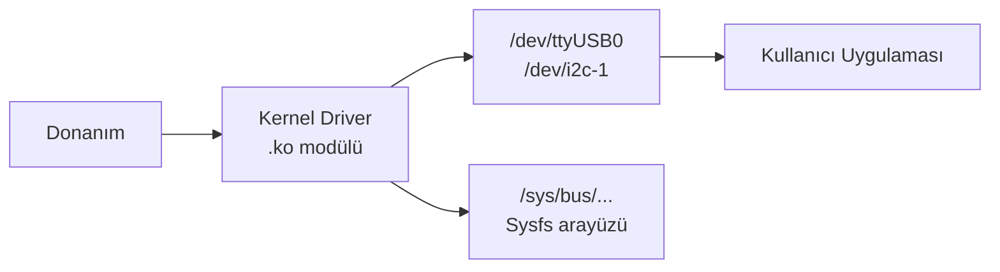
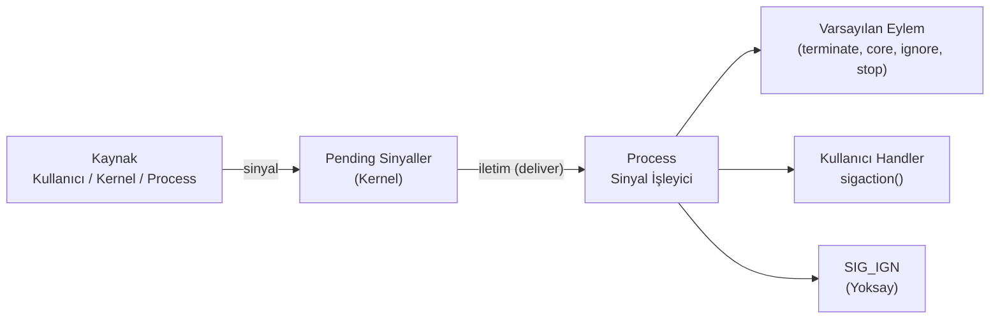
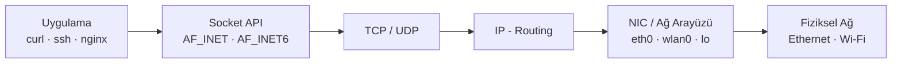
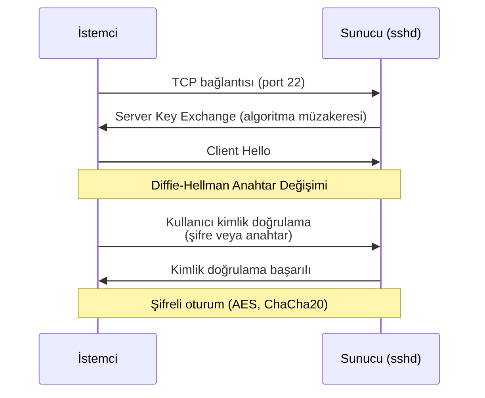
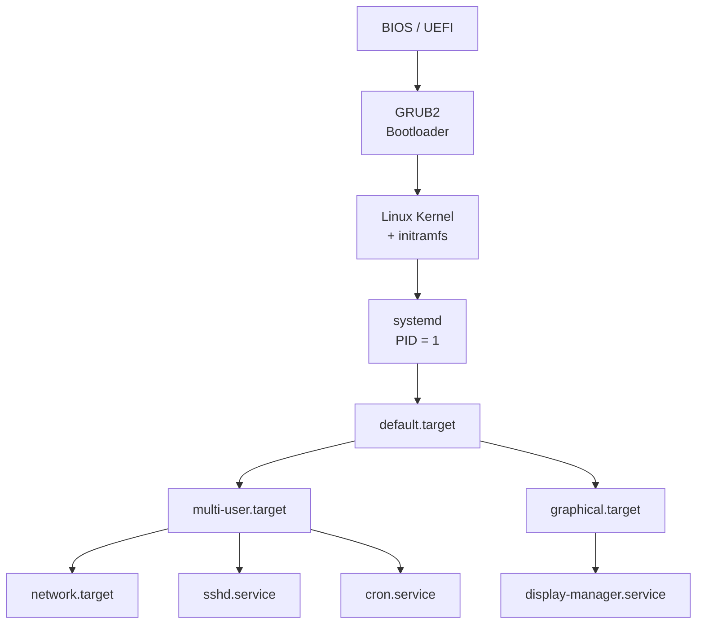

# Temel Linux 

- **inode(Index Node):** Dosyanın disk üzerindeki kimlik kartıdır. Dosyanın adını veya içeriğini içermez meta bilgilerini (izin, boyut, tarih) tutan benzersiz yapıdır. 
- **Soft Link** Hedef dosyanın yoluna referans; asıl dosya silinirse işlevsiz kalır.                    
- **Hard Link** Dosyanın inode'una doğrudan bağlanır; asıl dosya silinse de veri korunur.               
- **Daemon**    Sistem başlangıcında başlayan, arka planda çalışan uzun ömürlü servisler.               
- **Scheduler** Sistemdeki sınırlı CPU kaynaklarını, birden fazla process ve thread arasında adil ve verimli bir şekilde paylaştırmaktan sorumludur.                      
- **Polling**   CPU'nun bir donanımın durumunu belirli aralıklarla aktif olarak kontrol etmesi. 
- **User Space:** Uygulamaların çalıştığı katmandır. Donanıma doğrudan erişimi yoktur. Donanımla haberleşmek için `syscall` ile kernel'dan istenir. (`read(), write(), open(), mmap()`...) Bu geçişe **mode switch** denir ve maliyetlidir.
- **Kernel Space:** Bütün donanım bu katmanda kontrol edilir. (disk, bellek, network...)
- **Hard Real-Time:** Görevin, tanımlanmış deadline'ı içinde kesin olarak tamamlanmasını garanti eden mimaridir. Deadline'ın kaçırılması, sonucun geç gelmesi değil tamamen geçersiz sayılması anlamına gelir; sistem çöker, fiziksel hasara yol açar veya can güvenliğini tehlikeye atar. Zamanlama garantisi verebilmek için sistemde jitter (zamanlama sapması) en aza indirilir ve deterministik scheduler kullanılır. (Örn: Hava yastığının çarpışmadan 10ms sonra açılmaması; uçak uçuş kontrol sisteminin sensör verisini süresi içinde işleyememesi)
- **Soft Real-Time:** Görevin belirlenen süreyi aşması sistemi çökertmez, yalnızca çıktının kalitesini, doğruluğunu veya kullanıcı deneyimini düşürür. Ara sıra yaşanan gecikmeler tolere edilebilir ve sistem çalışmaya devam eder. Hard Real-Time'a göre zamanlama gereksinimleri daha esnektir. (Örn: YouTube videosunun anlık donması; ses/görüntü senkronizasyonunda küçük bir kayma)

!!! note "Not"
    Linux varsayılan olarak bir Soft Real-Time sistemdir; ancak çekirdeğine PREEMPT_RT yaması uygulanıp konfigüre edildiğinde, otonom ve endüstriyel standartları karşılayan bir Hard Real-Time işletim sistemine dönüşür

!!! tip "Analiz ve Debug"
    `strace`, bir programın User Space’ten Kernel Space’e yaptığı tüm system calls ve programın aldığı 
    signals canlı olarak izlemeye, kaydetmeye ve analiz etmeye yarayan dinamik bir analiz/debug aracıdır.

    kodun içine printf veya log eklemeden, sistem seviyesindeki tıkanmaları ve hataları teşhis etmek için 
    kullanılan en kritik araçlardan biridir. Bu işlem çalışan sisteme bir yük bindirir.

    - **`strace`:** Programın işletim sisteminden ne istediğini görmek için kullanıcı alanı ile çekirdek arasındaki sistem çağrılarını (syscalls) izleyen ana debug aracıdır.
    - **`ltrace`:** Programın kullandığı harici kütüphaneleri incelemek için kullanıcı alanındaki dinamik kütüphane fonksiyon çağrılarını (libc, OpenCV vb.) izleyen araçtır.
    - **eBPF / `bpftrace`:** Canlı ve gerçek zamanlı sistemleri yavaşlatmadan çekirdek ve kullanıcı seviyesindeki tüm olayları sıfıra yakın maliyetle analiz eden gelişmiş izleme teknolojisidir.


-  Büyük / küçük harfe duyarlıdır (`README.md` ≠ `readme.md`). `.` ile başlayan dosyalar gizlidir. (`.bashrc`, `.gitconfig`, `.ssh/`)
- Terminalde `#` **root** kullanıcı (Shell'de yorum satırı) `$` standart kullanıcı simgesidir.                                       

- `>` Stdout'u dosyanın **üzerine yazar**. `>>` dosyanın **sonuna ekler.** 
- `2>` Yalnızca stderr'i dosyaya yönlendirir. `&>` stdout ve stderr'ı dosyaya yönlendirir.    
- `tee` Çıktıyı terminale ve dosyaya yazar.  
- `<` Stdin'i klavye yerine **dosyadan alır**.                                  
- `;` Komutları sırayla çalıştırır. (Başarı durumu gözetilmez)        
- `&&` Sol komut başarılıysa sağdakini çalıştırır. `||` Sol komut başarısızsa sağdakini çalıştırır.                    
- `&` Komutu **arka planda** çalıştırır.     
- `|` Bir komutun çıktısını bir sonrakinin girdisine bağlar.         
- **Dosya izinleri:** `r - 4`, `w - 2`, `x - 1` ve `-` izin yok
- **Dosya türleri:**
    - `-` Regular File 
    - `d` Directory
    - `l` Sembolik Link
    - `c` Karakter Aygıtı (terminal, seri port)
    - `b` Blok Aygıtı (disk, USB)
    - `s` Socket
    - `p` Named Pipe / FIFO


```bash
# Tür  Sahip  Grup   Diğer
  d    rwx    -wx    r-x   4 serkan serkan 4096 Ağu  6 16:32 docs
-rw-rw-r-- 1 serkan serkan 5676 Ağu 12 16:41 mkdocs.yml

chmod 755 script.sh           # rwxr-xr-x
chmod +x  script.sh           # Sadece execute ekle
chmod g-w dosya.txt           # Gruptan yazma kaldır
chmod u=rw,go=r dosya         # Detaylı format

chown serkan:arge dosya.txt   # Sahip ve grup değiştir
chgrp arge dizin              # Sadece grup

echo "merhaba" > dosya.txt 
echo "merhaba" | tee -a dosya.txt   # Hem ekrana hem dosyaya yaz

telnet localhost 2> hata.txt         
ls /tmp 2>/dev/null                  
komut &> tum_cikti.txt               

cmd1 && cmd2; cmd1 || cmd2
sleep 10 &                           # Arka planda çalıştır
```


## Terminal Kısayolları

| Kısayol    | İşlev                                       || Kısayol    | İşlev                                       |
| ---------- | ------------------------------------------- || ---------- | ------------------------------------------- |
| `Ctrl + C` | Çalışan komutu sonlandırır                  || `Ctrl + Z` | Çalışan komutu duraklatır (arka plana alır) |
| `Ctrl + R` | Komut geçmişinde arama                      || `Ctrl + U` | İmlecin solundaki her şeyi siler            |
| `Ctrl + A` | Satır başına git                            || `Ctrl + E` | Satır sonuna git                            |
| `Ctrl + L` | Terminali temizler (`clear` gibi)           || `Ctrl + S` | Terminal çıktı akışını durdurur             |
| `Ctrl + Q` | Durdurulan akışı sürdürür                   || `Alt + F2` | Komut çalıştırma penceresi (grafik ortam)   |


## Dizinler

| Dizin            | Açıklama                                                                        |
| ---------------- | ------------------------------------------------------------------------------- |
| `/`              | Tüm dosya sisteminin kökü (`root`)                                              |
| `/bin`, `/sbin`  | Kritik sistem komutları. Modern distro'larda `/usr/bin`'e symlink.              |
| `/etc`           | Statik sistem yapılandırma dosyaları (ağ, kullanıcı, güvenlik).                 |
| `/usr`           | Paylaşılan kullanıcı programları ve kütüphaneler (salt okunur).                 |
| `/lib`, `/lib64` | Dinamik kütüphaneler ve kernel modülleri (`/lib/modules/<versiyon>/`).          |
| `/dev`           | Donanım aygıt düğümleri - UART, I2C, SPI, disk vb. kernel'in userspace arayüzü. |
| `/sys`           | Kernel nesne modelinin userspace arayüzü (sysfs).                               |
| `/tmp`           | Geçici dosyalar; genellikle RAM'de (tmpfs). Yeniden başlatmada silinir.         |
| `/boot`          | Kernel image, DTB, initramfs gibi önyükleme dosyaları.                          |
| `/var`           | Sistemin çalışması esnasında boyutu ve içeriği sürekli değişen Log, Database, Cache ve Queue gibi dinamik uygulama verilerini, ana sistem dosyalarından izole bir şekilde saklamak için vardır. `var` dizini genellikle ayrı bir disk partition olarak yapılandırılır bu sayede sistemin dolması engelenir.<br> <br>- `/var/log/boot.log` Önyükleme mesajları <br>- `/var/log/auth.log` Kimlik doğrulama ve güvenlik olayları <br>- `/var/log/syslog`   Genel sistem mesajları (Debian/Ubuntu) <br>- `/var/log/messages` Genel sistem mesajları (RHEL/CentOS) <br>- `/var/log/kern.log` Kernel detaylı kayıtları                       |
| `/proc`          | Kernel runtime durumunun sanal görünümü (procfs).<br> <br>- `/proc/cmdline` Kernel başlatma parametreleri <br>- `/proc/meminfo` Bellek kullanım bilgisi <br>- `/proc/cpuinfo` İşlemci bilgisi <br>- `/proc/<pid>/` Belirli bir process'in detayları <br>- `/proc/<pid>/maps` Process bellek haritası <br>- `/proc/<pid>/fd/` Açık dosya tanımlayıcıları|
            

## Regular Expression (Regex)

- **BRE (Basic):** `grep`, `sed` varsayılanı. `+`, `?`, `|`, `()` için `\` gerekir.
- **ERE (Extended):** `grep -E`, `egrep`, `awk`. Özel karakterler doğrudan kullanılır.

| Karakter | Anlamı                             | Örnek         | Eşleşen                      |
| -------- | ---------------------------------- | ------------- | ---------------------------- |
| `.`      | Herhangi bir karakter              | `a.c`         | `abc`, `axc`, `a1c`          |
| `*`      | Öncekinden 0 veya daha fazla       | `ab*c`        | `ac`, `abc`, `abbc`          |
| `+`      | Öncekinden 1 veya daha fazla (ERE) | `ab+c`        | `abc`, `abbc`                |
| `?`      | Önceki opsiyonel (ERE)             | `colou?r`     | `color`, `colour`            |
| `^`      | Satır başı                         | `^Hata`       | "Hata" ile başlayan satırlar |
| `$`      | Satır sonu                         | `Hata$`       | "Hata" ile biten satırlar    |
| `[]`     | Karakter sınıfı                    | `[abc]`       | `a`, `b` veya `c`            |
| `[^]`    | Hariç tutma                        | `[^0-9]`      | Rakam olmayan her karakter   |
| `{n,m}`  | n ile m arası tekrar               | `a{2,4}`      | `aa`, `aaa`, `aaaa`          |
| `()`     | Gruplama                           | `(ab)+`       | `ab`, `abab`, `ababab`       |
| `\|`     | Alternatif (veya)                  | `kedi\|köpek` | `kedi` veya `köpek`          |
| `\d`     | Rakam                              | `\d{3}`       | `123`                        |
| `\w`     | Kelime karakteri                   | `\w+`         | `merhaba_123`                |
| `\s`     | Boşluk karakteri                   | `\s+`         | boşluk, tab                  |


| POSIX Sınıf   | Anlamı               || POSIX Sınıf   | Anlamı               |
| ------------- | -------------------- || ------------- | -------------------- |
| `[[:digit:]]` | Rakamlar (0–9)       || `[[:alpha:]]` | Harfler              |
| `[[:alnum:]]` | Harf ve rakamlar     || `[[:space:]]` | Boşluk karakterleri  |
| `[[:upper:]]` | Büyük harfler        || `[[:lower:]]` | Küçük harfler        |
| `[[:punct:]]` | Noktalama işaretleri |


```bash title="grep Örnekleri"
grep -E "[0-9]+" dosya.log                                     # ERE ile rakam ara
grep -E "([0-9]{1,3}\.){3}[0-9]{1,3}" dosya.log                # IP adresi
grep -E "hata|uyarı" dosya.log                                 # Birden fazla kalıp
grep -v "debug" dosya.log                                      # Eşleşmeyenleri göster
grep -r -E "TODO|FIXME" /proje/                                # Özyinelemeli arama
grep -o -E "[a-zA-Z0-9._%+-]+@[a-zA-Z0-9.-]+\.[a-zA-Z]{2,}" dosya.txt


# E-posta
[a-zA-Z0-9._%+-]+@[a-zA-Z0-9.-]+\.[a-zA-Z]{2,}

# IPv4 adresi
^([0-9]{1,3}\.){3}[0-9]{1,3}$

# Tarih (YYYY-MM-DD)
^[0-9]{4}-[0-9]{2}-[0-9]{2}$

# URL
^https?://[a-zA-Z0-9.-]+\.[a-zA-Z]{2,}(/\S*)?$

# Türkiye telefon (05XX XXX XX XX)
^0[0-9]{3}[ ]?[0-9]{3}[ ]?[0-9]{2}[ ]?[0-9]{2}$
```


## Runlevel ve Systemd Targets

- **Runlevels:** SysVinit sisteminde, işletim sisteminin çalışma durumları 0 ile 6 arasında numaralandırılmış 7 farklı seviye (runlevel) ile temsil edilir. Sistem aynı anda yalnızca tek bir `runlevel` içinde bulunabilir
- **systemd:** Servisleri ve sistem durumlarını yönetmek için Unit adı verilen yapıları kullanır. Target, sistemin ulaşmak istediği nihayi durumu belirten ve grup halindeki diğer servis/unit dosyalarını bir araya toplayan özel bir `.target` uzantılı unit tipidir.

| Run Level | Anlamı                                                                                                                 | systemd Target       |
| :-------: | -----------------------------------------------------------------------------------------------------------------------| -------------------- |
|     0     | Kapatma                                                                                                                | `poweroff.target`    |
|     1     | Single-User Mode (Ağ desteği ve grafik arayüzü olmayan, yalnızca root kullanıcısının erişebildiği kurtarma/bakım modu) | `rescue.target`      |
|     2     | Ağ desteği olmayan çok kullanıcılı komut satırı modu (bazı dağıtımlarda ağ destekler)                                  | `multi-user.target`  |
|     3     | Ağ desteği olan çok kullanıcılı komut satırı modu (grafik arayüz yok)                                                  | `multi-user.target`  |
|     4     | Kullanılmıyor / dağıtıma özgü özel amaçlar için ayrılmış                                                               | `multi-user.target`  |
|     5     | Grafik arayüz + ağ                                                                                                     | `graphical.target`   |
|     6     | Yeniden başlatma                                                                                                       | `reboot.target`      |

```bash
systemctl isolate multi-user.target    # Anlık olarak target geçişi
systemctl get-default                  # Varsayılan target
systemctl set-default graphical.target # Varsayılan target değişir
sudo init 3                            # SysV run level değiştir (eski yöntem)
```


## Kernel Modülleri ve Sürücüler



| Komut               | Açıklama                                                |
| ------------------- | ------------------------------------------------------- |
| `lsmod`             | Yüklü kernel modüllerini listeler                       |
| `modprobe <modül>`  | Modül yükler (bağımlılıkları da yükler)                 |
| `rmmod <modül>`     | Modülü kaldırır                                         |
| `modinfo <modül>`   | Modül meta bilgisini gösterir                           |
| `insmod <dosya.ko>` | Belirtilen `.ko` dosyasını yükler (bağımlılık yönetmez) |

```bash
lsmod | grep usb           # USB ile ilgili modüller
modinfo usbserial          # usbserial modülü hakkında bilgi
sudo modprobe i2c-dev      # i2c-dev modülünü yükle
sudo modprobe -r i2c-dev   # Modülü kaldır
```

- **Signals:** Process'lere asenkron olay bildirimi gönderen kernel mekanizmasıdır. Bir sinyal; `Ctrl+C`, segfault, `kill` veya donanım tarafından gönderilebilir.



| Sinyal         | Açıklama                                   || Sinyal              | Açıklama                                   |
| -------------- | ------------------------------------------ || ------------------- | ------------------------------------------ |
| `SIGHUP`  - 1  | Terminal kapandı / daemon yeniden yükle    || `SIGINT`    - 2     | `Ctrl+C` - kullanıcı kesme                 |
| `SIGQUIT` - 3  | `Ctrl+\` - core dump ile çıkış             || `SIGKILL`   - 9     | **Yakalanamaz/engellenemez** - zorla öldür |
| `SIGSEGV` - 11 | Geçersiz bellek erişimi                    || `SIGPIPE`   - 13    | Okuyucusu olmayan pipe'a yazma             |
| `SIGALRM` - 14 | `alarm()` zamanlayıcı                      || `SIGTERM`   - 15    | Nazik sonlandırma isteği (yakalanabilir)   |
| `SIGCHLD` - 17 | Alt process durdu / sonlandı               || `SIGSTOP`   - 19    | **Yakalanamaz** - process'i durdur         |
| `SIGCONT` - 18 | Durdurulan process'i devam ettir           || `SIGUSR1/2` - 10/12 | Uygulama tanımlı kullanım                  |

```bash
kill -l                     # Tüm sinyalleri listele
kill -9 1234                # Zorla
kill -SIGTERM 1234          # PID'e nazikçe sonlandırma
kill -SIGHUP $(pgrep nginx) # nginx'e yeniden yükleme sinyali
pkill -USR1 gunicorn        # İsme göre SIGUSR1 gönder
killall -TERM myapp         # Aynı isimli tüm process'lere

# Process'in bekleyen sinyallerini göster
cat /proc/<PID>/status | grep Sig  # SigPnd, SigBlk, SigIgn, SigCgt
```

!!! warning "Async-Signal-Safe"
    Sinyal işleyici içinde `printf`, `malloc`, `free` gibi fonksiyonlar çağrılmamalıdır - bu fonksiyonlar async-signal-safe değildir ve deadlock yol açabilir. İşleyici içinde yalnızca `write()`, `_exit()` veya `sig_atomic_t` işlemleri güvenlidir.


## Ağ Temelleri

- **IP:** Bir cihazı ağ üzerinde tanımlayan sayısal adres (ör. `192.168.1.100`); IPv4 (32-bit) veya IPv6 (128-bit) olabilir.
  - `127.0.0.1` Loopback (kendi cihaz)
  - `169.254.x.x` Link-local (APIPA - DHCP yoksa)
  - `10.x.x.x`, `172.16-31.x.x`, `192.168.x.x` Özel (Private) ağlar
  - `0.0.0.0` Tüm arayüzleri dinle
  - `255.255.255.255` Broadcast
- **Netmask:** IP adresinin hangi bitlerinin network, hangilerinin host kısmı olduğunu belirtir (ör. `255.255.255.0`).
- **Subnet:** Netmask ile ayrılmış, aynı ağ segmentinde yer alan cihazların oluşturduğu mantıksal alt bölüm.
- **CIDR (Classless Inter-Domain Routing):** Netmask'i IP'nin sonuna `/n` şeklinde ekleyerek ağ bit sayısını gösteren kısa gösterim (ör. `192.168.1.0/24`).
- **MAC Adresi:** Ağ arayüzüne (NIC) üretici tarafından atanan 48-bit donanım adresi; OSI Katman 2'de LAN içi iletişimde kullanılır ve IP'den bağımsızdır.

```
IP: 192.168.1.100
Mask: 255.255.255.0  →  /24

255 = 11111111 (8 bit ağ)
  0 = 00000000 (8 bit host)
/24 → ilk 24 bit ağ, son 8 bit host → 254 kullanılabilir host
```

| CIDR |   Subnet Mask   | Host Sayısı || Sınıf | Aralık                      | Kullanım           |
| :--: | :-------------: | :---------: || :---: | --------------------------- | ------------------ |
|  /8  |    255.0.0.0    |  16.777.214 ||   A   | 0.0.0.0 – 127.255.255.255   | Çok büyük ağlar    |
| /16  |   255.255.0.0   |    65.534   ||   B   | 128.0.0.0 – 191.255.255.255 | Orta boy ağlar     |
| /24  |  255.255.255.0  |     254     ||   C   | 192.0.0.0 – 223.255.255.255 | Küçük ağlar        |
| /28  | 255.255.255.240 |      14     ||   D   | 224.0.0.0 – 239.255.255.255 | Multicast          |
| /30  | 255.255.255.252 |      2      ||   E   | 240.0.0.0 – 255.255.255.255 | Deneysel / rezerve |




## SSH (Secure Shell)



```bash
# Temel bağlantı
ssh kullanici@192.168.1.10
ssh -p 2222 kullanici@host     # Farklı port
ssh -i ~/.ssh/id_ed25519 user@host  # Belirli anahtar

# Anahtar tabanlı kimlik doğrulama
ssh-keygen -t ed25519 -C "yorum"    # Anahtar çifti oluştur
ssh-copy-id kullanici@host          # Public key'i sunucuya kopyala
ssh-add ~/.ssh/id_ed25519           # Agent'a ekle

# Tünel
ssh -L 8080:localhost:80 user@host  # Yerel port yönlendirme
ssh -R 9090:localhost:3000 user@host  # Uzak port yönlendirme
ssh -D 1080 user@host               # SOCKS proxy

# Bağlantısız komut çalıştırma
ssh user@host "df -h && uptime"
ssh user@host 'bash -s' < local_script.sh
```

```bash title="/etc/ssh/sshd_config (önemli ayarlar)"
Port 22                          # Farklı porta taşı
PermitRootLogin no               # Root girişini engelle
PasswordAuthentication no        # Sadece anahtar
PubkeyAuthentication yes
AuthorizedKeysFile .ssh/authorized_keys
AllowUsers serkan mert           # Sadece bu kullanıcılar
ClientAliveInterval 300          # Keep-alive aralığı (s)
ClientAliveCountMax 3            # Maksimum keep-alive sayısı
MaxAuthTries 3                   # Maksimum deneme sayısı
```

```bash
sudo systemctl restart sshd      # Ayarları uygula
sudo sshd -t                     # Yapılandırmayı doğrula
```

!!! danger "Root SSH Erişimini Kapatın"
    Üretim sunucularında `PermitRootLogin no` ve `PasswordAuthentication no` ayarları **zorunludur**. Ayrıca varsayılan 22 portunu değiştirmek brute-force saldırılarını önemli ölçüde azaltır.


## Servis ve Daemon Yapısı (systemd)



|   Uzantı   | Systemd Unit Tür     | Açıklama                                 |
| :--------: | -------------------- | ---------------------------------------- |
| `.service` | Service              | Arka plan hizmetleri (daemon)            |
| `.target`  | Target               | Unit grupları; run level yerine geçer    |
| `.socket`  | Socket               | Socket-activated servisler               |
|  `.timer`  | Timer                | Zamanlanmış görevler (cron alternatifi)  |
|  `.mount`  | Mount                | Dosya sistemi otomatik mount             |
|  `.path`   | Path                 | Dosya/dizin değişikliklerini tetikleyici |
|  `.slice`  | Slice                | Cgroups kaynak sınırı grubu              |

| Konum                      | Kapsam                            | Öncelik |
| -------------------------- | --------------------------------- | :-----: |
| `/etc/systemd/system/`     | Sistem geneli (admin değişikliği) |  Yüksek |
| `/usr/lib/systemd/system/` | Dağıtım paketleri                 |   Orta  |
| `~/.config/systemd/user/`  | Kullanıcı bazlı                   |    -    |

```ini title="/etc/systemd/system/my-app.service"
[Unit]
Description=My Application Service
Documentation=https://example.com/docs
After=network.target postgresql.service
Wants=postgresql.service
Conflicts=conflicting.service

[Service]
Type=simple
User=appuser
Group=appgroup
WorkingDirectory=/opt/myapp
ExecStart=/usr/bin/python3 /opt/myapp/main.py
ExecReload=/bin/kill -HUP $MAINPID
ExecStop=/bin/kill -SIGTERM $MAINPID
Restart=on-failure
RestartSec=5s
TimeoutStopSec=30s

# Ortam değişkenleri
Environment=ENV=production
EnvironmentFile=/etc/myapp/env

# Kaynak sınırları
LimitNOFILE=65536
MemoryMax=512M

[Install]
WantedBy=multi-user.target
```

| [Unit]        | Açıklama                                                    |
| ------------- | ----------------------------------------------------------- |
| `Description` | İnsan okunabilir kısa açıklama                              |
| `After`       | Başlama sırasını belirler; belirtilen unit'ten sonra başlar |
| `Before`      | Belirtilen unit'ten önce başlar                             |
| `Wants`       | Zayıf bağımlılık; bağımlı unit başlamasa da devam eder      |
| `Requires`    | Güçlü bağımlılık; bağımlı başlamazsa bu da başlamaz         |
| `Conflicts`   | Çakışan unit; biri başlayınca diğeri durur                  |

| [Service]            | Açıklama                                      |
| -------------------- | --------------------------------------------- |
| `Type=simple`        | ExecStart fork etmeden çalışır (varsayılan)   |
| `Type=forking`       | Daemon arka plana fork ettiğinde kabul edilir |
| `Type=oneshot`       | Tek seferlik kısa işler                       |
| `Type=notify`        | Daemon sd_notify() ile hazır sinyali gönderir |
| `Restart=no`         | Yeniden başlatma yok                          |
| `Restart=on-failure` | Başarısız çıkışta yeniden başlat              |
| `Restart=always`     | Her zaman yeniden başlat                      |
| `User`               | Hangi kullanıcı altında çalışacağı            |
| `Environment`        | Ortam değişkeni                               |
| `EnvironmentFile`    | Dosyadan ortam değişkeni yükle                |
| `WorkingDirectory`   | Çalışma dizini                                |

| [Install]                    | Açıklama                                           |
| ---------------------------- | -------------------------------------------------- |
| `WantedBy=multi-user.target` | `systemctl enable` ile bu target'a bağlanır        |
| `RequiredBy`                 | Zorunlu bağımlılık olarak bağlanır                 |
| `Also`                       | Bu unit enable edildiğinde başka unit de enable et |

### Gerçek Örnekler

=== "ROS2 Servisi"

    ```ini
    [Unit]
    Description=ROS 2 Startup Service
    After=network.target

    [Service]
    Type=simple
    User=rosuser
    Environment=HOME=/home/rosuser
    ExecStartPre=/bin/sleep 5
    ExecStart=/home/rosuser/start_ros2.sh
    Restart=on-failure
    RestartSec=10s

    [Install]
    WantedBy=multi-user.target
    ```

=== "Python Web Servisi"

    ```ini
    [Unit]
    Description=FastAPI Application
    After=network.target

    [Service]
    Type=simple
    User=webuser
    WorkingDirectory=/opt/api
    EnvironmentFile=/opt/api/.env
    ExecStart=/opt/api/venv/bin/uvicorn main:app --host 0.0.0.0 --port 8000
    Restart=always
    RestartSec=3s
    StandardOutput=journal
    StandardError=journal

    [Install]
    WantedBy=multi-user.target
    ```

=== "Periyodik Görev (Timer)"

    ```ini title="backup.timer"
    [Unit]
    Description=Daily Backup Timer

    [Timer]
    OnCalendar=*-*-* 02:00:00
    Persistent=true

    [Install]
    WantedBy=timers.target
    ```

    ```ini title="backup.service"
    [Unit]
    Description=Daily Backup Service

    [Service]
    Type=oneshot
    ExecStart=/usr/local/bin/backup.sh
    ```

### journald Yapılandırması

```ini title="/etc/systemd/journald.conf"
[Journal]
Storage=persistent           # Logları disk'e yaz (auto/volatile/persistent)
Compress=yes                 # Sıkıştır
SystemMaxUse=500M            # Maksimum disk alanı
SystemKeepFree=200M          # Minimum boş alan bırak
MaxRetentionSec=1month       # En uzun saklama süresi
ForwardToSyslog=no           # /var/log/syslog'a da yönlendir
```


## Sorunlar ve Çözümler

!!! note "Genel Bakış"
    Gerçek projelerden ve günlük Linux kullanımından derlenen yaygın sorunların çözümleri. Her madde kısa bir bağlam açıklaması ve doğrudan çözüm adımlarıyla sunulmuştur.

!!! tip "Script'lerde apt-get Kullan"
    `apt` UI öğeleri ekleyebilir veya uyarı gösterebilir. Otomasyon script'lerinde `apt-get` daha tutarlıdır.

### Donanım ve Aygıt Sorunları

- **Arduino / USB-Serial Port Görünmüyor:** Arduino IDE'de veya `ls /dev/tty*` ile port görünmüyor.

    ```bash
    # Kullanıcıyı dialout ve tty grubuna ekle
    sudo usermod -a -G dialout $USER
    sudo usermod -a -G tty $USER
    # Çıkış yapıp tekrar giriş gerekli

    # Ubuntu 22.04+: brltty çakışması
    # brltty, CH340/PL2303 chip'i braille cihaz olarak algılıyor
    sudo systemctl stop brltty
    sudo systemctl disable brltty

    # Alternatif: udev kuralında ilgili satırı devre dışı bırak
    sudo nano /usr/lib/udev/rules.d/85-brltty.rules
    # Aşağıdaki satırı yorum yap (# ekle):
    # ENV{PRODUCT}=="1a86/7523/*", ENV{BRLTTY_BRAILLE_DRIVER}="bm", GOTO="brltty_usb_run"

    sudo udevadm control --reload-rules
    ```

- **USB Sürücü / NTFS Hata Veriyor:** NTFS formatlı USB dosya aktarırken "Input/output error" veya "Transport endpoint is not connected".

    ```bash
    # USB'yi güvenli çıkart ve yeniden tak
    sudo umount /dev/sdb1
    sudo ntfsfix /dev/sdb1       # NTFS metadata onar
    sudo mount /dev/sdb1 /mnt/usb

    # Tamamen bozuksa Windows'ta chkdsk koşturmak daha etkili
    ```

- **GPIO / I2C / SPI Aygıtı Görünmüyor:**

    ```bash
    # Kernel modülünün yüklü olduğunu doğrula
    lsmod | grep i2c
    sudo modprobe i2c-dev

    # /dev/i2c-* yoksa
    ls /dev/i2c*
    # Raspberry Pi'de: /boot/firmware/config.txt içine "dtparam=i2c_arm=on" ekleyip yeniden başlat
    # veya: sudo raspi-config nonint do_i2c 0

    # I2C cihaz tarama
    sudo i2cdetect -y 1

    # Yetki sorunu
    sudo usermod -aG i2c $USER
    ```

### Ağ Sorunları

- **Wi-Fi Bağlantısı Kurulamıyor:**

    ```bash
    # Wi-Fi adaptörünü kontrol et
    ip link show
    nmcli radio wifi        # Wi-Fi hardware durumu
    nmcli radio wifi on     # Kapalıysa aç

    # NetworkManager logları
    journalctl -u NetworkManager -f

    # RF kill kontrolü
    rfkill list             # Blocked: yes ise
    rfkill unblock wifi

    # Sürücü yeniden yükleme
    sudo modprobe -r ath9k && sudo modprobe ath9k
    ```

- **Sabit IP Sonrası İnternet Yok:**

    ```bash
    # DNS sunucusu eksik olabilir
    cat /etc/resolv.conf
    # nameserver yoksa nmcli ile ekle
    nmcli con mod "bağlantı_adı" ipv4.dns "8.8.8.8 1.1.1.1"
    nmcli con up "bağlantı_adı"

    # Gateway eksik olabilir
    ip route              # default gw yoksa
    ip route add default via 192.168.1.1
    ```

- **SSH Bağlantısı Reddedildi:**

    ```bash
    # Servis çalışıyor mu?
    systemctl status sshd

    # Port dinleniyor mu?
    ss -tlnp | grep 22

    # Güvenlik duvarı?
    sudo ufw status
    sudo ufw allow 22/tcp

    # Çok fazla başarısız giriş (fail2ban)?
    sudo fail2ban-client status sshd
    sudo fail2ban-client set sshd unbanip 192.168.1.50

    # sshd yapılandırma hatası?
    sudo sshd -t              # Sözdizimi kontrolü
    ```

- **SSH Bağlantısı Çok Yavaş:**

    ```bash
    # DNS çözümleme yavaşlatıyor
    # /etc/ssh/sshd_config içinde:
    UseDNS no

    # GSSAPI gereksizse
    GSSAPIAuthentication no

    sudo systemctl restart sshd
    ```

### Sistem ve Yazılım Sorunları

- **Sudo Şifre İstemeyi Kaldır:**

    ```bash
    sudo visudo     # Sudoers dosyasını güvenli açar

    # Belirli kullanıcı için şifresiz sudo
    %sudo   ALL=(ALL:ALL) NOPASSWD:ALL     # Tüm sudo grubu
    serkan  ALL=(ALL:ALL) NOPASSWD:ALL     # Sadece serkan

    # Belirli komutlar için
    serkan  ALL=(ALL) NOPASSWD: /usr/bin/apt, /sbin/reboot
    ```

!!! danger "NOPASSWD Riski"
    `NOPASSWD:ALL` yalnızca güvenilir, izole geliştirme ortamlarında kullanın. Üretim sistemlerinde güvenlik açığıdır.

- **Wi-Fi Şifrelerini Görüntüle:**

    ```bash
    # NetworkManager şifreleri
    sudo grep -r psk= /etc/NetworkManager/system-connections/

    # Belirli bağlantı
    sudo cat /etc/NetworkManager/system-connections/"WIFI_ADI"
    ```

- **Terminalden Uygulama Çalıştırma (PATH Sorunu):**

    ```bash
    # Uygulama terminalde bulunmuyorsa symlink kur
    sudo ln -s $(readlink -f ./qtcreator) /usr/local/bin/qtcreator
    sudo ln -s /opt/myapp/bin/myapp /usr/local/bin/myapp

    # Veya PATH'e ekle (.bashrc / .profile)
    echo 'export PATH="$PATH:/opt/myapp/bin"' >> ~/.bashrc
    source ~/.bashrc
    ```

- **Paket Kurulumu Yarım Kaldı:** Bağımlılık eksikse kurulum `half-installed` veya `unconfigured` durumda kalır; `package is not fully configured` hatası alınır.

    ```bash
    # Bozuk bağımlılıkları düzelt
    sudo dpkg --configure -a
    sudo apt install -f
    sudo apt clean && sudo apt update

    # "dpkg: error: another process has the lock file"
    # Sahte kilit dosyasını sil
    sudo rm /var/lib/dpkg/lock
    sudo rm /var/lib/dpkg/lock-frontend
    sudo rm /var/cache/apt/archives/lock
    sudo dpkg --configure -a
    ```

### Disk ve Dosya Sistemi Sorunları

- **Disk Alanı Doldu:**

    ```bash
    # Nerede yer kaplanıyor?
    df -h                              # Genel disk kullanımı
    du -sh /var/* | sort -rh | head   # En büyük dizinler
    du -sh /var/log/* | sort -rh | head -10

    # Log temizleme
    sudo journalctl --vacuum-size=200M
    sudo apt clean
    sudo apt autoremove --purge

    # Docker temizleme
    docker system prune -a --volumes

    # Büyük dosyalar bul
    find / -size +500M -type f 2>/dev/null | sort -k5 -rn
    ```

- **Dosya Sistemi Salt Okunur Hale Geldi:** Genellikle disk hatası veya güç kesilmesi sonrası oluşur; `/proc/mounts` içinde "ro" ile gösterilir.

    ```bash
    # Dosya sistemi kontrolü (önce unmount et)
    sudo umount /dev/sda1
    sudo fsck -y /dev/sda1

    # Raspberry Pi: tmpfs logları ve read-only rootfs
    # /etc/fstab'da ro olan bölümü rw olarak yeniden mount et
    sudo mount -o remount,rw /
    ```

- **Silinmiş Dosyayı Geri Getirme:**

    ```bash
    # extundelete (ext3/ext4)
    sudo apt install extundelete
    sudo extundelete /dev/sda1 --restore-all

    # testdisk - partition ve dosya kurtarma
    sudo apt install testdisk
    sudo testdisk /dev/sda

    # photorec - medya dosyası kurtarma
    sudo photorec /dev/sda
    ```

### Process ve Performans Sorunları

- **Zombi Process Temizleme:**

    ```bash
    # Zombi'leri listele
    ps aux | awk '$8 == "Z"'

    # Ebeveyn process'i bul ve öldür
    pstree -p | grep zombie_PID
    kill -9 <EBEVEYN_PID>

    # Zombiler genellikle ebeveyn öldürülünce init (PID 1) tarafından temizlenir
    ```

- **Yüksek CPU Kullanan Process Bul:**

    ```bash
    # Anlık görünüm
    ps aux --sort=-%cpu | head -10
    top -b -n 1 -o %CPU | head -20

    # Süreçleri izle
    htop

    # 30 saniye CPU profili
    pidstat -u 1 30

    # Belirli process'in system call'larını takip et
    strace -p <PID> -c      # Özet
    strace -p <PID>         # Detaylı
    ```

- **"Too Many Open Files" Hatası:**

    ```bash
    # Mevcut limit
    ulimit -n

    # Geçici artırma
    ulimit -n 65536

    # Kalıcı - /etc/security/limits.conf
    echo "* soft nofile 65536" | sudo tee -a /etc/security/limits.conf
    echo "* hard nofile 65536" | sudo tee -a /etc/security/limits.conf

    # systemd servisi için
    # [Service] bölümüne:
    # LimitNOFILE=65536
    sudo systemctl daemon-reload
    ```

### Kullanıcı ve Yetki Sorunları

- **"Permission Denied" Hataları:**

    ```bash
    # Dosya sahibi ve izinlerini kontrol et
    ls -la dosya.txt
    stat dosya.txt

    # Execution izni eksikse
    chmod +x script.sh

    # Sahiplik düzelt
    sudo chown $USER:$USER dosya.txt

    # /dev dosyası için grup üyeliği
    ls -la /dev/ttyUSB0      # crw-rw---- 1 root dialout
    groups                    # dialout grubunda mısın?
    sudo usermod -aG dialout $USER

    # SELinux/AppArmor (Ubuntu 22.04+)
    sudo aa-status
    sudo aa-complain /etc/apparmor.d/profil_adi  # İzin ver
    ```

- **Kullanıcı Kilitlendi:**

    ```bash
    # Kilitli hesapları listele
    sudo passwd -S serkan
    # Durum: L = Locked, P = Password set, NP = No password

    # Kilidi aç
    sudo passwd -u serkan

    # Sıfırla
    sudo passwd serkan

    # Giriş denemesi sayacını sıfırla (pam_tally2)
    sudo pam_tally2 --user=serkan --reset
    # veya Ubuntu 20.04+
    sudo faillock --user serkan --reset
    ```

### Geliştirme Araçları Sorunları

- **Git SSL Sertifika Hatası:**

    ```bash
    git clone https://... → SSL certificate problem

    # Geçici devre dışı bırak (güvenli değil, sadece test)
    git -c http.sslVerify=false clone https://...

    # Kalıcı devre dışı bırakma (UYARI)
    git config --global http.sslVerify false

    # Doğru çözüm: sertifika güncelle
    sudo apt install ca-certificates
    sudo update-ca-certificates
    ```

- **Python Modülü Bulunamıyor:**

    ```bash
    # Hangi Python kullanılıyor?
    which python3
    python3 --version

    # Pip hangi Python'a yüklüyor?
    pip3 show numpy | grep Location

    # Sanal ortam kontrolü
    echo $VIRTUAL_ENV    # Aktif bir venv var mı?

    # Eğer conda kullanıyorsa
    conda activate myenv
    conda list | grep numpy
    ```

- **Docker İzin Hatası:** "permission denied while trying to connect to the Docker daemon socket"

    ```bash
    sudo usermod -aG docker $USER
    newgrp docker           # Oturumu yenilemeden grup aktivasyonu
    # veya
    docker run hello-world  # sudo ile test
    ```

### Hızlı Başvuru Tablosu

| Sorun             | İlk Bakılacak Yer                                    |
| ----------------- | ---------------------------------------------------- |
| Servis başlamıyor | `journalctl -u servis_adı -n 50`                     |
| Port açılmıyor    | `ss -tlnp \| grep PORT` ve `ufw status`              |
| Disk doldu        | `df -h` ve `du -sh /*`                               |
| SSH bağlanamıyor  | `systemctl status sshd` ve firewall                  |
| Yüksek CPU        | `ps aux --sort=-%cpu \| head`                        |
| Yavaş sistem      | `top`, `iotop`, `vmstat 1`                            |
| Paket kurulamıyor | `apt install -f` ve `dpkg --configure -a`            |
| Cihaz görünmüyor  | `dmesg \| tail -20` ve `lsusb / lspci`               |
| İzin hatası       | `ls -la` ve `groups`                                 |
| DNS çalışmıyor    | `dig @8.8.8.8 example.com` ve `cat /etc/resolv.conf` |
