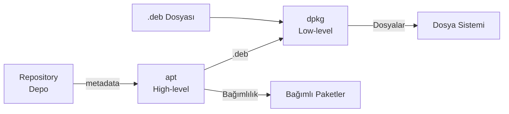

# Terminal Komutları

| Komut     | Açıklama                               || Komut       | Açıklama                                          |
| ----------| -------------------------------------- || ------------| --------------------------------------------------|
| `pwd`      | Mevcut dizin yolunu gösterir           || `cd`       | Dizin değiştirir                                  |
| `ls`       | Dizin içeriğini listeler               || `tree`     | Dizin yapısını ağaç şeklinde gösterir             |
| `mkdir`    | Dizin oluşturur                        || `touch`    | Boş dosya oluşturur veya tarih günceller          |
| `cp`       | Kopyalar                               || `mv`       | Taşır veya Yeniden adlandırır                     |
| `rm`       | Dosya/dizin siler                      || `rmdir`    | Boş dizin siler                                   |
| `wc`       | Satır, kelime, byte sayar              || `cat`      | Dosya içeriğini ekrana basar (`tac` tersi)        |
| `head`     | Dosyanın başını gösterir               || `tail`     | Dosyanın sonunu gösterir                          |
| `find`     | Gerçek zamanlı dosya arama             || `locate`   | İndeks tabanlı hızlı arama (gerçek zamanlı değil) |
| `top`      | Canlı sistem kaynak monitörü           || `htop`     | Gelişmiş interaktif process monitörü              |
| `ps`       | Çalışan process listesi                || `kill`     | Process'e sinyal gönderir                         |
| `df`       | Bağlı dosya sistemleri disk kullanımı  || `du`       | Dizin/dosya disk kullanımı                        |
| `grep`     | Metin içinde desen arama               || `cut`      | Belirli sütunları veya karakterleri ayıklar       |
| `diff`     | Farklılıklarını satır bazında gösterir || `cmp`      | Dosyaları byte bazında karşılaştırır              |
| `gzip`     | `.gz` sıkıştırma (`gunzip`)            || `tar`      | Arşivleme aracı (`.tar`, `.tar.gz`, `.tar.xz`)    |
| `useradd`  | Kullanıcı oluşturur                    || `usermod`  | Kullanıcı özelliklerini değiştirir (grup, kilit)  |
| `passwd`   | Şifre atar/değiştirir                  || `userdel`  | Kullanıcıyı siler                                 |
| `su`       | Başka kullanıcıya/root'a geçer         || `sudo`     | Yetkili komut çalıştırır                          |
| `mount`    | Dosya sistemine bağlar                 || `umount`   | Dosya sisteminden ayır                            |
| `hostname` | Sistem adı / IP adresleri              || `date`     | Tarih/saat gösterir                               |
| `sleep`    | Belirtilen süre bekler                 || `ln`       | Link oluşturur                                    |
| `env`      | Tüm ortam değişkenlerini listeler      || `printenv` | Belirli bir değişkenin değerini gösterir          |
| `export`   | Ortam değişkeni tanımlar               || `source`   | Script'i mevcut shell'de çalıştırır               |
| `alias`    | Komuta kısayol tanımlar                || `unalias`  | Kısayolu kaldırır                                 |
| `history`  | Komut geçmişini gösterir               || `uname`    | Kernel, hostname, mimari bilgisi                  |
| `watch`    | Bir komutu periyodik aralıklarla tekrarlar  | `echo` | Standart çıktı yazdırır                           |


```bash
env                      # Tüm ortam değişkenleri
printenv PATH            # Belirli değişken
echo $HOME $USER $SHELL  # Sistem değişkenleri

export MY_VAR="değer"
MY_VAR="değer" komut     # Sadece o komut için

echo 'export MY_VAR="değer"' >> ~/.bashrc
source ~/.bashrc

alias ll='ls -alh'
alias gs='git status'
alias update='sudo apt update && sudo apt upgrade -y'
unalias ll               # Kaldır
alias                    # Tüm alias'ları listele

cd ~                  # ~: Home, -: Önceki, ..: Bir üst dizini

ls -R -S              # (-R) Alt dizinleri de listele, (-S) Boyuta göre
tree -d -h -I ".git"  # (-d) Sadece dizinler, (-h) Boyutları göster , (-I) hariç tut

mkdir -p a/b/c            # İç içe dizin oluşturur

rm -rf -i dizin/          # Zorla sil, -i silmeden önce sor
rm -rf !(a.txt)           # a.txt dışında her şeyi sil

cp -r src/ dst/           # Dizini özyinelemeli kopyala
cp -p dosya dst           # İzin ve tarihleri koru
cp -l dosya link          # Hard link olarak kopyala

cut -d',' -f2 data.csv                    # CSV 2. sütun
cut -c1-20 dosya.txt                      # İlk 20 karakter

ln -s /hedef /link_adı    # Sembolik link
ln kaynak link            # Hard link

cat -n dosya.txt          # Satır numarası ile
cat -A dosya.txt          # Görünmez karakterleri göster

grep "hata" dosya.log
grep -i "error" dosya.log              # Büyük/küçük harf duyarsız
grep -n "failed" dosya.log             # Satır numarasıyla
grep -r "TODO" ./src                   # Özyinelemeli
grep -E "ERROR|WARN|FATAL" app.log     # ERE
grep -v "^#" /etc/ssh/sshd_config      # Yorum satırlarını atla
grep -o "[0-9]\+\.[0-9]\+\.[0-9]\+\.[0-9]\+" dosya  # Sadece eşleşen kısmı

head -n 20 dosya.txt       # İlk 20 satır
head -c 100 dosya.txt      # İlk 100 byte
tail -n 20 dosya.txt       # Son 20 satır
tail -f /var/log/syslog    # Canlı log takibi (-n  belli bir satır sayırı)

wc    dosya.txt            # Satır kelime byte (-l satır, -w kelime, -c byte)

tar -cvf arsiv.tar dizin/          # Arşiv oluştur
tar -xvf arsiv.tar                 # Arşiv aç
tar -tvf arsiv.tar                 # İçeriği listele
tar --exclude=".git" -czf proje.tar.gz proje/  # Dışla

gzip -k dosya.txt          # Orijinali koru
gzip -9 büyük.log          # Maksimum sıkıştırma
gzip -l arsiv.gz           # Bilgi göster

df -hT                                # (-h) Boyut okunaklı olarak, (-T) Dosya sistemi tipini de göster

du -sh /var/* | sort -rh | head -10   # En büyük alt dizinler
du -h --max-depth=1 /home             # Sadece 1 seviye derine git

find . -name "*.py"                      # İsme göre ara
find . -type f -size +10M -mtime -3      # 10 MB'dan büyük dosyalar ve son 3 günde değişenler
find . -type f -perm 0777 -user serkan   # Belirli izinli dosyalar ve serkan kullanıcısının
find . -type d -name "node_modules" -exec rm -rf {} + # Sil

locate -i network     # Büyük/küçük harf duyarsız
sudo updatedb         # İndeksi güncelle

ps aux                              # Tüm process'ler (a=tüm kullanıcı, u=detay, x=tty'siz)
ps -ef                              # Full format
ps -u serkan                        # Belirli kullanıcı
ps --sort=-%cpu | head              # CPU kullanımına göre sırala
# STAT sütunu anlamları: R - Çalışıyor, S - Uyuyor, D - I/O bekliyor, Z - Zombi, T - Durmuş

kill -l                            # Sinyal listesi
kill -9  <PID>                     # SIGKILL (zorla)

sudo useradd -m -s /bin/bash -G sudo serkan    # Kullanıcı oluştur
sudo passwd serkan                             # Şifre ata
sudo usermod -aG docker,gpio serkan            # Gruplara ekle
sudo usermod -L serkan                         # Kilitle
sudo usermod -U serkan                         # Kilidi aç
sudo userdel -r serkan                         # Home ile birlikte sil

date +"%Y-%m-%d %H:%M:%S"    # 2024-01-15 14:30:00
date +%s                     # Unix timestamp (epoch)
date +%Y%m%d                 # 20240115

watch -n 2 df -h         # 2 saniyede bir
watch -n 1 'ps aux --sort=-%cpu | head'

sleep 5                  # 5 saniye bekle
sleep 1m                 # 1 dakika
sleep 1h30m              # 1 saat 30 dakika

su serkan                       # Kullanıcıya geç
sudo su                         # Root'a geç
sudo -i                         # Root shell
sudo -s                         # Mevcut shell'de root
```

## Dosya Dizin ve Disk İşlemleri

| Komut      | Açıklama                                           || Komut    | Açıklama                                           |
| ---------- | -------------------------------------------------- || -------- | -------------------------------------------------- |
| `file`     | Dosyanın gerçek türünü içerik analizi ile belirler || `stat`   | Ayrıntılı dosya meta bilgileri                     |
| `install`  | Kopyalama + izin + sahip atama birleşimi           |
| `less`     | Sayfalı, aranabilir görüntüleme                    || `more`   | `less`'in eski ve sınırlı hali                     |
| `zip`      | `.zip` arşivi (`unzip`)                            || `zcat`   | `.gz` dosyasını açmadan görüntüle                  |
| `readlink` | Sembolik linkin gerçek hedefini gösterir           || `lsblk`  | Blok cihazların ağaç görünümü                      |
| `findmnt`  | Mount noktalarını ağaç yapısında gösterir          || `blkid`  | Blok cihaz UUID ve tip                             |
| `fdisk`    | Disk bölüm yönetimi                                || `mkfs`   | Dosya sistemi oluşturur                            |
| `fsck`     | Dosya sistemi kontrolü ve onarımı                  || `dd`     | Düşük seviye blok kopyalama                        |
| `which`    | PATH üzerindeki executable konumu                  || `whereis`| Binary, source, manual konumları                   |
| `sed`      | Akış düzenleyici; satır içi değiştirme             || `awk`    | Alan bazlı metin işleme programlama dili           |
| `sort`     | Satırları sıralar                                  || `uniq`   | Birbirini izleyen tekrar eden satırları filtreler  |
| `tr`       | Karakter dönüşümleri                               || `tee`    | Çıktıyı hem terminale hem dosyaya yazar            |


```bash
install -m 755 app /usr/local/bin/     # İzinli kopyala
install -d /etc/myapp                  # Dizin oluştur

zcat arsiv.log.gz | grep error  # Açmadan içinde ara

lsblk                         # Disk yapısı
lsblk -f                      # Dosya sistemi tipleri ve UUID

file /bin/ls                  # ELF 64-bit LSB executable, ARM aarch64...
file ./firmware.bin           # Firmware analizi

sudo mount /dev/sdb1 /mnt/disk
sudo mount -t ext4 /dev/sdb1 /mnt/disk
sudo mount -o ro /dev/sdb1 /mnt/disk  # Salt okunur
sudo umount /mnt/disk

sudo dd if=/dev/sda of=/mnt/backup.img bs=64K conv=noerror,sync status=progress
sudo dd if=/mnt/backup.img of=/dev/sdb bs=64K status=progress

which python3                # -a ile tüm eşleşmeler
whereis ls                   # Binary + manual, -b Sadece binary
```

```bash
sed 's/eski/yeni/g' dosya.txt             # Değiştir (stdout)
sed -i 's/eski/yeni/g' dosya.txt          # In-place
sed -n '/ERROR/p' dosya.txt               # Sadece eşleşen satırlar
sed '/^$/d' dosya.txt                      # Boş satırları sil
sed -n '10,20p' dosya.txt                  # 10-20. satırlar

awk '{print $1}' dosya.txt                # İlk alan
awk '{print $1, $3}' dosya.txt            # 1. ve 3. alan
awk '{print $NF}' dosya.txt               # Son alan
awk -F':' '{print $1}' /etc/passwd        # Ayırıcı değiştir
awk '/ERROR/ {print NR": "$0}' dosya.txt  # Satır no ile yazdır
awk '{sum+=$2} END{print "Toplam:", sum}' # Toplama
awk 'NR==5' dosya.txt                     # 5. satır

sort dosya.txt                             # Alfabetik
sort -r dosya.txt                          # Ters
sort -n sayilar.txt                        # Sayısal
sort -k2 -n dosya.txt                      # 2. alana göre sayısal
sort -rh                                   # İnsan okunabilir boyut (du çıktısı)

sort dosya.txt | uniq                     # Tekrarları kaldır
sort dosya.txt | uniq -c                  # Kaç kez tekrar ettiği
sort dosya.txt | uniq -d                  # Sadece tekraları göster
sort dosya.txt | uniq -u                  # Sadece benzersizleri

cat dosya.txt | tr 'a-z' 'A-Z'           # Büyük harfe çevir
cat dosya.txt | tr -d '\r'               # Windows satır sonu sil
cat dosya.txt | tr -s ' '                # Çoklu boşluğu tekleştir
```


## Kullanıcı ve Sistem Yönetimi

| Komut      | Açıklama                                || Komut     | Açıklama                                |
| -----------| --------------------------------------- || --------- | --------------------------------------- |
| `jobs`     | Arka plan işlerini listeler             || `pstree`  | Çalışan süreçleri hiyerarşik olarak gösterir|
| `killall`  | Eşleşen tüm process'leri öldürür        || `pkill`   |  İsimle process öldürür                   |
| `nice`     | Düşük öncelikle başlatır                || `renice`  | Çalışan process önceliğini değiştirir     |
| `bg`       | Arka planda devam ettirir               || `fg`      | Ön plana alır                             |
| `nohup`    | Terminale bağımsız çalıştırır           || `timeout` | Komut süresini sınırlar                   |
| `groupadd` | Grup oluşturur                          || `groupdel`     | Grubu siler                          |
| `groups`   | Kullanıcının gruplarını gösterir        || `id`           | UID, GID ve grup bilgisi             |
| `who`/`w`  | Sisteme giriş yapmış kullanıcılar       || `last`/`lastb` | Geçmiş girişler / başarısız girişler |
| `getfacl`  | Dosyanın ACL izinlerini gösterir        || `setfacl`      | ACL izni ekler/kaldırır              |

```bash

pstree                              # Ağaç görünümü
pkill -f "uygulama_adi"            # Kalıba göre öldür

nohup ./betik.sh &
nohup ./betik.sh > cikti.log 2>&1 &

# nice (-20 en yüksek, +19 en düşük öncelik)
nice -n 10 python3 agir_is.py
renice +5 -p <PID>

# Zamanlanmış sonlandırma
timeout 30s ping google.com
timeout 5m ./uzun_betik.sh || echo "Zaman aşıldı!"

# Grup yönetimi
sudo groupadd arge
sudo groupdel arge
id serkan                       # UID, GID ve gruplar

# ACL
getfacl dosya.txt
setfacl -m u:serkan:rwx dosya.txt
setfacl -m g:arge:rx dosya.txt
setfacl -x u:serkan dosya.txt   # Kaldır
setfacl -b dosya.txt            # Tümünü kaldır
```


## Sistem Bilgisi ve Debug

| Komut     | Açıklama                     || Komut          | Açıklama                         |
| --------- | ---------------------------- || -------------- | -------------------------------- |
| `lscpu`   | İşlemci detayı               || `lspci`/`lsusb`| PCIe / USB cihaz listesi         |
| `free`    | RAM kullanımı                || `uptime`       | Çalışma süresi ve sistem yükü    |
| `lsmod`   | Yüklü kernel modülleri       || `modinfo`      | Modül bilgisi                    |
| `timedatectl`  | Zaman dilimi, NTP ve sistem saati yönetimi    |
| `time`         | Komutun çalışma süresini ölçer                |
| `wall`/`write` | Kullanıcılara terminal mesajı gönderir        |
| `journalctl`   | Sistem loglarını görüntüler                   |
| `dmesg`        | Kernel halka tamponu mesajlarını gösterir     |


| Komut      | Açıklama                                                                           || Komut      | Açıklama                                                            |
| ---------- | ---------------------------------------------------------------------------------- || ---------- | ------------------------------------------------------------------- |
| `strace`   | Process'in kernel'e yaptığı sistem çağrılarını (open, read, write, ioctl...) izler || `ltrace`   | Process'in dinamik kütüphane (libc vb.) fonksiyon çağrılarını izler |
| `perf`     | CPU sayaçları, fonksiyon bazlı kullanım ve darboğazları profiller                  || `ldd`      | Binary'nin dinamik kütüphane bağımlılıklarını gösterir              |
| `readelf`  | ELF dosyasının başlık/section/segment bilgisini gösterir                           || `nm`       | ELF/obje dosyasındaki sembolleri listeler                           |
| `objdump`  | Binary'yi disassemble eder                                                         || `file`     | Dosyanın gerçek türünü tespit eder                                  |
| `strings`  | Binary içindeki okunabilir metin dizilerini çıkarır                                |


```bash
uname -a               # Kernel, hostname, mimari
lspci -k               # Hangi sürücüyü kullandığı
lsusb -v               # Detaylı
lsusb -t               # Hiyerarşi

cat /proc/cpuinfo      # CPU detayı
cat /proc/meminfo      # Bellek detayı
cat /etc/os-release    # Dağıtım bilgisi
lsb_release -a         # Dağıtım sürümü

wall "Sistem 10 dakika sonra bakıma alınacak"    # Tüm kullanıcılara
write serkan pts/1                                # Belirli terminale

# notify-send (masaüstü bildirimi)
notify-send "Yedekleme" "Tamamlandı!" --icon=dialog-information

# Tarih ve saat
timedatectl            # Zaman dilimi ve NTP durumu
timedatectl set-timezone Europe/Istanbul

# Sistem zamanı ayarla
sudo timedatectl set-time '2024-01-15 14:30:00'
sudo timedatectl set-ntp true   # NTP senkronizasyonu

time komut               # Zaman ölçme gerçek, user, sys süresi
```

```bash title="Debug"
journalctl -b                       # Son boot'tan itibaren
journalctl -f                       # Canlı takip (tail -f)
journalctl -u sshd -f               # SSH loglarını canlı izle
journalctl -u nginx --since today

journalctl --since "2024-01-01 08:00:00"
journalctl --until "2024-01-02"
journalctl --since "1 hour ago"

journalctl -p err                   # Sadece hata ve üzeri
journalctl -p warning               # Uyarı ve üzeri

journalctl -k                       # Kernel logları
journalctl -k -b                    # Bu boot'taki kernel logları

# Çıktı formatı
journalctl -o json-pretty           # JSON formatı
journalctl -o short-precise         # Mikrosaniye hassasiyetiyle
journalctl --no-pager               # Sayfalama olmadan
journalctl -n 50                    # Son 50 satır

sudo journalctl --vacuum-size=500M  # 500 MB'dan fazlasını sil
sudo journalctl --vacuum-time=30d   # 30 günden eskiyi sil

journalctl --disk-usage           # Disk kullanımı ve temizlik

dmesg | grep -i error             # Kernel hata mesajlarını filtrele
dmesg -T                          # İnsan okunabilir timestamp
```

## Ağ Komutları

| Komut              | Açıklama                                       || Komut       | Açıklama                                    |
| ------------------ | ----------------------------------------------- || ----------- | -------------------------------------------- |
| `ip addr` / `ip a` | IP adreslerini gösterir/yönetir (eski: `ifconfig`) || `ip link`   | Arayüz durumu ve MAC yönetimi                |
| `ip route`         | Routing tablosu (eski: `route -n`)              || `ip neigh`  | ARP/komşu tablosu (eski: `arp -n`)           |
| `ss`               | Aktif bağlantı ve dinleyen port listesi         || `ping`      | Bağlantı/erişilebilirlik testi               |
| `traceroute`/`mtr` | Pakete izlenen rotayı gösterir                  || `dig`/`nslookup` | DNS sorgulama                          |
| `nmap`             | Ağ/port tarama                                  || `tcpdump`   | Paket yakalama ve filtreleme                 |
| `scp`/`sftp`       | SSH üzerinden dosya kopyalama                   || `rsync`     | Artırımlı/verimli dosya senkronizasyonu      |
| `ufw`              | Basit güvenlik duvarı yönetimi                  || `iptables`  | Düşük seviye güvenlik duvarı kuralları       |

```bash
# ip - arayüz, adres ve rota yönetimi
ip -br link                                    # Arayüzleri özetle
ip link set eth0 up                            # Arayüzü aç (down: kapat)
ip -br addr                                    # IP adreslerini özetle
ip addr add 192.168.1.50/24 dev eth0           # Geçici IP ekle
ip route                                       # Routing tablosu
ip route add default via 192.168.1.1          # Gateway ekle
ip neigh                                       # ARP/komşu tablosu

# ss - port ve bağlantı izleme
ss -lntp     # Dinleyen TCP portları + process (-l listening, -n numeric, -t tcp, -p process)
ss -lunp     # Dinleyen UDP portları + process
ss -nt       # Aktif TCP bağlantıları

# Bağlantı ve rota testi
ping -c 4 8.8.8.8              # 4 paket gönder
traceroute 8.8.8.8              # Rota izle
mtr 8.8.8.8                     # Gerçek zamanlı traceroute (daha iyi)

# DNS sorgulama
dig +short example.com          # Hızlı A kaydı
dig @8.8.8.8 example.com       # Belirli DNS sunucu kullan
nslookup example.com
cat /etc/hosts                  # Statik isim-IP eşlemesi (DNS'den önce sorgulanır)

# nmap - ağ/port tarama
nmap -sn 192.168.1.0/24        # Ping taraması (host keşfi)
nmap -sV -p 22,80,443 host     # Servis versiyonu tespiti

# tcpdump - paket yakalama
sudo tcpdump -i eth0 -nn                        # Arayüzü dinle, DNS/port çözme yapma
sudo tcpdump -i eth0 port 443 or port 80        # Belirli portları filtrele
sudo tcpdump -i eth0 -w capture.pcap            # Dosyaya kaydet (Wireshark ile aç)
sudo tcpdump 'tcp[tcpflags] & tcp-syn != 0'    # SYN paketleri (bağlantı istekleri)

# scp / rsync / sftp - dosya aktarımı
scp dosya.txt user@host:/remote/path/           # Yerel → Uzak
scp -r ./proje user@host:~/                     # Dizin kopyala
rsync -avz --progress /kaynak/ /hedef/          # Senkronize et (-a arşiv, -z sıkıştır)
rsync -avz --delete /local/ user@host:/backup/  # Hedefte fazlalıkları sil
sftp user@host                                  # Şifreli interaktif dosya transferi

# Firewall
sudo ufw allow 22/tcp                            # Port aç
sudo ufw default deny incoming                   # Varsayılan politika (gelen trafiği reddet)
sudo ufw status verbose                          # Durumu göster
sudo iptables -A INPUT -p tcp --dport 22 -j ACCEPT
sudo iptables -L -n -v --line-numbers            # Kuralları görüntüle
```


## Paket Yönetimi



| Komut                 | Açıklama                                                        || Komut       | Açıklama                                              |
| ---------------------- | ------------------------------------------------------------------ || ----------- | ---------------------------------------------------------- |
| `apt`                  | Yüksek seviye paket yöneticisi; repo indirme + bağımlılık çözer   || `dpkg`      | Düşük seviye paket yöneticisi; `.deb` kurar, bağımlılık çözmez |
| `apt-cache`            | Paket metadata'sını sorgular (bağımlılık, sürüm)                 || `apt-mark`  | Paketi belirli sürümde tutar (pin/hold)                     |
| `snap`                 | Uygulamayı bağımlılıklarıyla izole container içinde çalıştırır   || `add-apt-repository` | 3. parti/PPA depo ekler                            |
| `pip`                  | Python paket yöneticisi                                          || `venv`      | Python sanal ortam oluşturur                                |

```bash
# snap - evrensel paket yöneticisi
snap find <uygulama>             # Ara
snap install <uygulama>          # Kur
snap install <uygulama> --classic  # Klasik (izolasyonsuz)
snap refresh <uygulama>          # Güncelle (boş: tümünü güncelle)
snap remove <uygulama>           # Kaldır
snap list                        # Kurulular
snap info <uygulama>             # Bilgi

# dpkg - düşük seviye paket yöneticisi
dpkg -i <paket>.deb      # Paket kur
dpkg -r <paket>          # Paketi kaldır (yapılandırma dosyaları kalır)
dpkg -P <paket>          # Paketi ve yapılandırmasını tamamen kaldır
dpkg -l                  # Kurulu paket listesi ve durumları
dpkg -L <paket>          # Paketin kurduğu dosyalar
dpkg -S <dosya_yolu>     # Bir dosyanın hangi pakete ait olduğu
dpkg -s <paket>          # Paket durumu (status)
dpkg --configure -a      # Tamamlanamamış kurulumları tamamla

# apt - yüksek seviye paket yöneticisi
apt update                      # Repository metadata'sını indir (paket kurmaz)
apt upgrade                     # Kurulu paketleri güncelle
apt full-upgrade                # Bağımlılık değişimleriyle tam güncelleme
apt install <paket>             # Paket ve bağımlılıklarını kur
apt install <paket>=<versiyon>  # Belirli sürümü kur
apt remove <paket>               # Paketi kaldır (yapılandırma kalır)
apt purge <paket>                # Paketi + yapılandırmayı tamamen kaldır
apt autoremove                  # Artık gerekmeyen paketleri kaldır
apt search <kelime>             # Paket ara
apt show <paket>                # Paket bilgisi
apt list --installed            # Kurulu paketler
apt list --upgradable           # Güncellenebilir paketler
apt install -f                   # Bozuk bağımlılıkları düzelt
sudo apt-mark hold linux-image-generic   # Belirli paketi tutma (pin)
sudo apt autoremove --purge     # Kernel güncelleme sonrası eski kernel temizleme

# apt-cache - metadata sorgulama
apt-cache show <paket>          # Detaylı paket bilgisi
apt-cache policy <paket>        # Sürüm ve pin bilgisi
apt-cache depends <paket>       # Doğrudan bağımlılıklar
apt-cache rdepends <paket>      # Ters bağımlılıklar (kim kullanıyor)

# pip - python paket yönetimi
pip install numpy
pip install numpy==1.25.0       # Belirli sürüm
pip install -r requirements.txt   # Dosyadan toplu kur
pip install --upgrade numpy
pip list --outdated               # Güncellenebilir paketler
pip show numpy                    # Paket bilgisi
pip freeze > requirements.txt     # Ortamı dışa aktar
pip uninstall numpy

# Python sanal ortam
python3 -m venv myenv
source myenv/bin/activate
deactivate

# Repository yönetimi
cat /etc/apt/sources.list
sudo add-apt-repository ppa:user/repo && sudo apt update

# 3. taraf depo (GPG anahtarıyla)
curl -fsSL https://example.com/gpg.key | sudo gpg --dearmor -o /etc/apt/keyrings/example.gpg
echo "deb [signed-by=/etc/apt/keyrings/example.gpg] https://example.com/repo stable main" | \
    sudo tee /etc/apt/sources.list.d/example.list
```

!!! warning "pip ile Sistem Python'u Değiştirme"
    Ubuntu/Debian'da `sudo pip install ...` sistem Python paketlerini bozabilir. `python3 -m pip install --user ...` (kullanıcı bazlı) veya sanal ortam kullanın.

!!! note "pyproject.toml (Modern Yol)"
    `requirements.txt` yerine modern projeler `pyproject.toml` (PEP 517/518) kullanır. `pip install .` veya `pip install -e .` (editable) ile proje yüklenir.
