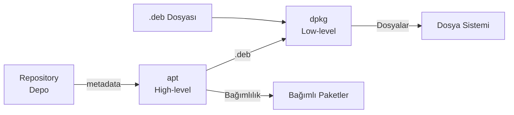

# Terminal Komutları

## Dosya ve Dizin İşlemleri

| Kom        | Açıklama                                           || Komut    | Açıklama                                           |
| ---------- | -------------------------------------------------- || -------- | -------------------------------------------------- |
| `pwd`      | Mevcut dizin yolunu gösterir                       || `cd`     | Dizin değiştirir                                   |
| `mkdir`    | Dizin oluşturur                                    || `touch`  | Boş dosya oluşturur veya tarih günceller           |
| `cp`       | Kopyalar                                           || `mv`     | Taşır veya Yeniden adlandırır                      |
| `rm`       | Dosya/dizin siler                                  || `rmdir`  | Boş dizin siler                                    |
| `ls`       | Dizin içeriğini listeler                           || `tree`   | Dizin yapısını ağaç şeklinde gösterir              |
| `file`     | Dosyanın gerçek türünü içerik analizi ile belirler || `stat`   | Ayrıntılı dosya meta bilgileri                     |
| `ln`       | Link oluşturur (-s: sembolik, bayraksız: hard)     || `install`| Kopyalama + izin + sahip atama birleşimi           |
| `readlink` | Sembolik linkin gerçek hedefini gösterir           ||
| `cat`      | Dosya içeriğini ekrana basar                       || `tac`  | Satırları ters sırada gösterir                       |
| `less`     | Sayfalı, aranabilir görüntüleme                    || `more` | `less`'in eski ve sınırlı hali                       |
| `head`     | Dosyanın başını gösterir (varsayılan: 10 satır)    || `tail` | Dosyanın sonunu gösterir                             |
| `wc`       | Satır, kelime, byte sayar                          |
| `tar`      | Arşivleme aracı (`.tar`, `.tar.gz`, `.tar.xz`)     || `gzip`/`gunzip`   | `.gz` sıkıştırma                          |
| `bzip2`/`bunzip2` | `.bz2` sıkıştırma                           || `xz`/`unxz`       | `.xz` yüksek sıkıştırma                   |
| `zip`/`unzip`     | `.zip` arşivi                               || `zcat`            | `.gz` dosyasını açmadan görüntüle         |


```bash
cd ~  # "~" -> Home, "-" -> Önceki, ".." -> Bir üst dizini

ls -l -S     # Boyuta göre sırala (direkt -lS diye yazılabilir)
ls -R        # Alt dizinleri de listele

mkdir -p a/b/c    # İç içe dizin oluşturur

rm -rf -i dizin/  # Zorla sil, -i silmeden önce sor
rm -rf !(a.txt)   # a.txt dışında her şeyi sil

cp -r src/ dst/   # Dizini özyinelemeli kopyala
cp -p dosya dst   # İzin ve tarihleri koru
cp -l dosya link  # Hard link olarak kopyala

ln -s /hedef /link_adı    # Sembolik link
ln kaynak link            # Hard link

tree -d            # Sadece dizinleri göster
tree -h            # Boyutları göster
tree -I ".git"     # Belirli kalıbı hariç tut

install -m 755 app /usr/local/bin/     # İzinli kopyala
install -d /etc/myapp                  # Dizin oluştur

cat -n dosya.txt           # Satır numarası ile
cat -A dosya.txt           # Görünmez karakterleri göster

# less içinde
# g → Başa git | G → Sona git | / → Ara | n → Sonraki eşleşme | q → Çık

head -n 20 dosya.txt       # İlk 20 satır
head -c 100 dosya.txt      # İlk 100 byte
tail -n 20 dosya.txt       # Son 20 satır
tail -f /var/log/syslog    # Canlı log takibi (-n  belli bir satır sayırı)

wc    dosya.txt            # Satır kelime byte (-l satır, -w kelime, -c byte)

tar -cvf arsiv.tar dizin/          # Arşiv oluştur
tar -czvf arsiv.tar.gz dizin/      # gzip ile sıkıştır
tar -cJvf arsiv.tar.xz dizin/      # xz ile sıkıştır
tar -xvf arsiv.tar                  # Arşiv aç
tar -xzvf arsiv.tar.gz             # gzip'li arşiv aç
tar -xvf arsiv.tar -C /hedef/      # Belirli dizine aç
tar -tvf arsiv.tar                  # İçeriği listele
tar --exclude=".git" -czf proje.tar.gz proje/  # Dışla

# Hızlı kopya (sıkıştırmadan)
tar -cf - src/ | tar -xf - -C dst/

gzip -k dosya.txt          # Orijinali koru
gzip -9 büyük.log          # Maksimum sıkıştırma
gzip -l arsiv.gz           # Bilgi göster
zcat arsiv.log.gz | grep error  # Açmadan içinde ara
```


## Arama Komutları

| Komut     | Açıklama                                        || Komut     | Açıklama                                          |
| --------- | ----------------------------------------------- || --------- | ------------------------------------------------- |
| `find`  | Gerçek zamanlı dosya arama                        || `locate`  | İndeks tabanlı hızlı arama (gerçek zamanlı değil) |
| `which` | PATH üzerindeki executable konumu                 || `whereis` | Binary, source, manual konumları                  |
| `sed`   | Akış düzenleyici; satır içi değiştirme            || `awk`     | Alan bazlı metin işleme programlama dili          |
| `grep`  | Metin içinde desen arama                          || `cut`     | Belirli sütunları veya karakterleri ayıklar       |
| `sort`  | Satırları sıralar                                 || `uniq`    | Birbirini izleyen tekrar eden satırları filtreler |
| `tr`    | Karakter dönüşümleri                              || `diff`    | Dosya farklılıklarını satır bazında gösterir      |
| `cmp`   | Dosyaları byte bazında karşılaştırır              || `tee`     | Çıktıyı hem terminale hem dosyaya yazar           |

```bash
find . -name "*.py"                      # İsme göre ara
find . -type f -size +10M -mtime -3      # 10 MB'dan büyük dosyalar ve son 3 günde değişenler
find . -type f -perm 0777 -user serkan   # Belirli izinli dosyalar ve serkan kullanıcısının
find . -type d -name "node_modules" -exec rm -rf {} + # Sil

locate -i network     # Büyük/küçük harf duyarsız
sudo updatedb         # İndeksi güncelle

which python3
which -a gcc                           # Tüm eşleşmeler
whereis ls                             # Binary + manual
whereis -b gcc                         # Sadece binary


sed 's/eski/yeni/g' dosya.txt             # Değiştir (stdout)
sed -i 's/eski/yeni/g' dosya.txt          # In-place
sed -n '/ERROR/p' dosya.txt               # Sadece eşleşen satırlar
sed '/^$/d' dosya.txt                      # Boş satırları sil
sed -n '10,20p' dosya.txt                  # 10-20. satırlar

awk '{print $1}' dosya.txt                # İlk alan
awk '{print $1, $3}' dosya.txt            # 1. ve 3. alan
awk '{print $NF}' dosya.txt               # Son alan
awk -F':' '{print $1}' /etc/passwd        # Ayırıcı değiştir
awk '/ERROR/ {print NR": "$0}' dosya.txt  # Satır no ile yazdır
awk '{sum+=$2} END{print "Toplam:", sum}' # Toplama
awk 'NR==5' dosya.txt                     # 5. satır

cut -d',' -f2 data.csv                    # CSV 2. sütun
cut -c1-20 dosya.txt                      # İlk 20 karakter

sort dosya.txt                             # Alfabetik
sort -r dosya.txt                          # Ters
sort -n sayilar.txt                        # Sayısal
sort -k2 -n dosya.txt                      # 2. alana göre sayısal
sort -rh                                   # İnsan okunabilir boyut (du çıktısı)

sort dosya.txt | uniq                     # Tekrarları kaldır
sort dosya.txt | uniq -c                  # Kaç kez tekrar ettiği
sort dosya.txt | uniq -d                  # Sadece tekraları göster
sort dosya.txt | uniq -u                  # Sadece benzersizleri

cat dosya.txt | tr 'a-z' 'A-Z'           # Büyük harfe çevir
cat dosya.txt | tr -d '\r'               # Windows satır sonu sil
cat dosya.txt | tr -s ' '                # Çoklu boşluğu tekleştir

grep "hata" dosya.log
grep -i "error" dosya.log              # Büyük/küçük harf duyarsız
grep -n "failed" dosya.log             # Satır numarasıyla
grep -r "TODO" ./src                   # Özyinelemeli
grep -E "ERROR|WARN|FATAL" app.log     # ERE
grep -v "^#" /etc/ssh/sshd_config      # Yorum satırlarını atla
grep -o "[0-9]\+\.[0-9]\+\.[0-9]\+\.[0-9]\+" dosya  # Sadece eşleşen kısmı
```


## Process ve Sistem Yönetimi

| Komut     | Açıklama                                || Komut               | Açıklama                                |
| --------- | --------------------------------------- || ------------------- | --------------------------------------- |
| `top`     | Canlı sistem kaynak monitörü            || `htop`              | Gelişmiş interaktif process monitörü    |
| `ps`      | Çalışan process listesi                 || `jobs`              | Arka plan işlerini listeler             |
| `kill`    | Process'e sinyal gönderir               || `pkill` - `killall` | İsimle process öldürür - Eşleşen tüm process'leri öldürür |
| `nice`    | Düşük öncelikle başlatır                || `renice`            | Çalışan process önceliğini değiştirir   |
| `bg`      | Arka planda devam ettirir               || `fg`                | Ön plana alır                           |
| `nohup`   | Terminale bağımsız çalıştırır           || `timeout`           | Komut süresini sınırlar                 |

```bash
ps aux                              # Tüm process'ler (a=tüm kullanıcı, u=detay, x=tty'siz)
ps -ef                              # Full format
ps -u serkan                        # Belirli kullanıcı
ps --sort=-%cpu | head              # CPU kullanımına göre sırala
pstree                              # Ağaç görünümü

# STAT sütunu anlamları:
# R=Çalışıyor, S=Uyuyor, D=I/O bekliyor, Z=Zombi, T=Durmuş

kill -l                            # Sinyal listesi
kill -9  <PID>                     # SIGKILL (zorla)
kill -15 <PID>                     # SIGTERM (nazikçe)
kill -1  <PID>                     # SIGHUP (yeniden yükle)
pkill -f "uygulama_adi"            # Kalıba göre öldür

# top etkileşim
# k → kill | r → renice | M → Belleğe göre sırala | P → CPU'ya göre

nohup ./betik.sh &
nohup ./betik.sh > cikti.log 2>&1 &

# nice (-20 en yüksek, +19 en düşük öncelik)
nice -n 10 python3 agir_is.py
renice +5 -p <PID>

# Zamanlanmış sonlandırma
timeout 30s ping google.com
timeout 5m ./uzun_betik.sh || echo "Zaman aşıldı!"
```


## Disk ve Dosya Sistemi

| Komut              | Açıklama                                  || Komut              | Açıklama                                  |
| ------------------ | ----------------------------------------- || ------------------ | ----------------------------------------- |
| `df`               | Bağlı dosya sistemleri disk kullanımı     || `du`               | Dizin/dosya disk kullanımı                |
| `lsblk`            | Blok cihazların ağaç görünümü             || `blkid`            | Blok cihaz UUID ve tip                    |
| `mount` / `umount` | Dosya sistemi bağla / ayır                || `findmnt`          | Mount noktalarını ağaç yapısında gösterir |
| `fdisk`            | Disk bölüm yönetimi                       || `mkfs`             | Dosya sistemi oluşturur                   |
| `fsck`             | Dosya sistemi kontrolü ve onarımı         || `dd`               | Düşük seviye blok kopyalama               |

```bash
# df
df -h                         # İnsan okunabilir
df -hT                        # Dosya sistemi tipini de göster
df -h /                       # Sadece root

# du
du -sh /var/log               # Tek dizin özeti
du -sh /var/* | sort -rh | head -10  # En büyük alt dizinler
du -h --max-depth=1 /home     # Sadece 1 seviye derine git

# lsblk
lsblk                         # Disk yapısı
lsblk -f                      # Dosya sistemi tipleri ve UUID

# mount
sudo mount /dev/sdb1 /mnt/disk
sudo mount -t ext4 /dev/sdb1 /mnt/disk
sudo mount -o ro /dev/sdb1 /mnt/disk  # Salt okunur
sudo umount /mnt/disk

# dd - Disk imajı
sudo dd if=/dev/sda of=/mnt/backup.img bs=64K conv=noerror,sync status=progress
sudo dd if=/mnt/backup.img of=/dev/sdb bs=64K status=progress
# Doğrula:
sha256sum /dev/sda /mnt/backup.img
```

!!! danger "dd Komutu"
    `dd` kaynak (`if=`) ve hedefi (`of=`) doğrudan silmeden yazar. Hedefi yanlış belirlemek veri kaybına neden olur. Çalıştırmadan önce `if=` ve `of=` değerlerini **iki kez kontrol edin**.


## Kullanıcı ve Yetki Yönetimi

| Komut      | Açıklama                                      || Komut          | Açıklama                                    |
| ---------- | ---------------------------------------------- || -------------- | -------------------------------------------- |
| `useradd`  | Kullanıcı oluşturur                            || `usermod`      | Kullanıcı özelliklerini değiştirir (grup, kilit) |
| `passwd`   | Şifre atar/değiştirir                          || `userdel`      | Kullanıcıyı siler                            |
| `groupadd` | Grup oluşturur                                 || `groupdel`     | Grubu siler                                  |
| `groups`   | Kullanıcının gruplarını gösterir               || `id`           | UID, GID ve grup bilgisi                     |
| `who`/`w`  | Sisteme giriş yapmış kullanıcılar              || `last`/`lastb` | Geçmiş girişler / başarısız girişler         |
| `su`       | Başka kullanıcıya/root'a geçer                 || `sudo`         | Yetkili komut çalıştırır                     |
| `getfacl`  | Dosyanın ACL izinlerini gösterir               || `setfacl`      | ACL izni ekler/kaldırır                      |

```bash
# Kullanıcı yönetimi
sudo useradd -m -s /bin/bash -G sudo serkan   # Kullanıcı oluştur
sudo passwd serkan                              # Şifre ata
sudo usermod -aG docker,gpio serkan           # Gruplara ekle
sudo usermod -L serkan                         # Kilitle
sudo usermod -U serkan                         # Kilidi aç
sudo userdel -r serkan                         # Home ile birlikte sil

# Grup yönetimi
sudo groupadd arge
sudo groupdel arge
groups                          # Mevcut kullanıcının grupları
id serkan                       # UID, GID ve gruplar

# Giriş bilgisi
who                             # Sisteme giriş yapmış kullanıcılar
w                               # Detaylı
last                            # Tüm girişler
lastb                           # Başarısız girişler

# Kullanıcı geçişi
su serkan                       # Kullanıcıya geç
sudo su                         # Root'a geç
sudo -i                         # Root shell
sudo -s                         # Mevcut shell'de root

# ACL
getfacl dosya.txt
setfacl -m u:serkan:rwx dosya.txt
setfacl -m g:arge:rx dosya.txt
setfacl -x u:serkan dosya.txt   # Kaldır
setfacl -b dosya.txt            # Tümünü kaldır
```


## Sistem Bilgisi ve Zaman

| Komut               | Açıklama                                    || Komut          | Açıklama                                       |
| ------------------- | --------------------------------------------- || -------------- | ----------------------------------------------- |
| `uname`             | Kernel, hostname, mimari bilgisi              || `lscpu`        | İşlemci detayı                                   |
| `free`              | RAM kullanımı                                 || `lspci`/`lsusb`| PCIe / USB cihaz listesi                         |
| `lsmod`/`modinfo`   | Yüklü kernel modülleri / modül bilgisi        || `hostname`     | Sistem adı / IP adresleri                        |
| `uptime`            | Çalışma süresi ve sistem yükü                 || `date`         | Tarih/saat gösterir                              |
| `timedatectl`       | Zaman dilimi, NTP ve sistem saati yönetimi    || `watch`        | Bir komutu periyodik aralıklarla tekrarlar       |
| `sleep`             | Belirtilen süre bekler                        || `at`/`atq`/`atrm` | Tek seferlik zamanlama / kuyruk / iptal       |
| `time`              | Komutun çalışma süresini ölçer                || `wall`/`write` | Kullanıcılara terminal mesajı gönderir           |

```bash
# Donanım bilgisi
uname -a               # Kernel, hostname, mimari
uname -r               # Kernel sürümü
uname -m               # Mimari (x86_64, aarch64)
lscpu                  # İşlemci detayı
free -h                # RAM kullanımı
lspci                  # PCIe cihazlar
lspci -k               # Hangi sürücüyü kullandığı
lsusb                  # USB cihazlar
lsusb -v               # Detaylı
lsusb -t               # Hiyerarşi
lsmod                  # Yüklü kernel modülleri
modinfo <modül>        # Modül bilgisi

# Sistem bilgisi
cat /proc/cpuinfo      # CPU detayı
cat /proc/meminfo      # Bellek detayı
cat /etc/os-release    # Dağıtım bilgisi
lsb_release -a         # Dağıtım sürümü
hostname               # Sistem adı
hostname -I            # IP adresleri
uptime                 # Çalışma süresi ve yük

wall "Sistem 10 dakika sonra bakıma alınacak"    # Tüm kullanıcılara
write serkan pts/1                                # Belirli terminale

# notify-send (masaüstü bildirimi)
notify-send "Yedekleme" "Tamamlandı!" --icon=dialog-information

# Tarih ve saat
date
timedatectl            # Zaman dilimi ve NTP durumu
timedatectl set-timezone Europe/Istanbul

# date formatları
date +"%Y-%m-%d %H:%M:%S"   # 2024-01-15 14:30:00
date +%s                     # Unix timestamp (epoch)
date +%Y%m%d                 # 20240115

# Sistem zamanı ayarla
sudo timedatectl set-time '2024-01-15 14:30:00'
sudo timedatectl set-ntp true   # NTP senkronizasyonu

# watch - periyodik komut tekrar
watch -n 2 df -h         # 2 saniyede bir
watch -n 1 'ps aux --sort=-%cpu | head'

# sleep
sleep 5                  # 5 saniye bekle
sleep 1m                 # 1 dakika
sleep 1h30m              # 1 saat 30 dakika

# at - tek seferlik zamanlama
at now + 30 minutes << 'EOF'
/usr/local/bin/yedekle.sh
EOF
atq                     # Kuyruğu gör
atrm <iş_no>            # İptal et

# Zaman ölçümü
time komut               # Gerçek, user, sys süresi
```


## Ortam Değişkenleri

| Komut     | Açıklama                                || Komut      | Açıklama                                  |
| --------- | ------------------------------------------ || ---------- | -------------------------------------------- |
| `env`     | Tüm ortam değişkenlerini listeler          || `printenv` | Belirli bir değişkenin değerini gösterir     |
| `export`  | Ortam değişkeni tanımlar                   || `source`   | Script'i mevcut shell'de çalıştırır          |
| `alias`   | Komuta kısayol tanımlar                    || `unalias`  | Kısayolu kaldırır                            |
| `history` | Komut geçmişini gösterir                   || `!!`/`!n`  | Geçmişteki bir komutu tekrar çalıştırır      |

```bash
env                      # Tüm ortam değişkenleri
printenv PATH            # Belirli değişken
echo $HOME $USER $SHELL  # Sistem değişkenleri

# Geçici tanımlama
export MY_VAR="değer"
MY_VAR="değer" komut     # Sadece o komut için

# Kalıcı (.bashrc veya .profile)
echo 'export MY_VAR="değer"' >> ~/.bashrc
source ~/.bashrc

# Alias
alias ll='ls -alh'
alias gs='git status'
alias update='sudo apt update && sudo apt upgrade -y'
unalias ll               # Kaldır
alias                    # Tüm alias'ları listele

# history
history
history | grep apt       # Filtrelenmiş geçmiş
!!                       # Önceki komut
!124                     # Geçmişte 124. komut
!apt                     # apt ile başlayan son komut
Ctrl+R                   # Ters arama
```


## Sistem Debug Araçları

| Komut      | Açıklama                                                                    || Komut      | Açıklama                                                     |
| ---------- | ------------------------------------------------------------------------------ || ---------- | ---------------------------------------------------------------- |
| `strace`   | Process'in kernel'e yaptığı sistem çağrılarını (open, read, write, ioctl...) izler || `ltrace`   | Process'in dinamik kütüphane (libc vb.) fonksiyon çağrılarını izler |
| `perf`     | CPU sayaçları, fonksiyon bazlı kullanım ve darboğazları profiller              || `ldd`      | Binary'nin dinamik kütüphane bağımlılıklarını gösterir           |
| `readelf`  | ELF dosyasının başlık/section/segment bilgisini gösterir                       || `nm`       | ELF/obje dosyasındaki sembolleri listeler                        |
| `objdump`  | Binary'yi disassemble eder                                                     || `file`     | Dosyanın gerçek türünü tespit eder                                |
| `strings`  | Binary içindeki okunabilir metin dizilerini çıkarır                            |

```bash
# Temel kullanım
strace ls /tmp                          # Komutun syscall'larını göster
strace -p 1234                          # Çalışan process'e bağlan

# Sadece belirli syscall'lar
strace -e trace=open,read,write ls      # Dosya işlemleri
strace -e trace=network curl http://x  # Ağ çağrıları
strace -e trace=ioctl ./myapp          # ioctl çağrıları (cihaz debug)
strace -e trace=mmap,brk ./myapp       # Bellek tahsisi

# Detay ve zaman
strace -t ./app                         # Zaman damgası
strace -T ./app                         # Her syscall süresi
strace -c ./app                         # Özet istatistik (hangi çağrı kaç kez)

# Dosyaya yaz
strace -o trace.txt ./app
strace -ff -o trace ./app              # Fork'ları ayrı dosyaya

# Pratik: hangi dosyalara erişiyor?
strace -e trace=openat ./app 2>&1 | grep -v ENOENT

# Pratik: cihaz dosyası kullanımını izle
strace -e trace=open,ioctl,read,write ./sensor_app 2>&1 | grep /dev/

# Pratik: başarısız sistem çağrıları
strace -e trace=all ./app 2>&1 | grep " = -1"

ltrace ./app              # Dinamik kütüphane çağrıları
ltrace -S ./app           # Syscall + kütüphane çağrıları
ltrace -p 1234            # Çalışan process
ltrace -c ./app           # Özet istatistik

# ldd - dinamik bağımlılıklar
ldd /usr/bin/python3               # Hangi .so dosyalarını kullanıyor
ldd -v /bin/ls                     # Detaylı versiyon bilgisi
LD_TRACE_LOADED_OBJECTS=1 ./app   # ldd'nin yaptığı şey

# readelf - ELF dosyası analizi
readelf -h /bin/ls                 # ELF başlığı (mimari, tip)
readelf -S /bin/ls                 # Section listesi
readelf -d ./app                   # Dinamik bölüm (NEEDED = bağımlılıklar)
readelf -l /bin/ls                 # Program header (segment'ler)
readelf --syms ./app               # Sembol tablosu

nm ./app                           # Tüm semboller
nm -D ./app                        # Dinamik semboller
nm -u ./app                        # Tanımsız (dış bağımlılık) semboller
nm --defined-only ./libmylib.so    # Sadece tanımlı semboller

objdump -d ./app                   # Text section'ı decompile et
objdump -S ./app                   # Kaynak+assembly (debug bilgisi varsa)
objdump -j .data -s ./app         # .data section içeriği

file /bin/ls                       # ELF 64-bit LSB executable, ARM aarch64...
file ./firmware.bin                # Firmware analizi

strings ./app | grep -i "error\|config\|version"
strings -n 8 firmware.bin         # En az 8 karakterlik dizeler

sudo perf stat ./app                    # CPU istatistikleri (cycles, instructions vb.)
sudo perf stat -e cache-misses ./app   # Cache miss sayısı
sudo perf top                           # Gerçek zamanlı CPU profili (top gibi)

sudo perf record ./app                  # Örnekleme yap (perf.data dosyası oluşur)
sudo perf record -g ./app              # Stack trace ile
sudo perf report                        # perf.data'yı analiz et
sudo perf report --stdio               # Terminal çıktısı

# Callgraph
sudo perf record -g --call-graph dwarf ./app
sudo perf report --call-graph

# Sistem geneli izleme
sudo perf top -e cycles -p 1234       # Belirli process

# Flamegraph (görsel profil - FlameGraph aracı gerekli)
sudo perf record -g ./app
sudo perf script | ./stackcollapse-perf.pl | ./flamegraph.pl > flame.svg
```

!!! tip "Gömülü Sistemlerde Debug Öncelikleri"
    1. **Çalışmıyor mu?** → `strace -e trace=openat,ioctl` ile hangi dosyaya/cihaza erişemediğini bul
    2. **Yavaş mı?** → `strace -c` ile en çok zaman harcayan syscall'ı bul, sonra `perf` ile darboğazı bul
    3. **Crash oluyor mu?** → `gdb ./app core` ile core dump analiz et
    4. **Kütüphane hatası mı?** → `ldd` + `ltrace` kombinasyonu


## Ağ Komutları

| Komut              | Açıklama                                       || Komut       | Açıklama                                    |
| ------------------ | ----------------------------------------------- || ----------- | -------------------------------------------- |
| `ip addr` / `ip a` | IP adreslerini gösterir/yönetir (eski: `ifconfig`) || `ip link`   | Arayüz durumu ve MAC yönetimi                |
| `ip route`         | Routing tablosu (eski: `route -n`)              || `ip neigh`  | ARP/komşu tablosu (eski: `arp -n`)           |
| `ss`               | Aktif bağlantı ve dinleyen port listesi         || `ping`      | Bağlantı/erişilebilirlik testi               |
| `traceroute`/`mtr` | Pakete izlenen rotayı gösterir                  || `dig`/`nslookup` | DNS sorgulama                          |
| `nmap`             | Ağ/port tarama                                  || `tcpdump`   | Paket yakalama ve filtreleme                 |
| `scp`/`sftp`       | SSH üzerinden dosya kopyalama                   || `rsync`     | Artırımlı/verimli dosya senkronizasyonu      |
| `ufw`              | Basit güvenlik duvarı yönetimi                  || `iptables`  | Düşük seviye güvenlik duvarı kuralları       |

```bash
# ip - arayüz, adres ve rota yönetimi
ip -br link                                    # Arayüzleri özetle
ip link set eth0 up                            # Arayüzü aç (down: kapat)
ip -br addr                                    # IP adreslerini özetle
ip addr add 192.168.1.50/24 dev eth0           # Geçici IP ekle
ip route                                       # Routing tablosu
ip route add default via 192.168.1.1          # Gateway ekle
ip neigh                                       # ARP/komşu tablosu

# ss - port ve bağlantı izleme
ss -lntp     # Dinleyen TCP portları + process (-l listening, -n numeric, -t tcp, -p process)
ss -lunp     # Dinleyen UDP portları + process
ss -nt       # Aktif TCP bağlantıları

# Bağlantı ve rota testi
ping -c 4 8.8.8.8              # 4 paket gönder
traceroute 8.8.8.8              # Rota izle
mtr 8.8.8.8                     # Gerçek zamanlı traceroute (daha iyi)

# DNS sorgulama
dig +short example.com          # Hızlı A kaydı
dig @8.8.8.8 example.com       # Belirli DNS sunucu kullan
nslookup example.com
cat /etc/hosts                  # Statik isim-IP eşlemesi (DNS'den önce sorgulanır)

# nmap - ağ/port tarama
nmap -sn 192.168.1.0/24        # Ping taraması (host keşfi)
nmap -sV -p 22,80,443 host     # Servis versiyonu tespiti

# tcpdump - paket yakalama
sudo tcpdump -i eth0 -nn                        # Arayüzü dinle, DNS/port çözme yapma
sudo tcpdump -i eth0 port 443 or port 80        # Belirli portları filtrele
sudo tcpdump -i eth0 -w capture.pcap            # Dosyaya kaydet (Wireshark ile aç)
sudo tcpdump 'tcp[tcpflags] & tcp-syn != 0'    # SYN paketleri (bağlantı istekleri)

# scp / rsync / sftp - dosya aktarımı
scp dosya.txt user@host:/remote/path/           # Yerel → Uzak
scp -r ./proje user@host:~/                     # Dizin kopyala
rsync -avz --progress /kaynak/ /hedef/          # Senkronize et (-a arşiv, -z sıkıştır)
rsync -avz --delete /local/ user@host:/backup/  # Hedefte fazlalıkları sil
sftp user@host                                  # Şifreli interaktif dosya transferi

# Firewall
sudo ufw allow 22/tcp                            # Port aç
sudo ufw default deny incoming                   # Varsayılan politika (gelen trafiği reddet)
sudo ufw status verbose                          # Durumu göster
sudo iptables -A INPUT -p tcp --dport 22 -j ACCEPT
sudo iptables -L -n -v --line-numbers            # Kuralları görüntüle
```


## Paket Yönetimi



| Komut                 | Açıklama                                                        || Komut       | Açıklama                                              |
| ---------------------- | ------------------------------------------------------------------ || ----------- | ---------------------------------------------------------- |
| `apt`                  | Yüksek seviye paket yöneticisi; repo indirme + bağımlılık çözer   || `dpkg`      | Düşük seviye paket yöneticisi; `.deb` kurar, bağımlılık çözmez |
| `apt-cache`            | Paket metadata'sını sorgular (bağımlılık, sürüm)                 || `apt-mark`  | Paketi belirli sürümde tutar (pin/hold)                     |
| `snap`                 | Uygulamayı bağımlılıklarıyla izole container içinde çalıştırır   || `add-apt-repository` | 3. parti/PPA depo ekler                            |
| `pip`                  | Python paket yöneticisi                                          || `venv`      | Python sanal ortam oluşturur                                |

```bash
# snap - evrensel paket yöneticisi
snap find <uygulama>             # Ara
snap install <uygulama>          # Kur
snap install <uygulama> --classic  # Klasik (izolasyonsuz)
snap refresh <uygulama>          # Güncelle (boş: tümünü güncelle)
snap remove <uygulama>           # Kaldır
snap list                        # Kurulular
snap info <uygulama>             # Bilgi

# dpkg - düşük seviye paket yöneticisi
dpkg -i <paket>.deb      # Paket kur
dpkg -r <paket>          # Paketi kaldır (yapılandırma dosyaları kalır)
dpkg -P <paket>          # Paketi ve yapılandırmasını tamamen kaldır
dpkg -l                  # Kurulu paket listesi ve durumları
dpkg -L <paket>          # Paketin kurduğu dosyalar
dpkg -S <dosya_yolu>     # Bir dosyanın hangi pakete ait olduğu
dpkg -s <paket>          # Paket durumu (status)
dpkg --configure -a      # Tamamlanamamış kurulumları tamamla

# apt - yüksek seviye paket yöneticisi
apt update                      # Repository metadata'sını indir (paket kurmaz)
apt upgrade                     # Kurulu paketleri güncelle
apt full-upgrade                # Bağımlılık değişimleriyle tam güncelleme
apt install <paket>             # Paket ve bağımlılıklarını kur
apt install <paket>=<versiyon>  # Belirli sürümü kur
apt remove <paket>               # Paketi kaldır (yapılandırma kalır)
apt purge <paket>                # Paketi + yapılandırmayı tamamen kaldır
apt autoremove                  # Artık gerekmeyen paketleri kaldır
apt search <kelime>             # Paket ara
apt show <paket>                # Paket bilgisi
apt list --installed            # Kurulu paketler
apt list --upgradable           # Güncellenebilir paketler
apt install -f                   # Bozuk bağımlılıkları düzelt
sudo apt-mark hold linux-image-generic   # Belirli paketi tutma (pin)
sudo apt autoremove --purge     # Kernel güncelleme sonrası eski kernel temizleme

# apt-cache - metadata sorgulama
apt-cache show <paket>          # Detaylı paket bilgisi
apt-cache policy <paket>        # Sürüm ve pin bilgisi
apt-cache depends <paket>       # Doğrudan bağımlılıklar
apt-cache rdepends <paket>      # Ters bağımlılıklar (kim kullanıyor)

# pip - python paket yönetimi
pip install numpy
pip install numpy==1.25.0       # Belirli sürüm
pip install -r requirements.txt   # Dosyadan toplu kur
pip install --upgrade numpy
pip list --outdated               # Güncellenebilir paketler
pip show numpy                    # Paket bilgisi
pip freeze > requirements.txt     # Ortamı dışa aktar
pip uninstall numpy

# Python sanal ortam
python3 -m venv myenv
source myenv/bin/activate
deactivate

# Repository yönetimi
cat /etc/apt/sources.list
sudo add-apt-repository ppa:user/repo && sudo apt update

# 3. taraf depo (GPG anahtarıyla)
curl -fsSL https://example.com/gpg.key | sudo gpg --dearmor -o /etc/apt/keyrings/example.gpg
echo "deb [signed-by=/etc/apt/keyrings/example.gpg] https://example.com/repo stable main" | \
    sudo tee /etc/apt/sources.list.d/example.list
```

!!! warning "pip ile Sistem Python'u Değiştirme"
    Ubuntu/Debian'da `sudo pip install ...` sistem Python paketlerini bozabilir. `python3 -m pip install --user ...` (kullanıcı bazlı) veya sanal ortam kullanın.

!!! note "pyproject.toml (Modern Yol)"
    `requirements.txt` yerine modern projeler `pyproject.toml` (PEP 517/518) kullanır. `pip install .` veya `pip install -e .` (editable) ile proje yüklenir.


## Servis Yönetimi (systemctl)

| Komut                | Açıklama                                              || Komut                  | Açıklama                                       |
| --------------------- | -------------------------------------------------------- || ----------------------- | --------------------------------------------------- |
| `start`/`stop`        | Servisi başlatır / durdurur                              || `restart`/`reload`      | Yeniden başlatır / yapılandırmayı yeniden yükler (fork yok) |
| `status`               | Servis durumunu gösterir                                 || `daemon-reload`         | Değişen unit dosyalarını tanır                       |
| `enable`/`disable`    | Boot'ta başlatmayı aç/kapat                              || `enable --now`          | Enable + hemen başlat                                |
| `is-enabled`           | Otomatik başlatma durumunu sorgular                      || `is-active`             | Servisin çalışır durumda olup olmadığını sorgular    |
| `list-units`           | Unit'leri listeler                                       || `list-timers`           | Zamanlayıcıları listeler                             |
| `poweroff`/`reboot`   | Sistemi kapatır / yeniden başlatır                       || `suspend`/`hibernate`   | Sistemi askıya alır / hazırda bekletir               |
| `rescue`               | Kurtarma moduna geçer                                    |

```bash
# Servis kontrolü
sudo systemctl start   my.service
sudo systemctl stop    my.service
sudo systemctl restart my.service
sudo systemctl reload  my.service     # Yapılandırmayı yeniden yükle (fork yok)
sudo systemctl status  my.service

# Otomatik başlatma
sudo systemctl enable  my.service     # Boot'ta başlat
sudo systemctl disable my.service     # Boot'ta başlatma
sudo systemctl enable --now my.service  # Enable + hemen başlat
sudo systemctl is-enabled my.service
sudo systemctl is-active  my.service

# Unit listesi
systemctl list-units --all
systemctl list-units --type=service --state=running
systemctl list-units --type=target
systemctl list-timers

# Timer servisini etkinleştirme örneği
sudo systemctl enable --now backup.timer
systemctl list-timers

# Birim yenileme
sudo systemctl daemon-reload           # Değişen unit dosyalarını tanı

# Sistem geneli
sudo systemctl poweroff
sudo systemctl reboot
sudo systemctl suspend
sudo systemctl hibernate
sudo systemctl rescue                  # Kurtarma moduna geç
```


## Log Yönetimi (journalctl)

| Komut                    | Açıklama                                                || Komut                | Açıklama                                       |
| ------------------------- | ------------------------------------------------------------ || --------------------- | ----------------------------------------------- |
| `journalctl`               | Sistem loglarını görüntüler                                  || `journalctl -f`       | Canlı log takibi (`tail -f`)                    |
| `journalctl -u <servis>`  | Belirli servisin logları                                     || `journalctl -b`       | Belirtilen boot'un logları                       |
| `journalctl --since/--until` | Zaman aralığına göre filtreler                            || `journalctl -p <öncelik>` | Log seviyesine göre filtreler (err, warning...) |
| `journalctl -o <format>`  | Çıktı formatını değiştirir (json, short-precise...)          || `journalctl -k`       | Kernel loglarını gösterir                        |
| `journalctl --vacuum-*`   | Eski logları temizler (`--vacuum-size`/`--vacuum-time`)      || `journalctl --disk-usage` | Log disk kullanımını gösterir               |
| `dmesg`                    | Kernel halka tamponu mesajlarını gösterir                    || `dmesg -T`            | İnsan okunabilir zaman damgasıyla gösterir       |

```bash
# Temel kullanım
journalctl                          # Tüm loglar
journalctl -b                       # Son boot'tan itibaren
journalctl -b -1                    # Bir önceki boot
journalctl -f                       # Canlı takip (tail -f)

# Servis filtreleme
journalctl -u sshd
journalctl -u sshd -f               # SSH loglarını canlı izle
journalctl -u nginx --since today

# Zaman filtresi
journalctl --since "2024-01-01 08:00:00"
journalctl --until "2024-01-02"
journalctl --since "1 hour ago"

# Öncelik filtresi
journalctl -p err                   # Sadece hata ve üzeri
journalctl -p warning               # Uyarı ve üzeri
# debug(7) info(6) notice(5) warning(4) err(3) crit(2) alert(1) emerg(0)

# Çıktı formatı
journalctl -o json-pretty           # JSON formatı
journalctl -o short-precise         # Mikrosaniye hassasiyetiyle
journalctl --no-pager               # Sayfalama olmadan
journalctl -n 50                    # Son 50 satır

# Kernel mesajları
journalctl -k                       # Kernel logları
journalctl -k -b                    # Bu boot'taki kernel logları

# Disk kullanımı ve temizlik
journalctl --disk-usage
sudo journalctl --vacuum-size=500M  # 500 MB'dan fazlasını sil
sudo journalctl --vacuum-time=30d   # 30 günden eskiyi sil

dmesg | grep -i error             # Kernel hata mesajlarını filtrele
dmesg -T                          # İnsan okunabilir timestamp
```