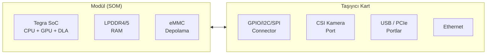
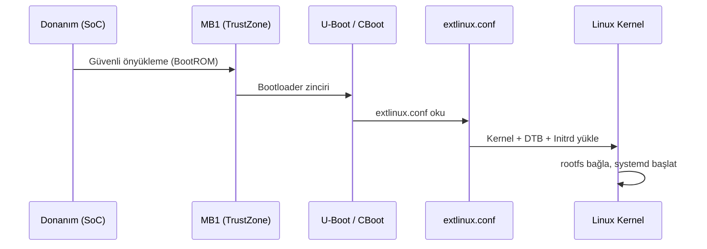

# NVIDIA Jetson



## L4T - Linux for Tegra

L4T (Linux for Tegra), NVIDIA'nın Jetson platformu için özelleştirilmiş Ubuntu tabanlı Linux dağıtımıdır.

```bash
# L4T sürümünü öğren
cat /etc/nv_tegra_release
# R32 (release), REVISION: 7.3

# JetPack sürümü
dpkg -l | grep nvidia-jetpack

# Donanım bilgisi
cat /proc/cpuinfo | grep "Hardware"
cat /proc/cpuinfo | grep "Revision"

# GPU bilgisi
nvidia-smi   # Xavier/Orin
tegrastats   # Tüm Jetson modelleri için daha ayrıntılı
```

```bash title="tegrastats - Gerçek Zamanlı İzleme"
sudo tegrastats                        # Gerçek zamanlı izleme
sudo tegrastats --interval 2000       # 2 saniyede bir
sudo tegrastats --logfile /tmp/stats.log --start  # Arka planda logla
sudo tegrastats --stop                 # Durdu

# Örnek çıktı:
# RAM 1200/3964MB (lfb 512x4MB) SWAP 0/1982MB
# CPU [23%@1479,18%@1479] EMC_FREQ 0% GR3D_FREQ 0%
# AO@35.5C CPU@42.5C GPU@40C PLL@39C
```

```bash title="nvpmodel - Güç Modu"
sudo nvpmodel -q verbose   # Aktif mod ve detaylar
sudo nvpmodel -m 0         # MAXN - maksimum performans
sudo nvpmodel -m 1         # 5W / 10W - düşük güç

# Sonraki açılışta da geçerli olsun
sudo nvpmodel -m 0
```

| Jetson Nano | Mod  |          CPU           |        GPU         |
| :---------: | :--: | :--------------------: | :----------------: |
|      0      | MAXN | 4 çekirdek @ 1.479 GHz | 128 core @ 921 MHz |
|      1      |  5W  |  2 çekirdek @ 918 MHz  | 128 core @ 640 MHz |

```bash
# Jetclocks - tüm saatleri maksimuma al (benchmark için)
sudo jetson_clocks          # Maksimum frekans kilitle
sudo jetson_clocks --show   # Mevcut frekansları göster
sudo jetson_clocks --restore  # Varsayılana dön
```

---

## Önyükleme Yapılandırması

Jetson, GRUB yerine `extlinux.conf` kullanır. Bu dosya, `flash.sh` tarafından eMMC birinci bölümüne (`mmcblk0p1`) yazılır.

```bash
# Dosya konumu (Jetson üzerinde)
cat /boot/extlinux/extlinux.conf
```

```ini title="/boot/extlinux/extlinux.conf"
TIMEOUT 30
DEFAULT primary

MENU TITLE L4T boot options

LABEL primary
    MENU LABEL primary kernel
    LINUX /boot/Image
    INITRD /boot/initrd
    FDT /boot/dtb/kernel_tegra210-p3448-0000-p3449-0000-b00.dtb
    APPEND ${cbootargs} quiet root=/dev/mmcblk0p1 rw rootfstype=ext4 \
           console=ttyS0,115200n8 console=tty0 fbcon=map:0 net.ifnames=0

# SD karttan önyükleme için:
# root=/dev/mmcblk1p1 veya root=/dev/sda1
```

```bash
# Yeni DTB yükle ve önyükleme için ayarla
sudo mount /dev/mmcblk0p1 /mnt
sudo cp yeni_board.dtb /mnt/boot/dtb/
sudo nano /mnt/boot/extlinux/extlinux.conf   # FDT satırını güncelle
sudo sync && sudo umount /mnt && sudo reboot
```



### 1. Kaynak Kodu İndir

```bash
# L4T R32.7.3 için
mkdir -p ~/jetson/kernel && cd ~/jetson/kernel

wget https://developer.nvidia.com/embedded/l4t/r32_release_v7.3/sources/t210/public_sources.tbz2
tar xf public_sources.tbz2
tar xf Linux_for_Tegra/source/public/kernel_src.tbz2

# Kaynak dizini
ls kernel/kernel-4.9/
```

### 2. Cross-Compile Ortamı

```bash
# ARM64 cross-compiler
sudo apt install gcc-aarch64-linux-gnu g++-aarch64-linux-gnu

# Ortam değişkenleri
export ARCH=arm64
export CROSS_COMPILE=aarch64-linux-gnu-
export LOCALVERSION=-tegra

# Çekirdek kaynak dizinine gir
cd kernel/kernel-4.9
```

### 3. Konfigürasyon

```bash
# Varsayılan Jetson Nano konfigürasyonu
make tegra_defconfig

# veya mevcut sistemin konfigürasyonunu kopyala
scp pi@jetson:/proc/config.gz .
gunzip config.gz && cp config .config
make olddefconfig

# Menü arayüzü ile özelleştirme
make menuconfig

# Belirli seçenekler
scripts/config --enable CONFIG_CAN
scripts/config --enable CONFIG_CAN_RAW
scripts/config --enable CONFIG_CAN_SOCKETCAN
scripts/config --module CONFIG_USB_SERIAL_CH341
```

### 4. Derleme

```bash
# CPU çekirdek sayısına göre paralel derleme
make -j$(nproc) Image modules dtbs

# Modülleri yükle (hedef dizine)
make INSTALL_MOD_PATH=/tmp/modules modules_install

# Derleme çıktıları
ls arch/arm64/boot/Image           # Sıkıştırılmamış kernel
ls arch/arm64/boot/dts/nvidia/     # DTB dosyaları
```

### 5. Jetson'a Kopyala ve Uygula

```bash
# SSH üzerinden kopyala
JETSON="pi@192.168.1.100"

scp arch/arm64/boot/Image ${JETSON}:/tmp/
scp arch/arm64/boot/dts/nvidia/tegra210-p3448-0000-p3449-0000-b00.dtb ${JETSON}:/tmp/

ssh ${JETSON} bash << 'EOF'
    sudo cp /tmp/Image /boot/Image
    sudo cp /tmp/*.dtb /boot/dtb/
    sudo sync
    sudo reboot
EOF

# Modülleri kopyala
rsync -avz /tmp/modules/ ${JETSON}:/
ssh ${JETSON} "sudo depmod -a && sudo reboot"
```

!!! tip "İpucu: out-of-tree Modül"
    Tüm kernel'i yeniden derlemek yerine, yalnızca özel sürücünüzü modül olarak derleyebilirsiniz:
    ```bash
    make -C /path/to/kernel-source M=$(pwd) modules
    make -C /path/to/kernel-source M=$(pwd) INSTALL_MOD_PATH=/tmp/mods modules_install
    ```

## Kamera Hızlı Referans

```bash
# Bağlı kameraları listele
v4l2-ctl --list-devices
ls /dev/video*

# Kamera yetenekleri
v4l2-ctl -d /dev/video0 --all
v4l2-ctl -d /dev/video0 --list-formats-ext

# Görüntü yakala (JPEG)
v4l2-ctl -d /dev/video0 \
    --set-fmt-video=width=1920,height=1080,pixelformat=MJPG \
    --stream-mmap --stream-to=frame.jpg --stream-count=1

# libargus / nvarguscamerasrc (CSI kamera)
# GStreamer ile önizleme
gst-launch-1.0 nvarguscamerasrc sensor-id=0 ! \
    'video/x-raw(memory:NVMM),format=NV12,width=1920,height=1080,framerate=30/1' ! \
    nvvidconv ! nvoverlaysink -e

# H.264 kayıt
gst-launch-1.0 nvarguscamerasrc sensor-id=0 ! \
    'video/x-raw(memory:NVMM),format=NV12,framerate=30/1' ! \
    nvv4l2h264enc ! h264parse ! mp4mux ! \
    filesink location=video.mp4 -e

# UDP yayın (ağ üzerinden)
gst-launch-1.0 nvarguscamerasrc sensor-id=0 ! \
    'video/x-raw(memory:NVMM),format=NV12,framerate=30/1' ! \
    nvv4l2h264enc ! rtph264pay ! \
    udpsink host=192.168.1.50 port=5000
```

---

## GPIO - Tegra Pin Numarası Hesaplama

Jetson'da GPIO sysfs numaraları, `tegra-gpio.h` dosyasındaki formül ile hesaplanır.

### Formül

```c
// tegra194-gpio.h (Xavier NX) veya tegra210-gpio.h (Nano)
#define TEGRA_GPIO(port, offset)  ((TEGRA_GPIO_PORT_##port * 8) + offset)

// Port sabitleri (A=0, B=1, C=2, ... BB=27, CC=28...)
#define TEGRA_GPIO_PORT_A   0
#define TEGRA_GPIO_PORT_B   1
...
#define TEGRA_GPIO_PORT_S  18
#define TEGRA_GPIO_PORT_T  19
#define TEGRA_GPIO_PORT_BB 27
```

### Hesaplama Örneği

Pinmux Excel dosyasından `GPIO3_PT.00` (CAM1_PWDN pini) için:

```
GPIO3_PT.00 → Port = T → TEGRA_GPIO_PORT_T = 19, Offset = 0
sysfs numarası = (19 × 8) + 0 = 152  →  hex: 0x98
```

```
GPIO3_PS.01 → Port = S → TEGRA_GPIO_PORT_S = 18, Offset = 1
sysfs numarası = (18 × 8) + 1 = 145  →  hex: 0x91
```

### sysfs ile GPIO Kontrolü

```bash
# GPIO pini etkinleştir
echo 152 > /sys/class/gpio/export

# Yönü ayarla
echo out > /sys/class/gpio/gpio152/direction
echo in  > /sys/class/gpio/gpio152/direction

# Değer yaz/oku
echo 1 > /sys/class/gpio/gpio152/value   # HIGH
echo 0 > /sys/class/gpio/gpio152/value   # LOW
cat    /sys/class/gpio/gpio152/value     # Oku

# Tüm GPIO hatlarını listele
sudo cat /sys/kernel/debug/gpio

# Pinmux kayıtlarını görüntüle
sudo cat /sys/kernel/debug/tegra_pinctrl_reg
sudo cat /sys/kernel/debug/tegra_pinctrl_reg | grep cam4
```

### GPIO Denetleyici Türleri

```bash
# Hangi GPIO denetleyicileri var?
sudo dmesg | grep "registered GPIO"

# Örnek çıktı:
# gpiochip0 (tegra-gpio)    →  GPIO  0-255 : formül ile hesapla
# gpiochip1 (max77620-gpio) →  GPIO 504-511 : sysfs = chip_base + pin
```

| Denetleyici     | sysfs Aralığı | Formül                |
| --------------- | :-----------: | --------------------- |
| `tegra-gpio`    |     0–255     | `(PORT × 8) + offset` |
| `max77620-gpio` |    504–511    | `504 + pin_index`     |

### DTS'de GPIO Referansı

```dts
// GPIO phandle ile DTS'de kullanım
reset-gpios = <&gpio TEGRA_GPIO(S, 1) GPIO_ACTIVE_HIGH>;
pwdn-gpios  = <&gpio TEGRA_GPIO(T, 0) GPIO_ACTIVE_HIGH>;

// Ham phandle ile (derlenmiş DTB'de)
pwdn-gpios  = <0x5b 0x98 0x0>;
//             ^phandle ^sysfs_no ^flags
```

## BSP - Kısa Hazırlık Rehberi

Özel taşıyıcı kart için L4T BSP hazırlamak ve müşteriye dağıtmak için temel adımlar.

```bash
# 1. Docker yapı ortamı (Ubuntu 18.04)
docker run -it --privileged \
    --name l4t-build \
    -v /dev:/dev \
    -v $HOME/l4t:/work \
    ubuntu:18.04 bash

# 2. Bağımlılıklar
apt-get install -y binutils perl python3 python3-pip libxml2-utils \
    device-tree-compiler abootimg cpp dosfstools openssl uuid-runtime \
    qemu-user-static binfmt-support bc liblz4-tool bzip2 lbzip2 rsync

pip3 install pycryptodome

# 3. L4T Driver Package + Sample Rootfs indir ve aç
cd /work
tar xf Jetson_Linux_R32.7.3_aarch64.tbz2
cd Linux_for_Tegra/rootfs
sudo tar xpf ../../Tegra_Linux_Sample-Root-Filesystem_R32.7.3_aarch64.tbz2
cd ..
# NOT: apply_binaries.sh'yi henüz ÇALIŞTIRMA - müşteri kendi host'unda çalıştıracak

# 4. Özel board dosyalarını yerleştir
sudo cp my_board.conf     Linux_for_Tegra/
sudo cp my_board.dtb      Linux_for_Tegra/kernel/dtb/
sudo cp init_script.py    Linux_for_Tegra/rootfs/usr/local/sbin/
sudo cp my_service.service Linux_for_Tegra/rootfs/etc/systemd/system/
sudo ln -sf /etc/systemd/system/my_service.service \
    Linux_for_Tegra/rootfs/etc/systemd/system/multi-user.target.wants/my_service.service

# 5. Gerekli kernel modülünü etkinleştir
grep -qxF spidev Linux_for_Tegra/rootfs/etc/modules || \
    echo spidev >> Linux_for_Tegra/rootfs/etc/modules

# 6. BSP'yi paketle
tar -I lbzip2 -cpf My_BSP_R32.7.3.tbz2 --numeric-owner Linux_for_Tegra
```

### Flash Komutları

```bash
# apply_binaries.sh çalıştır (müşteri tarafında)
cd Linux_for_Tegra
sudo ./apply_binaries.sh

# eMMC'ye flash
sudo ./flash.sh my-board-config mmcblk0p1

# SD karta flash (önce prepare_sd_card.sh)
sudo ./prepare_sd_card.sh /dev/sdX
sudo ./flash.sh my-board-config external

# Force Recovery modu:
# FRCV + RST butonlarını basılı tut → güç ver → 10s bekle → RST bırak → FRCV bırak
# Ardından USB bağla ve lsusb ile "NVIDIA Corp." görün
lsusb | grep NVIDIA
```

---

## Faydalı Araçlar

```bash
# Jetson GPIO Python kütüphanesi (RPi.GPIO benzeri API)
pip3 install Jetson.GPIO
python3 -c "import Jetson.GPIO as GPIO; GPIO.setmode(GPIO.BCM)"

# jtop - interaktif sistem monitörü (htop gibi)
sudo pip3 install jetson-stats
sudo jtop

# jetson_release - sistem bilgisi özeti
sudo jetson_release -v

# L4T versiyon öğren
dpkg -l | grep "l4t\|nvidia-l4t"

# devmem2 - MMIO kayıt okuma/yazma (dikkatli kullan!)
sudo apt install devmem2
sudo devmem2 0x2430038 w         # Belirtilen adresi oku
sudo devmem2 0x2430038 w 0x1    # Adrese değer yaz
```
