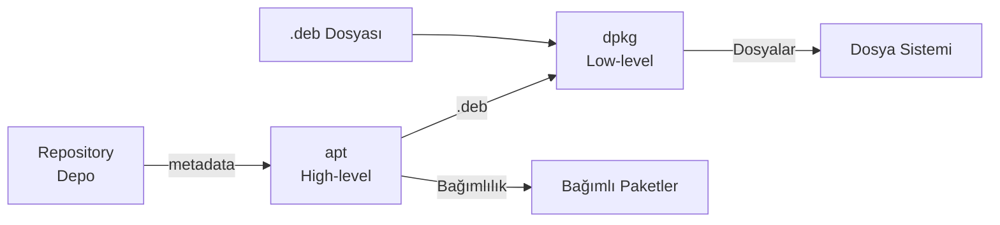

# Paket Yönetimi

!!! note ""
    Linux paket yönetimi; yazılım kurma, güncelleme ve kaldırma işlemlerini sistematik biçimde yöneten araçlar bütünüdür. Debian/Ubuntu için `dpkg` + `apt` zinciri, Python için `pip`, evrensel paketler için `snap` ve `flatpak` temel araçlardır.



| Özellik             | apt (deb) |   snap   |  flatpak   |   pip    |
| ------------------- | :-------: | :------: | :--------: | :------: |
| Hedef               |   Sistem  | Uygulama |  Uygulama  |  Python  |
| İzolasyon           |    Yok    |    ✓     |     ✓      | venv ile |
| Otomatik güncelleme |     ✗     |    ✓     |     ✗      |    ✗     |
| Boyut               |   Küçük   |  Büyük   |   Büyük    |  Küçük   |
| Hız                 |   Hızlı   |  Yavaş   |   Yavaş    |  Hızlı   |
| Sandboxing          |     ✗     | AppArmor | Bubblewrap |    ✗     |

## Paket Yöneticisi

- **Snap**, uygulamayı bağımlılıklarıyla birlikte yalıtılmış container içinde çalıştırır.

- **`dpkg` Düşük Seviye Paket Yöneticisi:** `dpkg`, Debian paket sisteminin en alt katmanıdır. `.deb` dosyalarını doğrudan sisteme kurar; ancak bağımlılık çözümlemez.

- **`apt` Yüksek Seviye Paket Yöneticisi:** `apt`, `dpkg`'yi kullanarak çalışır; repository'den indirme, bağımlılık çözümleme ve hata kurtarma ekler.


| Özellik         |          `apt`          |     `apt-get`      |
| --------------- | :---------------------: | :----------------: |
| Hedef kitle     |      Son kullanıcı      | Script / otomasyon |
| Progress bar    |            ✓            |         ✗          |
| Stabil API      | Script için uygun değil |         ✓          |
| Renkli çıktı    |            ✓            |         ✗          |
| Önerilen tercih |   İnteraktif terminal   |    Shell script    |


```bash title="Evrensel Paket Yöneticisi"
snap find <uygulama>             # Ara
snap install <uygulama>          # Kur
snap install <uygulama> --classic  # Klasik (izolasyonsuz)
snap refresh <uygulama>          # Güncelle
snap refresh                     # Tümünü güncelle
snap remove <uygulama>           # Kaldır
snap list                        # Kurulular
snap info <uygulama>             # Bilgi
```

```bash title="Düşük Seviye Paket Yöneticisi"
dpkg -i <paket>.deb      # Paket kur
dpkg -r <paket>          # Paketi kaldır (yapılandırma dosyaları kalır)
dpkg -P <paket>          # Paketi ve yapılandırmasını tamamen kaldır

dpkg -l                  # Kurulu paket listesi ve durumları
dpkg -L <paket>          # Paketin kurduğu dosyalar
dpkg -S <dosya_yolu>     # Bir dosyanın hangi pakete ait olduğu
dpkg -s <paket>          # Paket durumu (status)

dpkg --configure -a      # Tamamlanamamış kurulumları tamamla
```

```bash title="Yüksek Seviye Paket Yöneticisi"
# Güncelleme
apt update                      # Repository metadata'sını indir (paket kurmaz)
apt upgrade                     # Kurulu paketleri güncelle
apt full-upgrade                # Bağımlılık değişimleriyle tam güncelleme
apt dist-upgrade                # full-upgrade'in eski adı

# Kurma / Kaldırma
apt install <paket>             # Paket ve bağımlılıklarını kur
apt install <paket>=<versiyon>  # Belirli sürümü kur
apt reinstall <paket>           # Yeniden yükle
apt remove <paket>              # Paketi kaldır (yapılandırma kalır)
apt purge <paket>               # Paketi + yapılandırmayı tamamen kaldır
apt autoremove                  # Artık gerekmeyen paketleri kaldır
apt clean                       # İndirilen .deb cache'ini temizle
apt autoclean                   # Sadece eskimiş cache'i temizle

# Arama ve Bilgi
apt search <kelime>             # Paket ara
apt show <paket>                # Paket bilgisi
apt policy <paket>              # Kurulu ve mevcut sürüm + öncelik
apt list --installed            # Kurulu paketler
apt list --upgradable           # Güncellenebilir paketler

# Bağımlılık onarımı
apt install -f                  # Bozuk bağımlılıkları düzelt

# Belirli paketi tutma (pin)
sudo apt-mark hold linux-image-generic
sudo apt-mark showhold

# Kernel güncelleme sonrası eski kernel temizleme
sudo apt autoremove --purge
```

```bash title="Metadata Sorgulama"
apt-cache show <paket>          # Detaylı paket bilgisi
apt-cache showpkg <paket>       # Bağımlılık grafiği
apt-cache policy <paket>        # Sürüm ve pin bilgisi
apt-cache search <kelime>       # Açıklamada arama
apt-cache depends <paket>       # Doğrudan bağımlılıklar
apt-cache rdepends <paket>      # Ters bağımlılıklar (kim kullanıyor)
```

!!! warning "half-installed / unconfigured"
    Bağımlılık eksikse kurulum `half-installed` veya `unconfigured` durumda kalır. `package is not fully configured` hatası alınır. Çözüm:
    ```bash
    dpkg --configure -a
    apt install -f        # Eksik bağımlılıkları kur
    ```

!!! tip "Script'lerde apt-get Kullan"
    `apt` UI öğeleri ekleyebilir veya uyarı gösterebilir. Otomasyon script'lerinde `apt-get` daha tutarlıdır.


## Repository Yönetimi

```bash
# Depo listesi
cat /etc/apt/sources.list
ls /etc/apt/sources.list.d/

# Depo ekle (Ubuntu PPA)
sudo add-apt-repository ppa:user/repo
sudo apt update

# Depo ekle (3. taraf)
curl -fsSL https://example.com/gpg.key | sudo gpg --dearmor -o /etc/apt/keyrings/example.gpg
echo "deb [signed-by=/etc/apt/keyrings/example.gpg] https://example.com/repo stable main" | \
    sudo tee /etc/apt/sources.list.d/example.list
sudo apt update

# Pin - belirli paketi belirli sürümde kilitle
# /etc/apt/preferences.d/mypin
# Package: nginx
# Pin: version 1.24.*
# Pin-Priority: 1001
```


## Python Paket Yöneticisi (`pip`)

```bash
# Kurma
pip install numpy
pip install numpy==1.25.0       # Belirli sürüm
pip install "numpy>=1.20,<2.0"  # Sürüm aralığı
pip install -r requirements.txt   # Dosyadan toplu kur (Ortamı içe aktar)
pip install -e .                  # Geliştirme (editable) modu

# Güncelleme
pip install --upgrade numpy
pip list --outdated               # Güncellenebilir paketler
pip install --upgrade pip         # pip'i güncelle

# Bilgi ve listeleme
pip show numpy                    # Paket bilgisi
pip list                          # Kurulu paketler
pip freeze                        # requirements.txt formatında
pip freeze > requirements.txt     # Ortamı dışa aktar

# Kaldırma
pip uninstall numpy
pip uninstall -r requirements.txt -y

# Arama (PyPI)
pip search numpy                  # Eski pypi API kaldırıldı; pip index kullan
```

!!! warning "pip ile Sistem Python'u Değiştirme"
    Ubuntu/Debian'da `sudo pip install ...` sistem Python paketlerini bozabilir. `python3 -m pip install --user ...` (kullanıcı bazlı) veya sanal ortam kullanın.


!!! note "pyproject.toml (Modern Yol)"
    `requirements.txt` yerine modern projeler `pyproject.toml` (PEP 517/518) kullanır. `pip install .` veya `pip install -e .` (editable) ile proje yüklenir.

```bash title="Sanal Oram"
# Oluştur
python3 -m venv myenv

source myenv/bin/activate      
deactivate

# İçinde pip normal çalışır
pip install flask
pip freeze > requirements.txt
```
