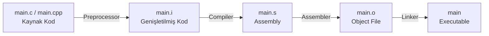

# Compiler

## GCC / G++



| Aşama             | Girdi       | Çıktı | Ne Yapar?                                                                                                           |
| ----------------- | ----------- | ----- | ------------------------------------------------------------------------------------------------------------------- |
| **Preprocessing** | `.c .cpp`   | `.i`  | `#include` dosyalarını yerleştirir, macro'ları açar, yorum satırlarını siler                                        |
| **Compilation**   | `.i`        | `.s`  | Temizlenmiş C/C++ kodunu hedef mimarinin assembly diline çevirir; asıl derleme burada olur                          |
| **Assembly**      | `.s`        | `.o`  | Assembly kodunu binary makine diline dönüştürerek object file üretir                                                |
| **Linking**       | `.o` + `.h` | exe   | Tüm object file'ları ve kütüphaneleri birleştirerek çalıştırılabilir program üretir; sembol referanslarını çözümler |

- Her aşamanın bağımsız olması önemli avantajlar sağlar. Bir dosya değiştiğinde yalnızca o dosya yeniden derlenir; diğer dosyanlar `.o` dosyaları kullanılır. Bu **incremental build'in** temelidir.
- **Incremental Build:** Bir yazılım projesini derlerken zaman kazanmak için sadece değişen veya yeni eklenen kaynak dosyalarını ve bunların etkilendiği kısımları derleme işlemidir.

| Parametre           | Açıklama                                                                                 |
| ------------------- | ---------------------------------------------------------------------------------------- |
| `-Wall`             | Temel warning mesajlarını aktif eder.                                                    |
| `-Wextra`           | `-Wall`'ın kapsamadığı ek uyarıları gösterir                                             |
| `-Wconversion`      | Veri kaybına yol açabilecek type dönüşümlerini uyarır (`int` → `char` gibi)              |
| `-Wsign-conversion` | Signed/unsigned dönüşümlerindeki riskleri bildirir                                       |
| `-Werror`           | Tüm uyarıları hata olarak ele alır; uyarı varsa derleme durur                            |
| `-Wpedantic`        | Standart dışı uzantılar kullanıldığında uyarır                                           |
| `-O0` … `-O3`       | Optimizasyon seviyesini artırır: `-O0` optimizasyon yapmaz, `-O1`/`-O2` derleme süresi karşılığında hız kazandırır, `-O3` agresif seviyedir ama beklenmeyen davranışlara yol açabilir |
| `-Os`               | Boyut optimizasyonu; gömülü sistemlerde flash alanı kısıtlıysa kullanılır                |
| `-Og`               | Debug ile uyumlu optimizasyon; `-O0`'dan hızlı ama debugger'ı bozmaz                     |
| `-std=c++17`        | Kaynak kodun belirtilen C++ standardına göre derleneceğini belirtir                      |
| `-g`                | Debug bilgisi ekler; GDB, Valgrind gibi araçlarla kullanım için şarttır                  |
| `-I<dizin>`         | Header dosyalarının aranacağı ek dizini (include path) ekler                             |

!!! danger "Önemli"
    Debug sırasında `-O2` ile derleme yaparsan breakpoint'ler beklenmedik sırada durabilir, bazı değişkenler kaybolur. Bunun nedeni derleyicinin kodu yeniden düzenlemesidir. Debug için her zaman `-O0` veya `-Og` kullan.

!!! example "Örnek"
    ```bash 
    gcc -E main.c -o main.i         # 1. Preprocessing  → .i  (macro açılmış hali gör)
    gcc -S main.i -o main.s         # 2. Compilation    → .s  (üretilen assembly'yi incele)
    gcc -c main.s -o main.o         # 3. Assembly       → .o  (object file)
    gcc main.o -o main              # 4. Linking        → executable
    gcc -save-temps main.c -o main  # Tek komut, tüm ara dosyaları sakla

    gcc main.c   -Wall -Wextra -Wconversion -Wsign-conversion
    g++ main.cpp -std=c++17 -I./include -I/usr/local/include -g -O0
    g++ main.cpp -g -O0     # Debug derlemesi
    g++ main.cpp -Os        # Gömülü sistem için boyut optimizasyonu
    ```

!!! note "VS Code Derleyici Ayarları `tasks.json`"
    ```json
    {
        "version": "2.0.0",
        "tasks": [
            {
                "label": "C++ Build",
                "type": "shell",
                "command": "g++",
                "args": [
                    "-std=c++20", "-Wall", "-Wextra",
                    "-Wconversion", "-Wsign-conversion",
                    "-Werror", "-o", "main", "main.cpp"
                ],
                "group": { "kind": "build", "isDefault": true }
            }
        ]
    }
    ```


## Kconfig ve Menuconfig

- **Kconfig:** Projedeki modülleri, özellikleri ve bağımlılık kurallarını tanımlayan dildir.
- **Menuconfig:** Kconfig dosyalarını okuyarak terminalde grafiksel seçim menüsü sunan araçtır (make menuconfig).
- `.config` Kullanıcı seçimlerinin saklandığı ve derleme (build) sürecini yönlendiren konfigürasyon dosyasıdır.


|      syntax            | Açıklama                                                        |
| -----------------------| --------------------------------------------------------------- |
| `bool`, `tristate`     | Açık (`y`) / Kapalı (`n`), `n` / `y` / `m` (kernel için - modul)|
| `string`, `int`, `hex` | Metin, Ondalık sayı, Onaltılık sayı                             |
| `mainmenu`             | Konfigürasyon ekranının ana başlığını tanımlar                                          |
| `comment`              | Arayüzde görünecek açıklama satırı ekler                                                |
| `menu / endmenu`       | Seçenekleri hiyerarşik alt menü altında gruplar                                         |
| `choice / endchoice`   | Listeden yalnızca tek seçime izin veren grup oluşturur                                  |
| `config`               | Yeni bir yapılandırma parametresi tanımlar                                              |
| `default`              | Parametrenin varsayılan değerini belirler                                               |
| `depends on`           | Seçeneğin görünürlüğünü başka bir parametreye bağlar; bağımlılık karşılanmazsa gizlenir |
| `select`               | Bu seçenek aktif edildiğinde bağımlılıklarını otomatik etkinleştirir                    |
| `range`                | `int` veya `hex` girdilerin `min/max` sınırlarını belirler                              |
| `help`                 | Yardım butonuna basıldığında gösterilecek açıklama metnini içerir                       |


## Make

- Kaynak dosyalar arasındaki bağımlılıkları tanımlayarak dosya yönetimini sağlayan bir derleme aracıdır. Bir dosya değiştiğinde yalnızca ona bağımlı olan dosyaları yeniden derler (**incremental build**).
- Makefile komut satırları **kesinlikle TAB** ile girintilenmeli. Boşluk kullanılması `Makefile:N: *** missing separator` hatasına yol açar.
- Target adında klasörde bir dosya veya dizin varsa Make düzgün çalışmaz. Bunu önlemek için `.PHONY` kullanılır.
- `wildcard` fonksiyonu mutlaka `:=` ile kullanılmalıdır; aksi hâlde genişletilmez.
- Genel kural olarak `:=` tercih edilmeli. `=` kullanımı döngüsel referans riskini artırır ve büyük projelerde beklenmeyen davranışa yol açabilir.

|  syntax  |           Açıklama                                                                                |
| -------- | --------------------------------------------------------------------------------------------------|
| `#`      | Yorum satırı                                                                                      |
| `@`      | Komutun kendisini terminalde gizler; yalnızca çıktısını gösterir                                  |
| `$`      | Değişkenlere veya otomatik değişkenlere referans verir                                            |
| `\`      | Uzun satırı bir sonraki satırda devam ettirir                                                     |
| `*`      | Dosya adı genişletmesinde tüm dosyalarla eşleşir (wildcard)                                       |
| `%`      | Pattern kurallarında değişken kısmı temsil eder - `%.o: %.c` tüm `.c` dosyaları için geçerli olur |
| `:`      | Target ile dependency arasındaki ilişkiyi kurar                                                   |
| `::`     | Aynı target için birbirinden bağımsız birden fazla kural tanımlar                                 |
| `$@`     | Mevcut kuralın **target** adı                                                                     |
| `$^`     | Target'a ait **tüm dependency**'lerin listesi                                                     |
| `$<`     | Target'ı tetikleyen **ilk dependency**                                                            |
| `$?`     | Target'tan **daha yeni** olan dependency'lerin listesi                                            |
| `=`      | Recursive (gecikmeli) - Değişken kullanıldığı andaki güncel içeriğe göre değerlenir               |
| `:=`     | Simple (anında) - Atama anında değerlendirilir ve sabitlenir; öngörülebilir davranış              |
| `?=`     | Koşullu - Değişken tanımlı değilse atar; tanımlıysa mevcut değeri korur                           |
| `+=`     | Ekleme - Mevcut değerin sonuna yeni değer ekler                                                   |

!!! example "Örnek"
    ```bash 
    `make -s`    # Silent mode; komutların kendisini terminale basmaz                               
    `make -k`    # Hata olsa bile bağımsız diğer target'lar derlemeye devam eder                    
    `make -i`    # Hataları yok sayarak sona kadar devam eder                                       
    `make -j<n>` # `n` paralel iş parçacığıyla derler - `make -j$(nproc)` tüm çekirdekleri kullanır 
    ```


## CMake

- Bir **meta-build sistemidir** doğrudan derleme yapmaz. Platformdan bağımsız `CMakeLists.txt` dosyalarını okur ve hedef platforma uygun Makefile, Ninja veya Visual Studio proje dosyalarını üretir.
    -  `CMakeLists.txt` Projenin her dizininde yer alan ana yapı taşı; CMake'in okuduğu tanım dosyası 
    -  `<script>.cmake` `cmake -P` ile doğrudan çalıştırılan script dosyaları                         
    -  `<module>.cmake` `include()` veya `find_package()` ile dahil edilen yardımcı modüller          


| Komut                                               | Açıklama                                                                     |
| --------------------------------------------------- | -----------------------------------------------------------------------------|
| `cmake_minimum_required(VERSION x.y)`               | Minimum CMake sürümünü zorunlu kılar; her dosyanın ilk satırı olmalı         |
| `project(ad VERSION x.y LANGUAGES CXX)`             | Proje adını, versiyonunu ve dillerini tanımlar                               |
| `add_executable(hedef kaynak...)`                   | Kaynak kodlardan çalıştırılabilir program üretir                             |
| `add_library(hedef TÜR kaynak...)`                  | Static, shared veya interface kütüphane üretir                               |
| `add_subdirectory(dizin)`                           | Alt dizindeki `CMakeLists.txt` dosyasını çalıştırır                          |
| `target_include_directories(hedef KAPSAM dizin...)` | Header arama dizinlerini hedefe tanımlar                                     |
| `target_link_libraries(hedef KAPSAM kütüphane...)`  | Hedefe kütüphane bağlar                                                      |
| `set(VAR değer)`                                    | Değişken tanımlar; `${VAR}` ile erişilir                                     |
| `unset(VAR)`                                        | Değişkeni bellekten siler                                                    |
| `$ENV{VAR}`                                         | İşletim sistemi ortam değişkenine erişir                                     |
| `set(VAR değer CACHE TÜR "açıklama" [FORCE])`       | Cache'e yazılan kalıcı değişken; `cmake -DVAR=değer` ile dışarıdan geçirilir |
| `if / elseif / else / endif`                        | Koşullu bloklar                                                              |
| `foreach / endforeach`                              | Döngü                                                                        |
| `while / endwhile`                                  | Koşul döngüsü                                                                |
| `function / endfunction`                            | Local scope'lu fonksiyon                                                     |
| `macro / endmacro`                                  | Inline yapıştırılan makro (parent scope kullanır)                            |
| `message(DURUM "metin")`                            | Terminale çıktı basar (`STATUS`, `WARNING`, `FATAL_ERROR`)                   |
| `include(dosya)`                                    | `.cmake` dosyasını dahil eder                                                |
| `find_package(pkg REQUIRED)`                        | Sistemde kurulu paketi arar; `REQUIRED` varsa bulamazsa hata verir           |
| `option(VAR "açıklama" ON/OFF)`                     | Kullanıcıya açma/kapama anahtarı sunar; `cmake -DVAR=ON` ile geçirilir       |
| `install(TARGETS/FILES ...)`                        | `make install` için kurulum kurallarını tanımlar                             |
| `file(GLOB VAR şablon)`                             | Şablona uyan dosyaları listeler                                              |
| `add_compile_options(flags...)`                     | Geçerli dizindeki tüm hedeflere derleyici parametresi ekler                  |
| `add_custom_command(...)`                           | Derleme sürecine özel komut adımı ekler                                      |
| `add_custom_target(...)`                            | Dosya üretmeyen bağımsız build hedefi oluşturur (ör: `format`, `docs`)       |
| `execute_process(COMMAND ...)`                      | Yapılandırma anında terminal komutu çalıştırır                               |
| `cmake_policy(...)`                                 | Sürümler arası davranış uyumluluğunu yönetir                                 |


!!! note "Not"
    
    1. **Kapsam Mantığı:** Modern CMake'in en kritik kavramı budur. Bir kütüphane tanımlarken bağımlılıkların kimleri etkileyeceğini belirler.

        | Belirteç    | Hedef kullanır | Tüketiciler kullanır | Ne zaman?                               |
        | ----------- | :------------: | :------------------: | --------------------------------------- |
        | `PUBLIC`    |       ✓        |          ✓           | Header'ları dışarıya açık bir kütüphane |
        | `PRIVATE`   |       ✓        |          ✗           | Sadece bu hedefin iç uygulaması         |
        | `INTERFACE` |       ✗        |          ✓           | Header-only kütüphaneler                |


    2. **if Koşul Operatörleri:** **1, TRUE, Y, YES, ON** doğru; **0, FALSE, N, NO, OFF, IGNORE, NOTFOUND** ve boş string yanlış kabul edilir.

        | Operatör                 | Açıklama                                                  |
        | ------------------------ | --------------------------------------------------------- |
        | `DEFINED`                | Değişkenin tanımlı olup olmadığını kontrol eder           |
        | `COMMAND`                | CMake komutunun mevcut olup olmadığını kontrol eder       |
        | `EXISTS`                 | Dosya veya dizin yolunun var olup olmadığını kontrol eder |
        | `STREQUAL`               | İki string değerin eşitliğini kontrol eder                |
        | `STRGREATER` / `STRLESS` | String karşılaştırması                                    |
        | `NOT`, `AND`, `OR`       | Mantıksal operatörler                                     |

    3. **`execute_process` Parametreleri**

        | Parametre           | Açıklama                                   |
        | ------------------- | ------------------------------------------ |
        | `COMMAND`           | Çalıştırılacak komutu tanımlar             |
        | `WORKING_DIRECTORY` | Komutun çalışacağı dizini belirtir         |
        | `RESULT_VARIABLE`   | Başarıda `0`, hata durumunda `1` döner     |
        | `OUTPUT_VARIABLE`   | Komut çıktısını değişkene atar             |
        | `ERROR_VARIABLE`    | Hata mesajını sakladığı değişkeni belirtir |

    4. **Tırnak ve Liste Davranışı**

        ```cmake
        set(LIST_VAR a b c)      # Liste: ["a", "b", "c"]
        set(STR_VAR "a b c")     # Tek string: "a b c"
        set(LIST_VAR2 "a;b;c")   # Liste: ["a", "b", "c"]  (noktalı virgül ayraç)
        ```

    5. **`function` vs `macro`:** `function` yeni bir scope açar; içerideki değişkenler dışarıyı etkilemez. Dışarıyı etkilemesi için `PARENT_SCOPE` kullanılır.
    `macro` çağrıldığı yere kopyalanır ve o noktanın scope'unu doğrudan kullanır. Bu beklenmedik yan etkilere yol açabilir. Genel kural olarak `function` tercih edilmeli.


!!! example "foreach Kullanımı"
    ```cmake
    foreach(x RANGE 10)       # 0'dan 10'a kadar (10 dahil)
    foreach(x RANGE 10 20)    # 10'dan 20'ye kadar
    foreach(x RANGE 10 20 5)  # 10'dan 20'ye 5'erli artışla

    foreach(item IN LISTS MY_LIST)
        message(STATUS "Eleman: ${item}")
    endforeach()
    ```


| Değişken                   | Açıklama                                         |
| -------------------------- | ------------------------------------------------ |
| `PROJECT_NAME`             | `project()` komutundaki güncel proje adı         |
| `CMAKE_PROJECT_NAME`       | Kök dizindeki ana proje adı                      |
| `CMAKE_VERSION`            | Çalışan CMake sürümü                             |
| `CMAKE_GENERATOR`          | Kullanılan build sistemi (Ninja, Unix Makefiles) |
| `CMAKE_SOURCE_DIR`         | Ana proje dizininin tam yolu                     |
| `CMAKE_CURRENT_SOURCE_DIR` | İşlenen `CMakeLists.txt`'in bulunduğu dizin      |
| `PROJECT_SOURCE_DIR`       | En son çağrılan `project()` komutuna ait dizin   |
| `CMAKE_BINARY_DIR`         | Ana build dizini                                 |
| `CMAKE_SYSTEM_NAME`        | Hedef işletim sistemi (Linux, Windows, Darwin)   |
| `CMAKE_INSTALL_PREFIX`     | `install()` komutunun hedef kök dizini           |
| `CMAKE_MODULE_PATH`        | Ek modüllerin aranacağı klasör yolları           |


```bash
cmake --help                         # Genel yardım
cmake --help-variable-list           # Kullanılabilir değişkenleri listeler
cmake --help-variable CMAKE_VERSION  # Belirli değişken hakkında detay

cmake -S . -B build                  # Kaynak ve build dizinini tanımla
cmake --build build                  # Derle
cmake --build build --target clean   # Belirli target'ı çalıştır
cmake -P script.cmake                # Script modunda çalıştır (derleme yapmaz)

cmake -G "Ninja" -DCMAKE_BUILD_TYPE=Release -S . -B build
```


=== "Derleme Yöntem 1"
    ```bash
    mkdir build && cd build
    cmake ..
    make
    ```

=== "Derleme Yöntem 2"
    ```bash
    cmake -S . -B build
    cd build && make
    ```

=== "Derleme Yöntem 3 (Önerilen)"
    ```bash
    cmake -B build
    cmake --build build   # Platform bağımsız; Ninja veya Make kullanılabilir
    ```


!!! danger "Dikkat Edilmesi Gerekenler"
    1. **`file(GLOB)`** Yeni dosya eklendiğinde CMake'i otomatik tetiklemez; elle eklenen dosya derlemeye dahil olmayabilir.
    2. **`CACHE` değişkenleri `build/CMakeCache.txt` dosyasında saklanır.** Komut satırından `-D` ile verilen değerlerin önbelleği ezmesi için `FORCE` kullanılır ya da `CMakeCache.txt` silinir.
    3. **`CMakeLists.txt` dosyası `-P` (Script modu) ile çalıştırılamaz.** `-P` yalnızca `add_executable` gibi derleme hedefleri içermeyen saf `.cmake` script dosyaları içindir.
