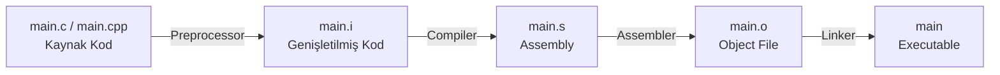
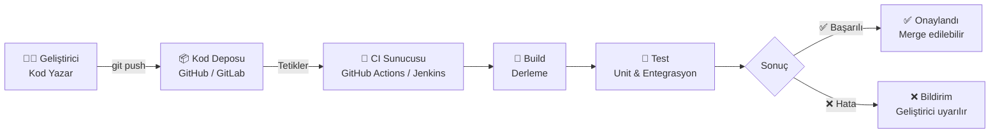
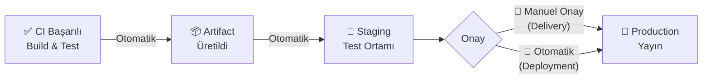
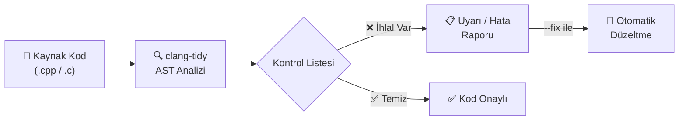

# Compiler

## GCC / G++




| Aşama             | Girdi       | Çıktı | Ne Yapar?                                                                                                           |
| ----------------- | ----------- | ----- | ------------------------------------------------------------------------------------------------------------------- |
| **Preprocessing** | `.c .cpp`   | `.i`  | `#include` dosyalarını yerleştirir, macro'ları açar, yorum satırlarını siler                                        |
| **Compilation**   | `.i`        | `.s`  | Temizlenmiş C/C++ kodunu hedef mimarinin assembly diline çevirir; asıl derleme burada olur                          |
| **Assembly**      | `.s`        | `.o`  | Assembly kodunu binary makine diline dönüştürerek object file üretir                                                |
| **Linking**       | `.o` + `.h` | exe   | Tüm object file'ları ve kütüphaneleri birleştirerek çalıştırılabilir program üretir; sembol referanslarını çözümler |


!!! tip "Neden Birden Fazla Aşama Var?"
    Her aşamanın bağımsız olması önemli avantajlar sağlar. 100 dosyadan oluşan projede sadece bir dosya değiştiğinde yalnızca o dosya yeniden derlenir; diğer 99 dosyanın `.o` dosyaları kullanılır. Bu **incremental build'in** temelidir.

    **Incremental build**, bir yazılım projesini derlerken zaman kazanmak için sadece değişen veya yeni eklenen kaynak dosyalarını ve bunların etkilendiği kısımları derleme işlemidir.


| Parametre           | Açıklama                                                                                 |
| ------------------- | ---------------------------------------------------------------------------------------- |
| `-Wall`             | Temel warning mesajlarını aktif eder.                                                    |
| `-Wextra`           | `-Wall`'ın kapsamadığı ek uyarıları gösterir                                             |
| `-Wconversion`      | Veri kaybına yol açabilecek type dönüşümlerini uyarır (`int` → `char` gibi)              |
| `-Wsign-conversion` | Signed/unsigned dönüşümlerindeki riskleri bildirir                                       |
| `-Werror`           | Tüm uyarıları hata olarak ele alır; uyarı varsa derleme durur                            |
| `-Wpedantic`        | Standart dışı uzantılar kullanıldığında uyarır                                           |
| `-O0` … `-O3`       | Optimizasyon seviyesini artırır: `-O0` optimizasyon yapmaz, `-O1`/`-O2` derleme süresi karşılığında hız kazandırır, `-O3` agresif seviyedir ama beklenmeyen davranışlara yol açabilir |
| `-Os`               | Boyut optimizasyonu; gömülü sistemlerde flash alanı kısıtlıysa kullanılır                |
| `-Og`               | Debug ile uyumlu optimizasyon; `-O0`'dan hızlı ama debugger'ı bozmaz                     |
| `-std=c++17`        | Kaynak kodun belirtilen C++ standardına göre derleneceğini belirtir                      |
| `-g`                | Debug bilgisi ekler; GDB, Valgrind gibi araçlarla kullanım için şarttır                  |
| `-I<dizin>`         | Header dosyalarının aranacağı ek dizini (include path) ekler                             |


!!! note "Not"
    Debug sırasında `-O2` ile derleme yaparsan breakpoint'ler beklenmedik sırada durabilir, bazı değişkenler kaybolur. Bunun nedeni derleyicinin kodu yeniden düzenlemesidir. Debug için her zaman `-O0` veya `-Og` kullan.


```bash
gcc -E main.c -o main.i         # 1. Preprocessing  → .i  (macro açılmış hali gör)
gcc -S main.i -o main.s         # 2. Compilation    → .s  (üretilen assembly'yi incele)
gcc -c main.s -o main.o         # 3. Assembly       → .o  (object file)
gcc main.o -o main              # 4. Linking        → executable
gcc -save-temps main.c -o main  # Tek komut, tüm ara dosyaları sakla

gcc  -o output main.c   -Wall -Wextra -Wconversion -Wsign-conversion
g++  -o output main.cpp -std=c++17 -Wall -Wextra -Werror -O2
g++  -o output main.cpp -std=c++17 -I./include -I/usr/local/include
g++  -o output main.cpp -g -O0     # Debug derlemesi
g++  -o output main.cpp -Os        # Gömülü sistem için boyut optimizasyonu
```


!!! note "VS Code Derleyici Ayarları `tasks.json`"
    ```json
    {
        "version": "2.0.0",
        "tasks": [
            {
                "label": "C++ Build",
                "type": "shell",
                "command": "g++",
                "args": [
                    "-std=c++20", "-Wall", "-Wextra",
                    "-Wconversion", "-Wsign-conversion",
                    "-Werror", "-o", "main", "main.cpp"
                ],
                "group": { "kind": "build", "isDefault": true }
            }
        ]
    }
    ```


## Kconfig ve Menuconfig

Büyük projelerde yüzlerce özellik opsiyonel olabilir, birbirine bağımlı olabilir veya çakışabilir. Bunları elle `#define` ile yönetmek hataya açıktır ve bakımı zorlaştırır. Kconfig + Menuconfig ikilisi bu yönetimi kolaylaştırır: **Kconfig** özellikleri ve aralarındaki bağımlılıkları tanımlayan dildir, **Menuconfig** ise bu tanımları okuyup `make menuconfig` ile terminalde bir seçim arayüzü sunan araçtır. Yapılan seçimler `.config` dosyasına yazılır ve derleme buna göre şekillenir.


|      syntax          | Açıklama                                                        |
| ---------------------| --------------------------------------------------------------- |
| `bool`               | Açık (`y`) / Kapalı (`n`)                                       |
| `tristate`           | Kapalı (`n`) / Açık (`y`) / Modül (`m`) - kernel modülleri için |
| `string`             | Metin değeri                                                    |
| `int`                | Ondalık sayı                                                    |
| `hex`                | Onaltılık sayı                                                  |
| `mainmenu`           | Konfigürasyon ekranının ana başlığını tanımlar                                          |
| `comment`            | Arayüzde görünecek bilgi/açıklama satırı ekler                                          |
| `menu / endmenu`     | Seçenekleri hiyerarşik alt menü altında gruplar                                         |
| `choice / endchoice` | Listeden yalnızca tek seçime izin veren grup oluşturur                                  |
| `config`             | Yeni bir yapılandırma parametresi tanımlar                                              |
| `default`            | Parametrenin varsayılan değerini belirler                                               |
| `depends on`         | Seçeneğin görünürlüğünü başka bir parametreye bağlar; bağımlılık karşılanmazsa gizlenir |
| `select`             | Bu seçenek aktif edildiğinde bağımlılıklarını otomatik etkinleştirir                    |
| `range`              | `int` veya `hex` girdilerin min/max sınırlarını belirler                                |
| `help`               | Yardım butonuna basıldığında gösterilecek açıklama metnini içerir                       |


## Make

Kaynak dosyalar arasındaki bağımlılıkları tanımlayarak dosya yönetimini sağlayan bir derleme aracıdır. Bir dosya değiştiğinde yalnızca ona bağımlı olan dosyaları yeniden derler (**incremental build**).


!!! danger "Kritik Kurallar"
    1. Makefile komut satırları **kesinlikle TAB** ile girintilenmeli. Boşluk kullanılması `Makefile:N: *** missing separator` hatasına yol açar.
    2. Target adında gerçek bir dosya veya dizin varsa Make "zaten güncel" sayar ve komutu çalıştırmaz. Bunu önlemek için `.PHONY` kullanılır.
    3. `wildcard` fonksiyonu mutlaka `:=` ile kullanılmalıdır; aksi hâlde genişletilmez.
    4. Genel kural olarak `:=` tercih edilmeli. `=` kullanımı döngüsel referans riskini artırır ve büyük projelerde beklenmeyen davranışa yol açabilir.


|  syntax  |           Açıklama                                                                                |
| -------- | --------------------------------------------------------------------------------------------------|
| `#`      | Yorum satırı                                                                                      |
| `@`      | Komutun kendisini terminalde gizler; yalnızca çıktısını gösterir                                  |
| `$`      | Değişkenlere veya otomatik değişkenlere referans verir                                            |
| `\`      | Uzun satırı bir sonraki satırda devam ettirir                                                     |
| `*`      | Dosya adı genişletmesinde tüm dosyalarla eşleşir (wildcard)                                       |
| `%`      | Pattern kurallarında değişken kısmı temsil eder - `%.o: %.c` tüm `.c` dosyaları için geçerli olur |
| `:`      | Target ile dependency arasındaki ilişkiyi kurar                                                   |
| `::`     | Aynı target için birbirinden bağımsız birden fazla kural tanımlar                                 |
| `$@`     | Mevcut kuralın **target** adı                                                                     |
| `$^`     | Target'a ait **tüm dependency**'lerin listesi                                                     |
| `$<`     | Target'ı tetikleyen **ilk dependency**                                                            |
| `$?`     | Target'tan **daha yeni** olan dependency'lerin listesi                                            |
| `=`      | Recursive (gecikmeli) - Değişken kullanıldığı andaki güncel içeriğe göre değerlenir               |
| `:=`     | Simple (anında) - Atama anında değerlendirilir ve sabitlenir; öngörülebilir davranış              |
| `?=`     | Koşullu - Değişken tanımlı değilse atar; tanımlıysa mevcut değeri korur                           |
| `+=`     | Ekleme - Mevcut değerin sonuna yeni değer ekler                                                   |

| Bayrak       | Açıklama                                                                         |
| ------------ | -------------------------------------------------------------------------------- |
| `make -s`    | Silent mode; komutların kendisini terminale basmaz                               |
| `make -k`    | Hata olsa bile bağımsız diğer target'lar derlemeye devam eder                    |
| `make -i`    | Hataları yok sayarak sona kadar devam eder                                       |
| `make -j<n>` | `n` paralel iş parçacığıyla derler - `make -j$(nproc)` tüm çekirdekleri kullanır |


## CMake

Bir **meta-build sistemidir** doğrudan derleme yapmaz. Platformdan bağımsız `CMakeLists.txt` dosyalarını okur ve hedef platforma uygun Makefile, Ninja veya Visual Studio proje dosyalarını üretir.


| Dosya            | Açıklama                                                                      |
| ---------------- | ----------------------------------------------------------------------------- |
| `CMakeLists.txt` | Projenin her dizininde yer alan ana yapı taşı; CMake'in okuduğu tanım dosyası |
| `<script>.cmake` | `cmake -P` ile doğrudan çalıştırılan script dosyaları                         |
| `<module>.cmake` | `include()` veya `find_package()` ile dahil edilen yardımcı modüller          |


| Komut                                               | Açıklama                                                                     |
| --------------------------------------------------- | -----------------------------------------------------------------------------|
| `cmake_minimum_required(VERSION x.y)`               | Minimum CMake sürümünü zorunlu kılar; her dosyanın ilk satırı olmalı         |
| `project(ad VERSION x.y LANGUAGES CXX)`             | Proje adını, versiyonunu ve dillerini tanımlar                               |
| `add_executable(hedef kaynak...)`                   | Kaynak kodlardan çalıştırılabilir program üretir                             |
| `add_library(hedef TÜR kaynak...)`                  | Static, shared veya interface kütüphane üretir                               |
| `add_subdirectory(dizin)`                           | Alt dizindeki `CMakeLists.txt` dosyasını çalıştırır                          |
| `target_include_directories(hedef KAPSAM dizin...)` | Header arama dizinlerini hedefe tanımlar                                     |
| `target_link_libraries(hedef KAPSAM kütüphane...)`  | Hedefe kütüphane bağlar                                                      |
| `set(VAR değer)`                                    | Değişken tanımlar; `${VAR}` ile erişilir                                     |
| `unset(VAR)`                                        | Değişkeni bellekten siler                                                    |
| `$ENV{VAR}`                                         | İşletim sistemi ortam değişkenine erişir                                     |
| `set(VAR değer CACHE TÜR "açıklama" [FORCE])`       | Cache'e yazılan kalıcı değişken; `cmake -DVAR=değer` ile dışarıdan geçirilir |
| `if / elseif / else / endif`                        | Koşullu bloklar                                                              |
| `foreach / endforeach`                              | Döngü                                                                        |
| `while / endwhile`                                  | Koşul döngüsü                                                                |
| `function / endfunction`                            | Local scope'lu fonksiyon                                                     |
| `macro / endmacro`                                  | Inline yapıştırılan makro (parent scope kullanır)                            |
| `message(DURUM "metin")`                            | Terminale çıktı basar (`STATUS`, `WARNING`, `FATAL_ERROR`)                   |
| `include(dosya)`                                    | `.cmake` dosyasını dahil eder                                                |
| `find_package(pkg REQUIRED)`                        | Sistemde kurulu paketi arar; `REQUIRED` varsa bulamazsa hata verir           |
| `option(VAR "açıklama" ON/OFF)`                     | Kullanıcıya açma/kapama anahtarı sunar; `cmake -DVAR=ON` ile geçirilir       |
| `install(TARGETS/FILES ...)`                        | `make install` için kurulum kurallarını tanımlar                             |
| `file(GLOB VAR şablon)`                             | Şablona uyan dosyaları listeler                                              |
| `add_compile_options(flags...)`                     | Geçerli dizindeki tüm hedeflere derleyici parametresi ekler                  |
| `add_custom_command(...)`                           | Derleme sürecine özel komut adımı ekler                                      |
| `add_custom_target(...)`                            | Dosya üretmeyen bağımsız build hedefi oluşturur (ör: `format`, `docs`)       |
| `execute_process(COMMAND ...)`                      | Yapılandırma anında terminal komutu çalıştırır                               |
| `cmake_policy(...)`                                 | Sürümler arası davranış uyumluluğunu yönetir                                 |


!!! note "Not"
    
    1. **Kapsam Mantığı:** Modern CMake'in en kritik kavramı budur. Bir kütüphane tanımlarken bağımlılıkların kimleri etkileyeceğini belirler.

        | Belirteç    | Hedef kullanır | Tüketiciler kullanır | Ne zaman?                               |
        | ----------- | :------------: | :------------------: | --------------------------------------- |
        | `PUBLIC`    |       ✓        |          ✓           | Header'ları dışarıya açık bir kütüphane |
        | `PRIVATE`   |       ✓        |          ✗           | Sadece bu hedefin iç uygulaması         |
        | `INTERFACE` |       ✗        |          ✓           | Header-only kütüphaneler                |


    2. **if Koşul Operatörleri:** **1, TRUE, Y, YES, ON** doğru; **0, FALSE, N, NO, OFF, IGNORE, NOTFOUND** ve boş string yanlış kabul edilir.

        | Operatör                 | Açıklama                                                  |
        | ------------------------ | --------------------------------------------------------- |
        | `DEFINED`                | Değişkenin tanımlı olup olmadığını kontrol eder           |
        | `COMMAND`                | CMake komutunun mevcut olup olmadığını kontrol eder       |
        | `EXISTS`                 | Dosya veya dizin yolunun var olup olmadığını kontrol eder |
        | `STREQUAL`               | İki string değerin eşitliğini kontrol eder                |
        | `STRGREATER` / `STRLESS` | String karşılaştırması                                    |
        | `NOT`, `AND`, `OR`       | Mantıksal operatörler                                     |

    3. **`execute_process` Parametreleri**

        | Parametre           | Açıklama                                   |
        | ------------------- | ------------------------------------------ |
        | `COMMAND`           | Çalıştırılacak komutu tanımlar             |
        | `WORKING_DIRECTORY` | Komutun çalışacağı dizini belirtir         |
        | `RESULT_VARIABLE`   | Başarıda `0`, hata durumunda `1` döner     |
        | `OUTPUT_VARIABLE`   | Komut çıktısını değişkene atar             |
        | `ERROR_VARIABLE`    | Hata mesajını sakladığı değişkeni belirtir |

    4. **Tırnak ve Liste Davranışı**

        ```cmake
        set(LIST_VAR a b c)      # Liste: ["a", "b", "c"]
        set(STR_VAR "a b c")     # Tek string: "a b c"
        set(LIST_VAR2 "a;b;c")   # Liste: ["a", "b", "c"]  (noktalı virgül ayraç)
        ```

    5. **`function` vs `macro`:** `function` yeni bir scope açar; içerideki değişkenler dışarıyı etkilemez. Dışarıyı etkilemesi için `PARENT_SCOPE` kullanılır.
    `macro` çağrıldığı yere kopyalanır ve o noktanın scope'unu doğrudan kullanır. Bu beklenmedik yan etkilere yol açabilir. Genel kural olarak `function` tercih edilmeli.


!!! example "foreach Kullanımı"
    ```cmake
    foreach(x RANGE 10)       # 0'dan 10'a kadar (10 dahil)
    foreach(x RANGE 10 20)    # 10'dan 20'ye kadar
    foreach(x RANGE 10 20 5)  # 10'dan 20'ye 5'erli artışla

    foreach(item IN LISTS MY_LIST)
        message(STATUS "Eleman: ${item}")
    endforeach()
    ```


| Değişken                   | Açıklama                                         |
| -------------------------- | ------------------------------------------------ |
| `PROJECT_NAME`             | `project()` komutundaki güncel proje adı         |
| `CMAKE_PROJECT_NAME`       | Kök dizindeki ana proje adı                      |
| `CMAKE_VERSION`            | Çalışan CMake sürümü                             |
| `CMAKE_GENERATOR`          | Kullanılan build sistemi (Ninja, Unix Makefiles) |
| `CMAKE_SOURCE_DIR`         | Ana proje dizininin tam yolu                     |
| `CMAKE_CURRENT_SOURCE_DIR` | İşlenen `CMakeLists.txt`'in bulunduğu dizin      |
| `PROJECT_SOURCE_DIR`       | En son çağrılan `project()` komutuna ait dizin   |
| `CMAKE_BINARY_DIR`         | Ana build dizini                                 |
| `CMAKE_SYSTEM_NAME`        | Hedef işletim sistemi (Linux, Windows, Darwin)   |
| `CMAKE_INSTALL_PREFIX`     | `install()` komutunun hedef kök dizini           |
| `CMAKE_MODULE_PATH`        | Ek modüllerin aranacağı klasör yolları           |


```bash
cmake --help                         # Genel yardım
cmake --help-variable-list           # Kullanılabilir değişkenleri listeler
cmake --help-variable CMAKE_VERSION  # Belirli değişken hakkında detay

cmake -S . -B build                  # Kaynak ve build dizinini tanımla
cmake --build build                  # Derle
cmake --build build --target clean   # Belirli target'ı çalıştır
cmake -P script.cmake                # Script modunda çalıştır (derleme yapmaz)

cmake -G "Ninja" -DCMAKE_BUILD_TYPE=Release -S . -B build
```


=== "Derleme Yöntem 1"
    ```bash
    mkdir build && cd build
    cmake ..
    make
    ```

=== "Derleme Yöntem 2"
    ```bash
    cmake -S . -B build
    cd build && make
    ```

=== "Derleme Yöntem 3 (Önerilen)"
    ```bash
    cmake -B build
    cmake --build build   # Platform bağımsız; Ninja veya Make kullanılabilir
    ```


!!! danger "Dikkat Edilmesi Gerekenler"
    1. **`file(GLOB)`** Yeni dosya eklendiğinde CMake'i otomatik tetiklemez; elle eklenen dosya derlemeye dahil olmayabilir.
    2. **`CACHE` değişkenleri `build/CMakeCache.txt` dosyasında saklanır.** Komut satırından `-D` ile verilen değerlerin önbelleği ezmesi için `FORCE` kullanılır ya da `CMakeCache.txt` silinir.
    3. **`CMakeLists.txt` dosyası `-P` (Script modu) ile çalıştırılamaz.** `-P` yalnızca `add_executable` gibi derleme hedefleri içermeyen saf `.cmake` script dosyaları içindir.


## CI (Continuous Integration)

Her kod değişikliğinde (commit/pull request) otomatik olarak derleme ve testleri çalıştırır. Sorunları dakikalar içinde raporlar; production'a geçmeden yakalar.





| Kavram             | Açıklama                                                                      |
| ------------------ | ----------------------------------------------------------------------------- |
| **Pipeline**       | CI sürecindeki adımların sıralı çalıştığı yapı (build → test → raporlama)     |
| **Job**            | Pipeline içinde bağımsız olarak çalışan bir görev birimi; paralel çalışabilir |
| **Step / Stage**   | Job içindeki tek bir komut ya da eylem                                        |
| **Trigger**        | Pipeline'ı başlatan olay (push, pull request, schedule gibi)                  |
| **Artifact**       | Build sonucunda üretilen çıktı dosyaları (binary, rapor, paket)               |
| **Runner / Agent** | CI komutlarını çalıştıran sunucu veya sanal makine                            |


| Araç               | Açıklama                                                                                   |
| ------------------ | ------------------------------------------------------------------------------------------ |
| **GitHub Actions** | GitHub'a entegre, YAML tabanlı; ek kurulum gerektirmez                                     |
| **GitLab CI/CD**   | GitLab'a gömülü, `.gitlab-ci.yml` ile yapılandırılır                                       |
| **Jenkins**        | Açık kaynak, eklenti tabanlı; kendi sunucunda çalıştırırsın, tam kontrol                   |
| **CircleCI**       | Bulut tabanlı, hızlı kurulum                                                               |
| **Travis CI**      | Açık kaynak projeler için yaygın kullanılırdı; günümüzde GitHub Actions daha tercih edilir |


!!! example "GitHub Actions ile C++ CI (`.github/workflows/ci.yml`)"
    ```yaml
    name: C++ CI

    on:
      push:
        branches: [ main, develop ]
      pull_request:
        branches: [ main ]

    jobs:
      build-and-test:
        runs-on: ubuntu-latest

        steps:
          - name: Kodu İndir
            uses: actions/checkout@v4

          - name: Bağımlılıkları Kur
            run: sudo apt-get install -y cmake g++ ninja-build

          - name: CMake ile Yapılandır
            run: cmake -B build -G Ninja -DCMAKE_BUILD_TYPE=Release

          - name: Derle
            run: cmake --build build

          - name: Testleri Çalıştır
            run: cd build && ctest --output-on-failure
    ```

!!! tip "İyi Bir CI Pipeline'ının Özellikleri"
    1. **Hızlı olmalı:** 10 dakikayı geçen pipeline'lar geliştiricileri yavaşlatır ve atlanmaya başlar.
    2. **Deterministik olmalı:** Aynı kod her çalıştırmada aynı sonucu vermelidir. "Bazen geçiyor bazen geçmiyor" olan test güvenilmezdir.
    3. **Anlamlı hata mesajı üretmeli:** Sorunun kaynağını açıkça göstermelidir; geliştirici log'un içinde kaybolmamalı.
    4. **Her commit'te çalışmalı:** Özellikle ana branch'e giden her değişiklikte tetiklenmelidir.


## CD (Continuous Delivery / Deployment)

Production'a alma sürecini otomatize eder. Deploy sık yapıldıkça küçük değişiklikler gider ve risk azalır.


|                    | Continuous Delivery                              | Continuous Deployment                                           |
| ------------------ | ------------------------------------------------ | --------------------------------------------------------------- |
| **Tanım**          | Yazılım her an yayına alınmaya **hazır** tutulur | Yazılım her başarılı build'de **otomatik** olarak yayına alınır |
| **Son adım**       | İnsan onayı gerekir                              | Tamamen otomatik                                                |
| **Kullanım alanı** | Kritik sistemler, finans, sağlık                 | SaaS uygulamaları, web servisleri                               |





| Ortam                 | Açıklama                                                                       |
| --------------------- | ------------------------------------------------------------------------------ |
| **Development (Dev)** | Geliştiricilerin aktif çalıştığı, en sık değişen ortam                         |
| **Staging**           | Production'ın birebir kopyası; son testler burada yapılır; kullanıcılar görmez |
| **Production (Prod)** | Gerçek kullanıcıların eriştiği canlı ortam                                     |


| Strateji                  | Açıklama                                                                                                                               |
| ------------------------- | -------------------------------------------------------------------------------------------------------------------------------------- |
| **Blue-Green Deployment** | İki özdeş ortam tutulur; yeni versiyon "yeşil"e alınır, sorun yoksa trafik anahtarlanır. Sorun çıkarsa anında eski ortama geri dönülür |
| **Canary Release**        | Yeni versiyon önce %1-5 kullanıcıya sunulur, sorun yoksa kademeli genişletilir. Risk minimize edilir                                   |
| **Rolling Update**        | Sunucular sırayla güncellenir; sistem hiç tamamen kapanmaz                                                                             |
| **Feature Flag**          | Yeni özellik kodda mevcut ama yapılandırmayla açık/kapalı kontrol edilir. Deploy ile release birbirinden ayrılır                       |


!!! example "GitHub Actions ile CD (Staging'e Otomatik Deploy)"
    ```yaml
    name: CD - Staging Deploy

    on:
      push:
        branches: [ main ]

    jobs:
      deploy-staging:
        runs-on: ubuntu-latest
        needs: build-and-test       # CI job'ı başarılıysa çalışır

        steps:
          - name: Kodu İndir
            uses: actions/checkout@v4

          - name: Docker Image Oluştur
            run: docker build -t myapp:${{ github.sha }} .

          - name: Staging'e Gönder
            run: |
              docker tag myapp:${{ github.sha }} registry.example.com/myapp:staging
              docker push registry.example.com/myapp:staging

          - name: Staging Ortamını Güncelle
            run: ssh deploy@staging.example.com "docker pull && docker-compose up -d"

      deploy-production:
        runs-on: ubuntu-latest
        needs: deploy-staging
        environment:
          name: production          # GitHub'da manuel onay gerektirir
        steps:
          - name: Production'a Deploy
            run: ssh deploy@prod.example.com "docker pull && docker-compose up -d"
    ```


!!! danger "CD için Kritik Noktalar"
    1. **Rollback planı:** Her deployment geri alınabilmeli; önceki versiyona dönmek hızlı ve güvenli olmalıdır.
    2. **Health check:** Deploy sonrası uygulamanın ayakta olduğu doğrulanmalı, sorun varsa otomatik rollback tetiklenmelidir.
    3. **Secret yönetimi:** Parola, API anahtarı asla kaynak kodda bulunmamalı; CI/CD sistemi secret store'lardan okumalıdır.
    4. **Ortam değişkenleri:** Dev/Staging/Prod farkları kod değil, konfigürasyon üzerinden yönetilmelidir.


## clang-tidy

LLVM/Clang altyapısını kullanan bir **statik analiz** ve **linting** aracıdır. Kodu çalıştırmadan, AST (Abstract Syntax Tree) üzerinde analiz ederek derleyici uyarılarının yakalayamadığı hataları (bellek sızıntısı, null pointer dereference, kullanımdan sonra move gibi), stil ihlallerini ve modernleştirme fırsatlarını tespit eder.


!!! note "Statik Analiz Nedir?"
    Programın kaynak kodu üzerinde **çalıştırılmadan** yapılan inceleme. Derleyici uyarılarının ötesine geçer: mantık hataları, kaynak sızıntıları, güvenlik açıkları. Kod review'dan farklı olarak otomatiktir ve her commit'te çalışır.





| Kategori              | Prefix             | Açıklama                                                       |
| --------------------- | ------------------ | -------------------------------------------------------------- |
| **Clang Analizör**    | `clang-analyzer-*` | Bellek sızıntısı, null pointer dereference gibi ciddi hatalar  |
| **C++ Modernizasyon** | `modernize-*`      | Eski C++ kodunu C++11/14/17 idiomlarına dönüştürür             |
| **Performans**        | `performance-*`    | Gereksiz kopyalama, verimsiz döngü gibi sorunları yakalar      |
| **Okunabilirlik**     | `readability-*`    | İsimlendirme, karmaşıklık ve anlaşılırlık sorunlarını raporlar |
| **Güvenlik**          | `cert-*`           | CERT C/C++ güvenli kodlama standartlarını uygular              |
| **Google Stili**      | `google-*`         | Google C++ stil kurallarını kontrol eder                       |
| **Hata Yatkınlığı**   | `bugprone-*`       | Sık yapılan mantık hatalarını ve tehlikeli kalıpları saptar    |
| **Taşınabilirlik**    | `portability-*`    | Platformlar arası uyumsuzlukları bildirir                      |


```bash
sudo apt-get install clang-tidy

clang-tidy main.cpp -- -std=c++17              # Tek dosyayı analiz et
clang-tidy main.cpp --checks="*" -- -std=c++17 # Tüm kontrolleri etkinleştir

# Belirli kategorileri seç
clang-tidy main.cpp --checks="modernize-*,bugprone-*,performance-*" -- -std=c++17

# Sorunları otomatik düzelt
clang-tidy main.cpp --checks="modernize-*" --fix -- -std=c++17

# CMake build diziniyle kullan (compile_commands.json gerekir)
clang-tidy -p build/ main.cpp
```

!!! note "compile_commands.json Nedir?"
    clang-tidy her dosyanın nasıl derlendiğini bilmek ister: hangi include path'ler, hangi bayraklar. Bu bilgiyi `compile_commands.json` dosyasından okur. Olmadan include path'lerini bulamaz ve yanlış analiz yapar. CMake ile üretmek için:
    ```bash
    cmake -B build -DCMAKE_EXPORT_COMPILE_COMMANDS=ON
    ```


| Kontrol                                       | Açıklama                                                               |
| --------------------------------------------- | ---------------------------------------------------------------------- |
| `modernize-use-nullptr`                       | `NULL` yerine `nullptr` kullanımını önerir                             |
| `modernize-use-auto`                          | Tip açık olduğunda `auto` kullanımını önerir                           |
| `modernize-range-based-for`                   | İndeks döngülerini range-based for'a çevirir                           |
| `modernize-use-override`                      | Virtual fonksiyon override'larına `override` eklenmesini zorunlu kılar |
| `bugprone-use-after-move`                     | `std::move` sonrası nesne kullanımını tespit eder                      |
| `performance-unnecessary-copy-initialization` | Gereksiz kopyalamaları işaret eder                                     |
| `clang-analyzer-cplusplus.NewDelete`          | Bellek sızıntılarını ve çifte silmeleri tespit eder                    |


!!! example "`.clang-tidy` Yapılandırma Dosyası Örneği"
    
    Proje kök dizinine `.clang-tidy` dosyası eklenerek kontroller kalıcı olarak yapılandırılır; her geliştirici ve CI aynı kuralları kullanır.

    ```yaml
    ---
    Checks: >
      -*,
      clang-analyzer-*,
      modernize-*,
      bugprone-*,
      performance-*,
      readability-identifier-naming,
      -modernize-use-trailing-return-type

    WarningsAsErrors: "bugprone-*"

    CheckOptions:
      - key: readability-identifier-naming.ClassCase
        value: CamelCase
      - key: readability-identifier-naming.FunctionCase
        value: camelCase
      - key: readability-identifier-naming.VariableCase
        value: lower_case
      - key: readability-identifier-naming.ConstantCase
        value: UPPER_CASE
    ```


!!! tip "CMake ile Entegrasyon"
    ```cmake title="CMakeLists.txt"
    find_program(CLANG_TIDY clang-tidy)
    if(CLANG_TIDY)
        set(CMAKE_CXX_CLANG_TIDY
            ${CLANG_TIDY}
            --checks=modernize-*,bugprone-*,performance-*
            --warnings-as-errors=bugprone-*)
    endif()
    ```


## clang-format

Kaynak kodunu belirlenen kurallara göre otomatik biçimlendiren bir araçtır. Bir kez yapılandırıldıktan sonra ekipteki herkes aynı formatı kullanır; girinti/boşluk farklılıklarından kaynaklanan gereksiz diff'ler ve tartışmalar ortadan kalkar.

Kodu elle formatlamak zaman kaybıdır. `clang-format` kullanıldığında ekip farklı editörler kullansa bile her commit aynı formata sahip olur. Bu özellikle gömülü sistemlerde ve büyük C++ projelerinde standart bir pratiktir.


!!! danger "Dikkat Edilmesi Gerekenler"
    1. `.clang-format` dosyası proje kök dizininde olmalıdır; yoksa clang-format üst dizinlere bakarak arar ve yanlış kurallar uygulayabilir.
    2. Mevcut projeye ilk kez `clang-format -i` uygulandığında çok büyük bir diff oluşur. Bu değişikliği tek bir ayrı "style: apply clang-format" commit'ine toplamak git history'nin okunabilirliğini korur.
    3. `ColumnLimit: 0` satır kesimi yapılmamasını sağlar; büyük projelerde okunabilirliği bozabilir.
    

| Yerleşik Stil Şablonları        | Açıklama                             |
| --------------------------------| ------------------------------------ |
| `LLVM`                          | LLVM projesinin kodlama standartları |
| `Google`                        | Google C++ Stil Kılavuzu             |
| `Chromium`                      | Google'ın Chromium projesi stili     |
| `Mozilla`                       | Mozilla kodlama standartları         |
| `WebKit`                        | WebKit projesinin stili              |
| `Microsoft`                     | Microsoft C++ kodlama stili          |
| `GNU`                           | GNU projesinin stil kuralları        |


```bash
sudo apt-get install clang-format

# Çıktıyı terminale yaz (dosyayı değiştirmez - önizleme için)
clang-format main.cpp
clang-format -i main.cpp                # Dosyayı yerinde formatla
clang-format -i --style=Google main.cpp # Belirli bir stil şablonuyla formatla

# Birden fazla dosyayı formatla
clang-format -i --style=LLVM src/*.cpp include/*.h

# CI'da format kontrolü - değişiklik varsa hata döner, dosyayı değiştirmez
clang-format --dry-run --Werror main.cpp
```


!!! example "`.clang-format` Yapılandırma Dosyası"
    
    Proje kök dizinindeki `.clang-format` dosyası tüm ekip için ortak kuralları tanımlar. clang-format çalıştırıldığında üst dizinlere bakarak bu dosyayı bulur.

    ```yaml
    ---
    BasedOnStyle: LLVM

    # Girinti
    IndentWidth: 4
    TabWidth: 4
    UseTab: Never
    AccessModifierOffset: -4

    # Satır uzunluğu
    ColumnLimit: 120

    # Süslü parantez stili
    BreakBeforeBraces: Allman    

    # Boşluk kuralları
    SpaceBeforeParens: ControlStatements
    SpaceInEmptyParentheses: false
    SpacesInAngles: false

    # Pointer ve referans hizalama
    PointerAlignment: Left       # int* ptr  (sola yapışık)

    # Include sıralama
    SortIncludes: CaseSensitive
    IncludeBlocks: Regroup

    # Constructor initializer listesi
    BreakConstructorInitializers: BeforeColon

    # Namespace içi girinti
    NamespaceIndentation: None
    ```


| BreakBeforeBraces    | Görünüm                                    | Kullanım               |
| ---------------------| ------------------------------------------ | ---------------------- |
| `Allman`             | `{` her zaman yeni satırda                 | C/C++ geleneksel stili |
| `Attach`             | `{` önceki satırın sonunda                 | Java / Google stili    |
| `Linux`              | Fonksiyonda `{` yeni satır, kontrolde ekli | Linux kernel stili     |


=== "VS Code"
    ```json title=".vscode/settings.json"
    {
        "editor.formatOnSave": true,
        "editor.defaultFormatter": "xaver.clang-format",
        "C_Cpp.clang_format_style": "file",
        "C_Cpp.clang_format_fallbackStyle": "LLVM"
    }
    ```

=== "CMake"
    ```cmake title="CMakeLists.txt"
    find_program(CLANG_FORMAT clang-format)
    if(CLANG_FORMAT)
        file(GLOB_RECURSE ALL_SOURCE_FILES
            ${CMAKE_SOURCE_DIR}/src/*.cpp
            ${CMAKE_SOURCE_DIR}/include/*.h)

        add_custom_target(format
            COMMAND ${CLANG_FORMAT} -i --style=file ${ALL_SOURCE_FILES}
            COMMENT "Kod formatlaniyor...")

        add_custom_target(format-check
            COMMAND ${CLANG_FORMAT} --dry-run --Werror ${ALL_SOURCE_FILES}
            COMMENT "Format kontrolu yapiliyor...")
    endif()
    ```

=== "GitHub Actions"
    ```yaml title=".github/workflows/format-check.yml"
    name: Format Check

    on: [ push, pull_request ]

    jobs:
      clang-format:
        runs-on: ubuntu-latest
        steps:
          - uses: actions/checkout@v4

          - name: clang-format Kur
            run: sudo apt-get install -y clang-format

          - name: Format Kontrolü
            run: |
              find src/ include/ -name "*.cpp" -o -name "*.h" | \
              xargs clang-format --dry-run --Werror
    ```

!!! tip "Mevcut Koddan Stil Üretme"
    Mevcut projeye `.clang-format` dosyasını sıfırdan yazmak yerine LLVM'den türetip ayarlamak daha kolaydır:
    ```bash
    clang-format --dump-config --style=LLVM > .clang-format
    # Sonra .clang-format dosyasını tercihlerine göre düzenle
    ```
