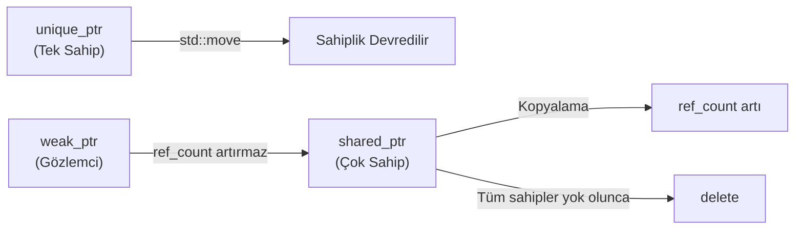
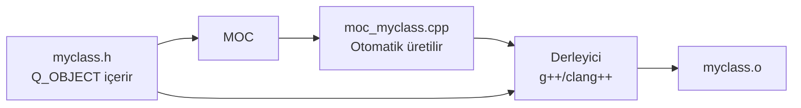
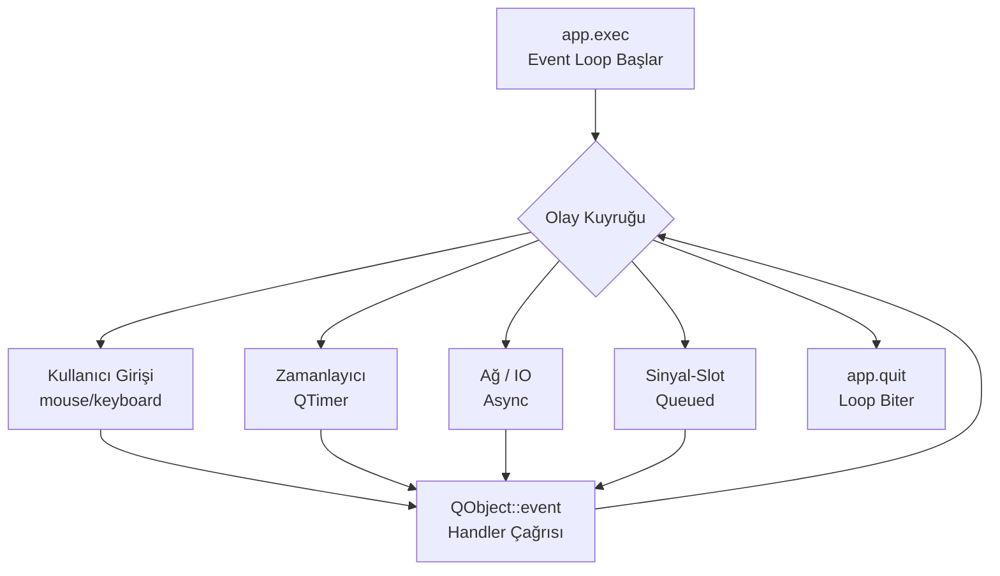
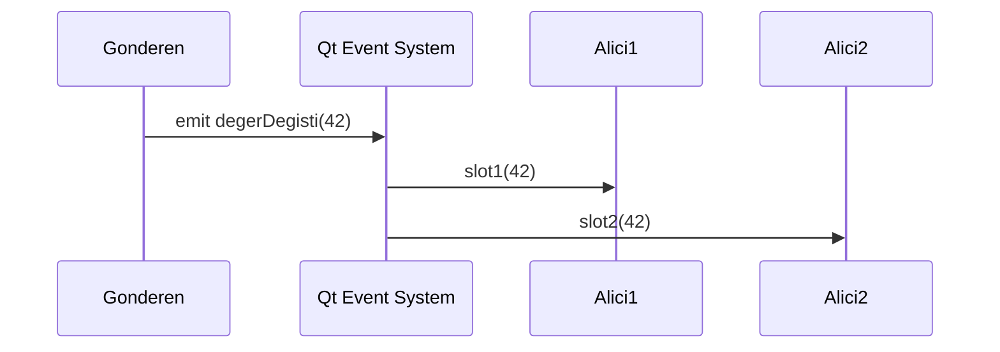

# C++ Programlama

- C'de bulunan bütün veri türleriyle koşul ve döngü yapıları geçerlidir; genel syntax da C ile büyük ölçüde aynıdır. C++ bu temelin üzerine OOP, generic programlama ve modern soyutlamalar ekler. **"zero-overhead abstraction"** ilkesi (kullanmadığın şey için bedel ödemezsin).

- List Initialization ile değişken başlatmanın avantajları:
    - **Narrowing conversion izin vermez.** `int x{3.14}` derleme hatası verir; `int x = 3.14` ise sessizce `3` atar.
    - **Aggregate ve container initialization** üye/eleman listesiyle doğrudan başlatma yapabilir, diğerleri yapamaz.
    - **Zero/value initialization tutarlılığı** her tipte tutarlı biçimde sıfır/varsayılan değer verir.

- Dosya işlemlerinde `.close()` ile manuel kapatmak şart değildir. Sınıfın destructor'ı scope dışına çıkıldığında dosyayı otomatik kapatır (RAII).

- `explicit` Tek parametreli constructor'ların örtük (implicit) tip dönüşümü yapmasını engeller; çağrı sadece açıkça belirtilerek yapılabilir.
- `constexpr` derleme zamanında kesin sabit; `const`'tan güçlüdür (`const` runtime'da da değer alabilir)
- `consteval` her çağrısı derleme zamanında zorunlu olarak değerlendirilir (C++20)    
- `[[maybe_unused]]` Kullanılmayan değişken için derleyici uyarısını bastırır (C++17)   
- `auto` Değişken tipini sağ taraftaki ifadeden çıkarır. (Sıfır runtime maliyeti)   
- `decltype` İfadenin tam tipini `const`/referans niteliğiyle birlikte verir   
- `std::cout` Tamponlu; buffer dolduğunda veya flush olduğunda yazar.
- `std::cerr` Tamponsuz; hata anında anında yazar (çökme senaryolarında kritik).
- `std::setw(n)` Minimum karakter genişliği (sağa hizalı).
- `std::setprecision(n)` Ondalık basamak sayısı.
- `std::fixed` Bilimsel gösterim yerine sabit ondalık.
- `std::hex - oct - dec` Sayı tabanı seçimi.
- `std::ifstream - ofstream - fstream` Dosyadan okuma - yazma - ikiside.
- `mutable` **const-correctness**'in bir parçasıdır. Bir sınıf üyesi `mutable` işaretlenirse, o üye `const` bir member fonksiyon içinde bile değiştirilebilir. Bu, nesnenin gözlemlenebilir durumunu değiştirmeyen ama teknik olarak bir alanı güncelleyen durumlar için kullanılır en yaygın örnek `std::mutex`

- `<=>` Spaceship operatörü (C++20) tek bir satırda iki değerin küçüklük, büyüklük ve eşitlik durumunu analiz eder; `std::strong_ordering` veya `std::partial_ordering` döner.
- `<<` Insertion - veriyi akışa gönderir.
- `>>` Extraction - akıştan veri çeker; boşluk/tab/newline'da durur.
- `::` (Scope Resolution) Önünde isim yoksa global kapsamı ifade eder; ayrıca namespace, sınıf üyesi, base class ve `enum class` erişiminde kullanılır.

- `++i` (Prefix) Hemen artırır, nesnenin referansını döndürür; geçici nesne oluşturmaz.
- `i++` (Postfix) Kopyayı alır, ardından artırır, kopyayı döndürür; geçici nesne oluşturduğu için maliyetlidir.

!!! tip "std::endl vs '\\n'"
    `std::endl` yeni satır ekler **ve** buffer'ı flush eder. Flush işlemi, tampondaki veriyi zorla işletim sistemine gönderir; bu I/O maliyetlidir ve döngü içinde sık sık `std::endl` kullanmak, her seferinde bu maliyeti tekrar ödediği için programın darboğaza (bottleneck) girmesine yol açar. Sadece yeni satır için `'\n'` kullanın; flush gerektiğinde `std::flush` çağırın.

|            | Text Modu                           | Binary Modu (`std::ios::binary`)  |
| ---------- | ----------------------------------- | --------------------------------- |
| Satır sonu | `\n` ↔ `\r\n` (OS'a göre otomatik)  | Dönüşüm yok                       |
| Metotlar   | `<<`, `>>`, `getline()`             | `.write()`, `.read()`             |
| Performans | Dönüşüm yüzünden yavaş              | Hızlı                             |

| Özellik                | C                                     | C++                                |
| ---------------------- | ------------------------------------- | ---------------------------------- |
| `struct` tanımlama     | `struct Adi var;` veya `typedef` şart | `Adi var;` doğrudan kullanılabilir |
| `struct` içi fonksiyon | Yasak                                 | Tam destekli                       |
| `enum` tip güvenliği   | Zayıf; `int`'e karışabilir            | `enum class` ile tamamen izole     |
| `enum` kapsam          | Tanımlandığı kapsama sızar            | `enum class` ile kendi kapsamı     |
| `enum` boyutu          | Derleyiciye bağlı                     | `: type` ile yazılımcı belirler    |

|                    | `std::string` |     `std::string_view`    |
| ------------------ | :-----------: | :-----------------------: |
| Bellek sahibi      |       ✓       |      ✗ (sadece bakış)     |
| Bellek ayırır      |       ✓       |             ✗             |
| Değiştirilebilir   |       ✓       |             ✗             |
| Kopyalama maliyeti |     Yüksek    |           Sıfır           |
| Ömür bağımlılığı   | Kendi yönetir | Gösterdiği veriye bağımlı |

!!! danger "Neden `std::string_view` Kullanılır?"
    - Gereksiz bellek kopyalamalarını ve dinamik bellek tahsislerini (heap allocation) sıfıra indirmek için kullanılır.

    - İlk bakışta const `std::string&` kullanmak bellek kopyalamasını engelliyor gibi görünse de gizli performans maliyetlerine sahiptir. `std::string_view` sadece bellek alanı ve uzunluk tutar sadece read-only durumlarında kullanılır.

    - **`std::string_view` Ömür Riski:** Metnin kendisine değil, bellekteki yerine işaret eder. İşaret ettiği orijinal metin bellekten silinirse `std::string_view` geçersiz hale gelir (dangling pointer). Bu yüzden `std::string_view` veriyi saklamak için değil, genellikle fonksiyon parametrelerinde okuma yapmak için tasarlanmıştır


```cpp 
// Değişken Başlatma Yöntemi 
int a = 5; // Copy initialization   -> C'den gelen klasik yöntem 
int b(5);  // Direct initialization -> Constructor çağrısına benzer
int c{5};  // List initialization   -> Modern ve en güvenli yöntem

// Sayı Gösterimleri
int ondalik = 100'000;      // ' digit separator (C++14)
int oktal   = 012;          // Sekizlik
int hex     = 0x1F;         // Onaltılık
int binary  = 0b1010;       // İkilik (C++14)

std::cout << std::oct << n;  // Sekizlik çıktı
std::cout << std::hex << n;  // Onaltılık çıktı
std::cout << std::fixed << std::setprecision(2) << 3.141; // 3.14
std::cout << std::setw(10) << "test";                     // "      test"

// Tür Takma Adları
typedef unsigned long long ULLI1;   // C tarzı (eski)
using   ULLI2 = unsigned long long; // Modern C++ (tercih edilmeli)

// Short-Circuit Evaluation -> ptr nullptr ise ptr->data asla çalıştırılmaz
if (ptr != nullptr && ptr->data == 5) { /* ... */ }

// Kopyalamayı önlemek için `const auto&` kullanılır.
std::vector<int> sayilar = {10, 20, 30};
for (const auto& sayi : sayilar) { std::cout << sayi << ' '; }

// mutable -> `getir()` const'tur çünkü `deger_`'i mantıksal olarak değiştirmez fakat 
// thread-safety için mutex'i kilitlemek gerekir `mutable` olmasaydı, const bir fonksiyon içinde
// `m_.lock()` çağrısı derleyici hatası verirdi.
class Sayac {
    mutable std::mutex m_; // const fonksiyon içinde lock/unlock edilebilsin diye mutable
    int deger_ = 0;
public:
    int getir() const {
        std::lock_guard<std::mutex> lock(m_); // m_ const olsaydı bu satır derlenmezdi
        return deger_;
    }
};
```


## Type Casting

C-Style Cast tehlikelidir çünkü arka planda const kaldırma, alakasız pointer dönüşümü ve sayısal dönüşüm işlemlerini ayırt etmeksizin uygular; niyeti derleyiciye aktaramaz.

```cpp
const int sabit = 10;
int *p = (int*)&sabit;   // const kırıldı → Undefined Behavior (C tarzı)
```
    

| Cast Operatörü     | Zaman   | Maliyet                             | Amaç                                                                                                                                          |
| ------------------ | ------- | ------------------------------------ | --------------------------------------------------------------------------------------------------------------------------------------------- |
| `static_cast`      | Derleme | Sıfır                               | Veri tipleri arası mantıksal dönüşümler; kalıtım hiyerarşisinde güvenli upcasting; `void*` göstericisini belirgin bir tipe dönüştürme          |
| `dynamic_cast`     | Runtime | **Yüksek** (RTTI + vtable taraması) | Polimorfik hiyerarşide güvenli downcasting (Base Class → Derived Class); tip uyuşmazsa pointer için `nullptr`, referans için `bad_cast` fırlatır |
| `const_cast`       | Derleme | Sıfır                               | `const`/`volatile` niteleyici manipülasyonu; genellikle const kabul etmeyen legacy (eski C) kütüphane API'lerine const veri geçirmek için       |
| `reinterpret_cast` | Derleme | Sıfır                               | Bit seviyesinde ham ve tehlikeli dönüşüm; donanım sürücüsü yazarken (hardware register erişimi) veya network/socket programlamada veriyi bayt dizisine (`char*`) paketlerken |

=== "static_cast"
    ```cpp
    double pi  = 3.14159;
    int    tam = static_cast<int>(pi);   // Güvenli; niyet açık

    void *raw = &tam;
    int  *ptr = static_cast<int*>(raw);  // Geçerli

    // char* ptr2 = static_cast<char*>(ptr); // HATA - ilişkisiz tipler
    ```

=== "dynamic_cast"
    ```cpp
    class Base    { virtual void f() {} };   // virtual şart (vtable gerekli)
    class Derived : public Base { public: void alt() {} };

    Base *b = new Base();
    Derived *d = dynamic_cast<Derived*>(b);

    if (d != nullptr)
        d->alt();         // Başarılı dönüşüm
    else
        /* Nesne gerçekte Base; dönüşüm başarısız */;
    ```

=== "const_cast"
    ```cpp
    void eski_c_func(char* str) { /* yazmıyor ama char* bekliyor */ }

    void modern(const char* s) {
        // eski_c_func(s);                    // HATA
        eski_c_func(const_cast<char*>(s));    // Zorunluluktan kabul
    }
    ```

=== "reinterpret_cast"
    ```cpp
    struct AgPaketi { unsigned int id; float veri; };

    char raw[8] = {0};   // Network'ten gelen ham 8 byte
    AgPaketi *p = reinterpret_cast<AgPaketi*>(raw);
    // Sıfır güvenlik. Yalnızca donanım/network düzeyinde kullanılır.
    ```


## Namespace

Mantıksal olarak ilişkili kod bloklarını, sınıfları ve fonksiyonları belirli bir isim altında gruplayan ve global kapsamdan izole eden sanal kapsamdır.

- **Anonymous Namespace:** C'deki dosya-seviyesi `static`'in modern C++ karşılığıdır. Başka hiçbir dosya `extern` ile bile erişemez.

- **Inline Namespace** sürüm Yönetimi için kullanılır.

=== "main.hpp"
    ```cpp
    #pragma once    // Include Guard

    namespace A {      // Eski 
        namespace B {    
            void foo();
        }
    }

    namespace A::B {    // Yeni C++17 - iç içe yazım
        void foo();
    }

    namespace V1 {
        void doSomething() { std::cout << "V1\n"; }
    }
    inline namespace V2 {    // Varsayılan sürüm
        void doSomething() { std::cout << "V2\n"; }
    }

    struct Foo { int a, b, c; };
    using ULLI = unsigned long long;

    void info();
    ```

=== "main.cpp"
    ```cpp
    using namespace std;   // Tüm std isimlerini açar
    // using std::cout;    // Sadece belirli bir isim

    namespace { // Anonymous namespace
        void gizli() { /* Yalnızca bu .cpp dosyasına görünür */ }
    }

    namespace Lib {
        inline namespace V2 { void hesapla(int x) {} }   // Güncel sürüm
        namespace V1        { void hesapla(double x) {} } // Eski sürüm
    }

    // Designated Initializer (C++20)
    Foo f0 {1, 2, 3};          // Sırayla atar
    Foo f1 {.a = 1, .c = 3};   // b = 0 (varsayılan)

    int main() {
        V1::doSomething();  // "V1"
        V2::doSomething();  // "V2"
        doSomething();      // inline namespace → "V2"

        auto f = []() { std::cout << "Hello\n"; };
        f();

        Lib::hesapla(5);      // → V2 (inline)
        Lib::V1::hesapla(5.5); // → V1 (açık)
    }
    ```


## Fonksiyonlar

- **Name Mangling:** C++ Derleyicisi, Overloading fonksiyonları birbirinden ayırmak için arka planda benzersiz isim vermesine denir.

- **Varsayılan Parametreler:** değer ataması sağdan sola yapılır. Varsayılan parametrenin sağında varsayılansız parametre bulunamaz.
- **Lambda:** İsmi olmayan, tanımlandığı yerde kullanılabilen küçük fonksiyonlardır.
    - `[]`   Hiçbir dış değişkene erişemez          
    - `[x]`  `x`'in kopyasını alır. `[=]` Tüm dış değişkenlerin kopyasını alır.                 
    - `[&x]` `x`'e referansla erişir. `[&]` Tüm dış değişkenlerin referansını alır.
    - Bir lambda'nın `operator()`'ı **varsayılan olarak `const`**'tur. Bu yüzden değer olarak (`[x]`, `[=]`) yakalanan değişkenler lambda gövdesi içinde değiştirilemez; değiştirmek için `mutable` eklenerek `operator()`'ın const olması engellenir:


```cpp
extern "C" {
void myCFunction(int x); // Derleyici bu fonksiyona Name Mangling yapmaz.
}                        // Direkt "myCFunction" olarak kalır. (C sembolü kalır)

namespace Math {
    class Calculator {
        int add(int a, int b);
        double add(double a, double b); // Aynı isimde 2 farklı fonksiyon! (Name Mangling)
    };
}

void f(int a, int b = 10, int c = 20);  // Geçerli
// void g(int a = 10, int b);           // HATA

// Lambda -> [capture](parametreler) -> dönüş_tipi { gövde } 
auto topla = [](int a, int b) -> int { return a + b; }; // a ve b değiştirilemez

int count = 0;
auto inc = [count]() mutable { return ++count; }; // count'un kopyası değiştirilebilir
```


## Pointer

|                       | C'den Miras `NULL`  |  C++11 `nullptr` |
| --------------------- | :-----------------: | :--------------: |
| Tür                   |    `0` (tam sayı)   | `std::nullptr_t` |
| Overloading güvenliği | ✗ - `0` ile karışır |        ✓         |

| Kriter                     |               Pointer (`*`)               |       Referans (`&`)       |
| -------------------------- | :---------------------------------------: | :------------------------: |
| Bağımsız nesne             |         ✓ (kendi bellek alanı var)        |       ✗ (takma isim)       |
| Null değeri                |               ✓ (`nullptr`)               |             ✗              |
| Yeniden bağlanabilir       |                     ✓                     |             ✗              |
| İlk değersiz bırakılabilir |                     ✓                     |             ✗              |
| Dereference operatörü      |            Açıkça `*` veya `->`           |          Gerekmez          |
| sizeof davranışı           | Pointer'ın kendi boyutu (8 byte / 64-bit) | Bağlandığı nesnenin boyutu |
| Multi-level                |                ✓ (`int**`)                |             ✗              |


- Modern C++ mimarisinde ham pointer (`*`) ve `delete` kullanımı birer güvenlik zafiyeti (code smell) olarak görülür. Bunların yerini `nullptr` ve Smart Pointers almıştır (RAII).
    - `unique_ptr` Nesnenin tek bir sahibi vardır; kopyalanamaz, sadece `move` ile başka bir `unique_ptr`'a devredilebilir. Ekstra referans sayacı tutmadığı için zero-overhead'dir, bu yüzden varsayılan tercih olmalıdır.
    - `shared_ptr` Nesnenin birden fazla sahibi olabilir; kopyalandıkça dahili referans sayacı (`ref count`) artar, son sahip yok olduğunda nesne silinir. Paylaşımlı sahiplik gerektiren durumlarda kullanılır, ancak referans sayacı yönetimi ekstra maliyet getirir.
    - `weak_ptr` Bir `shared_ptr`'ın gözlemcisidir; sahiplik almaz, referans sayacını artırmaz. Genellikle `shared_ptr`'lar arasında oluşabilecek döngüsel bağımlılığı (circular reference) kırmak için kullanılır, çünkü döngüdeki her taraf birbirini `shared_ptr` ile tutarsa referans sayacı hiç sıfıra inmez (Memory Leak) ve bellek sızıntısı oluşur.



```cpp
auto ptr = std::make_unique<int>(42);           // C++14
auto arr = std::make_unique<int[]>(5);          // 5 elemanlık dizi
auto sp  = std::make_shared<std::string>("hi"); // Paylaşımlı
```


## Hata Yönetimi

- `noexcept` bir fonksiyona eklenen "bu fonksiyon exception fırlatmayacak" sözüdür. Derleyici bu söze güvenip hata olursa geri sarma (stack unwinding) için gereken ekstra kodu üretmez; bu yüzden fonksiyon biraz daha hızlı ve küçük olur. Ama söz tutulmaz da fonksiyon içinde gerçekten bir exception fırlatılırsa, `try/catch` bile devreye giremeden program anında `std::terminate()` ile çöker.

```cpp title="Exceptions"
double bolme(double a, double b) {
    if (b == 0.0)
        throw std::invalid_argument("Sıfıra bölme!");
    return a / b;
}

try {
    double r = bolme(10.0, 0.0);
} catch (const std::invalid_argument& e) {
    std::cerr << "Hata: " << e.what() << '\n';
} catch (const std::exception& e) {
    std::cerr << "Genel hata: " << e.what() << '\n';
}
```


!!! danger "RAII + Exceptions"
    Bir exception fırlatıldığında, en yakın `catch` bloğu bulunana kadar çağrı yığınındaki (call stack) fonksiyonlar sırayla terk edilir; buna **stack unwinding** denir. Bu sırada her fonksiyonun scope'undaki **yerel nesnelerin destructor'ları otomatik çağrılır** ama bu sadece nesnelerin kendisi için geçerlidir, nesnenin *içinde tuttuğu* ham pointer'lar için değil.

    ```cpp
    // Ham Pointer 
    void fonksiyon() { 
        int* veri = new int[100];   // Ham pointer, kimse sahiplenmiyor
        riskli_islem();              // exception fırlatırsa...
        delete[] veri;                // ...buraya asla ulaşılmaz → Memory Leak
    }

    // RAII 
    void fonksiyon() {
        auto veri = std::make_unique<int[]>(100); 
        riskli_islem();                           
    }   
    ```

    - `veri` bir ham pointer olduğu için destructor'ı yoktur; stack unwinding onu "temizlemez", sadece stack'ten kaldırır. Sonuç: `delete[]` hiç çalışmaz ve ayrılan bellek sızar.

    - RAII sınıfında kullanıldığında, stack unwinding o nesnenin destructor'ını çağırır ve destructor içindeki `delete` garantili şekilde çalışır. Bu yüzden kaynakları (bellek, dosya, mutex vb.) hiçbir zaman `new`/`delete` ile değil, her zaman RAII sınıflarıyla yönetin.


## Template

- Veri tipini koddan ayırarak aynı algoritmayı farklı tipler için tekrar yazmayı önler.
- **Template Specialization:** Genel şablonun belirli bir tip için farklı çalışması gerektiğinde kullanılır.
- Tüm argümanlar aynı türdense `<>` yazmaya gerek yoktur; derleyici otomatik çıkarım yapar.
- Template kullanılan her `.cpp` dosyası kendi derlenirken kodu yeniden üretir; bunun için derleyicinin template'in **tam gövdesini** görmesi gerekir. Bu yüzden tanım `.h` dosyasında yazılmalıdır `.cpp`'de bırakılırsa derleyici gövdeyi göremez ve **linker error: undefined reference** hatası oluşur.

!!! danger "İstisna - Explicit Instantiation"
    Template `.cpp` dosyasında tanımlanıp dosya sonunda hangi tipler için kullanılacağı belirtilirse (`template class FixedArray<int, 5>;`), sadece o tipler diğer dosyalardan kullanılabilir. Genel esnekliği kaybettirir; genellikle binary boyutunu küçültmek isteyen büyük kütüphanelerde tercih edilir.

```cpp
template <typename T>
T maxVal(T a, T b) { return (a > b) ? a : b; }

// Class Templates
template <typename T, size_t N>
class FixedArray {
    T data[N];
public:
    void  set(size_t i, const T& v) { data[i] = v; }
    T     get(size_t i) const       { return data[i]; }
};

// Template Specialization
template <typename T>
bool isEqual(T a, T b) { return a == b; }

template <> // const char* için özelleştirme
bool isEqual<const char*>(const char* a, const char* b) {
    return std::strcmp(a, b) == 0;
}

std::cout << maxVal<double>(5.5, 3.2) << '\n';
std::cout << maxVal(10, 20) << '\n';

FixedArray<std::string, 5> arr;
```


## OOP

- `struct` ile `class` arasındaki tek teknik fark, varsayılan erişim ve kalıtımın `struct`'ta `public`, `class`'ta `private` olmasıdır; bu yüzden sadece veri tutan yapılar için `struct`, davranışı olan ve kapsülleme gerektiren yapılar için `class` tercih edilir.

- Derleyici varsayılan olarak şu özel üyeleri otomatik üretir: **default constructor**, **copy constructor**, **copy assignment operator**, **destructor**, **move constructor** ve **move assignment operator**.
    - `default` varsayılan davranışını açıkça talep eder.
    - `delete` üyenin kullanımını tamamen yasaklar. 

- **Rule of Three:** Sınıf kendi kaynağını (ör. ham pointer ile heap belleği) yönetiyorsa, Copy Constructor, Copy Assignment Operator ve Destructor'dan biri elle yazıldığında genelde üçü de birlikte yazılmalıdır; aksi halde derleyicinin ürettiği varsayılan sürüm kaynağı yanlış kopyalar.

- **Rule of Five (C++11):** Move semantiğiyle birlikte bu listeye Move Constructor ve Move Assignment Operator de eklenir; performans için taşımayı da elle tanımlamak gerekir.

- **Rule of Zero:** Kaynak yönetimi zaten `unique_ptr`/`shared_ptr` gibi **RAII** sınıflarına bırakılırsa, bu beş üyenin hiçbiri elle yazılmaz; derleyicinin ürettiği varsayılanlar zaten doğru çalışır.

- **Shallow Copy:** Varsayılan kopyalama davranışıdır; sadece pointer'ın adresi kopyalanır, işaret ettiği veri kopyalanmaz. İki nesne aynı heap alanını paylaştığı için biri silindiğinde diğeri geçersiz pointer'a sahip olur (**Double Free Crash** riski).

- **Deep Copy:** Kopyalama sırasında heap'te yeni bir alan açılıp veri oraya kopyalanır; iki nesne artık birbirinden bağımsız belleğe sahip olur, biri silinse diğeri etkilenmez.

```cpp
class MyClass {
public:
    MyClass() = default;              // Derleyici varsayılanını oluştur
    MyClass(const MyClass&) = delete; // Kopyayı yasakla
    explicit MyClass(int x);          // Örtük dönüşümü engelle
};
```

---
- **Encapsulation (Kapsülleme):** Üye değişkenler ve metotlar bir sınıf içinde bir arada tutulup, dışarıya sadece `public` metotlar üzerinden erişime açılmasıdır; `private` üyeler doğrudan dışarıdan değiştirilemez.


- **Abstraction (Soyutlama):** Nesnenin karmaşık iç detaylarını gizleyip kullanıcıya sadece gerekli/basit bir arayüz sunmaktır; 


- **Inheritance (Kalıtım):** Bir sınıfın, başka bir sınıfın üye ve davranışlarını devralarak üzerine yeni özellik ekleyebilmesidir; kod tekrarını azaltır.
    - **`public` kalıtım:** Base'in `public` üyeleri `public`, `protected` üyeleri `protected` kalır; `private` üyelere hiçbir zaman erişilemez.
    - **`protected` kalıtım:** Base'in `public` ve `protected` üyelerinin ikisi de derived'da `protected` olur.
    - **`private` kalıtım:** Base'in `public` ve `protected` üyelerinin ikisi de derived'da `private` olur (yani derived'ın dışına sızmaz).
    - **Virtual Destructor**, Base class pointer üzerinden Derived nesne yönetilecekse destructor **kesinlikle `virtual`** olmalıdır. Aksi hâlde `delete base_ptr` yalnızca Base destructor'ını çağırır; Derived'ın heap kaynakları sızar.

    - **Single** (`A → B`): Bir sınıf sadece bir base class'tan türer.
    - **Multiple** (`A + B → C`): Bir sınıf birden fazla base class'tan aynı anda türer.
    - **Multilevel** (`A → B → C`): Kalıtım zincirlenir; her sınıf bir öncekinden türer.
    - **Hierarchical** (`A → B` ve `A → C`): Tek bir base class'tan birden fazla sınıf türer.


- **Polymorphism (Çok Biçimlilik):** Aynı arayüz (fonksiyon adı) üzerinden farklı sınıfların kendine özgü davranışlar sergileyebilmesidir; C++'ta genellikle `virtual` fonksiyonlar ve base class pointer/referansı ile (runtime polymorphism) veya template'lerle (compile-time polymorphism) sağlanır.

    - `virtual` bir üye fonksiyonu base class pointer/referansı üzerinden çağrılırken, pointer'ın **tuttuğu tipe değil, işaret ettiği gerçek (derived) nesnenin tipine göre** çözülmesini sağlar; böylece her derived sınıf kendi versiyonunu çalıştırabilir (runtime polymorphism).

    - `override` derived sınıfta yazılan bir fonksiyonun, base class'taki bir `virtual` fonksiyonu **gerçekten override ettiğini** derleyiciye doğrulatır. Zorunlu değildir ama güçlü bir derleme güvencesidir: imza (parametre tipi, `const` niteliği vb.) yanlış yazılırsa `override` sayesinde derleyici hata verir; `override` olmadan aynı hata sessizce yeni ve alakasız bir overload oluşturur, bu da runtime polymorphism'i sessizce bozar.

    - Derived nesneyi Base'e **değer olarak** atamak Derived'a ait kısmı keser. Polymorphism için daima **pointer veya referans** kullanın.

!!! note "Polymorphism iki farklı zamanda ve iki farklı mekanizmayla çözülebilir"

    - **Compile-Time (Static) Polymorphism:** Hangi fonksiyonun çalışacağına derleyici, kodu derlerken karar verir. Function overloading, operator overloading ve template'ler bu gruba girer. Çalışma zamanında ekstra bir arama/yönlendirme olmadığı için **maliyeti sıfırdır**.
    - **Runtime (Dynamic) Polymorphism:** Hangi fonksiyonun çalışacağına program çalışırken, nesnenin gerçek tipine bakılarak karar verilir. `virtual` fonksiyonlar ve kalıtım ile sağlanır; arka planda her nesnenin **vtable + vptr** mekanizmasıyla doğru fonksiyona yönlendirilmesi gerekir, bu da küçük bir **indirection maliyeti** getirir.


!!! note "vtable / vptr Mekanizması"
    ```
    Base *ptr = new Derived();
    ptr->method();
    ```

    1. Nesnenin içindeki gizli `vptr`'ye git
    2. `vptr`'nin işaret ettiği sınıfın `VTABLE`'ına ulaş
    3. Tablodaki doğru indeksteki fonksiyon adresini çöz
    4. O fonksiyonu çağır

    Bu ekstra pointer takibi (indirection) cache-miss olasılığını artırır ve küçük bir runtime maliyeti oluşturur.

!!! tip "Pure Virtual ve Abstract Class"
    - **Pure virtual**, `= 0` ile gövdesiz bırakılan bir `virtual` fonksiyondur; sınıf bu fonksiyonun gövdesini vermez, sadece "bu fonksiyon derived sınıflarda mutlaka tanımlanmalı" der. 
    - En az bir **pure virtual** fonksiyon içeren sınıf **abstract class** olur: eksik/tamamlanmamış bir tasarım olduğu için doğrudan nesnesi oluşturulamaz, sadece ondan türeyen ve fonksiyonu gerçekten tanımlayan sınıfların nesnesi oluşturulabilir.

    ```cpp
    class Shape {
    public:
        virtual double area() = 0;   // Pure virtual → Abstract class
        virtual ~Shape() = default;  // Virtual destructor zorunlu
    };
    // Shape s;  // HATA - doğrudan nesne oluşturulamaz
    ```
    

- **Operator Overloading:** 
    - Yeni operatör icat edilemez.
    - Temel tiplerin davranışı değiştirilemez (en az bir işlenen kullanıcı tanımlı tip olmalı).
    - Operatör önceliği ve ilişkilendirilebilirlik değiştirilemez.
    - `.`, `.*`, `::`, `?:`, `sizeof` aşırı yüklenemez.


- **Friend Yapıları:**
    - **Karşılıklı değildir:** `A`, `B`'yi friend ilan ederse `B` `A`'nın private'larına erişir; ama `A`, `B`'ninkine erişemez.
    - **Geçişli değildir:** `A-B` dost, `B-C` dost ise `A-C` otomatik dost değildir.
    - **Miras kalmaz:** Base'in dostu Derived'ın private'larına erişemez.

```cpp
class Vec2 {
public:
    float x, y;
    Vec2 operator+(const Vec2& rhs) const {
        return {x + rhs.x, y + rhs.y};
    }
};

class Vec2 {
    float x, y;
    friend std::ostream& operator<<(std::ostream& os, const Vec2& v);
};
std::ostream& operator<<(std::ostream& os, const Vec2& v) {
    return os << '(' << v.x << ", " << v.y << ')';
}
``` 


## STL (Standard Template Library)

### Sequence Containers 

|  Karşılaştırması     |       `array`        |    `vector`    |        `deque`         |        `list`       |
| -------------------- | :------------------: | :------------: | :--------------------: | :-----------------: |
| Bellek               |   Stack (Ardışık)    | Heap (Ardışık) | Heap (Parçalı Bloklar) | Heap (Dağınık Node) |
| Rastgele Erişim `[]` |        O(1) ⚡        |     O(1) ⚡     |   O(1) ufak maliyet    |        O(N) ✗       |
| Sona Ekleme          |         N/A          |     O(1)*      |          O(1)          |         O(1)        |
| Başa Ekleme          |         N/A          |     O(N) ✗     |         O(1) ⚡         |        O(1) ⚡       |
| Araya Ekleme         |         N/A          |      O(N)      |          O(N)          |      **O(1)** ⚡     |
| Cache Locality       |         ⚡⚡⚡          |       ⚡⚡       |           ⚡            |          ✗          |
| Boyut                | Sabit (Compile-time) |    Dinamik     |        Dinamik         |       Dinamik       |


#### Vector

- `std::vector`, elemanları bellekte **ardışık (contiguous)** tutan, boyutu program çalışırken otomatik büyüyüp küçülebilen dinamik bir dizidir; STL'de en sık kullanılan konteynerdir.
- **Reallocation Zinciri:** Kapasite dolduğunda `vector` önce yeni ve daha büyük bir alan açar, mevcut elemanları oraya taşır/kopyalar, sonra eski alanı serbest bırakır. Elemanların adresi değiştiği için önceki tüm pointer, referans ve iterator'lar geçersiz kalır (**Iterator Invalidation**); bu işlem O(N) maliyetlidir.
- **Erase-Remove Idiom:** Döngü içinde tek tek `erase()` çağırmak O(N²)'ye çıkar (her silmede kalan elemanlar kaydırılır). Bunun yerine `std::remove` ile silinecekler sona toplanıp tek seferde `erase()` edilirse maliyet O(N)'e düşer: `vec.erase(std::remove(vec.begin(), vec.end(), deger), vec.end());`
- **Özel Durum (`vector<bool>`):** Bellekten tasarruf etmek için her `bool` değeri için tek bir bit ayrılır (gerçek `bool` dizisi tutulmaz). Sonuç olarak tek bir elemanın adresi (`&`) alınamaz ve thread-safe değildir; gerçek `bool` elemanlar gerekiyorsa `std::vector<char>` veya `std::bitset` tercih edilmelidir.
- Önemli fonksiyonlar: `size()` aktif eleman sayısını, `capacity()` reallocation olmadan tutulabilecek maksimum eleman sayısını verir; `reserve(n)` size'ı değiştirmeden capacity'yi büyütür, `resize(n)` ise size'ı değiştirir. `push_back(v)` dışarıda hazır bir nesneyi kopyalar/taşırken, `emplace_back(...)` nesneyi doğrudan **içeride in-place** inşa ederek geçici nesne oluşturmaktan kaçınır.

```cpp
std::vector<int> v;
v.reserve(10);           // Kapasite = 10, size = 0
v.push_back(1);
std::cout << v.size();   // 1
```

#### Deque

- `std::deque` (double-ended queue), tek bir ardışık blok yerine **parçalı bellek blokları** kullanan; hem başından hem sonundan O(1) maliyetle eleman ekleyip silebilen bir konteynerdir.
- `vector` kapasitesi dolduğunda tüm belleği kopyalar ve ani bir gecikme (latency spike) yaşanır; `deque` ise mevcut elemanları taşımadan yeni bir blok bağladığı için daha stabil davranır. Ortadan ekleme/silme her ikisinde de O(N)'dir.
- `deque`'e özgü olup `vector`'de bulunmayan: `push_front()`, `pop_front()`. `vector`'e özgü olup `deque`'de bulunmayan: `capacity()`, `reserve()`, `shrink_to_fit()` (çünkü `deque` tek bir ardışık blok olmadığı için bu kavramlar burada anlamsızdır).

#### List / Forward_list

- `std::list`, her elemanı bellekte ayrı ve bağımsız bir düğüm (Node) olarak tutan, çift yönlü bağlı bir listedir; elemanlar ardışık değildir, bu yüzden rastgele erişim (`[]`) yoktur ama listenin herhangi bir noktasına ekleme/silme O(1)'dir.
- `std::forward_list`, ham C'deki tek yönlü bağlı listeden daha fazla bellek kaplamamak ve yavaş olmamak ilkesiyle tasarlanmış tek yönlü bir listedir. `push_back` yoktur (sona ulaşmak O(N) sürer); ekleme/silme için `insert_after`/`erase_after` kullanılır.
- Fark: `list` her düğümde hem önceki hem sonraki elemana pointer tutar (2 pointer, +16 byte), `forward_list` sadece sonrakine (1 pointer, +8 byte); bu yüzden `forward_list` daha az bellek kullanır ama geriye doğru gezilemez. `list.size()` sabit zamanda çalışırken `forward_list` boyutunu bilmediği için saymak O(N) sürer.
- `list`'e özgü, düğüm bağlarını değiştirerek çalışan (elemanları taşımayan) algoritmalar vardır: `sort()` O(N log N), `reverse()` O(N), `unique()` ardışık tekrarları siler, `splice(iter, other)` başka bir `list`ten elemanları kopyasız, O(1) maliyetle aktarır.

#### Array

- `std::array<T, N>`, boyutu derleme zamanında sabit olan ve **Stack'te** tutulan bir konteynerdir; ham C dizisinin (`T arr[N]`) STL uyumlu, daha güvenli bir sürümü gibi düşünülebilir.
- Ham C dizisinden farkı: `.at()` ile sınır kontrollü erişim sağlar (aralık dışına çıkılırsa `std::out_of_range` fırlatır) ve `=` ile doğrudan kopyalanabilir; ham C dizisi kopyalanamaz, elle döngüyle kopyalanması gerekir.

```cpp
std::array<int, 5> arr = {5, 2, 9, 1, 6};
std::array<int, 5> kopya = arr;   // Doğrudan kopyalanabilir
```

### Associative Containers

İç yapı: **Red-Black Tree** (Self-balancing BST). Otomatik sıralama, O(log N) arama/ekleme/silme.

| Container  |     Anahtar      |  Tekrar | Operatör[] |
| ---------- | :--------------: | :-----: | :--------: |
| `set`      | Değerin kendisi  |    ✗    |     ✗      |
| `multiset` | Değerin kendisi  |    ✓    |     ✗      |
| `map`      |   Key (unique)   | ✗ (key) |     ✓      |
| `multimap` | Key (non-unique) |    ✓    |     ✗      |

!!! tip "map operator[]"
    `m[key]` key yoksa **varsayılan değerle oluşturur**. Sadece kontrol edecekseniz `find()` veya `contains()` (C++20) kullanın.

### Unordered Containers

İç yapı: **Hash Table**. Ortalama O(1) arama/ekleme/silme; sıralama garantisi yok.

| Container       |     Anahtar     | Tekrar |
| --------------- | :-------------: | :----: |
| `unordered_set` | Değerin kendisi |   ✗    |
| `unordered_map` |   Key (unique)  |   ✗    |

|               | `map` / `set`  | `unordered_map` / `unordered_set` |
| ------------- | :------------: | :-------------------------------: |
| Veri Yapısı   | Red-Black Tree |             Hash Table            |
| Arama         |    O(log N)    |           Ortalama O(1)           |
| Sıralama      |  ✓ (otomatik)  |                 ✗                 |
| Range sorgusu |       ✓        |                 ✗                 |

!!! tip "Ne Zaman Hangisini Kullanmak Gerekir?"
    - Sıralama veya range sorgusu gerekiyorsa → `map`/`set`
    - Maksimum hız, sıralama gerekmiyorsa → `unordered_map`/`unordered_set`

### Container Adaptors

| Adaptor          |    Prensibi    |   Arka Planda   | Temel Operasyonlar             |
| ---------------- | :------------: | :-------------: | ------------------------------ |
| `stack`          |      LIFO      |     `deque`     | `push`, `pop`, `top`           |
| `queue`          |      FIFO      |     `deque`     | `push`, `pop`, `front`, `back` |
| `priority_queue` | Öncelikli FIFO | `vector` + heap | `push`, `pop`, `top`           |

### STL Algorithms

| Algoritma                        | Karmaşıklık | Açıklama                                     |
| -------------------------------- | :---------: | -------------------------------------------- |
| `std::sort`                      |  O(N log N) | Sıralar                                      |
| `std::find`                      |     O(N)    | İlk eşleşmede durur, iterator döner          |
| `std::count`                     |     O(N)    | Sona kadar gider, sayı döner                 |
| `std::transform`                 |     O(N)    | Her elemanı fonksiyondan geçirir             |
| `std::accumulate`                |     O(N)    | Elemanları tek değere indirger (`<numeric>`) |
| `std::remove` / `std::remove_if` |     O(N)    | Erase-Remove idiom için kullanılır           |

---

## RAII (Resource Acquisition Is Initialization)

Modern C++ bellek güvenliğinin temel felsefesidir: **Bir kaynak edinildiğinde (constructor), onun serbest bırakılması (destructor) garanti altına alınır.**

C++'ta fonksiyon sonlandığında (normal veya exception ile), kapsamdaki tüm yerel nesnelerin destructor'ları otomatik çağrılır - **Stack Unwinding**. RAII bu garantiyi kullanarak kaynak yönetimini otomatize eder.

| Kaynak Türü  | RAII Sınıfı                           |
| ------------ | ------------------------------------- |
| Bellek       | `std::unique_ptr`, `std::shared_ptr`  |
| Dosya        | `std::ifstream`, `std::ofstream`      |
| Mutex kilidi | `std::lock_guard`, `std::unique_lock` |

```cpp
void process() {
    auto f   = std::ifstream("data.txt");        // Dosya açıldı
    auto ptr = std::make_unique<Data>(42);       // Bellek alındı
    auto lk  = std::lock_guard(mutex_);         // Kilit alındı
    // ...
}   // Scope bitti → destructor'lar çağrıldı; dosya kapandı, bellek iade edildi, kilit açıldı
```

---

## Multithreading

### std::thread

```cpp
void gorv(int id) { std::cout << "Thread " << id << '\n'; }

std::thread t(gorv, 42);
t.join();     // Ana thread bekler, t biter → kaynaklar temizlenir
// t.detach(); // Arka plana alır; main bitince detached thread de sonlanır
```

!!! danger "join veya detach Zorunlu"
    `std::thread` nesnesi join veya detach yapılmadan destroy edilirse destructor `std::terminate()` çağırır → program çöker.

### Senkronizasyon Mekanizmaları

| Mekanizma              | Açıklama                                         | Ne Zaman                      |
| ---------------------- | ------------------------------------------------ | ----------------------------- |
| `std::mutex`           | Temel kilit; critical section'a tek thread       | Genel amaçlı koruma           |
| `std::recursive_mutex` | Aynı thread aynı kilidi tekrar alabilir          | Recursive fonksiyonlar        |
| `std::shared_mutex`    | Çok okuyucu / tek yazıcı (Reader-Writer)         | Ağırlıklı okuma senaryoları   |
| `std::lock_guard`      | RAII mutex wrapper; scope bitince kilit açılır   | Basit critical section        |
| `std::unique_lock`     | `lock_guard`'dan esnek; defer/try lock destekler | Karmaşık kilit senaryoları    |
| `std::atomic<T>`       | Lock-free; CPU donanımsal atomik işlem           | Sayaç, flag gibi basit tipler |

```cpp
std::mutex  mtx;
int         counter = 0;

void increment() {
    for (int i = 0; i < 100'000; i++) {
        std::lock_guard<std::mutex> lk(mtx);  // RAII - scope bitince açılır
        ++counter;
    }
}
```

!!! danger "Data Race"
    Birden fazla thread aynı değişkene eş zamanlı erişip en az biri yazma yapıyorsa **Data Race** oluşur. C++'ta Data Race **Undefined Behavior**'dır.

!!! danger "Deadlock"
    İki thread birbirinin elindeki kilidi bekler → program sonsuza kadar bloke olur.
    ```
    Thread A → Mutex1 kilitli, Mutex2 bekliyor
    Thread B → Mutex2 kilitli, Mutex1 bekliyor  → Deadlock ∞
    ```
    Çözüm: Tüm thread'lerin kilitleri **her zaman aynı sırayla** alması.

### std::atomic

Lock-free alternatif; doğrudan CPU seviyesinde bölünemez (atomic) işlem yapar.

```cpp
std::atomic<int> counter{0};

void increment() {
    for (int i = 0; i < 100'000; i++)
        ++counter;  // Mutex gerekmez; atomik
}
```

### std::condition_variable

Bir koşul sağlanana kadar thread'i bloke eder; sürekli döngü (busy-wait) yazmayı önler.

```cpp
std::mutex              mtx;
std::condition_variable cv;
std::queue<int>         buffer;

void producer() {
    std::lock_guard lk(mtx);
    buffer.push(42);
    cv.notify_one();                               // bekleyen thread'i uyandır
}

void consumer() {
    std::unique_lock lk(mtx);
    cv.wait(lk, []{ return !buffer.empty(); });   // spurious wakeup koruması
    int val = buffer.front(); buffer.pop();
}
```

!!! danger "notify → wait sırası"
    `notify_one` çağrısı `wait`'ten önce gelirse bildirim kaybolur. Koşul değişkenini her zaman bir mutex ile birlikte kullanın.

### Futures ve Async

- **`std::future<T>`:** Henüz hazır olmayan, ileride bir thread tarafından üretilecek bir `T` değerine tutulan "bilet" gibidir. `f.get()` çağrıldığında, değer hazırsa hemen döner; hazır değilse değer üretilene kadar çağıran thread'i bloke eder.
- **`std::async`:** Bir fonksiyonu (genellikle ayrı bir thread'de) arka planda çalıştırıp, sonucunu almak için otomatik olarak bir `std::future` döndüren **yüksek seviye** bir araçtır. Thread'i, senkronizasyonu veya sonucun nasıl taşınacağını elle yönetmeniz gerekmez; sadece çalıştırılacak fonksiyonu verirsiniz.
- **`std::promise` / `std::future` çifti:** `std::async`'in aksine, sonucun nasıl ve ne zaman üretileceğini **manuel** kontrol etmek istediğinizde kullanılır. `std::promise<T>`, değeri üretecek tarafta tutulur ve iş bitince `.set_value(...)` ile değeri "vaat edilen yere koyar"; bu değeri bekleyen taraf ise `promise`'den alınan eşleşen `std::future<T>` üzerinden `.get()` ile o değeri okur. Yani `promise` **yazma ucu**, `future` ise **okuma ucudur** — aralarında tek yönlü, tek seferlik bir veri kanalı kurarlar.

```cpp
// std::async - arka planda çalıştır, sonucu future ile al
std::future<int> f = std::async(std::launch::async, []() {
    return 42;
});
std::cout << f.get() << '\n';  // Hazır olana kadar bekler
```

---

## Move Semantics

### Rvalue Referanslar ve std::move

Rvalue referansı (`&&`) geçici ya da "artık kullanılmayacak" nesnelere bağlanır. `std::move` bir nesneyi rvalue'ya çevirir; kopyalamak yerine iç kaynakları taşır.

```cpp
std::string a = "uzun bir metin";
std::string b = std::move(a);  // a'nın tamponu b'ye aktarıldı - kopya yok
// a artık geçerli ama boş; kullanılmamalı
```

Move constructor ve move assignment, Rule of Five kapsamında tanımlanır:

```cpp
class Buffer {
    int* data; size_t size;
public:
    Buffer(Buffer&& other) noexcept        // Move constructor
        : data(other.data), size(other.size)
    { other.data = nullptr; other.size = 0; }

    Buffer& operator=(Buffer&& other) noexcept {  // Move assignment
        if (this != &other) { delete[] data; data = other.data; other.data = nullptr; }
        return *this;
    }
};
```

### Perfect Forwarding

`std::forward`, şablon fonksiyonlarda argümanı orijinal değer kategorisiyle (lvalue/rvalue) iletir. Aksi hâlde her şey lvalue olarak iletilir ve taşıma fırsatı kaçar.

```cpp
template <typename T>
void wrapper(T&& arg) {
    target(std::forward<T>(arg));  // lvalue gelirse lvalue, rvalue gelirse rvalue
}
```

!!! note "std::move vs std::forward"
    `std::move` - koşulsuz rvalue'ya çevirir. `std::forward` - orijinal kategoriyi korur; yalnızca şablon kodda kullanılır.


## Utility Types

- `std::optional` Değeri olmayabilecek sonuçlar için; `nullptr` veya sentinel değer kullanmayı önler.
- `std::variant` Tür güvenli union; birden fazla tipten birini tutabilir; aktif olmayan tipe erişim exception fırlatır.
- `std::span` Bellek sahibi olmadan array, vector veya pointer üzerinde güvenli bir pencere sunar. 

!!! tip "std::span ne zaman kullanılır?"
    Fonksiyona "veriyi oku ama sahiplenme" semantiği vermek istediğinde. `const std::span<const T>` read-only görünüm sağlar.

```cpp
std::optional<int> divide(int a, int b) {
    if (b == 0) return std::nullopt;
    return a / b;
}

auto r = divide(10, 0);
r.has_value();           // false
r.value_or(0);           // değer yoksa 0 döner; exception fırlatmaz


std::variant<int, float, std::string> v = "merhaba";

std::get<std::string>(v);                          // "merhaba"
std::visit([](auto& x){ std::cout << x; }, v);    // tüm olası tipleri işler

void process(std::span<int> data) {
    for (auto x : data) std::cout << x << ' ';
}

std::vector<int> v   = {1, 2, 3};
int              arr[] = {4, 5, 6};

process(v);    // vector geçerli
process(arr);  // ham dizi de geçerli - pointer + boyut çifti yazmak gerekmez
```

---

## Derleme Zamanı Programlama

- `if constexpr` Şablon kodu içinde derleme zamanında dal seçimi yapar; seçilmeyen dal derlenmez, bu sayede tip uyumsuzluğu hatası oluşmaz.

- `Concepts` Şablon parametrelerine anlamlı kısıtlamalar ekler; SFINAE'nin yerini alan, okunabilir hata mesajları üreten modern alternatif.

```cpp
template <typename T>
void print(T val) {
    if constexpr (std::is_integral_v<T>)
        std::cout << "tamsayı: " << val;
    else if constexpr (std::is_floating_point_v<T>)
        std::cout << "ondalık: " << val;
    else
        std::cout << "diğer: " << val;
}

template <typename T>
concept Sayisal = std::is_arithmetic_v<T>;

template <Sayisal T>
T topla(T a, T b) { return a + b; }

// topla("a", "b");  → Açık hata: "T, Sayisal kavramını karşılamıyor"
// SFINAE ile aynı hata onlarca satır karmaşık mesaj olurdu
```

|             |              SFINAE             |                  Concepts                 |
| ----------- | :-----------------------------: | :---------------------------------------: |
| Hata mesajı |         Karmaşık ve uzun        |             Net ve okunabilir             |
| Sözdizimi   | `enable_if`, `void_t` karmaşası | `requires` / `concept` anahtar kelimeleri |
| Versiyon    |              C++98+             |                   C++20                   |

## QT 

Qt, C++ tabanlı, çapraz platform uygulama geliştirme çerçevesidir. Grafik arayüz (Widgets, QML/Quick), ağ, veri tabanı, dosya sistemi ve thread yönetimini kapsayan kapsamlı bir standart kütüphane sunar. **Meta-Object System (MOC)**, C++'ın statik tip sistemini genişleterek çalışma zamanı yansıma, sinyal-slot mekanizması ve dinamik özellik sistemini mümkün kılar.

### QObject ve Parent-Child Hiyerarşisi

Qt'nin bellek yönetiminin temeli parent-child ilişkisine dayanır: **bir parent silindiğinde tüm child'ları da otomatik silinir.**

```cpp
// Parent verildiğinde Qt belleği yönetir - delete gerekmez
QWidget *pencere = new QWidget(nullptr);         // Root - sahibi yok
QPushButton *buton = new QPushButton("Tamam", pencere);  // Pencere sahibi
QLabel *etiket = new QLabel("Merhaba", pencere);

delete pencere;   // Buton ve etiket de silinir
```

!!! danger "QObject Kopyalanamaz"
    `QObject` ve türetilmiş sınıflar copy constructor ve copy assignment operatörü **silinmiş** olarak tanımlanır. Nesneyi kopyalamak yerine pointer ile taşıyın.

### MOC (Meta-Object Compiler)

MOC, derleme öncesinde Qt uzantılarını (sinyal/slot, özellik sistemi, RTTI) standart C++'a dönüştüren bir ön işlemci aracıdır.



| Makro / Anahtar Kelime          | Açıklama                                                         |
| ------------------------------- | ---------------------------------------------------------------- |
| `Q_OBJECT`                      | Sınıfın MOC tarafından işleneceğini bildirir; sinyal/slot şart   |
| `signals:`                      | Sinyal bildirimleri bölümü                                       |
| `slots:` (veya `public slots:`) | Slot bildirimleri bölümü                                         |
| `emit`                          | Sinyali tetikler                                                 |
| `QVariant`                      |  Herhangi bir Qt veya kullanıcı tanımlı tipi taşıyan dinamik tip kabı. C++/QML arası veri aktarımında kritik rol oynar  |
| `Q_PROPERTY(...)`               | QML ve meta-system ile senkron özellik tanımı                    |
| `Q_INVOKABLE`                   | Metodu QML ve `QMetaObject::invokeMethod` ile çağrılabilir yapar |
| `Q_GADGET`                      | `QObject` mirası olmayan ancak meta-sistem kullanan sınıf        |
| `Q_DECLARE_METATYPE`            | Tipi signal/slot ve `QVariant` için kaydeder                     |

```cpp
class Sayac : public QObject {
    Q_OBJECT
    Q_PROPERTY(int deger READ deger WRITE setDeger NOTIFY degerDegisti)

public:
    explicit Sayac(QObject *parent = nullptr) : QObject(parent) {}

    int deger() const { return m_deger; }

    Q_INVOKABLE void sifirla() { setDeger(0); }

public slots:
    void setDeger(int yeni) {
        if (m_deger != yeni) {
            m_deger = yeni;
            emit degerDegisti(m_deger);
        }
    }

signals:
    void degerDegisti(int yeniDeger);

private:
    int m_deger = 0;
};
```

!!! note "m_ Prefix - Member Değişken Konvansiyonu"
    Qt kod stilinde sınıf üye değişkenleri `m_` öneki ile isimlendirilir (ör. `m_deger`). Bu, yerel değişkenlerle karışmayı önler ve getter/setter isimlerinde çakışmayı engeller.


### Event Loop



```cpp
int main(int argc, char *argv[]) {
    QApplication app(argc, argv);

    QWidget pencere;
    pencere.show();

    return app.exec();   // Olay döngüsü başlar; çarpıya basılınca döner
}
```

!!! tip "QCoreApplication vs QGuiApplication vs QApplication"
    | Sınıf              | Kullanım                              |
    | ------------------ | ------------------------------------- |
    | `QCoreApplication` | GUI olmayan; terminal uygulamaları    |
    | `QGuiApplication`  | Pencere sistemi var; Widget yok (QML) |
    | `QApplication`     | Tam Widget desteği                    |

---

### Signal ve Slot Mekanizması

Nesneler arası **gevşek bağlı (loosely coupled)** iletişim; sinyal gönderen, alıcının kim olduğunu bilmez.




=== "Modern (Function Pointer) - Önerilen"
    ```cpp
    // Derleme zamanı doğrulaması - yanlış imza derleyici hatası verir
    connect(slider, &QSlider::valueChanged,
            spinBox, &QSpinBox::setValue);

    // Lambda slot
    connect(buton, &QPushButton::clicked, this, [this]() {
        label->setText("Tıklandı!");
    });
    ```

=== "SIGNAL/SLOT Makrosu - Eski"
    ```cpp
    // Çalışma zamanı doğrulaması - imza hatası derleme geçer, runtime'da uyarı
    connect(slider, SIGNAL(valueChanged(int)),
            spinBox, SLOT(setValue(int)));
    ```

=== "Functor / Lambda (3 parametre)"
    ```cpp
    // Context nesnesi verilmezse: Pencere kapanırsa crash riski!
    connect(buton, &QPushButton::pressed, this, [this]() {
        label->setText("Güvenli lambda");
    });
    // 'this' context olduğunda: this yok edilirse bağlantı otomatik kopar
    ```

| connect() Parametresi | Açıklama                                                           |
| --------------------- | ------------------------------------------------------------------ |
| `sender`              | Sinyali gönderen nesne                                             |
| `signal`              | `&SınıfAdı::sinyalAdı`                                             |
| `receiver`            | Sinyali alacak nesne (lambda için context)                         |
| `slot`                | `&SınıfAdı::slotAdı` veya lambda                                   |
| `Qt::ConnectionType`  | `DirectConnection`, `QueuedConnection`, `BlockingQueuedConnection` |

!!! note "Bağlantı Türleri"
    | Tür                            | Açıklama                                                        |
    | ------------------------------ | --------------------------------------------------------------- |
    | `Qt::DirectConnection`         | Sinyal ile aynı thread'de anında çağrılır                       |
    | `Qt::QueuedConnection`         | Slot, alıcının event loop'unda çağrılır (thread arası iletişim) |
    | `Qt::AutoConnection`           | Aynı thread → Direct; farklı thread → Queued (varsayılan)       |
    | `Qt::BlockingQueuedConnection` | QueuedConnection + gönderen thread alıcı bitene kadar bekler    |

```cpp
// disconnect - belirli bağlantıyı kes
disconnect(slider, &QSlider::valueChanged, spinBox, &QSpinBox::setValue);

// Nesnenin tüm bağlantılarını kes
disconnect(buton, nullptr, nullptr, nullptr);
```