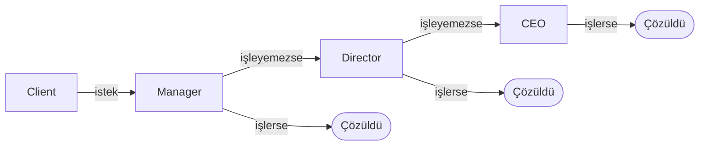

# Software Design

## SOLID

Sürdürülebilir, genişletilebilir ve esnek yazılımlar geliştirmek için kullanılan tasarım prensibidir. Kodun hantallaşmasını, kırılgan hale gelmesini ve spagetti koda dönüşmesini engeller.

!!! abstract "Single Responsibility Principle (SRP)"
    Bir modül tek bir işten sorumlu olmalıdır.

!!! abstract "Open/Closed Principle (OCP)"
    Sınıflar **genişletmeye açık, değiştirmeye kapalı** olmalıdır. `if/else - switch` ile tür kontrolü yapıldığında her yeni tür bu bloğu değiştirmeyi zorunlu kılar fakat polimorfizm ile yeni tür yeni bir sınıf olarak eklenir var olan kod değişmez.

!!! abstract "Liskov Substitution Principle (LSP)"
    Alt sınıflar, miras aldıkları üst sınıfların yerine kullanılabilmeli ve bu durum programın davranışını bozmamalıdır.

!!! abstract "Interface Segregation Principle (ISP)"
    Çok amaçlı tek bir arayüz yerine, amaca yönelik özelleştirilmiş birden fazla arayüz tercih edilmelidir.

!!! abstract "Dependency Inversion Principle (DIP)"
    Yüksek seviyeli modüller, düşük seviyeli modülleri doğrudan referans almamalıdır. Her iki modül de soyutlamalara (Abstraction) bağımlı olmalıdır. Soyutlamalar detaylara değil, detaylar soyutlamalara bağımlı olmalıdır.


## Design Pattern

Yazılımda sık karşılaşılan tasarım sorunlarına karşı geliştirilmiş **düşünce biçimleridir**.


### Creational

Nesnenin nasıl ve ne zaman oluşturulacağını belirler. Oluşturma mantığını iş mantığından ayırır.


!!! abstract "Factory Method"
    Nesne oluşturma kararını alt sınıflara bırakır. Üst sınıf yalnızca nesne oluştur der ne oluşacağına alt sınıf karar verir. Bu sayede genişletme, mevcut kodu değiştirmek yerine yeni sınıf yazmak anlamına gelir.

```cpp
class Transport {
public:
    virtual void deliver() = 0;
    virtual ~Transport() = default;
};

class Truck : public Transport { void deliver() override { std::cout << "Kara\n"; } };
class Ship  : public Transport { void deliver() override { std::cout << "Deniz\n"; } };

class Logistics {
public:
    virtual std::unique_ptr<Transport> create() = 0;
    void plan() { create()->deliver(); } // türü bilmez, sadece kullanır
    virtual ~Logistics() = default;
};

class RLogistics : public Logistics { std::unique_ptr<Transport> create() override { return std::make_unique<Truck>(); } };
class SLogistics : public Logistics { std::unique_ptr<Transport> create() override { return std::make_unique<Ship>(); } };

std::unique_ptr<Logistics> l = std::make_unique<RLogistics>();
l->plan(); // Kara

l = std::make_unique<SLogistics>();
l->plan(); // Deniz - plan() hiç değişmedi
```


!!! abstract "Abstract Factory"
    Birbiriyle uyumlu nesne aileleri üretir; yanlış kombinasyonu derleme zamanında engeller. Factory Method tek bir ürün üretir; Abstract Factory uyumlu bir *aile* üretir.

```cpp
class Button { public: virtual void render() = 0; virtual ~Button() = default; };
class Menu   { public: virtual void show()   = 0; virtual ~Menu()   = default; };

class DesktopButton  : public Button { void render() override { std::cout << "Desktop buton\n"; } };
class DesktopMenu    : public Menu   { void show()   override { std::cout << "Desktop menü\n"; } };
class EmbeddedButton : public Button { void render() override { std::cout << "Embedded buton\n"; } };
class EmbeddedMenu   : public Menu   { void show()   override { std::cout << "Embedded menü\n"; } };

class UIFactory {
public:
    virtual std::unique_ptr<Button> createButton() = 0;
    virtual std::unique_ptr<Menu>   createMenu()   = 0;
    virtual ~UIFactory() = default;
};
class DesktopFactory : public UIFactory {
    std::unique_ptr<Button> createButton() override { return std::make_unique<DesktopButton>(); }
    std::unique_ptr<Menu>   createMenu()   override { return std::make_unique<DesktopMenu>(); }
};
class EmbeddedFactory : public UIFactory {
    std::unique_ptr<Button> createButton() override { return std::make_unique<EmbeddedButton>(); }
    std::unique_ptr<Menu>   createMenu()   override { return std::make_unique<EmbeddedMenu>(); }
};

// İstemci - hangi fabrika gelirse aynı kod çalışır; yanlış kombinasyon mümkün değil
void buildUI(UIFactory& f) {
    f.createButton()->render();
    f.createMenu()->show();
}

DesktopFactory  desktop;  
buildUI(desktop);   // Desktop buton + Desktop menü

EmbeddedFactory embedded; 
buildUI(embedded);  // Embedded buton + Embedded menü
```


!!! abstract "Builder"
    karmaşık nesnelerin adım adım inşa edilmesini sağlayan desendir. Builder her adımı açık isimli bir metodla tanımlar; yalnızca gereken adımlar çağrılır, geri kalanlar varsayılan değerde kalır.

```cpp
// KÖTÜ PRATİK: Parametre sayısı arttıkça anlaşılmaz olur
Drone drone(6, true, true, false, "");

// BUILDER: Her adım isimlendirilmiş, sadece gereken adımlar çağrılır
auto drone = Drone::builder().setMotors(6)
                 .useEtherCAT().addImu().build();
```


!!! abstract "Prototype"
    Sıfırdan oluşturmak yerine var olan nesneyi kopyalar. Nesne oluşturması pahalı olduğunda, veritabanı sorgusu, ağ çağrısı, ağır hesaplama, klonlamak çok daha hızlıdır. Kopya, hazır kurulmuş nesneyi alır; yalnızca farklı parametreler güncellenir.

```cpp
class Sensor {
protected:
    double freq;
    std::vector<double> calib; // büyük veri
public:
    Sensor(double f, std::vector<double> cal): freq(f), calib(std::move(cal)) {}
    virtual ~Sensor() = default;
    virtual std::unique_ptr<Sensor> clone() const = 0;
    void setFreq(double f) { freq = f; }
};

class TemperatureSensor : public Sensor {
public:
    TemperatureSensor(double f, std::vector<double> cal): Sensor(f, std::move(cal)) {}
    std::unique_ptr<Sensor> clone() const override {
        return std::make_unique<TemperatureSensor>(*this); // deep copy
    }
};

TemperatureSensor base(100.0, {0.1, 0.2, 0.3, 0.4, 0.5}); // bir kez pahalı kurulum

auto s1 = base.clone();       // hızlı kopyalama
s1->setFreq(200.0);           // sadece bu klonda değişir
```

!!! warning "Deep Copy vs Shallow Copy"
    - **Shallow copy:** iç nesnelerin referanslarını kopyalar. Bir kopyada değişim diğerini de etkiler. 
    - **Deep copy:** tüm iç yapıyı ayrı kopyalar. C++'da kopya yapıcı yazarak derin kopyalama garantilenir.


!!! abstract "Singleton"
    Bir sınıfın runtime yalnızca tek bir örneğinin (instance) olmasını garanti altına alan ve bu örneğe global access point sağlayan tasarım desenidir.

    - **Test edilemezlik:** Global durum yarattığı için testlerde izole etmek zordur; bir testin değiştirdiği state başkasını etkiler
    - **Gizli bağımlılık:** Bağımlılıklar yapıcıdan değil sınıf içinden alınır
    - Çoğu durumda bağımlılık enjeksiyonu daha temiz çözümdür

```cpp
class Logger {
    Logger() = default; // private

public:
    Logger(const Logger&) = delete; Logger& operator=(const Logger&) = delete;

    static Logger& getInstance() {
        static Logger instance; // C++11: thread-safe garantili
        return instance;
    }

    void log(const std::string& msg) { std::cout << "[LOG] " << msg << "\n"; }
};

Logger::getInstance().log("Sistem başlatıldı");
Logger::getInstance().log("Bağlantı kuruldu");
```


### Structural

Sınıfların ve nesnelerin birbirine nasıl bağlandığını düzenler. Uyumsuz parçaları birleştirir, karmaşık yapıları sadeleştirir.


!!! abstract "Adapter"
    Birbiriyle uyumsuz arayüzlere sahip iki farklı sınıfın birlikte çalışabilmesini tasarım desenidir. Genellikle projenin ilerleyen aşamalarında veya bakım sürecinde kullanılır. Birbiriyle hiç alakası olmayan, uyumsuz iki eski/yeni sistemi sonradan "yama" ve birlikte çalıştırmak için tercih edilir.


!!! abstract "Bridge"
    Bir sınıfın soyutlama katmanı ile bu soyutlamanın arka plandaki gerçek işi yapan implementation katmanını birbirinden ayıran ve ikisinin bağımsız olarak genişlemesini sağlayan tasarım desenidir. Projenin en başında, tasarım aşamasında bilinçli olarak tasarlanır. Amaç, bir yapının ara yüzü ile o yapının platforma veya donanıma bağımlı kodlarını birbirinden baştan izole etmektir.


!!! abstract "Composite"
    Tekil nesneleri ve nesne gruplarını aynı arayüzle kullanmayı sağlar. Dosya sistemi veya arayüz hiyerarşisi gibi ağaç yapılarında istemcinin "bu yaprak mı, grup mu?" diye sorgulamadan aynı işlemi yapabilmesi gerekir. Her şey aynı arayüzü uyguladığında istemci ikisini ayırt etmek zorunda kalmaz.


!!! abstract "Decorator"
    Nesneye çalışma zamanında yeni davranış ekler; kalıtım kullanmaz. Davranış kombinasyonları için alt sınıf açmak sınıf patlamasına yol açar: şifreli, sıkıştırılmış, şifreli+sıkıştırılmış, ikisi de yok 4 ayrı sınıf. Decorator, sarılan nesneyle aynı arayüzü uygular; `send()` çağrıldığında kendi davranışını ekleyerek zincirin geri kalanına aktarır.

    **Not:** Kalıtım derleme zamanında sabittir. Decorator çalışma zamanında esnektir ve kombine edilebilir.


!!! abstract "Facade"
    Karmaşık alt sistemin önüne sade bir yüz koyar. Bir alt sistem birden fazla sınıftan oluşuyorsa ve kullanmak için belirli sırayla başlatılıp çağrılması gerekiyorsa bu karmaşıklığı gizler. İstemci tek sade bir metod görür; alt sisteme doğrudan erişim kapanmaz, sadece kolaylaşır.

    
!!! abstract "Flyweight"
    Çok sayıda benzer nesnenin ortak verilerini paylaştırır; belleği boşa harcamaz. Binlerce benzer nesne oluşturuluyorsa ve her biri aynı büyük verinin kopyasını taşıyorsa bellek tükenir. Flyweight, değişmez paylaşılan veriyi (*intrinsic*) bir kez tutar; her nesneye özgü veri (*extrinsic*) dışarıdan geçirilir, içinde saklanmaz.

    **Not:** Nesne sayısı gerçekten büyük değilse eklenen karmaşıklık faydasızdır.


!!! abstract "Proxy"
    Başka bir nesneye erişimi kontrol eden vekil nesnedir. Bir nesneye erişmeden önce ek kontrol (yetki, önbellekleme, gecikmeli yükleme) eklemek istediğinde bunu nesnenin kendisine koymak Tek Sorumluluk İlkesi'ni ihlal eder. Proxy, gerçek nesneyle aynı arayüzü uygular; istemci farkı görmez.

    | Tür                  | Amaç                                          |
    | -------------------- | --------------------------------------------- |
    | **Virtual Proxy**    | Pahalı nesneyi gerçekten gerektiğinde oluştur |
    | **Protection Proxy** | Kim neyi görebilir/yapabilir                  |
    | **Caching Proxy**    | Aynı sonucu tekrar hesaplama                  |
    | **Remote Proxy**     | Uzak nesneye yerel arayüzden eriş             |


### Behavioral 

Nesneler arasındaki iletişimi ve sorumlulukların dağılımını yönetir. Kim ne yapmalı, kim kimi bilmeli sorularına yanıt verir.


!!! abstract "Chain of Responsibility"
    Bir isteğin birden fazla nesne tarafından ele alınabileceği durumlarda, isteği gönderen taraf ile isteği işleyen taraflar arasındaki sıkı bağımlılığı ortadan kaldıran bir tasarım desenidir.
    
!!! abstract "Proxy"
    İsteği bir zincir boyunca iletir; kimin işleyeceğini başlatıcı bilmek zorunda değildir. Bir isteği birden fazla nesne işleyebilir ama hangisinin devreye gireceği önceden belli değildir. İstemciye "bu durumda A'ya git, şunda B'ye git" yazmak kodu kırılgan kılar. Her halka isteği karşılayamazsa bir sonrakine iletir.

    **Örnek:** Web çatılarında istek sırayla kimlik doğrulama → yetkilendirme → hız sınırlama → kayıt katmanlarından geçer. Her katman isteği işler veya reddeder; reddedilmezse iletilir.




!!! abstract "Command"
    Bir eylemi nesne olarak kapsüller; sakla, kuyruğa al, geri al. İşlemi tetikleyen (buton, zamanlayıcı, tuş kısayolu) ile gerçekleştiren arasındaki bağımlılığı keser ya da "geri al" (undo) ihtiyacını karşılar. Command, işlemi ve tersini (`execute`/`undo`) bir nesnede kapsüller; çağıran taraf nasıl yapıldığını bilmez.


!!! abstract "Interpreter"
    Özel bir dili veya ifade dilbilgisini sınıf hiyerarşisiyle temsil eder ve yorumlar. Tekrarlayan, belirli kurallara sahip bir mini dil gerektiğinde kullanılır: koşul ifadeleri, basit sorgular, kural motoru. Her dilbilgisi kuralı bir sınıf olur; ifade ağaca dönüştürülür ve `interpret()` özyinelemeli çağrılır.

    **Örnek:** `"sıcaklık > 80 AND nem < 30"` ifadesi ayrıştırılarak `AndExpr` ağacına dönüştürülür. Yeni kural tipi (`NotExpr`) eklemek için yeni bir sınıf yazmak yeterlidir.

    **Not:** Dilbilgisi karmaşıklaştıkça sınıf sayısı ve bakım maliyeti patlar. Gerçek dil işleme ihtiyacında ANTLR, yacc/bison gibi ayrıştırıcı üreteç araçları kullanılmalı.


!!! abstract "Iterator"
    Koleksiyonun iç yapısını açığa çıkarmadan elemanları üzerinde dolaşmayı sağlar. Her veri yapısı için farklı dolaşım kodu yazmak istemediğinde Iterator arayüzü dolaşımı standartlaştırır; istemci koleksiyonun iç yapısını bilmez, aynı şekilde dolaşır.

    **Not:** Python `for x in obj`, C++ range-based for, Java `Iterable` - hepsi bu desenin dil seviyesindeki uygulamaları. Genellikle dilin özelliğini kullanırsın; sıfırdan yazmak özel veri yapılarında gerekir.


!!! abstract "Mediator"
    Nesnelerin birbirini doğrudan tanıması yerine iletişimi merkezi bir aracıya aktarır. N nesne birbirleriyle iletişim kurduğunda N×(N-1) bağlantı oluşur - örümcek ağı. Mediator ile her nesne yalnızca Mediator'ı tanır; toplamda N bağlantı yeterlidir. 10 uçak doğrudan konuşursa 90 bağlantı, hava trafik kulesiyle konuşursa 10 bağlantı.

!!! danger "Dikkat"
    Mediator kendisi God Object'e dönüşebilir. Tüm mantık oraya yığılırsa monolitik iletişim merkezi ortaya çıkar. Sorumluluklarını dar tut.


!!! abstract "Memento"
    Nesnenin iç durumunu kapsüllemeyi bozmadan kaydeder; gerektiğinde geri yükler. Nesnenin önceki durumuna geri dönmek istediğinde iç durum private olduğu için dışarıdan okuyamazsın. Durumu dışa açmak sarmalama ilkesini bozar. Memento, durumu yalnızca Originator'ın okuyabileceği opak bir nesnede saklar.

    - **Originator:** Durumu olan asıl nesne - `save()` ile anlık görüntü üretir, `restore()` ile geri yükler
    - **Memento:** Opak nesne - yalnızca Originator içini okuyabilir
    - **Caretaker:** Memento'ları saklar ama içini okuyamaz

    **Not:** Command undo için işlemi tersine çeviren kod yazar. Memento önceki durumu saklar (veri odaklı). Ters işlemi yazmak imkânsız veya karmaşıksa Memento daha uygundur.


!!! abstract "Observer"
    Bir nesnedeki değişikliği ilgilenen herkese otomatik bildirir. Nesnenin durumu değişince bağlı diğer nesnelerin güncellenmesi gerekiyorsa onları kod içinde tek tek çağırmak sıkı bağımlılık yaratır; yeni bağımlı eklemek kodu değiştirmeyi gerektirir. Subject abonelerini tanımaz - sadece değişince bildirir; aboneler abone ol/çık ile dinamik girer çıkar.

    **Not:** Modern sistemlerdeki Kafka, RabbitMQ, Redux, event bus bu desenin çeşitli varyasyonlarıdır.


!!! abstract "State"
    Nesnenin davranışı iç durumuna göre değişir; durum geçişlerini koşullu ifadeler yerine ayrı nesnelerle yönetir. Aynı nesne farklı durumlarda aynı metodlarda farklı davranıyorsa bunu if/else ile yönetmek hem uzar hem kırılganlaşır - yeni durum eklenince her yere koşul eklenmesi gerekir. Her durum kendi sınıfı olunca geçişler ve davranışlar o sınıfın içinde kapsüllenir.

    **Not:** Strategy'de istemci algoritmayı seçer. State'de nesne kendi durumunu ve geçişlerini yönetir; değişimler otomatik gerçekleşebilir. State nesneleri birbirini tanıyabilir; Strategy nesneleri genellikle birbirinden habersizdir.


!!! abstract "Strategy"
    Aynı işi yapan farklı algoritmalar arasında çalışma zamanında geçiş yapmayı sağlar. Aynı işin birden fazla yapılış biçimi varsa hepsini tek sınıfa koymak hem şişirir hem Açık/Kapalı İlkesi'ni ihlal eder - yeni algoritma eklemek mevcut koda dokunmayı gerektirir. Her algoritma ayrı sınıfa taşınır; Context hangisini kullandığını bilmez, sadece aktarır.


!!! abstract "Template Method"
    Algoritmanın iskeletini üst sınıfa yazar; değişen adımları alt sınıflara bırakır. Birden fazla sınıf aynı genel akışı paylaşıyor ama bazı adımlarda farklı davranıyorsa ortak akışı her sınıfa kopyalamak bakımı zorlaştırır. Üst sınıf sabit adımları uygular, değişen adımları `virtual` bırakır - alt sınıflar yalnızca onları geçersiz kılar, akışa dokunamaz.

    **Not:** Template Method kalıtım kullanır; iskeleti değiştirmeyi engeller. Strategy bileşim kullanır; tüm algoritmayı çalışma zamanında değiştirebilir.

    **Hollywood Prensibi:** "Bizi arama, biz seni ararız" Alt sınıf adımları uygular ama akışı kontrol etmez; üst sınıf yönetir.


!!! abstract "Visitor"
    Kararlı nesne yapısına, nesneleri değiştirmeden yeni operasyonlar ekler. Birçok farklı türde nesne var ve bu yapı üzerinde sık yeni operasyonlar ekleniyor - analiz, yazdırma, serileştirme. Her yeni operasyon için her sınıfa dokunmak Açık/Kapalı İlkesi'ni ihlal eder. Yeni operasyon = yeni Visitor sınıfı; var olan nesnelere dokunulmaz.

    Her nesne `accept(Visitor& v)` uygular ve `v.visit(*this)` çağırır (**çift gönderim**). Visitor, hangi düğüm türü olduğuna göre doğru `visit` metodunu çalıştırır.

!!! example "Derleyici"
    Sözdizimi ağacı üzerinde tür kontrolü, optimizasyon, kod üretimi - her biri ayrı Visitor'dır. Sözdizimi ağacı düğüm sınıfları hiç değişmez; yeni analiz = yeni Visitor sınıfı.
