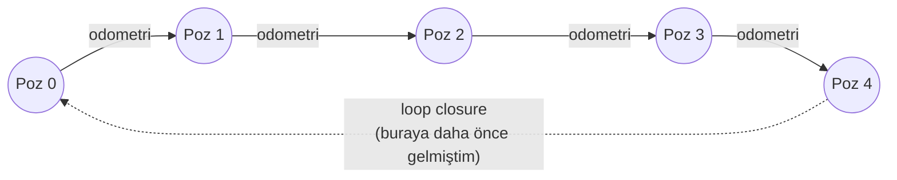
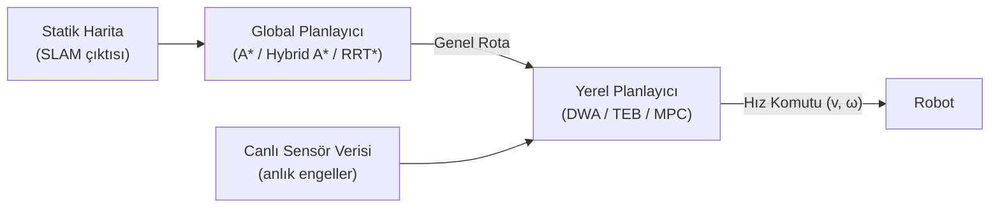
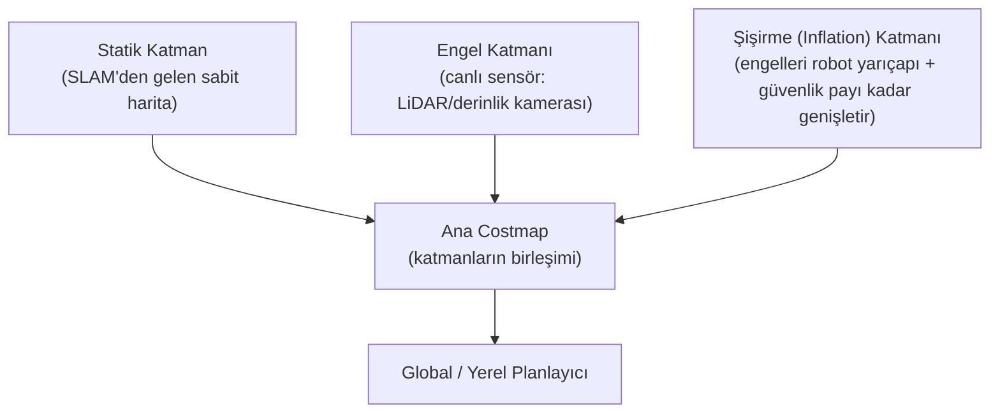

# Sensör Füzyonu, SLAM ve Hareket Planlama

!!! note "Bu Sayfa Ne Anlatıyor?"
    Bir otonom robotun "neredeyim, çevrem nasıl ve nereye nasıl giderim?" sorularını cevaplayan üç katmanlı yığın: ham sensör verisinin güvenilir bir duruma dönüştürülmesi (**sensör füzyonu**), bu durumdan tutarlı bir harita ve konum çıkarılması (**SLAM**), ve bu haritada güvenli bir yol bulunması (**hareket planlama**). PID/LQR/MPC gibi düşük seviye kontrolör teorisi için [Robot Kontrolü](control.md) sayfasına, kamera-IMU kalibrasyonu detayları için [VIO ve Kalibrasyon](vio.md) sayfasına bakın.

---

## 1. Sensör Füzyonu (LiDAR, IMU, Radar)

Tek bir sensöre güvenmek risklidir - her sensörün kör noktası farklıdır. Sensör füzyonu, birbirini tamamlayan sensörleri birleştirerek tek bir sensörün zayıflığını diğerinin gücüyle kapatır:

| Sensör    | Güçlü Yönü                                           | Zayıf Yönü                                          |
| ----------- | -------------------------------------------------------- | ---------------------------------------------------------- |
| **Kamera**   | Zengin görsel bilgi (renk, doku, nesne tanıma), ucuz        | Işık/hava koşullarına hassas, tek başına derinlik belirsiz    |
| **LiDAR**    | Doğrudan, hassas metrik mesafe; ışıktan bağımsız              | Pahalı, dönen mekanizma (bazı modeller), yağmur/sis'te bozulur, renk/doku bilgisi yok |
| **Radar**    | Hava koşullarından (yağmur, sis, toz) neredeyse etkilenmez, doğrudan hız ölçer (Doppler) | Düşük açısal çözünürlük, küçük/durağan cisimleri ayırt etmekte zayıf |
| **IMU**      | Çok yüksek frekans (100-1000 Hz), kısa vadede çok hassas       | Zamanla sürüklenir (drift), mutlak konum veremez               |

### Kalman Filtresi Ailesi (KF, EKF, UKF)

Sensör füzyonunun matematiksel çekirdeği, farklı zamanlarda ve farklı güvenilirlikte gelen ölçümleri, sistemin **o anki en olası durumuna** (konum, hız, yönelim...) dönüştüren bir tahmin döngüsüdür. Bu döngü her zaman aynı iki adımdan oluşur: **tahmin** (bir hareket modeliyle bir sonraki durumu öngör) ve **güncelleme** (yeni bir sensör ölçümü geldiğinde bu öngörüyü düzelt). Üç varyantı birbirinden ayıran, sistemin **doğrusal olup olmadığını** nasıl ele aldıklarıdır.

| Filtre  | Doğrusallık Varsayımı                                    | Nasıl Çalışır                                                        | Hesaplama Maliyeti |
| --------- | ------------------------------------------------------------ | -------------------------------------------------------------------------- | :--------------------: |
| **KF**    | Sistem tamamen doğrusal, gürültü Gauss'yan                     | Kapalı-form matris çözümü; belirtilen varsayımlar altında **matematiksel olarak optimal** | En düşük                 |
| **EKF**    | Doğrusal olmayan sistemi anlık durumda **doğrusallaştırır** (Jacobian ile) | KF'nin doğrusal olmayan sistemlere uyarlanmış hali                              | Düşük-orta                |
| **UKF**   | Doğrusallaştırma yapmaz; birkaç **temsili nokta** (sigma point) sistemin gerçek doğrusal olmayan denkleminden geçirilir | Doğrusal olmama hatasını Jacobian hesaplamadan, daha doğru yakalar                | Orta-yüksek                |

**Neden EKF her zaman yeterli değildir?** Jacobian, yalnızca mevcut tahminin **yakın çevresindeki** doğrusal davranışı yakalar. Sistem güçlü doğrusal olmayan bir davranış sergiliyorsa (ör. ani dönüşler, keskin ivmelenme) bu yerel doğrusallaştırma gerçek durumdan uzaklaşır ve filtre **ıraksayabilir** (yanlış bir tahminde kilitlenip kalabilir). UKF, gerçek doğrusal olmayan fonksiyonu birkaç seçilmiş nokta üzerinden doğrudan örneklediği için bu hatayı önemli ölçüde azaltır - bedeli, her adımda birden fazla nokta için hesaplama yapmaktır.

!!! example "Hangisi Ne Zaman Seçilir?"
    - Sistem gerçekten doğrusala yakınsa (ör. sabit hızlı düz hareket) → **KF** yeterli ve en ucuzdur.
    - Çoğu robotik/IMU füzyon problemi (dönen, ivmelenen robot) → **EKF** endüstri standardıdır, iyi bir denge sunar.
    - Güçlü doğrusal olmayan dinamikler veya EKF'nin ıraksadığı durumlar (ör. keskin manevralar yapan hava araçları) → **UKF** tercih edilir.
    - Gürültü Gauss'yan değilse veya çok-modlu belirsizlik varsa (ör. hangi koridorda olduğundan emin olunamayan bir robot) ne EKF ne UKF yeterlidir - bu durumda **Parçacık Filtresi (Particle Filter)** gibi örnekleme tabanlı yöntemlere geçilir.

### Sensör Kalibrasyonu (Intrinsic / Extrinsic)

Füzyonun doğruluğu, girdi verisinin doğruluğundan fazla olamaz. İki farklı kalibrasyon türü ayrı sorunları çözer:

- **Intrinsic (iç) kalibrasyon:** Sensörün kendi ölçüm hatalarını düzeltir - kameranın lens distorsiyonu ve odak uzaklığı, IMU'nun ölçek faktörü ve eksen hizalama hatası, LiDAR'ın her bir lazer huzmesinin açısal/mesafe sapması. Bu parametreler sensöre özgüdür ve fiziksel montajdan bağımsızdır.
- **Extrinsic (dış) kalibrasyon:** Bir sensörün diğerine (veya robotun gövdesine) göre **konumunu ve yönünü** (bir dönüşüm matrisi olarak) tanımlar. Örneğin LiDAR'ın IMU'ya göre 3 boyutlu yerleşimi.

!!! warning "Küçük Açısal Hata, Büyük Mesafe Hatasına Dönüşür"
    Extrinsic kalibrasyondaki 1 derecelik bir açısal hata, sensörden 20 metre uzaktaki bir nokta için ~35 cm'lik konum hatasına yol açar (`20m × tan(1°) ≈ 0.35m`). Bu yüzden extrinsic kalibrasyon, füzyon zincirindeki en kritik ve en çok ihmal edilen adımdır - kamera-IMU extrinsic kalibrasyonu için bkz. [Kalibr](vio.md#kalibr-kamera-ve-imu-kalibrasyonu).

### Zaman Senkronizasyonu (Time Synchronization)

Her sensör farklı bir hızda (LiDAR ~10 Hz, kamera ~30 Hz, IMU 200-1000 Hz) ve farklı bir işlem gecikmesiyle veri üretir. Bu ölçümler, gerçek zaman damgaları göz ardı edilip "geldikleri sırayla" birleştirilirse, füzyon **farklı anlardaki gerçekliği tek bir ana aitmiş gibi** karıştırır - özellikle hızlı hareket sırasında bu, ciddi ve sistematik bir hataya dönüşür.

Bu sorun iki seviyede çözülür:

1. **Donanımsal senkronizasyon:** Sensörlere ortak bir tetikleme sinyali (hardware trigger) veya ortak bir zaman referansı (PPS, PTP) verilerek, ölçümlerin gerçekten aynı ana denk gelmesi sağlanır. Yazılımsal zaman damgalama (işletim sisteminin veriyi aldığı an damgalanması) her zaman işletim sistemi/sürücü gecikmesi kadar belirsizlik taşır.
2. **Algoritmik telafi:** Donanımsal senkronizasyon mümkün olmadığında, filtre tasarımı gecikmeli/sıra dışı gelen ölçümleri (out-of-sequence measurements) ele alacak şekilde yapılır - yakın geçmişteki durumların bir tamponu tutulur, geç gelen bir ölçüm o anki değil, ait olduğu geçmiş zamana geri gidilerek işlenir ve sonrasındaki tahminler yeniden hesaplanır.

!!! danger "NTP Yeterli Değildir"
    Standart ağ zaman senkronizasyonu (NTP) milisaniye mertebesinde belirsizlik taşır; hızlı hareket eden bir araçta bu, metrelerce konum hatasına dönüşebilir. Hassas senkronizasyon gerektiren sistemlerde donanımsal tetikleme veya PTP (Precision Time Protocol) şarttır.

### LiDAR-IMU Loose Coupling vs Tight Coupling

İki sensörün birleştirilme derinliği, sistemin sağlamlığını doğrudan belirler:

| Kriter                     | Loose Coupling (Gevşek Bağlaşım)                          | Tight Coupling (Sıkı Bağlaşım)                                  |
| ----------------------------- | ---------------------------------------------------------------- | ---------------------------------------------------------------------- |
| Ne birleştirilir                | Her sensörün **kendi başına ürettiği** poz tahmini (iki ayrı çıktı) | Ham ölçümler (IMU ivme/açısal hız, LiDAR nokta bulutu) **ortak** bir durum/optimizasyonda |
| Uygulama karmaşıklığı           | Basit; sensörler birbirinden bağımsız modüller olarak geliştirilebilir | Karmaşık; ortak bir durum vektörü ve optimizasyon gerektirir             |
| Doğruluk                        | Düşük-orta; ara adımda bilgi/korelasyon kaybı olur                   | **Yüksek**; ham veri arasındaki korelasyonlar korunur                    |
| Sağlamlık (zayıf geometri, hızlı hareket) | Zayıf; bir sensör başarısız olursa (ör. LiDAR'ın geometrik olarak "kör" kaldığı bir tünel) o an için elde tutarlı veri kalmaz | **Güçlü**; IMU, LiDAR'ın zayıf kaldığı anlarda köprü görevi görür (ör. FAST-LIO, LIO-SAM) |
| Hesaplama maliyeti               | Düşük                                                              | Daha yüksek                                                              |

Pratikte, gerçek zamanlı ve sağlam bir sistem hedefleniyorsa (otonom araç, hızlı İHA) tight coupling tercih edilir; hızlı prototipleme veya sensörlerin bağımsız test edilmesi gerektiğinde loose coupling makul bir başlangıç noktasıdır.

---

## 2. SLAM ve Konumlandırma Algoritmaları

**SLAM** (Simultaneous Localization and Mapping), robotun "nerede olduğumu bilmek için haritaya ihtiyacım var, haritayı çıkarmak için nerede olduğumu bilmem gerekiyor" şeklindeki tavuk-yumurta problemini eş zamanlı olarak çözer.

### Visual SLAM vs LiDAR SLAM

| Kriter                  |         Visual SLAM (ör. ORB-SLAM)         |              LiDAR SLAM               |
| -------------------------- | :---------------------------------------------: | :---------------------------------------: |
| Girdi                        |          Kamera görüntüsü (özellik noktaları)      |         Doğrudan 3B nokta bulutu             |
| Işık bağımlılığı              |        Yüksek; karanlıkta/parlak ışıkta zayıflar    |          Yok; ışıktan bağımsız çalışır          |
| Doku (texture) gereksinimi     |     Yüksek; boş/tekdüze yüzeylerde özellik bulunamaz |    Yok; ama **geometrik** olarak tekdüze ortamlarda (uzun düz koridor/tünel) da zayıflar |
| Metrik ölçek                  |    Mono'da belirsiz (IMU/stereo gerekir)             |          Doğrudan mesafe ölçer, her zaman metrik    |
| Donanım maliyeti               |               Düşük                                 |                  Yüksek                        |
| Tipik doğruluk                 |             Orta                                    |                **Yüksek**                       |

Visual SLAM ucuz ve hafiftir ama ışık/doku koşullarına bağımlıdır; LiDAR SLAM daha pahalı ama fiziksel olarak daha güvenilirdir. Bu yüzden birçok üretim sistemi ikisini birlikte (ve genelde IMU ile birlikte) kullanır.

**Öne çıkan LiDAR SLAM sistemleri farklı tasarım tercihleri yapar:**

- **LOAM (LiDAR Odometry and Mapping):** Nokta bulutundan **kenar** (edge - keskin yüzey sınırları) ve **düzlem** (planar - düz yüzeyler) özellik noktaları çıkarır; bu özellikleri kare-kareye (scan-to-scan, hızlı ama sürüklenmeye açık) ve kareyi-haritaya (scan-to-map, daha yavaş ama daha doğru) eşleyerek iki hızlı/yavaş paralel katmanda çalışır. Hafif ve gerçek zamanlıdır ama tek başına IMU kullanmadığı için hızlı/ani hareketlerde kırılgandır.
- **LIO-SAM:** LOAM'ın özellik çıkarma fikrini, IMU ile **sıkı bağlaşımlı** (tight coupling) bir faktör grafı üzerinde birleştirir; IMU ön entegrasyonu (bkz. [VIO](vio.md)) hem hareket tahmininde hem de LiDAR eşlemesine iyi bir başlangıç noktası vermede kullanılır - bu da geometrik olarak zayıf (tünel gibi) alanlarda LOAM'dan çok daha sağlamdır.
- **Cartographer (Google):** Haritayı küçük yerel **alt haritalara** (submap) bölerek oluşturur; her alt harita kendi içinde tutarlıdır, alt haritalar arasındaki tutarlılık ise verimli bir arama algoritmasıyla (branch-and-bound scan matching) sağlanan güçlü bir loop closure mekanizmasıyla korunur. Hem 2B hem 3B LiDAR'da çalışabilen, endüstride yaygın kullanılan olgun bir sistemdir.

### Graph-Based SLAM, Loop Closure ve Pose Graph Optimization

Modern SLAM sistemlerinin çoğu, robotun yörüngesini bir **graf** olarak modeller: her düğüm (node) belirli bir andaki robot pozunu, her kenar (edge) ise iki poz arasındaki göreli ölçümü (odometriden veya iki tarama arası eşlemeden gelen "buradan oraya şu kadar hareket ettim" kısıtını) temsil eder.

Robot sadece odometriye (tekerlek dönüşü, IMU entegrasyonu, ardışık tarama eşlemesi) güvendiğinde, her adımdaki küçük hatalar zamanla birikir - buna **drift** denir ve dead-reckoning tabanlı her tahminde kaçınılmazdır. **Loop closure**, robot daha önce ziyaret ettiği bir yere geri döndüğünde bunu **tanıyıp**, o anki pozla geçmişteki poz arasına doğrudan yeni bir kenar (kısıt) ekleyerek bu birikmiş hatayı düzeltme fırsatı sunar.

Loop closure iki aşamada çalışır: önce bir **aday** tespit edilir (görsel SLAM'de "bag-of-words" tabanlı görünüş eşleştirmesi, LiDAR SLAM'de geometrik tanımlayıcı eşleştirmesi gibi yöntemlerle "bu yer daha önce gördüğüm bir yere benziyor" tahmini yapılır), sonra bu aday **geometrik olarak doğrulanır** (gerçekten aynı yer mi, yoksa görünüşte benzer farklı bir yer mi?). Bu doğrulama adımı atlanamaz: yanlış bir loop closure, tüm haritayı geri döndürülemez şekilde bozabilir.

Yeni bir loop closure kenarı eklendiğinde, artık graf **çelişkili** kısıtlar içerir (odometri "buradayım" derken loop closure "hayır, biraz ötedesin" der) - **Pose Graph Optimization**, tüm düğümlerin konumunu, graftaki **tüm kısıtları toplamda en iyi şekilde** karşılayacak şekilde eş zamanlı olarak yeniden ayarlayan bir doğrusal olmayan en küçük kareler problemidir. Bunun sonucunda hata tek bir noktaya değil, tüm yörünge boyunca yumuşak bir şekilde dağıtılır. Bu optimizasyonu çözen standart kütüphaneler **g2o**, **Ceres Solver** ve **GTSAM**'dır; her biri büyük, seyrek (sparse) graf yapılarını verimli çözecek şekilde tasarlanmıştır.

### Drift Yönetimi ve Haritalama Stratejileri

Drift tamamen ortadan kaldırılamaz, yalnızca **yönetilebilir**. Pratikte kullanılan stratejiler:

- **Keyframe seçimi:** Her tarama/kareyi değil, yalnızca öncekinden yeterince farklı olan (belirgin hareket veya görünüş değişimi olan) kareleri "keyframe" olarak işaretleyip haritaya eklemek - hem hesaplama yükünü azaltır hem de gereksiz redundant veriyi engeller.
- **Yerel/global harita ayrımı:** Kısa vadeli, anlık kararlar (engelden kaçınma gibi) sürekli kayan ama tutarlı bir yerel referansa (`odom`) dayanırken, uzun vadeli konumlandırma periyodik olarak loop closure ile düzeltilen küresel bir referansa (`map`) dayanır - bu ayrımın nedeni [tf2 sayfasında](ros2.md#tf2-koordinat-donusumleri) daha ayrıntılı işlenir.
- **Harita gösterimi seçimi:** Occupancy grid (hücre başına "dolu/boş" olasılığı - hafif, engelden kaçınma için ideal), nokta bulutu haritası (yüksek çözünürlük, büyük bellek), özellik haritası (yalnızca ayırt edici noktalar - kompakt ama yeniden oluşturma için yetersiz) - seçim, geri dönük kullanım amacına (navigasyon mu, görselleştirme mi, yeniden yerelleştirme mi) göre yapılır.

---

## 3. Otonom Sistemler ve Hareket Planlama

Bir robotun "nereye gideceğine karar vermesi" iki farklı zaman ölçeğinde, iki ayrı planlayıcı tarafından çözülür: **global planlayıcı** tüm haritaya bakarak baştan sona bir rota çizer; **yerel planlayıcı** bu rotayı izlerken anlık olarak ortaya çıkan engelleri gerçek zamanlı olarak aşar.

### Global Planlayıcı (Yol Bulma)

| Algoritma       | Yaklaşım                                                  | Optimal mi?                     | Kinematik Kısıt | Tipik Kullanım                                |
| ------------------ | ---------------------------------------------------------- | ---------------------------------- | :----------------: | ---------------------------------------------- |
| **Dijkstra**         | Tüm yönlere eşit "genişlikte" arama, en düşük maliyetli düğümden ilerler | ✓ Garanti                            |         Yok           | Küçük haritalar, kesin optimallik gerektiğinde     |
| **A\***               | Dijkstra + hedefe olan tahmini mesafeyi (**sezgisel/heuristic**) kullanarak aramayı hedefe doğru yönlendirir | ✓ Garanti (sezgisel "iyimser" ise)      |         Yok           | Standart ızgara tabanlı yol planlama               |
| **Hybrid A\***        | A*'ı sürekli (continuous) durum uzayında, aracın direksiyon kısıtlarını hesaba katarak çalıştırır | Yaklaşık                              |     **Var (Ackermann)**  | Otonom araç park/manevra, dar alanlarda sürüş yönü önemliyken |
| **RRT / RRT\***       | Durum uzayında rastgele örnekleme yaparak bir arama ağacı büyütür | RRT: ✗ &nbsp;&nbsp; RRT*: ✓ (sonsuz örnekte) |    Uyarlanabilir       | Yüksek boyutlu uzaylar (robot kolu), karmaşık kısıtlı ortamlar |

**A\* neden Dijkstra'dan hızlıdır?** Dijkstra, hedefin nerede olduğunu bilmeden her yönde eşit şekilde arama yapar; A* ise "hedefe kuş uçuşu ne kadar kaldı" bilgisini (heuristic) kullanarak aramayı hedef yönüne eğer - bu sezgisel değer gerçek maliyeti hiç abartmadığı (admissible) sürece A* de Dijkstra gibi optimal sonucu garanti eder, ama çok daha az düğüm inceleyerek.

**Neden bazen ızgara tabanlı A\* yetmez?** Standart A*, robotun herhangi bir hücreden herhangi bir komşu hücreye anında dönebileceğini varsayar - bu, bir diferansiyel sürüşlü robot için sorun değildir ama bir otomobil (Ackermann) için fizik dışıdır (araç anında 90° dönemez). **Hybrid A\***, arama uzayını ızgara yerine aracın gerçek kinematiğiyle (konum + yönelim + direksiyon açısı) genişleterek, sonunda gerçekten **sürülebilir** bir yol üretir.

**RRT ailesi ne zaman devreye girer?** A*/Dijkstra, durum uzayı düşük boyutlu ve ızgaraya bölünebilir olduğunda iyi çalışır. Bir robot kolunun eklem açıları gibi yüksek boyutlu uzaylarda ızgara oluşturmak hesaplanamaz hale gelir; RRT bunun yerine uzayı rastgele örnekleyerek hızla **geçerli bir** (mutlaka en kısa olmayan) yol bulur. **RRT\***, bulunan ağacı sürekli "yeniden bağlayarak" (rewiring) zamanla optimale yakınsar - RRT'nin hız avantajını korurken asimptotik optimallik kazandırır.

### Yerel Planlayıcı / Engelden Kaçınma

Global planlayıcının çizdiği rota, harita anındaki bilgiyle çizilmiştir; ama yürüyen bir insan, kapalı bir kapı veya haritada olmayan bir kutu gibi **anlık, dinamik** engeller yalnızca gerçek zamanlı sensör verisiyle görülebilir. Yerel planlayıcının işi, global rotayı olabildiğince izlerken bu tür engellerden kaçınmaktır - ve bunu robotun gerçek hız/ivme limitleri dahilinde yapmalıdır.

| Yöntem   | Yaklaşım                                                                 | Ufuk (Horizon)      | Hesaplama Maliyeti | Zayıf Yönü                                        |
| ---------- | ----------------------------------------------------------------------------- | :---------------------: | :--------------------: | ---------------------------------------------------- |
| **DWA**    | Robotun ivme limitleriyle ulaşabileceği hız komutlarını (v, ω) örnekler, her birini kısa bir süre ileri simüle edip puanlar (hedefe ilerleme, engelden uzaklık) | Kısa, tek adım           | Düşük                    | Açgözlü (greedy); U-şeklinde engellerde yerel minimuma takılabilir |
| **TEB**    | Yolu, zaman aralıklarıyla birlikte bir dizi poz olarak temsil edip, engelden minimum mesafe ve kinematik kısıtları koruyarak bu diziyi optimize eder ("esnek şerit" gibi deforme eder) | Orta, çoklu adım          | Orta                    | DWA'dan daha karmaşık ayarlama gerektirir              |
| **MPC**     | Engelden kaçınmayı ve yörünge takibini, robotun dinamik modelini doğrudan kullanan tek bir optimizasyon problemi olarak çözer (bkz. [Robot Kontrolü - MPC](control.md#mpc)) | Uzun, öngörülü            | **Yüksek**              | Doğru bir dinamik model gerektirir, en pahalı seçenek    |

DWA hızlı ve basittir ama kısa ufuklu olduğu için "görebildiği kadarına" göre karar verir - bir U-şeklinde engelin içine girip çıkmazı fark edemeden sıkışabilir. TEB, tüm yolu bir bütün olarak optimize ettiği için bu tür durumlarda daha başarılıdır ve daha akıcı hareket üretir. MPC, robotun dinamiğini (ivmelenme, yalpalanma gibi fiziksel gerçekleri) doğrudan modele dahil ettiği için en doğru sonucu verir - ama bu doğruluk, en yüksek hesaplama maliyeti ve doğru bir dinamik model bulma zorunluluğuyla gelir.

### Kinematik / Dinamik Kısıtlar

Bir planlayıcının ürettiği yol, robot fiziksel olarak **takip edemiyorsa** işe yaramaz. İki temel hareket modeli, planlamanın nasıl yapılması gerektiğini belirler:

| Model                 | Hareket Serbestliği                                | Minimum Dönüş Yarıçapı | Planlayıcıya Etkisi                                       |
| ------------------------ | ------------------------------------------------------ | :-----------------------: | ---------------------------------------------------------------- |
| **Differential Drive**    | İki bağımsız tekerlek; yerinde dönebilir (holonomic'e yakın) |         Sıfır (yerinde)      | Izgara tabanlı A* çoğunlukla yeterlidir                             |
| **Ackermann** (otomobil)  | Ön tekerlek direksiyonlu; yerinde dönemez                 |       Sabit bir minimum       | Yol, bu minimum yarıçapı ihlal etmemeli → **Hybrid A\*** veya TEB gibi kinematik-farkında planlayıcı gerekir |

Bu ayrım, hangi global planlayıcının seçileceğini doğrudan belirler: bir depo robotu (differential drive) için düz A* genelde yeterlidir, çünkü robot her yöne anında dönebilir. Bir otonom otomobil veya forklift (Ackermann) için ise A*'ın ürettiği "köşeli" yol sürülemez - bu yüzden Hybrid A* gibi, aracın gerçek dönüş kısıtını arama sırasında hesaba katan yöntemler zorunludur.

### Costmap2D Katmanları

Planlayıcıların üzerinde çalıştığı harita, çevreyi ham haliyle değil, her hücreye bir **"maliyet"** (cost) atanmış bir ızgara olarak temsil eder: düşük maliyet = serbest alan, yüksek maliyet = riskli/yasak alan. Bu maliyet haritası, birbiri üzerine binen bağımsız **katmanlardan** oluşur:

- **Statik Katman:** SLAM'in ürettiği önceden bilinen, nadiren değişen harita (duvarlar, sabit yapılar).
- **Engel Katmanı:** O anki sensör verisiyle güncellenir; haritada olmayan yeni/hareketli engelleri (bir kutu, bir insan) anlık olarak işaretler.
- **Şişirme (Inflation) Katmanı:** Planlayıcı robotu genelde tek bir nokta gibi düşünür; bu katman her engelin etrafını robotun gerçek yarıçapı ve ek bir güvenlik payı kadar "şişirerek", nokta-robot varsayımıyla planlama yapılsa bile gerçek robot gövdesinin bir engele çarpmamasını garanti eder.

Bu katmanlar bağımsız güncellenip en sonunda tek bir maliyet değerinde (genelde en yüksek değeri alarak) birleştirilir. Pratikte **iki ayrı costmap** kullanılır: geniş, düşük frekansta güncellenen bir **global costmap** (global planlayıcı için) ve robotun etrafında küçük, yüksek frekansta güncellenen bir **yerel costmap** (yerel planlayıcı için) - bu ayrım, global rotanın hesaplama maliyetini düşük tutarken, yerel tepkiselliğin gerçek zamanlı kalmasını sağlar.

!!! example "Tipik Bir Otonom Navigasyon Zinciri"
    LiDAR + IMU (tight coupling) → LIO-SAM ile SLAM (harita + poz) → global costmap üzerinde Hybrid A* ile rota → yerel costmap ve canlı sensör verisiyle TEB/DWA ile anlık engelden kaçınma → hız komutları PID/MPC kontrolörüne (bkz. [Robot Kontrolü](control.md)) iletilir.
