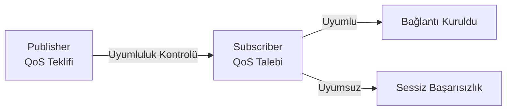
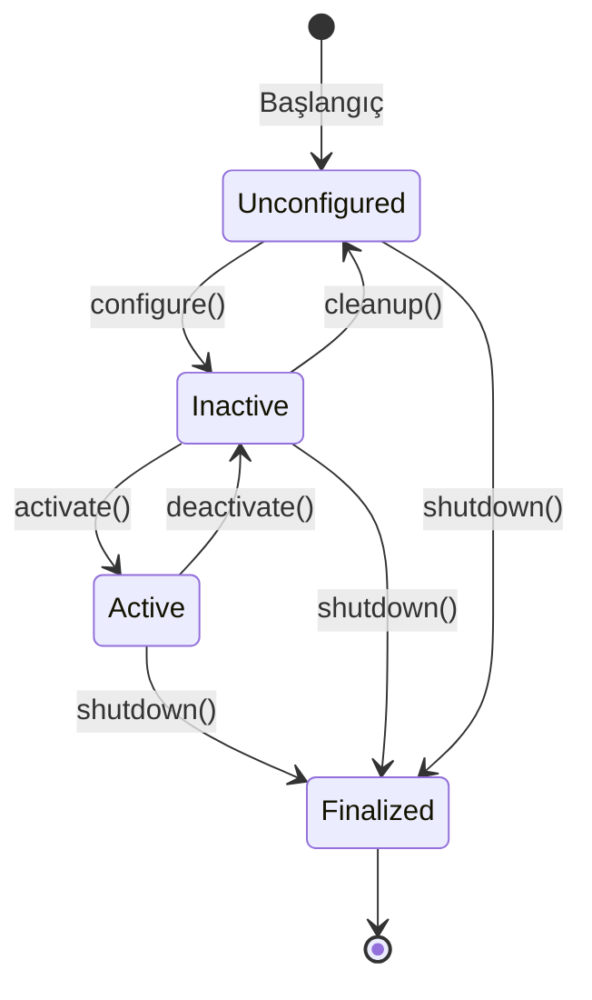
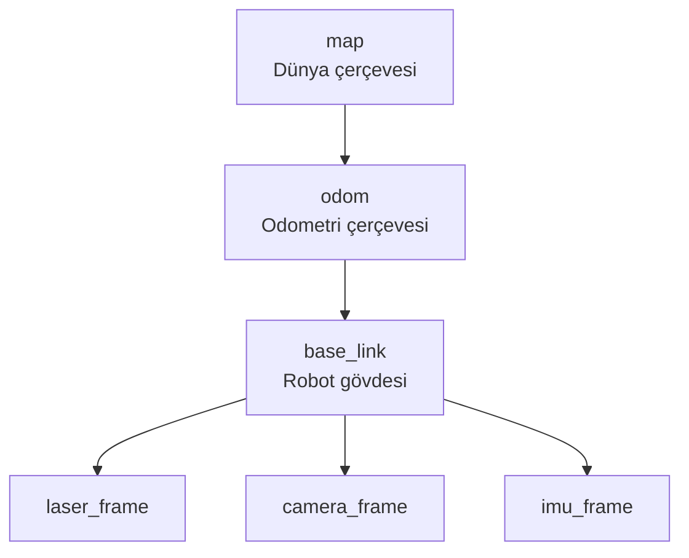
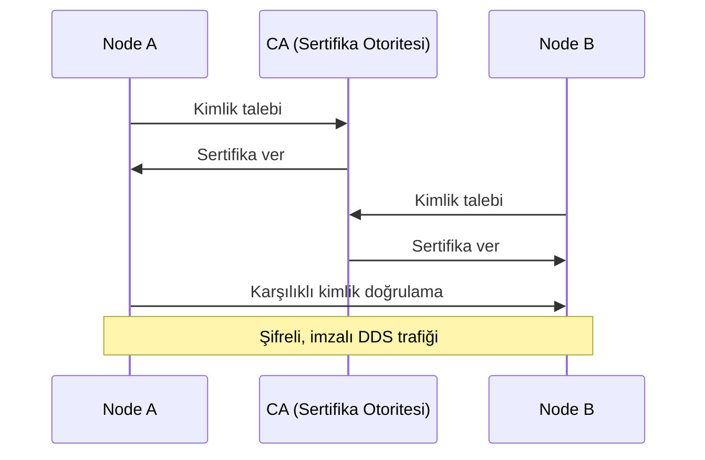

# ROS 2 - Derinlemesine Rehber

ROS 2, robot yazılımı geliştirmek için tasarlanmış meta-işletim sistemidir. ROS 1'deki merkezi `rosmaster` mimarisini tamamen terk ederek **DDS (Data Distribution Service)** üzerine kurulmuş, merkeziyetsiz, gerçek zamanlı yetenekli bir haberleşme altyapısı sunar - tek bir sürecin çökmesi tüm sistemi durdurmaz. Bu sayfa kod örneklerine değil, "neden böyle çalışır?" sorusuna cevap veren kavramlara odaklanır.

---

## Mimari ve Haberleşme Altyapısı

ROS 2 API'si (`rclcpp`/`rclpy`), doğrudan ağ üzerinde konuşmaz; katmanlı bir yapı üzerinden DDS'e devreder:

| Katman           | Sorumluluk                          | Değiştirilebilir mi?     |
| ------------------- | -------------------------------------- | :--------------------------: |
| **rclcpp/rclpy**    | Dile özgü API, callback, executor      | Kullanılan dille sabit        |
| **rcl**             | Dilden bağımsız çekirdek C API         | -                             |
| **rmw**              | DDS uygulamasından soyutlama katmanı   | ✓ (`RMW_IMPLEMENTATION`)       |
| **DDS**              | RTPS, QoS, cihaz keşfi (discovery)     | ✓ (FastDDS / CycloneDDS / Connext) |
| **Taşıma**           | UDP / TCP / Shared Memory              | DDS yapılandırmasıyla         |

**Neden UDP?** TCP'nin gerçek zamanlı haberleşme için sorunlu yönleri vardır: bağlantı kurmak için el sıkışma gecikmesi ister, tek bir kayıp paket tüm akışı bloklar (head-of-line blocking) ve çok sayıda alıcıya aynı veriyi tekrar tekrar gönderme zorunluluğu getirir (multicast desteği yoktur). ROS 2'nin temel taşıma protokolü RTPS, bunun yerine UDP üzerinde çalışır ve TCP'nin sağladığı güvenilirliği **kendi uygulama katmanında** yeniden inşa eder: alıcı, eksik bir mesaj sıra numarası tespit ettiğinde göndericiye `ACKNACK` ile bildirir, gönderici de sadece o mesajı yeniden gönderir. Bu sayede hem multicast'in verimliliği hem de TCP'ye yakın bir güvenilirlik garantisi elde edilir.

Bu tasarım, topic bazında bir seçim sunar: **best-effort** topic'lerde (kamera, lidar gibi yüksek frekanslı sensör akışları) kayıp paket tolere edilir ve düşük gecikme önceliklenir; **reliable** topic'lerde (komut gönderme, durum güncelleme gibi kritik mesajlar) RTPS'in yeniden gönderim mekanizması devreye girer.

DDS'in kendisi bir uygulama değil, bir **standarttır**; ROS 2 farklı DDS uygulamalarından (vendor) birini kullanabilir:

|                    | **FastDDS** (eProsima) | **CycloneDDS** (Eclipse) | **Connext** (RTI) |
| -------------------- | :-----------------------: | :---------------------------: | :--------------------: |
| Lisans                |        Apache 2.0          |        Eclipse/Apache          |         Ticari           |
| ROS 2 varsayılanı      |         Humble+             |            Seçenek              |          Seçenek          |
| Shared Memory desteği   |     ✓ (FastDDS SHM)         |          ✓ (iceoryx ile)         |            ✓             |
| Performans             |          Yüksek              |         **En yüksek**            |          Yüksek           |
| DDS-Security           |             ✓                 |               ✓                   |             ✓              |
| WAN (uzak ağ) desteği   |          Sınırlı              |            Sınırlı                |             ✓              |

Kullanılan uygulama, `RMW_IMPLEMENTATION` ortam değişkeniyle (örn. `rmw_cyclonedds_cpp`) çalışma zamanında değiştirilebilir - kod değişikliği gerekmez.

---

## QoS - Kalite Servis Politikaları

QoS (Quality of Service), bir publisher ile subscriber arasındaki "haberleşme davranışı sözleşmesi"dir. En kritik nokta şudur: **uyumsuz QoS, bağlantının hatayla değil sessizce kurulamamasına** yol açar - publisher ve subscriber görünürde birbirini bulur ama hiç mesaj akmaz. Bu yüzden "topic'i görüyorum ama veri gelmiyor" sorunlarının ilk şüphelisi her zaman QoS uyumsuzluğu olmalıdır.

| Politika          | Değerler                                       | Ne İşe Yarar                                                              | Tipik Kullanım                                    |
| ------------------- | -------------------------------------------------- | ------------------------------------------------------------------------------ | -------------------------------------------------- |
| **Reliability**      | `RELIABLE` / `BEST_EFFORT`                          | Kayıp mesajın yeniden gönderilip gönderilmeyeceği                                | Komut/servis = RELIABLE; sensör akışı = BEST_EFFORT |
| **Durability**       | `VOLATILE` / `TRANSIENT_LOCAL`                      | Geç bağlanan subscriber'ın önceki mesajları alıp almayacağı                       | Harita, statik parametreler = TRANSIENT_LOCAL       |
| **History**          | `KEEP_LAST(N)` / `KEEP_ALL`                          | Tamponda kaç mesajın tutulacağı                                                 | Çoğu durumda `KEEP_LAST` yeterlidir                  |
| **Deadline**         | Süre (ms)                                            | Mesajın belirtilen sürede gönderilmesi/alınması zorunluluğu; aşılırsa callback tetiklenir | Belirli bir frekansı garanti etmesi gereken kontrol döngüleri |
| **Liveliness**       | `AUTOMATIC` / `MANUAL_BY_TOPIC`                       | Node'un hâlâ "canlı" olduğunu bildirme biçimi (yazılımsal watchdog)              | Kritik node'ların çökme tespiti                       |
| **Lifespan**         | Süre (ms)                                            | Mesajın belirli bir süre sonra "bayat" sayılıp atılması                          | Zamanla geçersizleşen komutlar                        |

!!! tip "Yaygın Bir Kalıp: 'Her Zaman Son Değer'"
    `TRANSIENT_LOCAL` (geç bağlanana geçmişi ver) ile `KEEP_LAST(1)` (sadece son mesajı tut) birlikte kullanıldığında, geç başlayan bir subscriber bile topic'in en güncel değerine anında erişir. `/map` veya `/robot_description` gibi nadiren değişen ama her zaman güncel olması gereken topic'lerde standart kullanımdır.

!!! warning "Uyumluluk Kuralı"
    Bir publisher `BEST_EFFORT` yayınlıyorsa, yalnızca `BEST_EFFORT` isteyen subscriber'lar bağlanabilir. Publisher `RELIABLE` ise hem `RELIABLE` hem `BEST_EFFORT` isteyen subscriber'lar bağlanabilir - yani RELIABLE, BEST_EFFORT'un isteklerini de karşılar ama tersi geçerli değildir. Sık kullanılan senaryolar için hazır profiller vardır (`SensorDataQoS`, `SystemDefaultsQoS`, `ServicesQoS`) - her politikayı elle ayarlamak yerine bunlardan başlamak önerilir.

---

## Haberleşme Performansı: Intra-Process, Shared Memory ve Domain Ayrımı

ROS 2, node'ların birbirine ne kadar "yakın" olduğuna göre otomatik olarak farklı bir taşıma yolu seçer - amaç, mümkün olan en düşük gecikmeyi sağlamaktır.

| Yöntem                     | Kapsam                    | Kopyalama | Serileştirme | Tipik Gecikme |
| ----------------------------- | ---------------------------- | :---------: | :-------------: | :---------------: |
| **Intra-Process**              | Aynı süreç (aynı Component Container) | ✗          | ✗                 | ~100 ns              |
| **Loaned Messages** (DDS)      | Aynı host, farklı süreç        | ✗          | ✗                 | ~1 µs                |
| **iceoryx SHM** (CycloneDDS)   | Aynı host, farklı süreç        | ✗          | ✗                 | ~1 µs                |
| **UDP Loopback**                | Aynı host                     | ✓          | ✓                 | ~50 µs               |
| **UDP (Ağ üzeri)**              | Farklı host                    | ✓          | ✓                 | > 1 ms                |

- **Intra-Process:** Aynı süreçteki node'lar (bir **Component Container** içinde çalıştırıldıklarında) arasında mesaj hiç kopyalanmadan, doğrudan bellek işaretçisi devri ile aktarılır. Kamera/lidar gibi büyük mesajları aynı süreçte işleyen, mikrosaniye gecikmenin önemli olduğu sistemlerde tercih edilir.
- **Loaned Messages:** Farklı süreçlerde ama aynı makinede çalışan node'lar için, publisher mesaj belleğini kendi ayırmak yerine DDS middleware'den "ödünç alır"; mesaj DDS'in yönettiği paylaşılan bellekte yaşar ve subscriber aynı belleği doğrudan okur. Yalnızca sabit boyutlu (POD) veri tipleriyle tam uyumludur.
- **iceoryx / SHM Transport:** CycloneDDS veya FastDDS'in işletim sistemi seviyesindeki paylaşılan belleği kullanarak süreçler arası sıfır kopya sağlayan alternatif bir mekanizmadır; ek bir arka plan servisi (`iox-roudi`) gerektirir.
- **UDP:** Farklı makineler arası (veya bu mekanizmalardan biri etkin değilse aynı makinede) varsayılan yoldur; her zaman kopyalama ve serileştirme maliyeti içerir.

**İzolasyon mekanizmaları:** Geliştirme sırasında farklı ROS 2 sistemlerinin birbirine karışmaması için iki bağımsız araç vardır. `ROS_LOCALHOST_ONLY` etkinleştirildiğinde tüm DDS trafiği yalnızca `127.0.0.1` üzerinden akar - ağdaki başka hiçbir makine bu node'ları göremez. `ROS_DOMAIN_ID` (0-101 arası güvenli aralık) ise, aynı ağdaki farklı ROS 2 sistemlerini birbirinden mantıksal olarak ayırır: her domain ID kendi multicast/unicast port aralığını kullanır, farklı Domain ID'ye sahip node'lar birbirini hiç göremez.

!!! warning "Sessiz Domain ID Uyuşmazlığı"
    Farklı terminal sekmeleri farklı `ROS_DOMAIN_ID` değerleriyle açılmışsa, node'lar hatasız çalışır ama birbirini asla göremez - hata mesajı vermeden "sistem çalışmıyor" hissi verir. Domain ID'nin 101'in üzerine çıkması, Linux'un geçici (ephemeral) port aralığıyla çakışabileceğinden önerilmez.

---

## Node, Topic, Service, Action - Temel İletişim Kalıpları

Bir **Node**, tek bir amaca odaklanmış çalıştırılabilir bir süreçtir (örn. bir sürücü, bir planlayıcı). Node'lar birbirleriyle üç farklı iletişim modelinden birini kullanarak konuşur:

| Model       | Yön                | Senkron mu?               | Ne Zaman Kullanılır                                                    |
| ------------- | --------------------- | ---------------------------- | -------------------------------------------------------------------------- |
| **Topic**     | Çoktan-çoğa (pub/sub) | Asenkron, sürekli akış         | Sensör verisi, durum yayınları - kimin dinlediği publisher'ı ilgilendirmez  |
| **Service**   | Birebir (istemci/sunucu) | Senkron, bloklayan istek-yanıt | Kısa süren, anında sonuç bekleyen işlemler (bir bayrağı aç/kapat)             |
| **Action**    | Birebir, uzun süreli    | Asenkron, geri bildirimli       | Uzun süren görevler (navigasyon, manipülasyon) - Goal → periyodik Feedback → Result |

Topic modeli tamamen ayrıştırılmıştır (decoupled): publisher, kimin dinlediğini bilmez ve umursamaz. Service modeli, geleneksel bir fonksiyon çağrısına benzer - istemci yanıt gelene kadar bloke olur, bu yüzden uzun süren işlemler için uygun değildir. Action, bu ikisinin bir sentezidir: Service gibi bir sonuç (Result) döndürür ama bekleme süresince periyodik ilerleme bildirimleri (Feedback) yayınlar ve iptal edilebilir.

Her üç iletişim modelinin de kendi tanı komut ailesi vardır (`ros2 node`, `ros2 topic`, `ros2 service`, `ros2 action`); bunlarla ilgili node'ları/uç noktaları listelemek, canlı mesaj içeriğini izlemek, yayın frekansını ve gecikmesini ölçmek ve arayüz (mesaj/servis/action) yapısını incelemek mümkündür.

---

## Component, Executor ve Lifecycle Node

**Component Container**, birden fazla node'u aynı işletim sistemi süreci içinde barındıran bir mekanizmadır. Bunun getirdiği üç somut kazanım vardır: intra-process haberleşme (sıfır kopya) mümkün olur, her ayrı DDS katılımcısının (participant) sabit belleği/CPU maliyeti tekrarlanmaz, ve daha az süreç sayısı işletim sistemi seviyesinde daha az context switch anlamına gelir. Node'lar container'a çalışma zamanında (dinamik olarak) yüklenip kaldırılabilir.

**Executor**, DDS'ten gelen olayları (yeni mesaj, zamanlayıcı, servis isteği) alıp ilgili callback'i çalıştıran mekanizmadır:

| Executor Tipi                     | Davranış                                                          |
| ------------------------------------ | ---------------------------------------------------------------------- |
| `SingleThreadedExecutor`             | Tüm callback'ler tek thread'de, sırayla çalışır - en basit ve öngörülebilir |
| `MultiThreadedExecutor`               | Callback'ler bir thread havuzunda paralel çalışabilir                     |
| `StaticSingleThreadedExecutor`         | Derleme zamanı optimizasyonlu tek thread; gerçek zamanlı sistemler için tercih edilir |

Paralellik ince ayarı **Callback Group**'larla yapılır: `MutuallyExclusive` grubundaki callback'ler asla aynı anda çalışamaz (paylaşılan veriye erişimi korumak için doğal bir kilit görevi görür); `Reentrant` gruptakiler ise paralel çalışabilir. Callback group'lar yalnızca `MultiThreadedExecutor` ile birlikte anlamlıdır.

**Lifecycle Node**, bir node'un durumunu dışarıdan (bir yönetici süreç tarafından) kontrol edilebilir hale getirir - kritik bileşenlerin güvenli, sıralı başlatılıp kapatılması gerektiğinde kullanılır:

`configure()` aşamasında kaynaklar (publisher, bellek) ayrılır ama hiçbir şey henüz yayınlanmaz; yalnızca `activate()` sonrasında node fiilen veri üretmeye/tüketmeye başlar. Bu ayrım, bir node'u "hazır ama pasif" durumda bekletip, sistemin geri kalanı hazır olduğunda tek bir komutla devreye almayı mümkün kılar - örneğin bir donanım sürücüsünün, kalibrasyon tamamlanana kadar `Inactive` durumda bekletilmesi.

---

## Paket Yapısı, Derleme ve Launch

Bir ROS 2 çalışma alanı (workspace), kaynak kodun (`src/`), derleme ürünlerinin (`build/`), kurulu paketlerin (`install/`) ve logların (`log/`) ayrı dizinlerde tutulduğu standart bir yapı izler; bir paket ya C++ (`ament_cmake`, `CMakeLists.txt`) ya da Python (`ament_python`, `setup.py`) tabanlı olabilir ve her ikisi de bağımlılıklarını `package.xml` ile bildirir. Bağımlılıkların sistemde kurulu olup olmadığı `rosdep` ile denetlenir; derleme işlemi `colcon` aracıyla yapılır - bu araç, paketler arası bağımlılık grafiğini otomatik çözerek doğru sırada derler ve tek bir paketi ya da tüm çalışma alanını seçici olarak derleyebilir.

**Launch sistemi**, birden fazla node'u, parametreyi ve koşullu mantığı tek bir komutla ayağa kaldırmak için kullanılır. Bir launch dosyası; başka launch dosyalarını içine alabilir (modülerlik), bir grup node'u tek bir Component Container içinde tanımlayarak intra-process haberleşmeyi otomatik etkinleştirebilir ve komut satırı argümanlarına bağlı koşullu node başlatma (örn. yalnızca simülasyon modunda belirli bir node'u başlatma) tanımlayabilir.

**Parametreler**, bir node'un çalışma zamanı davranışını kod değiştirmeden ayarlamayı sağlar (örn. maksimum hız, PID katsayıları). Bir node başlangıçta parametrelerini varsayılan değerleriyle bildirir; bu değerler bir YAML dosyasından yüklenebilir, komut satırından geçirilebilir veya sistem çalışırken canlı olarak değiştirilebilir - node isterse bir değişiklik doğrulama callback'i tanımlayarak geçersiz değerleri (örn. negatif bir hız) reddedebilir.

**Mesaj, servis ve action arayüzleri** (`.msg`/`.srv`/`.action` dosyaları), topic/service/action üzerinden taşınan verinin şemasını tanımlar. Bir `.msg` dosyası düz bir alan listesidir; bir `.srv` dosyası `---` ile ayrılmış istek ve yanıt bölümlerinden oluşur; bir `.action` dosyası ise aynı `---` ayracıyla üçe bölünür: Goal (istenen hedef), Result (nihai sonuç) ve Feedback (görev sürerken periyodik olarak yayınlanan ilerleme). Bu arayüzler paket derlenirken hem C++ hem Python için otomatik olarak tip-güvenli kod üretir.

---

## tf2 - Koordinat Dönüşümleri

`tf2`, farklı koordinat çerçevelerindeki (frame) verileri birbirine dönüştüren ROS 2'nin temel kütüphanesidir. Her sensör, robot parçası ve ortam öğesi kendi çerçevesinde ifade edilir; `tf2` bunlar arasındaki geometrik ilişkiyi zaman damgalı olarak takip eder ve "lazerin gördüğü nokta, haritada nereye denk geliyor?" gibi sorulara cevap verir.

| Çerçeve            | Açıklama                                                    |
| -------------------- | ---------------------------------------------------------------- |
| `map`                 | Küresel sabit referans; SLAM/lokalizasyon tarafından yayınlanır    |
| `odom`                | Sürekli (atlama yapmayan) odometrik referans; encoder/IMU'dan gelir |
| `base_link`           | Robot gövdesinin merkezi                                          |
| `base_footprint`      | Robotun zemine izdüşümü; navigasyon planlamasında kullanılır        |
| `sensor_frame`        | Bir sensörün fiziksel veya optik merkezi                            |

Çerçeveler arasındaki dönüşümler iki türlüdür: **statik** (kamera gövdeye sabit bağlıdır, bir kere tanımlanır ve değişmez) ve **dinamik** (robot hareket ettikçe sürekli güncellenen `odom → base_link` gibi dönüşümler). Bir uygulama, iki çerçeve arasındaki güncel ilişkiyi sorgulamak istediğinde `tf2` zaman damgalarını kullanarak en uygun (veya istenen ana ait) dönüşümü hesaplar; talep edilen dönüşüm henüz yayınlanmamışsa bir hata fırlatılır - bu yüzden sorgu kodu her zaman bu hatayı ele almalıdır.

!!! tip "map → odom → base_link Ayrımının Nedeni"
    `map → odom` dönüşümü SLAM/lokalizasyon tarafından yayınlanır ve **atlama yapabilir** (yeni bir lokalizasyon tahmini geldiğinde robot konumu aniden düzeltilir). `odom → base_link` ise yalnızca tekerlek/IMU verisine dayanır, **monoton ve sürekli**dir ama zamanla kayar (drift). Navigasyon yığını bu ikisini bilerek ayırır: anlık, tepkisel hareket kararları (yerel planlayıcı) `odom`'a, uzun vadeli rota planlaması (küresel planlayıcı) `map`'e dayanır.

---

## pluginlib ve ros2_control

**pluginlib**, bir temel arayüzün (soyut sınıfın) farklı uygulamalarını, derleme zamanında birbirine bağımlı olmadan, çalışma zamanında (`dlopen` ile) yüklemeyi sağlayan bir mekanizmadır. Bir paket yalnızca ortak arayüzü bilir; hangi somut uygulamanın (örn. hangi yol planlama algoritmasının) kullanılacağı bir parametre ile çalışma zamanında seçilir. Nav2'deki costmap katmanları, planlayıcılar ve kontrolörler bu mekanizmayla değiştirilebilir haldedir - yeni bir algoritma eklemek, mevcut sistemi yeniden derlemeyi gerektirmez.

**ros2_control**, robot donanımını (motor, encoder, IMU) standart bir arayüz arkasında soyutlayan bir çerçevedir. Bir **Hardware Interface**, gerçek donanımdan periyodik olarak veri okur (State Interface: pozisyon, hız) ve komut yazar (Command Interface: hedef hız/pozisyon); bu katman gerçek donanım, bir mock (sahte donanım) veya bir simülatör (Gazebo) olabilir - üstteki kontrol mantığı hangisinin çalıştığını bilmez. **Controller Manager**, bu donanım arayüzleri ile üst seviye kontrolörler (diferansiyel sürüş kontrolörü, eklem yörünge kontrolörü gibi) arasındaki koordinasyonu, sabit bir güncelleme frekansında yönetir. Bu katmanlı tasarım sayesinde aynı kontrolör kodu, gerçek robotta ve simülasyonda değişiklik yapılmadan çalışır.

---

## Test, Loglama, Teşhis ve Kayıt

**Test:** ROS 2, C++ için birim testte `gtest` (`ament_cmake_gtest`), entegrasyon testinde ise gerçek node'ları başlatıp davranışlarını doğrulayan `launch_testing` kullanır; tüm testler `colcon test` ile tek komutla çalıştırılır ve sonuçlar toplu raporlanır. Birim testler saf mantığı (algoritma, hesaplama) izole doğrularken, launch testleri node'lar arası gerçek haberleşmeyi (bir node'un beklenen topic'e gerçekten yayın yapıp yapmadığını) doğrular.

**Loglama:** Log mesajları önem sırasına göre beş seviyeye ayrılır - `DEBUG` (ayrıntı), `INFO` (normal bilgi), `WARN` (beklenmedik ama kurtarılabilir durum), `ERROR` (hata), `FATAL` (kritik, süreç durabilir). Çalışan bir node'un log seviyesi yeniden derlemeye gerek kalmadan çalışma zamanında değiştirilebilir. Yüksek frekanslı döngülerde her iterasyonda log basmak performansı ciddi etkileyebileceğinden, "throttled" (belirli aralıklarla en fazla bir kez basılan) log fonksiyonları tercih edilir. Çalışan bir node uzak bir hata ayıklayıcıya (GDB) bağlanarak canlı incelenebilir.

**Sistem Teşhisi:** `ros2 doctor`, ortamdaki yaygın yapılandırma sorunlarını (eksik bağımlılık, QoS uyuşmazlığı, ağ ayarı) otomatik tarar. `rqt_graph`, node'lar ve topic'ler arasındaki bağlantıları görsel bir grafik olarak gösterir - beklenmeyen bir bağlantının eksik/fazla olduğu ilk bakışta görülür. Bir topic'in yayın frekansı ve uçtan uca gecikmesi ayrı komutlarla ölçülebilir; DDS'in ağ üzerindeki gerçek trafiği de standart paket yakalama araçlarıyla (`tcpdump`) izlenebilir, çünkü sonuçta sıradan UDP paketleridir.

**Kayıt ve Yeniden Oynatma (`ros2 bag`):** Çalışan bir sistemdeki tüm veya seçili topic'lerin trafiği zaman damgalarıyla birlikte diske kaydedilebilir ve daha sonra gerçek donanım/sensör olmadan, gerçek zamanlı ya da hızlandırılmış/yavaşlatılmış şekilde yeniden oynatılabilir. Bu, regresyon testinde ("yeni algoritma aynı kayıtlı veride eskisinden daha mı iyi?") ve saha sorunlarının ofiste tekrar üretilmesinde vazgeçilmez bir araçtır.

**Diagnostics:** `diagnostic_updater`, bir node'un kendi sağlık durumunu (bağlantı var mı, sıcaklık normal mi, veri hızı yeterli mi) standart bir formatta periyodik olarak yayınlamasını sağlayan bir kütüphanedir; `diagnostic_aggregator` sistem genelindeki bu raporları toplayıp özetler. Bu sayede bir operatör, onlarca node'un loglarını tek tek okumak yerine tek bir özet ekrandan sistemin sağlığını izleyebilir.

---

## Güvenlik (SROS2)

SROS2, DDS-Security standardı üzerinden şifreleme, karşılıklı kimlik doğrulama ve erişim kontrolü ekler. Her node'a, bir sertifika otoritesi (CA) tarafından imzalanmış bir **kimlik** (identity) ve hangi topic'lere yayın/abone olabileceğini, hangi servisleri çağırabileceğini tanımlayan bir **izin belgesi** (permissions) atanır.

Bu yapı, bir **keystore** (CA'nın kendisi) ve her node için ayrı bir **enclave** (o node'a özgü sertifika + izin dosyaları seti) etrafında kurulur. İzin politikaları, bir node'un yalnızca belirli topic'lere yayın yapabileceği, servis çağrılarının tamamen yasaklanabileceği gibi ayrıntı düzeyinde tanımlanabilir.

!!! warning "SROS2 Üretim Notları"
    - CA'nın özel anahtarı asla robot üzerinde tutulmamalıdır - yalnızca sertifika üretimi için kullanılan güvenli bir makinede kalmalıdır.
    - `Enforce` modunda sertifikasız node hiç başlamaz (güvenli varsayılan); `Permissive` modunda sertifikasız node yine başlar ama şifresiz iletişim kurar - yalnızca geliştirme/test için kullanılmalıdır.
    - Sertifika süresi dolduğunda tüm sistem iletişimi aniden durur; otomatik yenileme planı olmadan üretime alınmamalıdır.

---

## Gerçek Zamanlı (Real-Time) ROS 2

Gerçek zamanlı bir sistemde önemli olan "ortalama hız" değil **determinizm**dir - bir callback'in her seferinde öngörülebilir bir sürede tamamlanması. Bunu bozan en büyük üç kaynak: çalışma zamanında dinamik bellek tahsisi (`malloc`/`new` süresi öngörülemez), işletim sistemi zamanlayıcısının gecikmesi ve öncelik ters dönmesi (priority inversion).

Pratikte bu, birkaç somut kurala dönüşür: callback'ler içinde bellek tahsis etmemek (gerekli bellek önceden ayrılır), `StaticSingleThreadedExecutor` gibi dinamik tahsis yapmayan bir executor kullanmak, sürece işletim sisteminin gerçek zamanlı zamanlama sınıfını (`SCHED_FIFO`) ve yüksek öncelik atamak, ve fiziksel bellek sayfalarının sonradan yüklenmesini (page fault) önlemek için belleği önceden kilitlemek (`mlockall`). Süreçler arası zero-copy veri paylaşımı için Loaned Messages API tercih edilmelidir, çünkü normal DDS yolu serileştirme ve kopyalama içerir.

**Priority Inversion**, yüksek öncelikli bir gerçek zamanlı thread'in, düşük öncelikli bir thread'in elinde tuttuğu bir kilidi (mutex) beklerken, düşük öncelikli thread'in de zamanlayıcı tarafından çalıştırılamaması (çünkü araya orta öncelikli başka thread'ler girmiştir) durumudur - yüksek öncelikli thread beklenmedik şekilde uzun süre bloke kalır ve determinizm bozulur. İki standart çözüm vardır: kilidi tutan thread'in geçici olarak yüksek önceliğe yükseltildiği **priority inheritance** mutex'leri kullanmak, ya da kilit gerektirmeyen (**lock-free**) veri yapılarına geçmek.

---

## ROS 1 vs ROS 2 - Temel Farklar

| Konu                 |             ROS 1              |             ROS 2             |
| ---------------------- | :--------------------------------: | :---------------------------------: |
| **Mimari**             |    Merkezi (`rosmaster` zorunlu)     |   Merkeziyetsiz (DDS discovery)       |
| **Haberleşme**          | XMLRPC (keşif) + TCPROS/UDPROS       |             DDS / RTPS                |
| **Tek hata noktası**    | `rosmaster` çökerse sistem durur     |                 Yok                   |
| **QoS**                 |                Yok                    |        DDS QoS politikaları            |
| **Güvenlik**            |                Yok                    |        DDS-Security (SROS2)            |
| **Gerçek Zaman**        |              Sınırlı                  |     Destekli (real-time executor)       |
| **Windows Desteği**     |            Resmi değil                 |                  ✓                     |
| **Intra-Process**       |                Yok                     |            ✓ Sıfır kopya               |
| **Lifecycle Node**      |                Yok                     |                  ✓                     |
| **Süreç İçi Modülerlik**|              Nodelet                   |             ✓ Component                |
| **Dil Sürümleri**       |         C++03/11, Python 2              |          C++14/17, Python 3             |

---

## İpuçları ve En İyi Pratikler

!!! tip "Büyük Mesajlar (Görüntü, Nokta Bulutu)"
    - Aynı süreçte işleme yapılıyorsa → **Component Container + Intra-process**
    - Farklı süreç ama aynı makine → **SHM taşıma** (iceoryx veya FastDDS SHM)
    - Farklı makine → sıkıştırma (`image_transport`) ile birlikte ağ üzerinden UDP

!!! tip "QoS Uyumsuzluğunu Teşhis Etme"
    Publisher ve subscriber sayısı doğru görünüyor ama mesaj akmıyorsa, ilk kontrol edilmesi gereken şey Reliability ve Durability değerlerinin uyumluluğudur.

!!! warning "Domain ID'yi Unutmayın"
    Farklı terminallerde farklı `ROS_DOMAIN_ID` değeri kullanılıyorsa node'lar sessizce birbirini göremez. Bu tür ortam değişkenlerini (`ROS_DOMAIN_ID`, `RMW_IMPLEMENTATION`, `ROS_LOCALHOST_ONLY`) proje genelinde sabitleyip (`.bashrc` veya bir ortam kurulum betiği ile) tüm terminallerde tutarlı tutmak, "sistem çalışmıyor" görünen ama aslında hiç bağlanmamış node kaynaklı sorunların en yaygın nedenini ortadan kaldırır.
