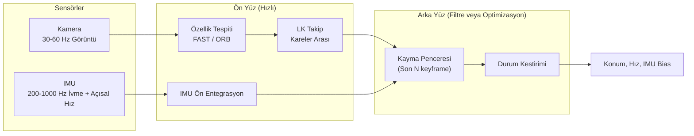
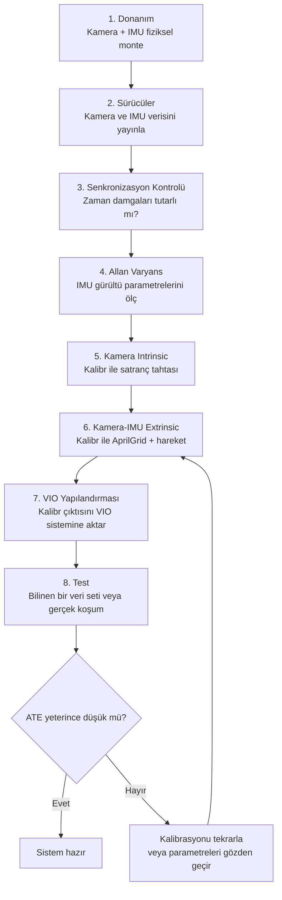

# VIO - Görsel-Atalet Odometri

!!! note "Bu Sayfa Ne Anlatıyor?"
    Optical flow'dan başlayarak VIO'nun iç mimarisine, filtre/optimizasyon tabanlı yaklaşımların karşılaştırmasına, OpenVINS'e ve Kalibr ile kamera-IMU kalibrasyonuna kadar kavramsal bir rehber. Amaç kod yazmak değil, "neden böyle tasarlanmış?" sorusuna cevap vermektir.

---

## Optik Akış (Optical Flow)

Bir videodan iki ardışık kare alıp her pikselin bir sonraki karede nereye gittiğini bulursanız, kameranın veya sahnedeki nesnelerin nasıl hareket ettiğini çıkarabilirsiniz - buna **optik akış** denir. Bu hesap iki varsayıma dayanır: kısa sürede bir pikselin parlaklığının değişmediği (**parlaklık sabitliği**) ve pikselin bir sonraki karede çok uzağa gitmediği (**küçük hareket**). Bu iki varsayım Taylor açılımıyla birleştirildiğinde tek bir kısıt denklemi ortaya çıkar:

$$I_x u + I_y v + I_t = 0$$

Burada `I_x`, `I_y` görüntünün yatay/dikey gradyanı, `I_t` zaman içindeki parlaklık değişimi, `u`, `v` ise aranan yatay/dikey piksel hızıdır. Sorun şu ki bu tek denklemde iki bilinmeyen (`u`, `v`) vardır - buna **aperture problemi** denir: bir kenar parçasına dar bir pencereden bakıldığında, kenara paralel yöndeki hareket görülemez. Bu belirsizliği çözmek için iki farklı ek varsayım/yaklaşım geliştirilmiştir:

| Yöntem              | Ek Varsayım                                      | Çıktı                          | Hız              | Tipik Kullanım                     |
| --------------------- | ---------------------------------------------------- | ---------------------------------- | ------------------- | -------------------------------------- |
| **Lucas-Kanade** (seyrek) | Küçük bir pencerede (örn. 15×15 piksel) tüm pikseller aynı hareketi yapar | Seçili (köşe) noktalarda vektör    | Hızlı (100+ FPS)     | VIO, nesne takibi                       |
| **Farneback** (yoğun)     | Global düzgünlük (Horn-Schunck ailesi)                | Görüntüdeki her piksel için vektör | Yavaş (10-30 FPS)     | Segmentasyon, arka plan çıkarma          |

**Lucas-Kanade** yaklaşımında, seçilen penceredeki her piksel kendi denklemini katkı olarak verir; N pikselli bir pencere iki bilinmeyene karşı N denklem üretir (aşırı belirlenmiş sistem) ve çözüm en küçük kareler yöntemiyle bulunur:

$$\mathbf{d} = (A^\top A)^{-1} A^\top \mathbf{b}$$

Bu çözümün sağlıklı olması için seçilen noktanın **köşe** özelliği taşıması gerekir - düz bir kenar veya tekdüze bir yüzeyde `AᵀA` matrisi tekilleşir ve akış hesaplanamaz; bu yüzden takip öncesi mutlaka "iyi" (köşe niteliğinde) noktalar seçilir.

Büyük hareketler "küçük hareket" varsayımını bozar; bunun çözümü **piramit** yaklaşımıdır: görüntü önce birkaç kez küçültülür (büyük hareket, küçük çözünürlükte küçük hareket gibi görünür), en düşük çözünürlükte kaba bir tahmin yapılır, sonra her piramit seviyesinde tahmin kademeli olarak inceltilerek orijinal çözünürlüğe kadar rafine edilir.

!!! tip "Neden VIO Lucas-Kanade Tercih Eder?"
    VIO gerçek zamanlı çalışmak zorundadır ve tüm görüntü yerine yalnızca birkaç yüz iyi özellik noktasının takibiyle ilgilenir - bu yüzden hızlı, seyrek Lucas-Kanade neredeyse tüm VIO sistemlerinin (MSCKF, VINS-Mono, OpenVINS) ön yüzünde (frontend) kullanılır. Farneback gibi yoğun yöntemler VIO için gereksiz hesaplama yükü getirir.

---

## VIO Nedir ve Neden IMU Gerekli?

Yalnızca kamerayla (Visual Odometry, VO) konum kestirmek mümkündür ama kırılgandır. IMU eklenmesi (Visual **Inertial** Odometry), sistemin zayıf noktalarını doğrudan telafi eder:

| Sorun                              |      Sadece VO       |         VO + IMU (VIO)          |
| ------------------------------------- | :----------------------: | :----------------------------------: |
| Tek kamerada (mono) ölçek belirsizliği |       ✗ Bilinmez          |          ✓ IMU kurtarır               |
| Hızlı hareket / bulanıklık             |    ✗ Takip bozulur        |        ✓ IMU köprü kurar               |
| Karanlık / doku yok                    |  ✗ Özellik bulunamaz      |     ✓ IMU kısa süre devralır            |
| Uzun vadeli drift                      |     ✗ Hata birikir        |  Kısmen: IMU bias tahmin edilerek azaltılır |
| Başlangıç oryantasyonu                 |        Belirsiz            |       ✓ Yerçekimi vektöründen çıkarılır   |

Mono kamerada ölçek neden belirsizdir? Çünkü bir görüntüden, sahnenin "1 metre uzaklıkta 1 metre büyüklüğünde" mi yoksa "10 metre uzaklıkta 10 metre büyüklüğünde" mi olduğunu ayırt etmek mümkün değildir - iki durum da aynı görüntüyü üretir. IMU'nun ivme ölçümleri gerçek fiziksel birimlerde (m/s²) olduğundan, bu ölçeği sabitlemek için kullanılabilir.

IMU'nun da kendi zayıflığı vardır: **bias** (sürüklenme). Sensör tamamen sabit dururken bile ivmeölçer ve jiroskop tam sıfır göstermez; bu küçük sapma zamanla entegre edildikçe büyük konum hatasına dönüşür. VIO'nun temel işlerinden biri de bu bias'ı sistemin durumunun bir parçası olarak sürekli tahmin etmektir.

İki kamera karesi arasında IMU onlarca kez ölçüm yapar; bunların hepsini arka yüze tek tek vermek yerine, aradaki tüm ölçümler **IMU ön entegrasyonu (preintegration)** ile tek bir "delta dönüş, delta hız, delta konum" özetine sıkıştırılır. Bu özet, IMU bias tahmini sonradan değişse bile (matematiksel bir düzeltme terimiyle) yeniden ham veriye dönmeden güncellenebilir - bu da ciddi bir hesaplama tasarrufu sağlar.

---

## Arka Yüz Tasarımı: Filtre Tabanlı mı, Optimizasyon Tabanlı mı?

Ön yüz (özellik takibi, IMU ön entegrasyonu) hemen hemen tüm VIO sistemlerinde benzer çalışır; asıl mimari fark **arka yüzde** (backend) - yani "biriken ölçümlerden konum/hız/oryantasyon nasıl kestirilir?" sorusunun cevabında ortaya çıkar. İki temel felsefe vardır.

### Filtre Tabanlı Algoritmalar (EKF / UKF)

Sistemin o anki durumunu (konum, hız, oryantasyon, IMU bias) tek bir olasılık dağılımı olarak tutar. Yeni bir ölçüm geldiğinde (Kalman filtresinin **tahmin** ve **güncelleme** adımlarıyla) bu dağılım güncellenir ve **geçmiş ölçümler bir daha ele alınmaz** - geçmişin etkisi yalnızca güncel durumun içine sıkıştırılmış haldedir. **MSCKF (Multi-State Constraint Kalman Filter)**, bu ailenin VIO'daki en önemli üyesidir: klasik EKF-SLAM'in aksine harita noktalarını durumun bir parçası yapmaz (bu, harita büyüdükçe durumu da büyütüp sistemi yavaşlatırdı); bunun yerine bir noktanın birden fazla kamera pozisyonunda görülmesinden doğan geometrik kısıtı, o noktayı hiç tahmin etmeden doğrudan kamera pozlarını düzeltmek için kullanır. Durum yalnızca son birkaç kamera pozu ve IMU durumundan oluştuğu için **sabit boyutludur** - bu da gerçek zamanlı çalışmayı garanti eder. `ROVIO`, `MSF` bu ailenin diğer örnekleridir.

### Optimizasyon Tabanlı Algoritmalar (Faktör Grafı / Sliding Window)

Son N keyframe'i ve aralarındaki geometrik/eylemsel kısıtları (IMU ön entegrasyonu, ortak görülen noktalar) bir **faktör grafı** olarak tutar; yeni bir ölçüm geldiğinde geçmişteki tüm bu kısıtlar **birlikte**, doğrusal olmayan en küçük kareler (non-linear least squares) problemi olarak yeniden optimize edilir (Ceres, g2o, GTSAM gibi kütüphanelerle). Pencere dolup en eski keyframe dışarı çıkarken, o keyframe'in bilgisini kaybetmemek için doğrudan atmak yerine bir **prior faktörüne özetlenir** (marjinalizasyon) ve pencerede kalır. `VINS-Mono`, `ORB-SLAM3`, `OpenVINS` (MSCKF ile bu yaklaşımın bir hibridi) bu ailenin örnekleridir.

**Avantaj / Dezavantaj**

| Kriter                       | Filtre Tabanlı (EKF/MSCKF)                         | Optimizasyon Tabanlı (Faktör Grafı)                    |
| ------------------------------- | ------------------------------------------------------ | ------------------------------------------------------------ |
| Hesaplama maliyeti               | **Düşük**, sabit boyutlu durum                            | Daha yüksek; pencere boyutuyla artar                          |
| Doğruluk                         | Orta; geçmiş ölçümler tekrar değerlendirilmez               | **Daha yüksek**; geçmiş bilgi tekrar tekrar kullanılır (relinearization) |
| Doğrusal olmama (nonlinearity) ile başa çıkma | Zayıf; tek bir doğrusallaştırma noktasında sıkışabilir (yanlış yakınsama riski) | **İyi**; her iterasyonda yeniden doğrusallaştırılır             |
| Gerçek zamanlı garanti            | **Güçlü**; sabit iş yükü                                   | Pencere boyutuna ve donanıma bağlı; garanti daha zayıf           |
| Gecikmiş/sıra dışı gelen ölçümler  | Zor entegre edilir                                          | Faktör grafına doğal olarak eklenebilir                          |
| Uygulama karmaşıklığı              | Görece basit                                               | Daha karmaşık (marjinalizasyon, doğrusal olmayan çözücü gerekir) |
| Tipik örnekler                    | MSCKF, ROVIO, MSF                                            | VINS-Mono, ORB-SLAM3, OpenVINS, Kimera, Basalt                  |

!!! example "Hangisi Ne Zaman Seçilir?"
    - **Kaynak kısıtlı, gerçek zamanlılık kritik** (küçük drone, gömülü işlemci) → filtre tabanlı (MSCKF)
    - **Doğruluk önceliği, yeterli hesaplama gücü var** (yer robotu, offline harita çıkarma) → optimizasyon tabanlı
    - **İkisi bir arada:** OpenVINS gibi modern sistemler, MSCKF'in verimliliğini sliding-window optimizasyonuyla birleştirerek her iki dünyanın avantajını almaya çalışır - bazı noktalar MSCKF mantığıyla anında elenir, geri kalan kısıtlar pencerede optimize edilir.

---

## Mono, Stereo ve IMU Kombinasyonları

Kamera sayısı arttıkça sistemin sağlamlığı artar ama hesaplama maliyeti de artar:

| Özellik              |  Mono  |       Mono + IMU       |   Stereo  | Stereo + IMU |
| ---------------------- | :------: | :------------------------: | :---------: | :-------------: |
| Ölçek                  |    ✗     |    ✓ (başlatma sonrası)     |      ✓      |        ✓         |
| Derinlik               |    ✗     |            Kısmi             |      ✓      |        ✓         |
| Başlatma kolaylığı      |  Düşük   |            Orta              |  **Kolay**   |      Kolay        |
| Hesaplama yükü          |    Az    |            Orta              |     Çok      |    **En çok**     |
| Sağlamlık               |  Düşük   |            Orta              |     İyi      |    **En iyi**     |

Stereo kameranın en büyük katkısı, tek bir kareden bile üçgenleme yoluyla gerçek metrik derinlik ölçebilmesidir - bu da sistemin ölçeği anında (IMU hareket beklemeden) bilmesini sağlar. IMU eklenmesi ise hem mono hem stereo sistemlerde hızlı hareket ve doku eksikliğine karşı dayanıklılığı artırır.

!!! tip "Pratik Öneri"
    - Küçük drone, ağırlık/güç kritik → **Mono + IMU**
    - Kapalı alan, metrik konum önemli → **Stereo + IMU**
    - Derinlik sensörü zaten mevcutsa → **Stereo** veya RGB-D doğrudan kullanılabilir

---

## OpenVINS - Açık Kaynak Referans VIO Sistemi

**OpenVINS**, Wisconsin Üniversitesi'nin geliştirdiği, MSCKF ile sliding-window optimizasyonunu birleştiren açık kaynaklı bir VIO sistemidir; akademik camiada referans uygulama sayılır. Mono, stereo ve RGB-D kamera girişini destekler, kamera-IMU dış parametrelerini (extrinsic) çalışırken de güncelleyebilir (online kalibrasyon), ve EuRoC/TUM-VI gibi standart veri setleriyle doğrulanmıştır.

OpenVINS'in davranışı tek bir yapılandırma dosyasıyla belirlenir; bu dosyadaki parametreler kabaca dört gruba ayrılır:

- **Kamera-IMU senkronizasyonu ve gürültü modeli:** kamera ile IMU arasındaki zaman gecikmesi ve IMU'nun gürültü/bias karakteristiği (bunlar Kalibr ve Allan varyans analiziyle ölçülür).
- **Başlangıç (initialization) ayarları:** sistemin harekete başlamadan önce ne kadar bekleyeceği ve yerçekimi vektörünü doğru kestirebilmesi için gereken minimum hareket eşiği.
- **Özellik takibi:** kaç nokta takip edileceği, köşe tespiti hassasiyeti, noktaların görüntüye ne kadar homojen dağıtılacağı (bir ızgaraya bölünerek).
- **Durum tahmini boyutu:** kaç kamera kullanılacağı (mono/stereo), kayma penceresinin boyutu ve MSCKF ile birlikte tutulan SLAM noktası sayısı.

Sistemin ürettiği en önemli çıktı, zaman damgalı konum/hız/oryantasyon tahmini ve bu tahmine eşlik eden **kovaryans**tır - kovaryans büyüdüğünde sistem kendi tahminine daha az güvendiğini bildirir (örn. uzun süre özellik kaybı sonrası). Bir VIO sisteminin doğruluğu, tahmin edilen yörüngenin gerçek (ground-truth) yörüngeden ne kadar saptığını ölçen **ATE (Absolute Trajectory Error)** metriğiyle karşılaştırılır.

---

## Kalibr - Kamera ve IMU Kalibrasyonu

**Kalibr**, ETH Zürich'in geliştirdiği kalibrasyon araç setidir ve VIO'nun doğruluğunu doğrudan belirleyen üç şeyi ölçer: kameranın kendi iç parametreleri (intrinsic: odak uzaklığı, optik merkez, lens distorsiyonu), stereo ise iki kamera arasındaki geometrik ilişki, ve en kritik olanı - kameranın IMU çerçevesine göre tam konumu/yönü (**T_cam_imu**) ile aralarındaki zaman gecikmesi.

Kalibrasyon, önünde bilinen geometrik desenli fiziksel bir **hedef** (target) hareket ettirilerek yapılır:

| Hedef                    | Avantaj                                              | Dezavantaj                       |
| --------------------------- | -------------------------------------------------------- | -------------------------------------- |
| **Satranç tahtası**          | Ucuz, kolay üretilir                                       | Kenar noktaları az → zayıf kısıt         |
| **AprilGrid** (önerilen)      | Her kare kendine özgü işaretli → hedefin bir kısmı görünmese de çalışır | Baskısı daha zordur                     |
| **CircleGrid**                | Daha fazla merkez noktası                                    | Perspektifte merkez konumu kayabilir      |

Kalibrasyon üç aşamada ilerler:

1. **Tek kamera intrinsic kalibrasyonu:** Kamera, hedefi farklı açı ve mesafelerden görecek şekilde yavaşça hareket ettirilerek kaydedilir; çıktı odak uzaklığı, optik merkez ve lens distorsiyon katsayılarıdır. Kalitenin göstergesi **reprojection error**'dur - 0.5 pikselin altı iyi bir kalibrasyon sayılır.
2. **Stereo extrinsic kalibrasyonu:** İki kamera aynı anda kayıt yapar; çıktı, ikinci kameranın birinciye göre konum ve yönünü (taban çizgisi dahil) verir.
3. **Kamera-IMU extrinsic kalibrasyonu:** Kamera ve IMU verisi birlikte kaydedilirken sistem tüm eksenlerde hem döndürülür hem ötelenir (hedef her zaman görünür kalacak şekilde) - bu hareket çeşitliliği, kameranın IMU'ya göre tam yerleşimini ve aralarındaki zaman kaymasını gözlemlenebilir kılar. Bu adımın çıktısı, doğrudan VIO yapılandırmasına aktarılan `T_cam_imu` dönüşümüdür.

!!! warning "Kamera-IMU Senkronizasyonu Kritiktir"
    Zaman damgaları arasındaki fark yanlış tahmin edilirse VIO hiçbir zaman doğru çalışmaz. İki sensörün zaman damgaları arasındaki farkın sabit ve küçük (birkaç milisaniyenin altında) olduğu, ilgili topic'lerin zaman damgaları karşılaştırılarak doğrulanmalıdır.

!!! warning "Extrinsic Kalibrasyon Zamanla Bozulur"
    Stereo kameranın iki kafası arasındaki geometrik ilişki titreşim veya ısıl genleşmeyle kayabilir. Özellikle saha kullanımı öncesi kalibrasyonun güncel olduğu doğrulanmalıdır.

---

## Allan Varyans - IMU Gürültüsünü Ölçmek

IMU datasheet'indeki gürültü değerleri tipik/ortalama değerlerdir; her fiziksel sensör üretim toleransları yüzünden bir miktar farklıdır. **Allan varyans analizi**, IMU'yu uzun süre (tipik olarak 1-2 saat) tamamen sabit tutup topladığı veriden, sensörün gerçek gürültü karakteristiğini çıkarır. Sonuç grafiğinde iki bölge yorumlanır: eğimin negatif olduğu bölge **rastgele yürüyüş (random walk) gürültüsünü**, eğrinin en düşük noktası ise **bias kararsızlığını (bias instability)** verir. Bu ölçülen değerler doğrudan VIO'nun gürültü modeline (IMU'ya ne kadar güvenileceğine) girdi olur; gerçek ölçüm mümkün değilse datasheet değerinin birkaç katı büyütülerek kullanılması, sistemin sensöre olduğundan fazla güvenmesinden daha güvenlidir.

---

## Uçtan Uca Kurulum Akışı

!!! tip "Başlatma Sırasında Dikkat"
    Çoğu VIO sistemi başlarken birkaç saniye tamamen sabit durulmasını bekler (IMU bias'ının ilk tahmini için), ardından her eksende yavaş bir hareket ister (ölçek ve extrinsic parametrelerinin hızlı yakınsaması için). Bu iki adım atlanırsa sistem yanlış bir başlangıç durumundan yola çıkar ve düzeltmesi zaman alır.
